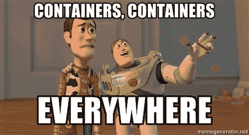

# 使用 Docker 运行您的节点项目

> 原文：<https://itnext.io/run-your-node-projects-with-docker-ccd093352648?source=collection_archive---------4----------------------->



我最近得到了一个需要更新的旧节点项目。这是一个 AngularJS + Ionic 1 项目。即使我只是想安装软件包，也会出现大量的问题。

所以我所做的是把整个项目放在一个 Docker 容器中，这个容器使用的是 Node 的旧版本。对于您的项目，您可以使用节点 8 或节点 10。

基本上，您可以在任何节点项目中执行此操作。你需要的是对码头工人有一个基本的了解，然后你就可以开始了。

重要的是写出你的文档。它控制将项目转移到容器的过程。

1.  **正常方法**

完成 docker 文件后，你必须为你的项目建立一个图像。

```
docker build -t image-name .
```

然后从您的映像运行一个容器。

```
docker run --rm -ti -p 3000:3000 image-name# --rm container will be removed after each run
# -p 3000:3000 you can communicate with the project through port: 3000
```

如果没有错误，您可以打开浏览器并检查项目

```
http://127.0.0.1:3000
```

此外，您可以通过打开第二个 bash 来编辑 docker 容器中的文件。

```
docker exec -ti container-id /bin/bash# Then using vim or nano to edit the files
```

您可以将整个项目从容器复制到您的主机上

```
docker cp container-id:/usr/src/app .
```

**2。疯狂的方法**

在这个方法中，我将创建一个临时映像，它不需要从主机上复制项目文件，甚至不需要安装 bower 或 node 包。我将从主机共享一卷项目目录到容器的工作目录。因此，基本上，我仍然可以从主机上编辑当前文件夹中的项目，节点命令将从 docker 容器@中运行。@

```
docker run --name container-name -ti -v your-project-folder:/usr/src/app -p 3000:3000 node-image
```

之后，只要想运行项目，就需要启动容器

```
docker start container-name
```

那一刻，我简直惊呆了。@

希望这有所帮助:)