# 使用 Apache Airflow 在 Amazon EMR 上运行 Spark 作业

> 原文：<https://itnext.io/running-spark-jobs-on-amazon-emr-with-apache-airflow-2e16647fea0c?source=collection_archive---------1----------------------->

## 在 AWS 上使用新的 Amazon Managed Workflows for Apache air flow(亚马逊 MWAA)服务

# 介绍

在本系列的第一篇文章中，我们探索了几种使用 AWS 服务在 Amazon EMR 上运行 PySpark 应用程序的方法，包括 AWS CloudFormation、AWS Step 函数和用于 Python 的 AWS SDK。这个系列的第二篇文章将使用最近宣布的[亚马逊管理的 Apache Airflow](https://aws.amazon.com/managed-workflows-for-apache-airflow/) (亚马逊 MWAA)服务来检查在亚马逊 EMR 上运行的 Spark 作业。

## **亚马逊 EMR**

据 [AWS](https://aws.amazon.com/emr) 介绍，Amazon Elastic MapReduce(Amazon EMR)是一个基于云的大数据平台，使用常见的开源工具处理大量数据，如 [Apache Spark](https://aws.amazon.com/emr/features/spark/) 、 [Hive](https://aws.amazon.com/emr/features/hive/) 、 [HBase](https://aws.amazon.com/emr/features/hbase/) 、 [Flink](https://aws.amazon.com/blogs/big-data/use-apache-flink-on-amazon-emr/) 、[胡迪](https://aws.amazon.com/emr/features/hudi/)和 [Zeppelin](https://zeppelin.apache.org/) 、 [Jupyter](https://jupyter.org/) 和[prest 使用 Amazon EMR，数据分析师、工程师和科学家可以自由地探索、处理和可视化数据。EMR 负责调配、配置和调整底层计算集群，使您能够专注于运行分析。](https://aws.amazon.com/emr/features/presto/)

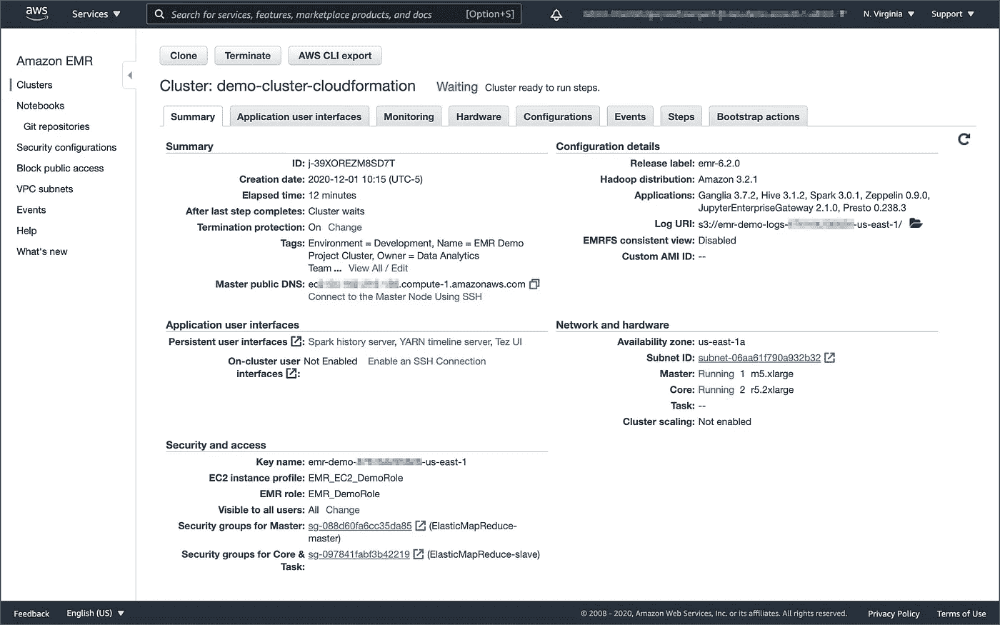

Amazon EMR 控制台的集群摘要选项卡

用户与 EMR 的交互方式多种多样，这取决于他们的具体需求。例如，您可以创建一个瞬态 EMR 集群，使用 Spark、Hive 或 Presto 执行一系列数据分析作业，并在作业完成后立即终止集群。您只需为集群启动和运行的时间付费。或者，对于时间关键型工作负载或持续的高容量作业，您可以选择创建一个或多个持久的、[高可用性的](https://aws.amazon.com/about-aws/whats-new/2019/05/amazon-emr-now-supports-multiple-master-nodes-to-enable-high-availability-for-hbase-clusters/) EMR 集群。这些集群[自动水平扩展](https://aws.amazon.com/blogs/big-data/best-practices-for-resizing-and-automatic-scaling-in-amazon-emr/)计算资源，包括使用 [EC2 Spot 实例](https://docs.aws.amazon.com/AWSEC2/latest/UserGuide/using-spot-instances.html)，以满足处理需求，最大限度地提高性能和成本效益。

AWS 目前提供 5.x 和 6.x 版本的亚马逊 EMR。Amazon EMR 的每个主要和次要版本都提供了近 25 个不同的流行开源大数据应用程序的增量版本供选择，Amazon EMR 将在创建集群时安装和配置这些应用程序。最新的[亚马逊 EMR 版本](https://docs.aws.amazon.com/emr/latest/ReleaseGuide/emr-release-components.html)是亚马逊 EMR 版本 6.2.0 和亚马逊 EMR 版本 5.32.0。

## 亚马逊管理的 Apache Airflow 工作流(MWAA)

[Apache Airflow](https://airflow.apache.org/) 是一个流行的开源平台，旨在调度和监控工作流。根据[维基百科](https://en.wikipedia.org/wiki/Apache_Airflow)的说法，Airbnb 于 2014 年创建了 Airflow，以管理该公司日益复杂的工作流程。项目从一开始就做开源，成为 2016 年 [Apache 孵化器](https://incubator.apache.org/)项目，2019 年顶级 Apache 软件基金会项目(TLP)。

许多组织使用 Amazon EC2 或 Amazon EKS 等计算服务在 AWS 上构建、管理和维护 Apache Airflow。亚马逊最近宣布[亚马逊管理阿帕奇气流](https://aws.amazon.com/managed-workflows-for-apache-airflow/)(亚马逊 MWAA)的工作流程。随着亚马逊 MWAA[于 2020 年 11 月发布](https://aws.amazon.com/blogs/aws/introducing-amazon-managed-workflows-for-apache-airflow-mwaa/)，AWS 客户现在可以专注于开发工作流自动化，而将气流管理留给 AWS。亚马逊 MWAA 可以作为 [AWS 步骤函数](https://aws.amazon.com/step-functions/)的替代品，用于 AWS 上的工作流自动化。

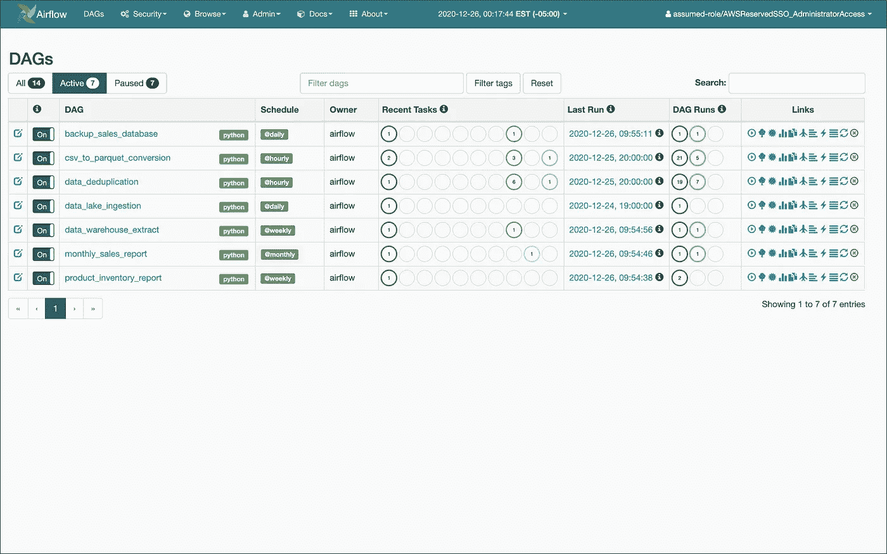

Apache 气流用户界面

Apache [最近宣布](http://airflow.apache.org/blog/airflow-two-point-oh-is-here/)2020 年 12 月 17 日发布气流 2.0.0。气流最新的 1.x 版本是 1.10.14，发布于 2020 年 12 月 12 日。然而，在这篇文章发表时，亚马逊 MWAA 正在运行 2020 年 8 月 25 日发布的 [Airflow 1.10.12](https://github.com/apache/airflow/releases/tag/1.10.12) 。确保在为亚马逊 MWAA 开发工作流时，使用正确的 [Apache Airflow 1.10.12 文档](https://airflow.apache.org/docs/apache-airflow/1.10.12/)。

亚马逊 MWAA 服务可以使用 AWS 管理控制台，以及使用最新版本的 [AWS SDK](https://boto3.amazonaws.com/v1/documentation/api/latest/reference/services/mwaa.html) 和 [AWS CLI](https://awscli.amazonaws.com/v2/documentation/api/latest/reference/mwaa/index.html) 的[亚马逊 MWAA API](https://docs.aws.amazon.com/mwaa/latest/userguide/mwaa-actions-resources.html) 获得。

Airflow 有一种机制，允许您扩展其功能并与其他系统集成。鉴于其集成能力，Airflow 对 AWS 有广泛的支持，包括亚马逊 EMR、亚马逊 S3、AWS Batch、亚马逊 RedShift、亚马逊 DynamoDB、AWS Lambda、亚马逊 Kinesis 和亚马逊 SageMaker。除了对亚马逊 S3 的支持，大多数 AWS 集成可以在气流代码库的[贡献](https://github.com/apache/airflow/tree/master/airflow/contrib)部分的[钩子](https://github.com/apache/airflow/tree/master/airflow/contrib/hooks)、[秘密](https://github.com/apache/airflow/tree/master/airflow/contrib/secrets)、[传感器](https://github.com/apache/airflow/tree/master/airflow/contrib/sensors)和[操作符](https://github.com/apache/airflow/tree/master/airflow/contrib/sensors)中找到。

# 入门指南

## 源代码

使用这个`git clone`命令，下载这篇文章的 [GitHub 库](https://github.com/garystafford/aws-airflow-demo)到你的本地环境。

```
git clone --branch main --single-branch --depth 1 --no-tags \
    https://github.com/garystafford/aws-airflow-demo.git
```

## 初步步骤

这篇文章假设读者已经完成了前一篇文章中的演示，[在 Amazon EMR 方法上运行 PySpark 应用程序，以便与 Amazon Elastic MapReduce 上的 PySpark 进行交互](https://medium.com/swlh/running-pyspark-applications-on-amazon-emr-e536b7a865ca)。这篇文章将重用许多上一篇文章的 AWS 资源，包括 EMR VPC、子网、安全组、AWS 粘合数据目录、亚马逊 S3 桶、EMR 角色、EC2 密钥对、AWS 系统管理器参数存储参数、PySpark 应用程序和 Kaggle 数据集。

## 配置亚马逊 MWAA

创建新的 MWAA 环境最简单的方法是通过 AWS 管理控制台。我强烈建议您在继续之前查看一下亚马逊 MWAA 的[定价](https://aws.amazon.com/managed-workflows-for-apache-airflow/pricing/)。即使在空闲时，这项服务的运营成本也可能非常高，最小的环境级别每月可能高达数百美元。

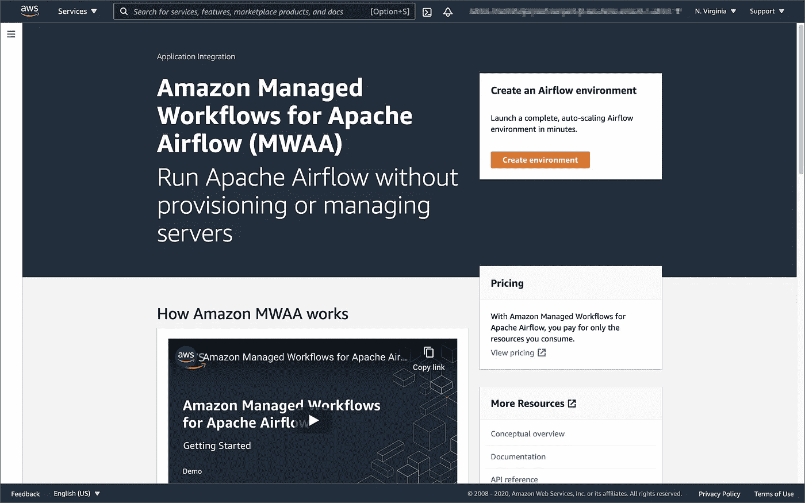

亚马逊 MWAA 环境创建流程

使用控制台，创建一个新的亚马逊 MWAA 环境。亚马逊 MWAA 界面将引导你完成创建过程。注意现在的‘气流版本’，`1.10.12`。

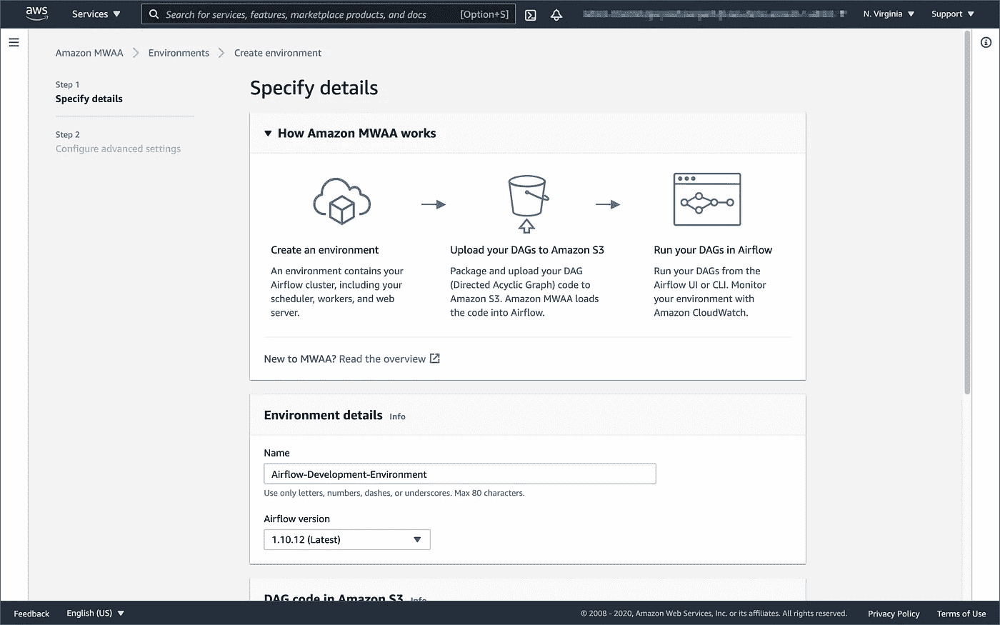

亚马逊 MWAA 环境创建流程

亚马逊 MWAA 需要一个亚马逊 S3 桶来存储气流资产。创建一个新的亚马逊 S3 桶。根据[文档](https://docs.aws.amazon.com/mwaa/latest/userguide/mwaa-s3-bucket.html)，桶必须以前缀`airflow-`开始。您还必须在 Bucket 上启用 [Bucket 版本控制](https://docs.aws.amazon.com/AmazonS3/latest/dev/Versioning.html)。在 bucket 中指定一个`dags`文件夹来存储气流的[有向无环图](https://airflow.apache.org/docs/apache-airflow/stable/concepts.html#core-ideas) (DAG)。将接下来的两个选项留空，因为我们没有额外的 Airflow 插件或额外的 Python 包需要安装。

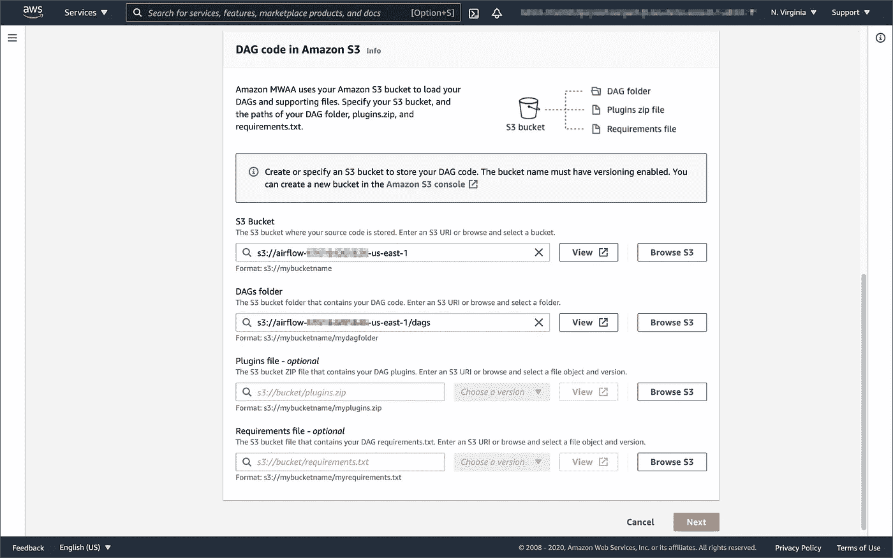

亚马逊 MWAA 环境创建流程

借助亚马逊 MWAA，您的数据在默认情况下是安全的，因为工作负载运行在他们自己的亚马逊虚拟私有云(亚马逊 VPC)内。作为 MWAA 环境创建过程的一部分，您可以选择让 AWS 创建一个 MWAA·VPC 云形成堆栈。

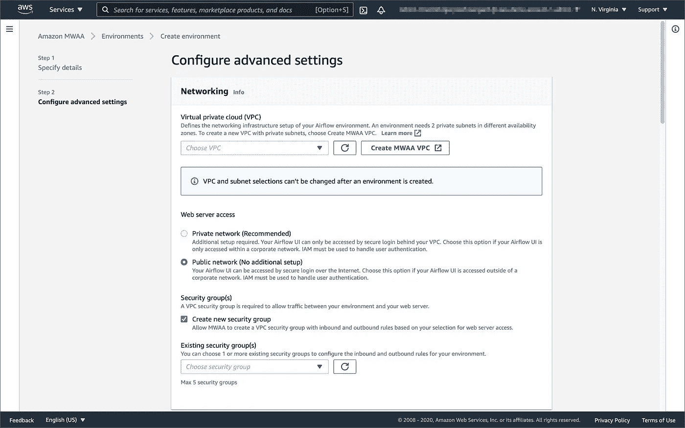

亚马逊 MWAA 环境创建流程

在本演示中，选择让 MWAA 创建一个新的 VPC 和相关的网络资源。

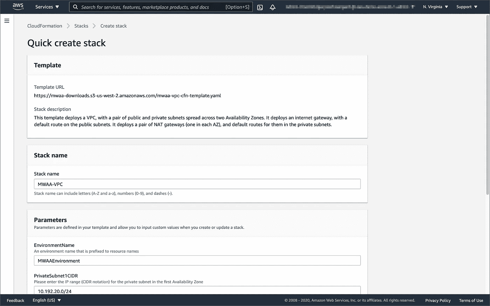

AWS CloudFormation 创建堆栈控制台

MWAA CloudFormation 堆栈包含大约 22 个 AWS 资源，包括一个 VPC、一对公共和私有子网、路由表、一个互联网网关、两个 NAT 网关和相关的弹性 IP(EIP)。更多细节见 [MWAA 文档](https://docs.aws.amazon.com/mwaa/latest/userguide/vpc-create.html)。

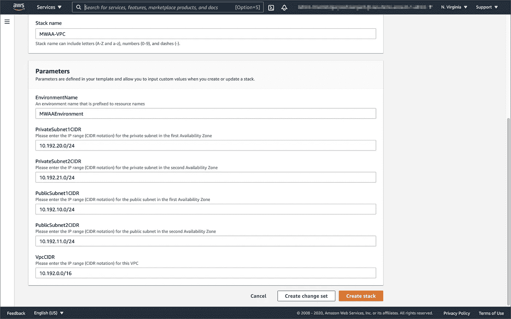

AWS CloudFormation 创建堆栈控制台

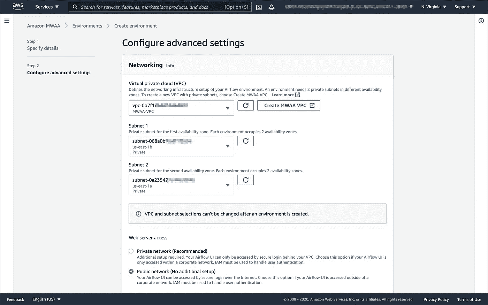

亚马逊 MWAA 环境创建流程

作为亚马逊 MWAA 网络配置的一部分，您必须决定您希望对 Airflow 的 web 访问是公开的还是私有的。网络配置的详细信息可在 [MWAA 文档](https://docs.aws.amazon.com/mwaa/latest/userguide/vpc-create.html)中找到。对于这个演示，我选择公共 web 服务器访问，但是为了更高的安全性，建议选择私有。使用公共选项时，AWS 仍然需要 IAM 身份验证来登录 AWS 管理控制台，以便访问 Airflow UI。

您必须选择一个现有的 VPC 安全组，或者让 MWAA 创建一个新的组。在本演示中，选择让 MWAA 为您创建一个安全组。

最后，根据您的需求规模，为气流选择适当大小的环境类别。对于这个演示来说，`mw1.small`类就足够了。

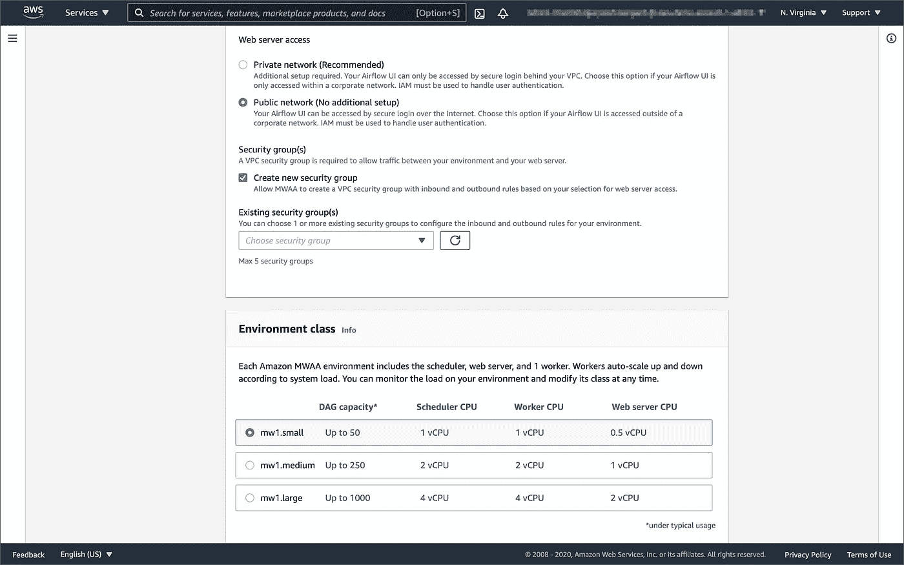

亚马逊 MWAA 环境创建流程

最后，对于权限，您必须选择一个现有的 Airflow 执行服务角色或创建一个新角色。在本演示中，创建一个新的气流服务角色。我们稍后将添加额外的权限。

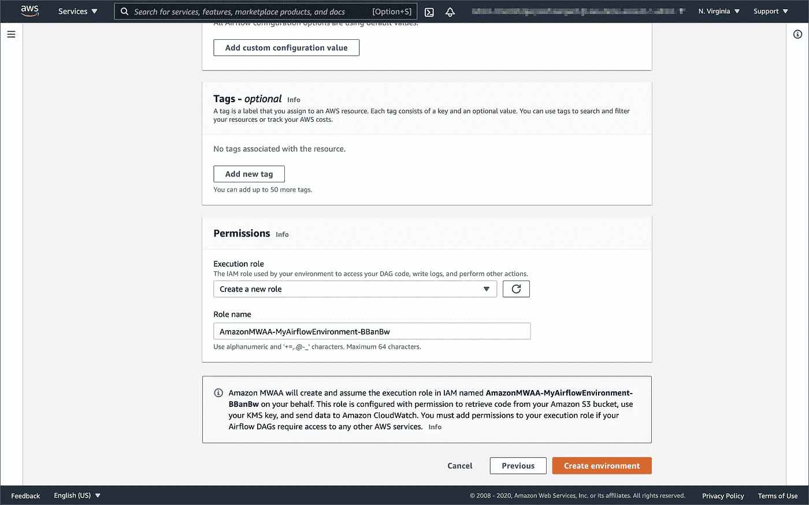

亚马逊 MWAA 环境创建流程

## 气流执行角色

作为本次演示的一部分，我们将使用气流在 EMR 上运行 Spark 作业(EMR 步骤)。为了允许气流与 EMR 交互，我们必须增加新的气流执行角色的默认权限。其他权限包括允许新的气流角色使用`iam:PassRole`承担 EMR 角色。对于这个演示，我们将包括两个默认的 EMR 服务和作业流角色，`EMR_DefaultRole`和`EMR_EC2_DefaultRole`。我们还将包括在[上一篇文章](https://medium.com/swlh/running-pyspark-applications-on-amazon-emr-e536b7a865ca)、`EMR_DemoRole`和`EMR_EC2_DemoRole`中创建的相应自定义 EMR 角色。对于本演示，气流服务角色还需要三个特定的 EMR 权限，如下所示。在这篇文章的后面，Airflow 还将从 S3 读取文件，这需要`s3:GetObject`的许可。

通过导入项目的 JSON 文件`iam_policy/airflow_emr_policy.json`创建一个新策略，并将这个新策略附加到 Airflow 服务角色。确保用您自己的帐户 ID 更新文件中的 AWS 帐户 ID。

气流 EMR IAM 策略

由 MWAA 创建的气流服务角色如下所示，并附有新策略。

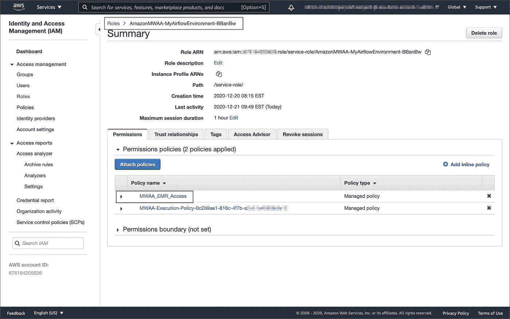

附加了新策略的气流执行服务角色

## 最终建筑

下面是帖子演示的最终高层架构。该图以红色显示了 DAG 运行请求的大致路由。该图包括一个可选的 [S3 网关 VPC 端点](https://docs.aws.amazon.com/vpc/latest/userguide/vpce-gateway.html)，在帖子中没有详细说明，但建议用于额外的安全性。据 [AWS](https://docs.aws.amazon.com/vpc/latest/userguide/endpoint-services-overview.html) 称，VPC 端点使您能够将您的 VPC 私下连接到受支持的 AWS 服务和由 AWS PrivateLink 支持的 VPC 端点服务，而无需互联网网关。在这种情况下，MWAA VPC 和亚马逊 S3 之间的私人连接。还可以创建一个 [EMR 接口 VPC 端点](https://docs.aws.amazon.com/emr/latest/ManagementGuide/interface-vpc-endpoint.html)来安全地将流量从 MWAA 直接路由到 EMR，而不是通过互联网连接。

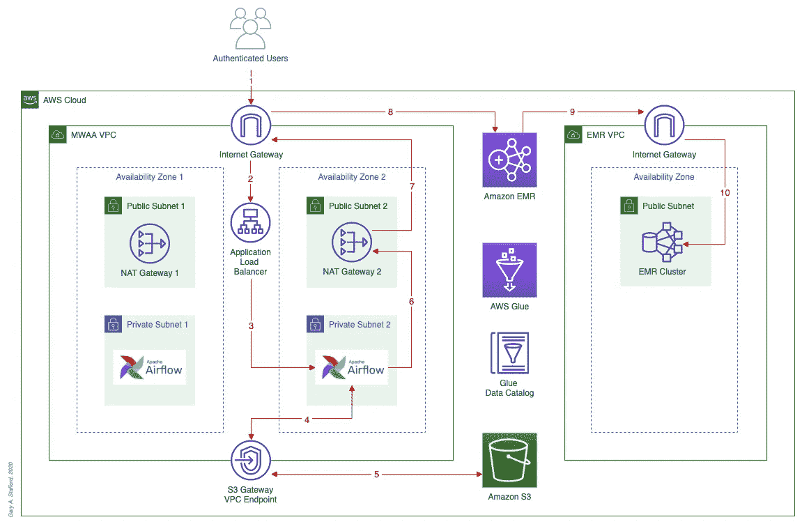

演示亚马逊 MWAA 和亚马逊 EMR 架构

## 亚马逊 MWAA 环境

新的 MWAA 环境将包括到气流 UI 的链接。

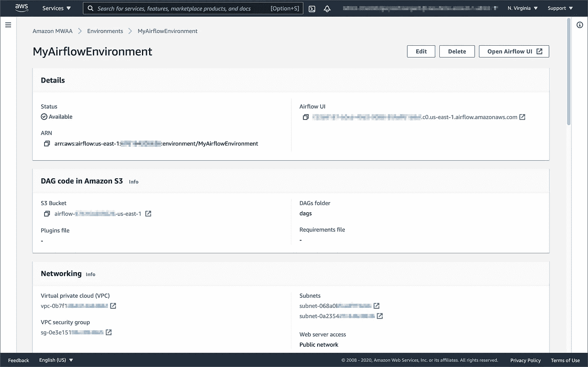

亚马逊 MWAA 环境控制台

## 气流 UI

使用提供的链接，您应该能够使用 web 浏览器访问 Airflow UI。

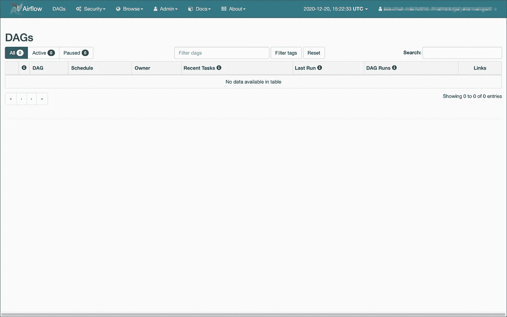

Apache 气流用户界面

# 我们的第一只狗

亚马逊 MWAA 文档包括一个[示例 DAG](https://docs.aws.amazon.com/mwaa/latest/userguide/samples-emr.html) ，它包含 Spark 自带的几个示例程序 SparkPi[中的一个。我已经创建了一个类似的 DAG，包含在 GitHub 项目中，`dags/emr_steps_demo.py`。DAG 将创建一个最小规模的单节点 EMR 群集，没有核心或任务节点。然后 DAG 将使用该集群向 Spark 提交`calculate_pi`作业。一旦作业完成，DAG 将终止 EMR 群集。](https://spark.apache.org/docs/latest/#running-the-examples-and-shell)

火花 Pi 气流 DAG

上传 DAG 到气流 S3 桶的`dags`目录。在下面的 AWS CLI 命令中替换您的气流 S3 桶名称，然后从项目的根目录运行它。

```
aws s3 cp dags/spark_pi_example.py \
    s3://***<your_airflow_bucket_name>***/dags/
```

DAG，`spark_pi_example`，应该会自动出现在气流 UI 中。单击“Trigger DAG”创建新的 EMR 集群并启动 Spark 作业。

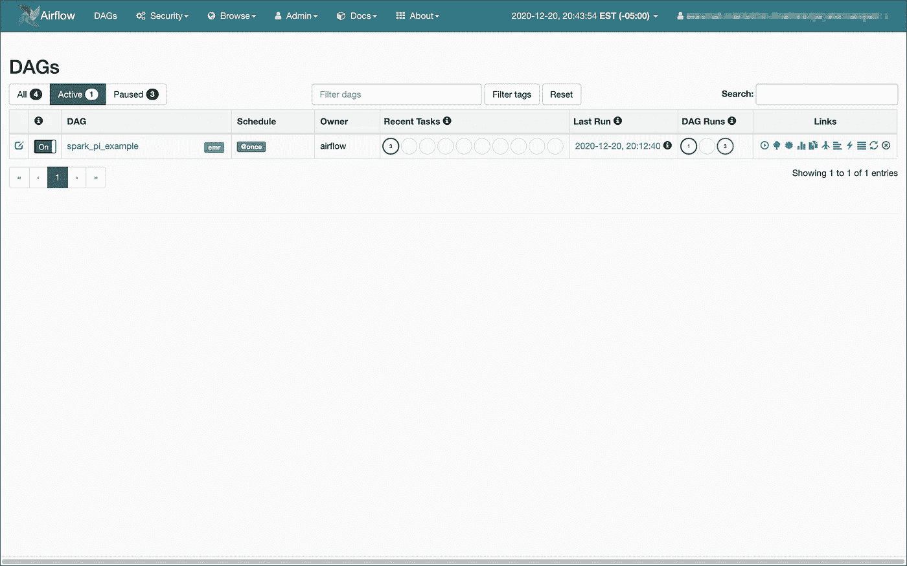

Apache Airflow 用户界面的 DAGs 选项卡

DAG 没有可选的配置作为 JSON 输入。选择“Trigger”提交作业，如下所示。

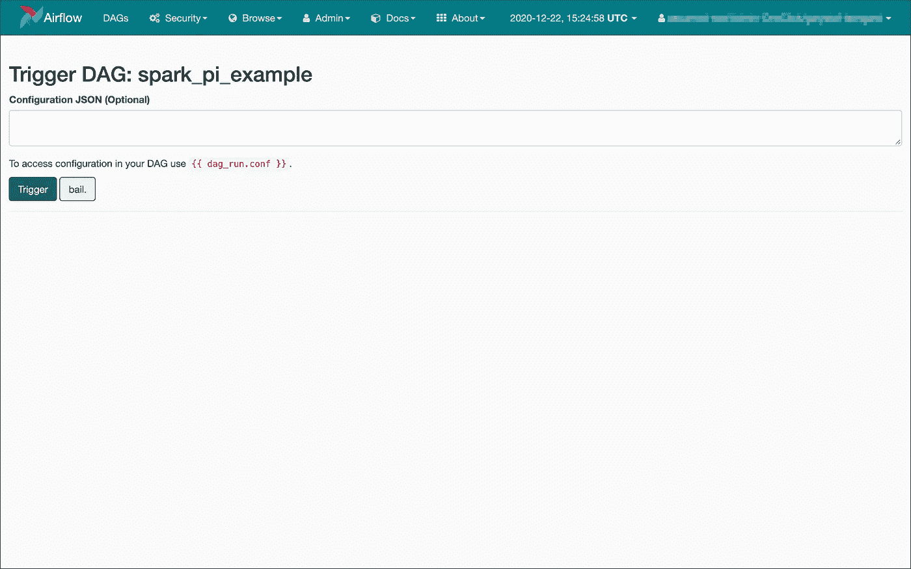

Apache Airflow 用户界面的触发器 DAG 页面

DAG 应该成功完成所有三个[任务](https://airflow.apache.org/docs/apache-airflow/stable/concepts.html#core-ideas)，如下面 DAG 的“图表视图”选项卡所示。

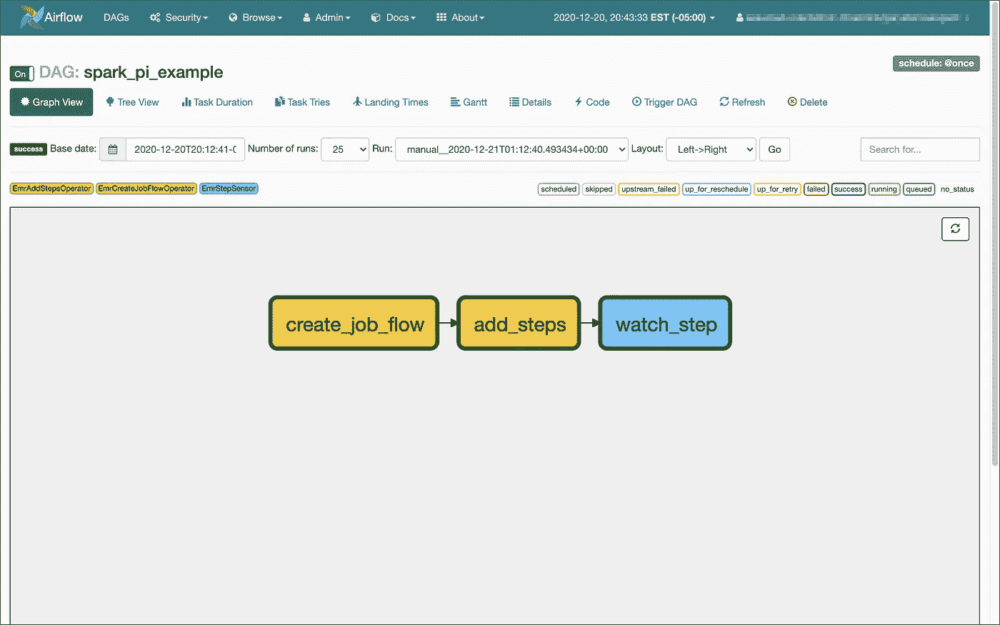

Apache Airflow UI 的 DAG 图形视图

切换到 EMR 控制台，您应该看到正在创建单节点 EMR 集群。

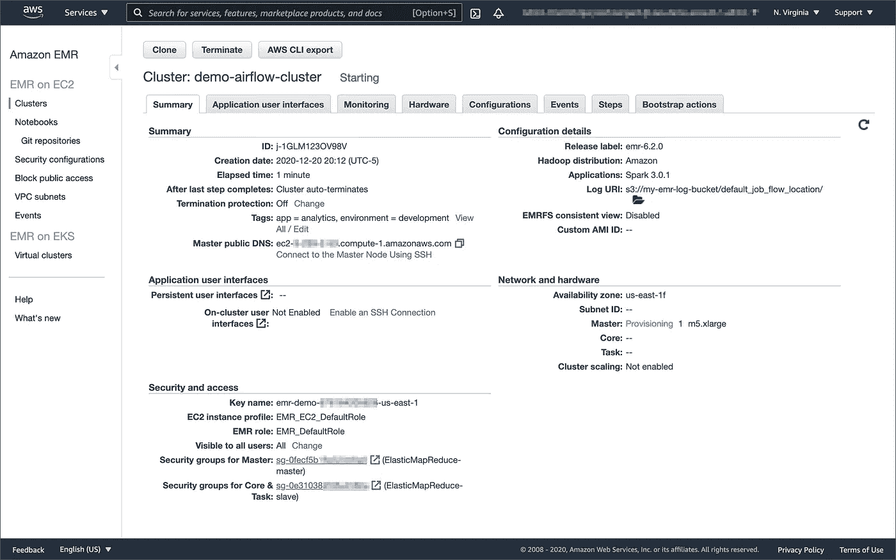

Amazon EMR 控制台的摘要选项卡

在“Steps”选项卡上，您应该看到“calculate _ pi”Spark 作业已经提交，正在等待集群准备运行。

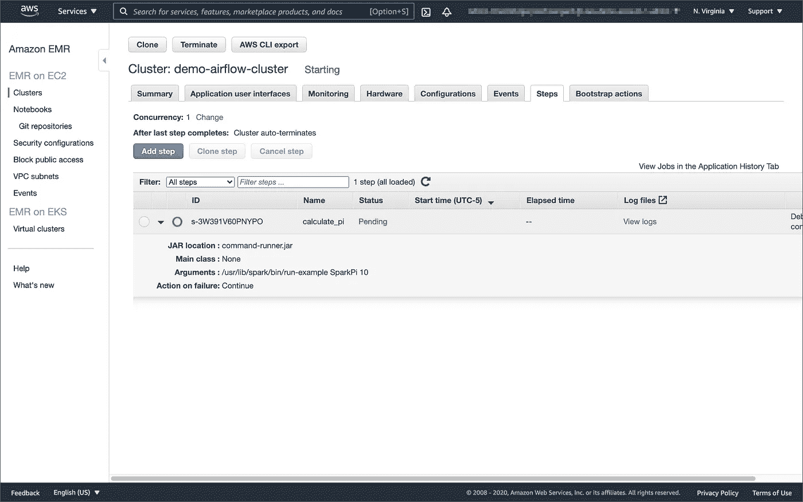

Amazon EMR 控制台的步骤选项卡

## 以编程方式触发 Dag

亚马逊 MWAA 服务可以使用 AWS 管理控制台，以及使用最新版本的 [AWS SDK](https://boto3.amazonaws.com/v1/documentation/api/latest/reference/services/mwaa.html) 和 [AWS CLI](https://awscli.amazonaws.com/v2/documentation/api/latest/reference/mwaa/index.html) 的[亚马逊 MWAA API](https://docs.aws.amazon.com/mwaa/latest/userguide/mwaa-actions-resources.html) 获得。为了自动运行 DAG，我们可以使用 AWS CLI 并通过 Apache Airflow 服务器上的端点调用 Airflow CLI。[亚马逊 MWAA 文档](https://docs.aws.amazon.com/mwaa/latest/userguide/access-airflow-ui.html)和 [Airflow 的 CLI 文档](https://airflow.apache.org/docs/apache-airflow/stable/cli-and-env-variables-ref.html#dags)解释了如何操作。

下面是一个使用 Airflow 的`trigger_dag` CLI 命令以编程方式触发`spark_pi_example` DAG 的示例。您需要用自己的 Airflow Web 服务器的主机名替换`WEB_SERVER_HOSTNAME`变量。`ENVIROMENT_NAME`变量假设`jq`只返回一个 MWAA 环境。

使用 AWS CLI 触发 DAG

# 气流分析作业

接下来，我们将向 EMR 提交一个实际的分析作业。如果你还记得[之前的帖子](https://medium.com/swlh/running-pyspark-applications-on-amazon-emr-e536b7a865ca)，我们有四个不同的分析 PySpark 应用程序，它们对三个 Kaggle 数据集进行分析。对于下一个 DAG，我们将运行一个执行`bakery_sales_ssm.py` PySpark 应用程序的 Spark 作业。该作业应该已经存在于`processed`数据 S3 存储桶中。

DAG`dags/bakery_sales.py`创建一个 EMR 集群，该集群与使用[上一篇文章](https://medium.com/swlh/running-pyspark-applications-on-amazon-emr-e536b7a865ca)中的 [run_job_flow.py](https://github.com/garystafford/emr-demo/blob/main/run_job_flow.py) Python 脚本创建的 EMR 集群相同。使用 AWS 步进功能时可用的所有 EMR 配置选项均可用于 EMR 的 Airflow 的`airflow.contrib.operators`和`airflow.contrib.sensors`包。

Airflow 利用了 [Jinja 模板](https://jinja.palletsprojects.com/)，并为管道作者提供了一组内置参数和宏。面包店销售 DAG 包含 11 个 Jinja 模板变量。通过将 JSON 文件导入“管理”⇨的“变量”选项卡，将在气流用户界面中配置七个变量。这些模板变量在 DAG 中以`var.value`为前缀。其他三个变量将作为 DAG 运行配置作为 JSON blob 传递，类似于前面的 DAG 示例。这些模板变量以`dag_run.conf`为前缀。

面包店销售气流图

## 将变量导入气流用户界面

要导入所需的变量，首先，更改项目的`airflow_variables/admin_variables.json`文件中的值。您需要更新`bootstrap_bucket`、`emr_ec2_key_pair`、`logs_bucket`和`work_bucket`的值。三个 S3 桶应该都存在于[之前的帖子](https://medium.com/swlh/running-pyspark-applications-on-amazon-emr-e536b7a865ca)中。

面包店销售 DAG 变量

接下来，从 Airflow UI 的“管理”⇨“变量”选项卡导入变量文件。

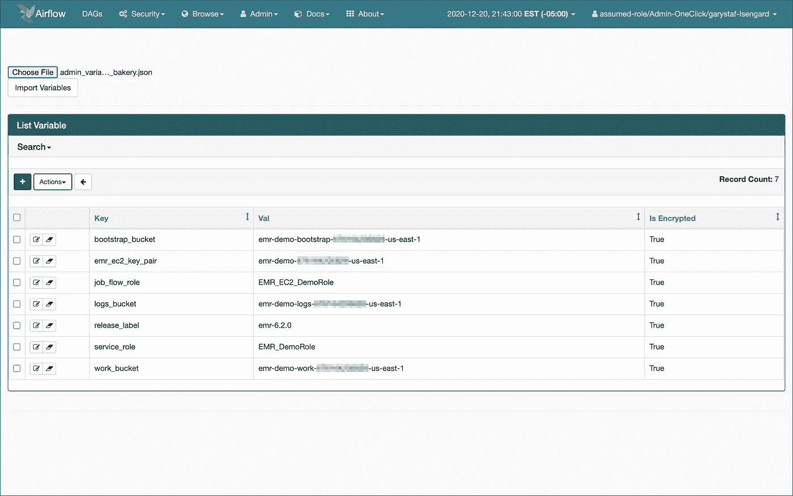

Apache Airflow 用户界面的管理>变量选项卡

将 DAG`dags/bakery_sales.py`上传到气流 S3 桶，类似于第一个 DAG。

```
aws s3 cp dags/bakery_sales.py \
    s3://***<your_airflow_bucket_name>***/dags/
```

第二个 DAG，`bakery_sales`，应该会自动出现在气流 UI 中。单击“Trigger DAG”创建新的 EMR 集群并启动 Spark 作业。

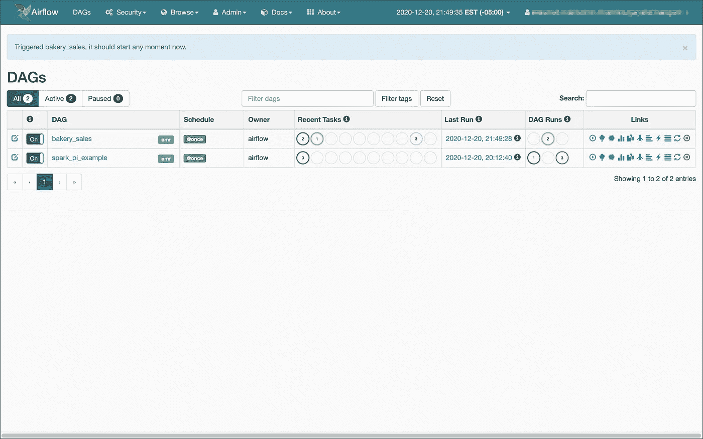

Apache Airflow 用户界面的 DAGs 选项卡

在“触发 DAG”界面中输入三个必需的参数，用于传递 DAG 运行配置，然后选择“触发”。JSON blob 的示例可以在项目`airflow_variables/dag_run_config.json`中找到。

```
{
    "airflow_email": "[airflow@example.com](mailto:airflow@example.com)",
    "email_on_failure": false,
    "email_on_retry": false
}
```

这只是为了演示的目的。要收发电子邮件，您需要[配置气流](https://docs.aws.amazon.com/mwaa/latest/userguide/configuring-env-variables.html)。

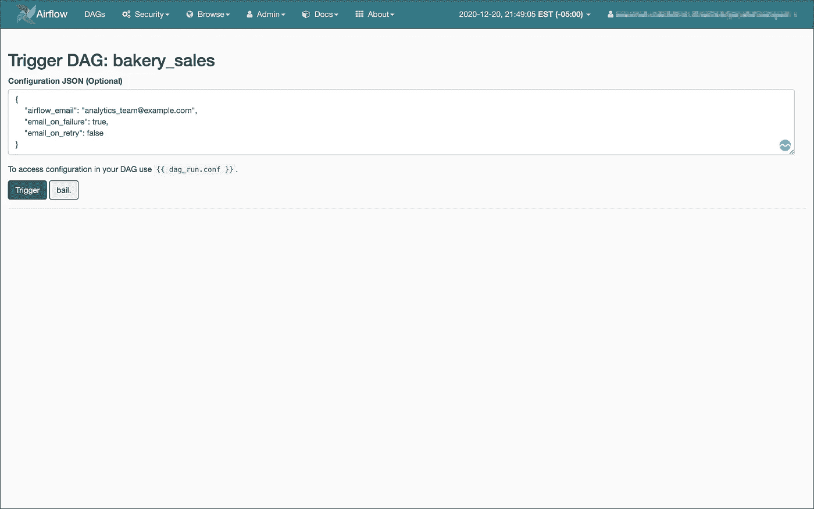

Apache Airflow UI 的触发 DAG 屏幕

切换到 EMR 控制台，您应该在“步骤”选项卡中看到“面包店销售”Spark 作业。

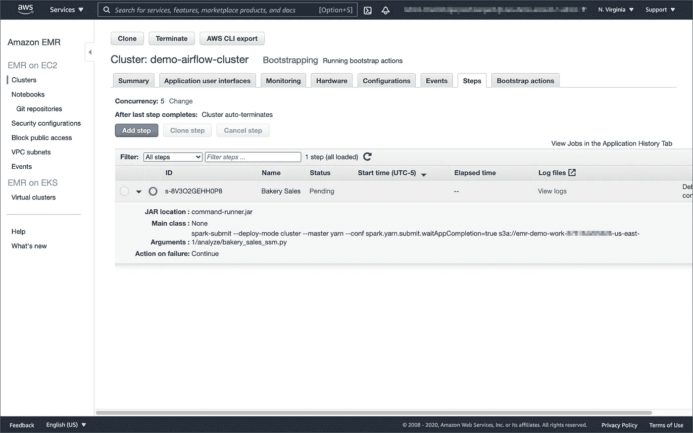

Amazon EMR 控制台的步骤选项卡

# 多步 DAG

在我们的最后一个示例中，我们将使用单个 DAG 并行运行四个 Spark 作业。Spark 作业参数(`EmrAddStepsOperator` `steps`参数)将从位于亚马逊 S3 的外部 JSON 文件中加载，而不是像前面两个 DAG 示例那样在 DAG 中定义。此外，EMR 集群规范(`EmrCreateJobFlowOperator` `job_flow_overrides`参数)也将从外部 JSON 文件中加载。使用这种方法，我们将 EMR 集群细节和 Spark 作业细节从 DAG 中分离出来。DataOps 或 DevOps 工程师可能将 EMR 集群规范作为代码进行管理，而数据分析师则分别管理 Spark 作业参数。第三个团队可能管理 DAG 本身。

我们仍然在 JSON 文件中维护变量。DAG 会将基于 JSON 文件的配置作为 JSON blobs 读入任务，然后在 DAG 被触发时，用在 Airflow 中定义的变量值或作为参数的输入替换 DAG 中的 Jinja 模板变量(表达式)。

下面我们看到了四个 Spark `submit-job`作业定义中的两个(`steps`)的片段，它们已经被移动到一个单独的 JSON 文件中，`emr_steps/emr_steps.json`。

Spark 作业定义 JSON 文件

下面是 EMR 集群规范(`job_flow_overrides)`)，它们已经被移到一个单独的 JSON 文件中，`job_flow_overrides/job_flow_overrides.json`。

Spark 作业覆盖 JSON 文件

解耦配置将 DAG 从 200 多行代码减少到不到 75 行。请注意下面 DAG 的第 56 行和第 63 行。参数现在引用函数`get_objects(key, bucket_name)`，而不是引用局部对象变量，该函数加载 JSON。

多级气流 DAG

这一次，我们需要上传三个文件到 S3，DAG 到气流 S3 桶，和两个 JSON 文件到 EMR 工作 S3 桶。更改 bucket 名称以匹配您的环境，然后运行如下所示的三个 AWS CLI 命令。

```
aws s3 cp emr_steps/emr_steps.json \
    s3://**emr-demo-work-****123412341234****-us-east-1**/emr_steps/aws s3 cp job_flow_overrides/job_flow_overrides.json \
    s3://**emr-demo-work-****123412341234****-us-east-1**/job_flow_overrides/aws s3 cp dags/multiple_steps.py \
    s3://**airflow-****123412341234****-us-east-1**/dags/
```

第二个 DAG，`multiple_steps`，应该会自动出现在气流 UI 中。单击“Trigger DAG”创建新的 EMR 集群并启动 Spark 作业。“触发 DAG”界面中所需的三个输入参数与之前的`bakery_sales` DAG 相同。JSON blob 示例可以在项目中的`airflow_variables/dag_run_conf.json`处找到。

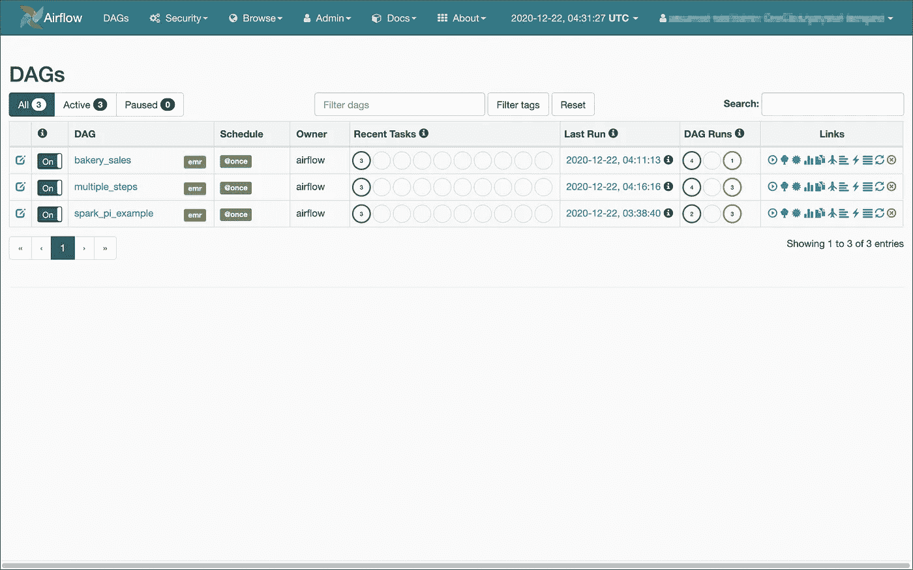

Apache Airflow 用户界面的 DAGs 选项卡

下面我们看到 EMR 集群已经完成了四个 Spark 任务(EMR 步骤),并且已经自动终止。请注意，所有四个作业都是在完全相同的时间启动的。如果您还记得上一篇文章，这是可能的，因为我们将“并发”级别预设为 5。

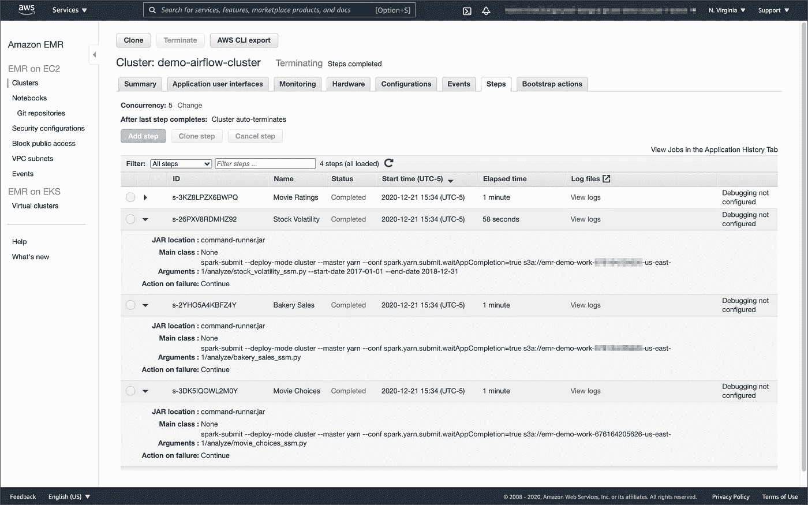

Amazon EMR 控制台的步骤选项卡显示了并行运行的四个步骤

## 使用 CLI 以编程方式触发 Dag

与前面的示例类似，下面我们可以使用 Airflow 的`trigger_dag` CLI 命令以编程方式触发`multiple_steps` DAG。注意添加了名为`—-conf`的参数，它将包含三个键/值对的配置作为 JSON blob 传递给 trigger 命令。

使用 AWS CLI 触发 DAG

## 使用 AWS SDK 触发

也可以使用 AWS SDK 触发气流 Dag。例如，对于 Python 的`boto3`,我们可以使用类似下面的脚本来远程触发 DAG。

# 清理

一旦您完成了 MWAA 环境，一定要尽快删除它，以节省额外的成本。此外，删除`MWAA-VPC`云形成堆栈。与两个 NAT 网关一样，这些资源也将继续产生额外的成本。

```
aws mwaa delete-environment --name ***<your_mwaa_environment_name>***aws cloudformation delete-stack --stack-name MWAA-VPC
```

# 结论

在本系列的第二篇文章中，我们探索了如何使用最新发布的 Amazon Managed Workflows for Apache air flow(Amazon MWAA)在 Amazon Elastic MapReduce(Amazon EMR)上运行 PySpark 应用程序。在未来的帖子中，我们将探索 Jupyter 和 Zeppelin 笔记本在 EMR 上用于数据科学、科学计算和机器学习的用途。

如果你有兴趣了解更多关于配置亚马逊 MWAA 和气流的信息，请看我最近的帖子[亚马逊管理的 Apache 气流工作流——配置:了解亚马逊 MWAA 的配置选项](/amazon-managed-workflows-for-apache-airflow-configuration-77db7fd633c5)。

这篇博客代表我自己的观点，而不是我的雇主亚马逊网络服务公司的观点。所有产品名称、徽标和品牌都是其各自所有者的财产。