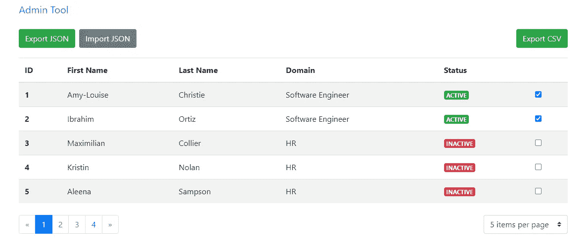
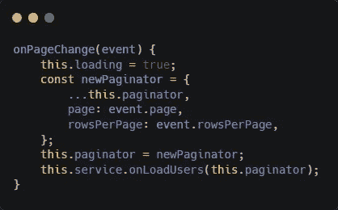
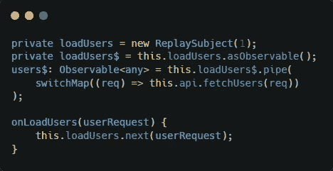
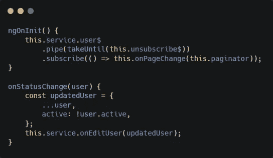
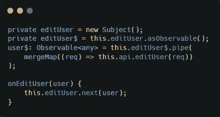
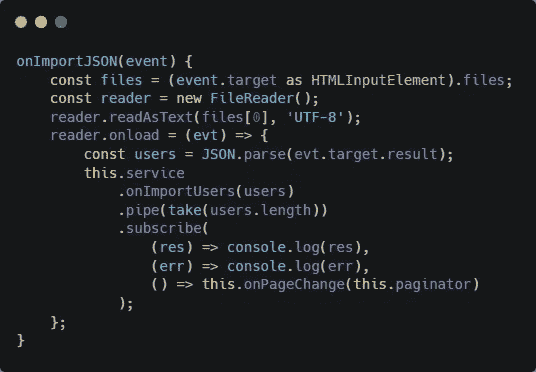
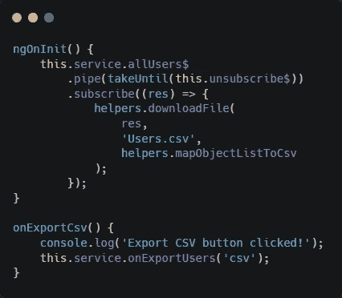
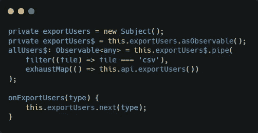

# RxJS 运算符:角度-吻

> 原文：<https://itnext.io/rxjs-operators-angular-kiss-36d875d2ff7d?source=collection_archive---------3----------------------->

本文的目的是为初学者提供使用最常见的 RxJS 操作符的基本信息，并有望成为未来拥抱反应式编程的火花。本文的目标是不仅提供 switchMap、mergeMap、exhaustMap、concatMap 的真实用例，而且提供一个小项目作为起点。

在我研究这些操作符的过程中，我讨厌那些看起来简单容易，但没有揭示操作符真正目的和潜力的例子。我将尽我最大的努力在你的应用程序中提供可理解、可复制的用例，并帮助你获得基本的权利。

## 项目信息和结构

今天的项目是一个管理工具，管理员工对公司共享文件夹的访问。让我们欢迎一个空前经典的分页表，它的右边有一个小复选框，这样我们就可以将员工的状态设置为“活动”或“非活动”。我们还能够导出现有员工的文件，并导入新员工的文件。

我们精美的用户界面

我们有一个智能组件来托管公司员工的表。特定用户的动作触发来自智能组件的事件，并向一个 API(在我们的特定例子中是 in-memory-web-api)发出一些 HTTP 调用。当然，任何人都可以在用户选择另一个页面或单击按钮时调用 API，并用响应填充视图，但是现在是时候面对一些挑战了。

## 挑战#1:用户快速点击分页器

因此，我们有一个用户点击下一页按钮如此之快，以至于一个新的请求在上一个请求完成之前就开始了。当然，我们可以禁用按钮，直到第一个响应到达，但这种方法破坏了用户体验，我们还迫使用户等到数据到达，然后再次单击按钮。相反，我们应该能够无声地**取消**挂起的请求，并开始一个新的请求，而不会打断用户。

> 当用户点击分页器区域并持有对`users$` observable 的订阅时，组件发出一个事件。

> 该服务将主体的事件转换成 HTTP 调用。因此，由于组件订阅了`users$` observable，所以当数据到达时，组件会得到通知。`switchMap`操作符用于取消对当前订阅的订阅(如果没有其他订阅者，则取消未决的 HTTP 请求),只订阅新的可观察对象。

这绝对有道理。当用户快速换页时，他们真的不关心前几页的结果，而只关心他们将登陆的最后一页。这与`switchMap`操作符是一个完美的类比，该操作符取消订阅之前的内部可观察对象，并订阅最新的。

## **挑战 2:用户快速点击复选框**

*在这种情况下，用户希望快速点击几个复选框。同样，我们可以在屏幕中央使用加载器，等待复选框的 HTTP 请求完成，然后触发另一个请求来刷新页面的雇员，只有在更新的数据到达后，隐藏加载器并允许用户继续。让我们关注用户。用户希望单击几个复选框来更改员工的状态，并在没有任何中断的情况下等待更新的数据。因此，我们处于一种会发出几个事件的情况，我们将在**并行**中管理它们，并在之后更新数据。*

> *当用户点击复选框并订阅`user$`观察对象时，组件发出一个事件。当一个雇员被成功更新时，一个新的请求被触发来更新数据。*

**

*该服务遵循与以前相同的模式，但是这次使用了`mergeMap`操作符。因此，该组件维护所有活动请求中的订阅，并且当其中任何一个请求完成时，它将得到通知。*

**

*使用这种方法，用户能够非常快速地点击许多复选框，并且应用程序能够并行处理请求。当然，有时向一个 API 发出多个请求并不是最佳的解决方案。更新现有雇员记录布尔值可能没问题，但是如果我们试图创建许多新用户，会发生什么情况呢？*

## *挑战 3:用户导入新员工的 JSON 文件*

*对于这个用例，让我们假设 API 每次只能创建一个雇员，但是我们希望允许用户提供一个包含雇员列表的文件，以获得更好的体验。应用程序将读取文件，并为列表中的每个雇员发出一个 HTTP 请求，但是如果我们并行发出请求，我们将会给后端产生不必要的负载。正确的做法是每次保持一个活动请求，只有在前一个请求完成后才开始下一个请求。当创建了所有新员工后，我们应该刷新数据。*

> *该组件将解析 JSON 并创建一个雇员列表。我们使用`take`操作符来订阅与我们想要创建的雇员数量相等的请求。之后，我们将刷新数据。*

**

*该服务将使用“from”操作符为每个新员工记录创建一个新的可观察对象。`concatMap`操作员将保留一个带有可观察值的队列，并在完成前一个后订阅新的**，因此现在我们能够按顺序处理它们。***

**

## ***挑战#4:用户快速点击导出 CSV 按钮***

**现在，用户试图下载一个包含所有可用员工的文件。当然，这个动作需要一些时间，并且后端资源非常紧张。我们应该保护 API，所以我们必须**忽略**进一步的事件，直到活动的 HTTP 请求完成。**

> **组件订阅了`allUsers$` observable，并为每个按钮点击发出一个事件。**

****

> **当一个 CSV 文件被请求时，该服务将创建一个新的可观察对象，但是如果有一个已经激活的事件，它将忽略所有其他事件。所以，所有这些大规模点击将不会产生任何影响。如果请求另一种文件类型(如 JSON ), filter 操作符用于跳过事件。**

****

## ****奖金****

*   **当用户想要一次上传多个文件，但是 API 只接受每个请求一个文件，并且您知道文件处理需要大量资源时，使用`concatMap`操作符。您可以在请求中使用一个相关 id，还可以包括文件的索引，只要文件的总数。**
*   **尽可能多地使用`asyncPipe`,这样 angular 就可以退订那些可观的东西了。对于我们必须手动订阅的情况，我们应该确保取消订阅以避免内存泄漏。一种简单的方法是利用`takeUntil`操作符，结合一个在组件被销毁时发出一个值的主题。**

> **在这里 *找到角度代码 [*。*](https://github.com/stavrosdro/rxjs-operators)***

***享受*🚀🚀🚀**