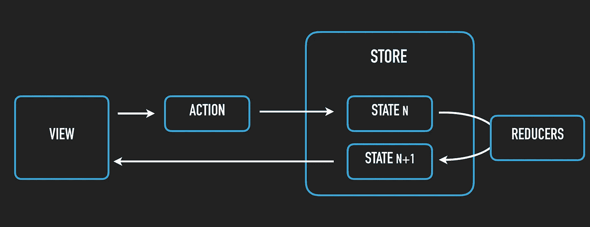

# RxReduce:反应式状态容器架构—第 1 部分

> 原文：<https://itnext.io/rxreduce-reactive-state-container-architecture-part-1-940480a0f838?source=collection_archive---------3----------------------->

状态容器体系结构

在移动应用程序中，状态管理最近已经成为一个非常流行的问题。状态应该是应用程序中唯一的真实来源的想法非常吸引人！视图将只是这种状态的一个可显示的人工制品👌。

但是众所周知，伴随着强大的力量而来的是巨大的责任…以及一系列的问题😀：

*   国家到底是什么？
*   如何围绕一个州构建我的应用程序？
*   有没有一种模式或架构可以简化状态管理？
*   我如何利用 Swift 的类型安全和值类型来优雅地管理状态突变？

这需要涵盖很多内容，但是我们不要害怕，因为这最终是非常简单的。

这是一篇由两部分组成的文章。在第一部分中，我将尝试引导你通过国家和国家不变性的奇妙土地。在第二部分中，我将介绍 RxReduce，这是一个我开源的框架，实现了一个反应式状态容器架构。

# 什么是国家？

状态是一个我们在很多领域都能找到的概念:经典力学、量子力学、热力学、物理学、政治学、计算机科学、软件工程…

来自维基百科的一些定义:

> 对于热力学而言，系统的状态是其在特定时间的条件，其完全由称为状态变量、状态参数或热力学变量的一组合适的参数的值来识别。

> 在信息技术和计算机科学中，一个程序被描述为有状态的，如果它被设计来记住之前的事件或用户交互；记忆的信息称为系统的状态。

> “在物理学中，物质状态是物质存在的独特形式之一。在日常生活中可以观察到物质的四种状态:固体、液体、气体和等离子体

无论在哪个知识领域，状态都是由以下因素定义的:

*   一些内在属性(形状、颜色、重量等)
*   这些属性在给定时间的值
*   其存在的条件和驱动其突变的规则

如果我们参考计算机科学，我们都知道状态机是如何工作的。我觉得它的定义非常好，它为这篇文章接下来的内容带来了一些很好的见解:

> 它是一个抽象的机器，在任何给定的时间都可以处于有限数量的状态中的一个。状态机可以响应一些外部输入从一种状态改变到另一种状态。从一种状态到另一种状态的变化称为过渡。状态机由其状态列表、初始状态和每次转换的条件来定义。

你猜怎么着？应用程序是一个状态机:

*   一个应用程序的状态是以下内容的集合:它的屏幕布局、屏幕间的导航、它显示的数据、它发出的声音等等
*   它有有限数量的可能状态
*   它一次只能处于一种状态，这取决于用户输入、运行时环境、物理设备、外部数据等
*   根据外部输入(用户、网络等)，应用程序将从一种状态进入另一种状态(屏幕之间的导航、视图更新等):这些是状态转换。

顾名思义，状态是应用程序的核心！

如果正确处理了**状态**，您就可以拥有一个安全、无 bug 的应用程序。

# 状态容器架构

掌握国家的概念只是第一步😀。挑战在于如何处理好它。这就是“**州容器架构**”发挥作用的地方。

状态容器架构并不是一个全新的概念，它们都依赖于众所周知的概念，如值类型、不变性、函数式编程和单向数据流。Redux 就是这种架构的一个著名实现。

在继续之前，我强烈建议您阅读这两篇关于状态容器和单向数据流架构的文章:

*   [iOS 架构:基于状态容器的方法](https://jobandtalent.engineering/ios-architecture-an-state-container-based-approach-4f1a9b00b82e)
*   [单向数据流:缩小海量视图控制器](https://academy.realm.io/posts/benji-encz-unidirectional-data-flow-swift/)

# 一张图胜过千言万语

一个**状态容器架构**的唯一目的是提供一个安全的方法来改变和暴露你的应用程序中的状态。下面是这样一个模式的流程:

状态容器单向数据流

这里要注意的第一件事是流程的单向方面:您可以想象一个来自和返回视图的事件循环，并在每次迭代中产生状态的新版本。这是我们从先前状态机定义的状态转换。

# 这种模式的每个概念一览

*   **存储**是处理你的**状态**的组件。它只有一个输入:一个“ **dispatch()** ”函数，该函数将一个**动作**作为参数。
*   根据定义，**状态**必须是不可变的。触发**状态**突变的唯一方法是用**动作**调用 **Store** 的 **dispatch()** 函数，它将创建一个新的**状态**。
*   **动作**是没有业务逻辑的简单类型(例如结构)。它们嵌入了改变**状态**所需的有效载荷(id、搜索字符串等等)。
*   只有被称为**归约器**的纯函数和可测试函数才能变异为**状态**。一个“ **reduce()** ”函数接受一个**状态**，一个**动作**，并返回新的**状态** …就这么简单(这就是**状态**转换)。
*   您可以拥有任意数量的**减速器**，它们将由**商店**的 **dispatch()** 功能依次应用。例如，每个企业都有一个**缩减器**会很好。
*   **减速器**不能执行异步逻辑，只能以同步且可测试的方式使**状态**发生变异。作为副作用，异步工作将由其他机制来处理(我们将在本文的第二部分看到这一点)。
*   **存储**公开了某种可观察的**状态**，这样每次计算新的**状态**时，您的视图都会得到通知。

# 为什么这是一个很好的模式？

正如我们前面看到的:"**状态是你的应用程序的核心，从定义上来说！"**。拥有一个可复制的、安全的、以国家为中心的模式带来了一些好处:

*   **状态**修改没有不受控制的传播。因为它是值类型，所以每个变异都会创建一个新的**状态**副本。它不是一个共享的引用类型，这种类型的变化会导致整个应用程序的不一致。
*   **状态**突变被**动作**调度非常严格地框住。这为开发团队中的新成员提供了一个非常安全的环境。
*   由于**状态**是一个值类型，异步工作是非常隔离的，所以避免了竞争条件。
*   应用程序全局**状态**非常具有可重复性。**状态**集中在**商店**内，这是一个不可否认的好处。我们可以将其序列化，保存在文件系统上，并随意重放。每次都将以类似的配置恢复应用程序。
*   不仅**状态**突变是可重复的，而且是非常可测试的，因为它们是由没有副作用的纯功能诱导的。我们要测试的是**减速器**在给定稳定输入的情况下输出的一致性。

与更传统的模式相比，我发现这种方法非常有趣，因为它负责应用程序状态的一致性。MVC、MVP、MVVM 或 VIPER 可以帮助你将应用程序分成定义良好的层，但在处理应用程序的状态时，它们不会给你太多指导。

这就是这个话题的第一部分。我们已经学习了很多关于状态容器架构的基础知识。在第 2 部分中，我们将深入探讨一个名为 RxReduce 的反应式实现，它将帮助您处理状态、状态突变以及与副作用相关的异步工作。

敬请关注。