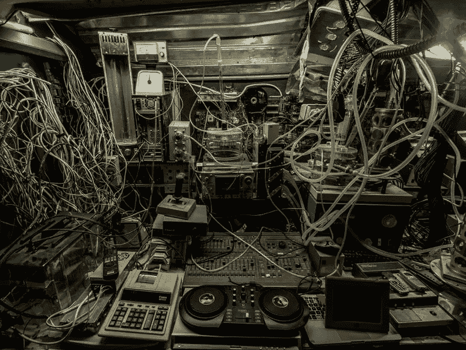

# 具有堆叠架构的 Flutter 应用的可扩展状态管理

> 原文：<https://itnext.io/scalable-state-management-on-flutter-using-stacked-architecture-ac2a5d419eaa?source=collection_archive---------2----------------------->

来源:Unsplash | [链接](https://unsplash.com/photos/VurHDpO4VYI)

# 介绍

你好。今天，我想分享一个关于使用 Flutter 进行状态管理的简单指南，在这种情况下，如何以一种可伸缩和干净的方式在多个小部件之间共享状态。

简而言之，如何在不同的窗口小部件上用相同的值同时调用 setState()函数，而不会在代码✨.中造成混乱

来源:Unsplash | [链接](https://unsplash.com/photos/4h0HqC3K4-c)

# 一些方法

## 回调注入

一种简单的方法是从父部件向子部件发送回调。由于 Flutter 应用程序只是一个小部件树，在某些时候两个小部件总是有一个共同的父部件，在那里你可以用 *setState()* 调用创建一个函数，并通过构造函数参数注入回调。

但是这种方法根本不可伸缩，并且总是会产生副作用，因为我们失去了对状态的一点控制。

## 带有 ValueNotifier 的全局变量

众所周知，当涉及到代码时，全局变量几乎从来都不是一个好主意，你不希望从应用程序的任何地方访问变量，因为这使得代码耦合，并且对于项目的新开发人员来说难以维护和理解。

尤其是当正在讨论的全局变量可以更新和重新呈现应用程序 UI 时。

## 继承的小部件

这是 Flutter 团队提供的开箱即用的标准方法，继承的小部件方法的问题是，它需要大量的样板代码来设置，有时特定情况下的实现会变得非常困难。

## 国家管理图书馆

这是标准的方式，也是大多数应用程序的归宿。在这种情况下，我们可以使用应用程序的上下文跨多个小部件管理应用程序的状态，这方面的一些例子是 *Provider* 和 *Bloc* 库，它们都被社区广泛使用和推荐。

但是，即使它们非常标准，这些方法仍然存在问题，其中之一是没有解决每个状态管理场景的标准方法，它们提供了工具，但是“*如何*”取决于开发人员，对我来说，这导致了大型应用程序中的不一致性，特别是当应用程序由大型团队开发时。

使用提供程序库的状态管理示例。

# 堆叠架构

一旦我们理解了其他方法的优缺点，我想介绍一个我发现的非常好的方法，通过使用**堆叠架构**来保持代码的高质量、整洁和可伸缩性。

该架构基于 MVVM 架构模式，其中每个 *V* ***视图*** 都有其对应的 *V* ***视图模型*** ，视图的唯一职责是显示 UI，视图模型的职责是处理逻辑、状态管理和服务与 API 的交互。

请注意，即使我们使用的是无状态小部件，UI 仍然是反应式的。

## 状态管理

该架构中的状态管理是基于提供者的，通过使用来自 *Viewmodel* 类的 *notifyListeners()* 函数来更新视图的状态并重建 UI，但是状态仍然只更新其对应的*视图*的 UI(参见前面的代码示例)。

由于*视图-视图模型*是一对一的关系(每个*视图*可以与一个并且只有一个*视图模型*交互，反之亦然)，我们不能为两个不同的*视图*共享同一个*视图模型*，但是我们能做的是使用*反应服务在*视图模型*之间创建一个连接点。*

*一个*

# ***结论***

***当我编码时，我是可伸缩性、整洁性和简单性的忠实粉丝，对我来说，堆叠架构提供了最好的方式来实现跨所有应用程序的状态管理，照顾到所有这些特性。***

***如果你是一个即将开始一个大项目的 Flutter 开发者，并且你喜欢学习新的方法来解决老问题，我真的鼓励你尝试这个架构。我保证你不会后悔的😄。***