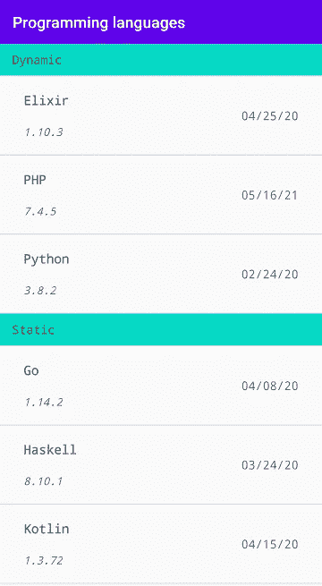

# 密封类+带标题的 recycle view =❤️

> 原文：<https://itnext.io/sealed-classes-recyclerview-with-headers-%EF%B8%8F-14b87d41deb6?source=collection_archive---------3----------------------->

如果你已经在 Android 生态系统中呆了一段时间，有可能在某个时候你需要在屏幕上以标题的形式显示一个按照给定标准分组的项目列表。类似于:

按类型分组的语言列表

我们可以在屏幕上识别两种不同类型的行:

*   **表头**:包含语言类型名称。
*   **语言**:显示给定语言的数据(名称、最新版本和发布日期)。

让我们开始定义必要的**基类**:

基于这个`Language`类，我们需要显示由`type`属性分组的语言。我们假设这个类将一个实体表示为我们域的**部分，它没有耦合到 UI** 。这非常重要，因为仅为 UI 定义模型将使我们的生活更容易(改变)。

该 UI 基于包含两种不同类型的行的 RecyclerView。这看起来像一个密封的类:

注意，除了这两个类(每个都代表 UI 状态数据)，还有一个新的枚举`RowType`，我们稍后会看到它为什么有用。

现在我们可以开始使用新创建的类构建我们的适配器了。幸运的是，`**RecyclerView.Adapter**` **类已经支持不同类型的视图**:`[getItemViewType](https://developer.android.com/reference/androidx/recyclerview/widget/RecyclerView.Adapter#getItemViewType(int))`函数允许定义哪种类型的视图将用于给定的数据行索引(这就是枚举变得方便的地方):

所以现在，有一个包含一系列`LanguageRow`项的适配器(记住这是密封类),它为 *getItemViewType* 函数返回`RowType`枚举的**序数值**。这就是 enum 的强大之处，因为我们不需要编写任何 if/when 语句。

接下来，我们需要处理适配器的支架。想法是有两个独立的持有人。其中一个用于包含语言数据的“常规”行，另一个用于标题:

我们可以完成缺少`onCreateViewHolder` 和`onBindViewHolder`功能的适配器实现:

这里还缺少一个重要的东西。一开始我展示了我们领域的一个`Language`类部分，然后是`LanguageRow`密封类。但是我们需要做一个**转换**来将语言列表转换成 UI 的行列表。为此，我们首先需要按类型对语言进行分组，并为每个结果分组创建一个标题+当前类型的所有语言:

# 结论

使用类型系统的力量会让你的代码更强大，更难破解，更容易修改。像使用枚举或定义密封类来表示只作为集合的一部分有效的值这样的小事会更简洁，更不容易出错。

下一篇文章再见！