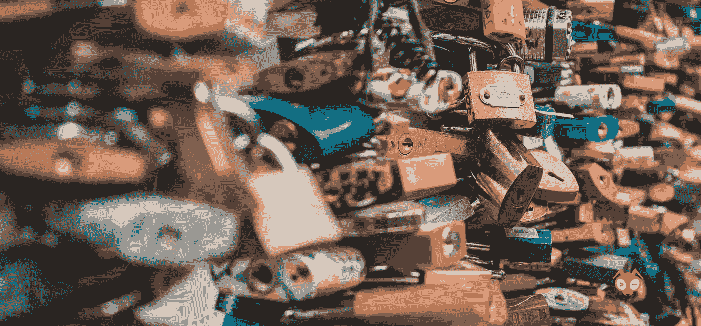

# 保护 Kubernetes 集群的基础设施

> 原文：<https://itnext.io/securing-the-base-infrastructure-of-a-kubernetes-cluster-64e79646b7bf?source=collection_archive---------3----------------------->

本系列 ***的[第一篇文章](https://blog.giantswarm.io/why-is-securing-kubernetes-so-difficult/)讨论了为什么难以保护 Kubernetes，以及在我们着手保护该平台时需要注意的各个层面。***

堆栈中的第一层是基础架构层。我们可以用许多不同的方式来定义它，但是出于我们讨论的目的，它是部署 Kubernetes 的基础设施组件的总和。它是用于计算、存储和网络目的的物理或抽象硬件层，以及这些资源所在的环境。它还包括操作系统，很可能是 Linux，以及一个容器运行时环境，比如 Docker。

我们将讨论的大部分内容同样适用于支撑 Kubernetes 之外的系统的基础设施组件，但我们将特别关注那些将增强 Kubernetes 安全性的因素。

# 机器、数据中心和公共云

采用云作为工作负载部署的工具，无论是公共、私有还是混合云，都在快速发展。虽然对专业裸机服务器配置的需求尚未完全消失，但支撑当今大部分计算资源的基础架构是虚拟机。然而，如果我们部署的机器是虚拟的(基于云或其他方式)或物理的，这并不重要，实体将驻留在数据中心，由我们自己的组织或选定的第三方(如公共云提供商)托管。

数据中心很复杂，在考虑安全性时，需要考虑的内容非常多。它是一种通用资源，用于托管整个组织的数据处理需求，甚至是来自不同行业和地理位置的众多独立组织的租赁工作负载。出于这个原因，在这个层次上对基础设施的许多不同方面应用安全性，往往是一个成熟的公司或供应商的责任。它将根据国家或国际法规( [HIPAA](https://www.hhs.gov/hipaa/for-professionals/privacy/index.html) 、 [GDPR](https://ec.europa.eu/commission/priorities/justice-and-fundamental-rights/data-protection/2018-reform-eu-data-protection-rules_en) )、行业合规性要求( [PCI DSS](https://www.pcisecuritystandards.org/pci_security/how) )等因素进行管理，并且通常会追求认证标准认可( [ISO 27001](https://www.iso.org/isoiec-27001-information-security.html) 、 [FIPS](https://www.nist.gov/itl/current-fips) )。

在公共云环境的情况下，供应商可以并将在基础架构层提供对法规和合规性标准的必要遵守，但在某种程度上，它归结为服务消费者(您和我)，以进一步构建这一安全基础。这是一个共同的责任。作为公共云服务的消费者，这就引出了一个问题，“我应该保护什么，我应该如何做？”有很多人对这个话题有很多看法，但一个可信的实体是互联网安全中心(CIS)(T11)，这是一个非营利组织，致力于保护公共和私人实体免受恶意网络活动的威胁。

# CIS 基准

CIS 提供了一系列工具、技术和信息，用于应对我们所依赖的系统和数据面临的潜在威胁。[例如，CIS 基准](https://www.cisecurity.org/cis-benchmarks/)是基于平台的安全最佳实践配置指南，由安全专业人员和主题专家共同编制。随着越来越多的组织开始实施转型计划(包括迁移到公共和/或混合云基础架构), CIS 已经将为主要公共云提供商提供基准作为自己的工作。 [CIS 亚马逊网络服务基础基准](https://www.cisecurity.org/benchmark/amazon_web_services/)就是一个例子，其他主要公共云提供商也有类似的基准。

这些基准提供基本的安全配置建议，涵盖身份和访问管理(IAM)、入口和出口、日志记录和监控最佳实践等。实施这些基准建议是一个很好的开始，但它不应该是旅程的终点。每个公共云提供商都将有自己的一套详细的推荐最佳实践 [1](https://blog.giantswarm.io/securing-the-base-infrastructure-of-a-kubernetes-cluster/#fn:1) 、 [2](https://blog.giantswarm.io/securing-the-base-infrastructure-of-a-kubernetes-cluster/#fn:2) 、 [3](https://blog.giantswarm.io/securing-the-base-infrastructure-of-a-kubernetes-cluster/#fn:3) ，并且可以从该领域的其他专家意见中受益匪浅，例如[云安全联盟](https://cloudsecurityalliance.org/)。

让我们花点时间来看看一个典型的基于云的场景，它需要从安全角度进行一些仔细的规划。

# 云场景:私有网络与公共网络

我们如何通过限制访问来平衡保持 Kubernetes 集群安全的需求，同时允许外部客户通过互联网以及从我们自己的组织内部进行所需的访问？

*   **为托管 Kubernetes 的机器使用专用网络** —确保代表集群节点的主机没有公共 IP 地址。取消与任何主机建立直接连接的能力，会大大减少攻击的可能性。这种简单的预防措施提供了显著的好处，例如，可以防止导致利用计算资源进行加密货币挖掘的危害。
*   **使用堡垒主机访问私有网络** —管理集群所需的对主机私有网络的外部访问应该通过适当配置的堡垒主机提供。Kubernetes API 通常也会暴露在 bastion 主机后面的私有网络中。它也可能公开暴露，但建议至少通过将来自组织内部网络和/或其 VPN 服务器的 IP 地址列入白名单来限制访问。
*   **使用带有内部负载平衡器/DNS 的 VPC 对等** —当在带有私有网络的 Kubernetes 集群中运行的工作负载需要由其他私有的集群外客户端访问时，可以通过调用内部负载平衡器的服务来公开工作负载。例如，要在 AWS 环境中创建一个内部负载平衡器，服务需要以下注释:`service.beta.kubernetes.io/aws-load-balancer-internal: 0.0.0.0/0`。如果客户端驻留在另一个 VPC，则需要对等 VPC。
*   **使用带有入口的外部负载平衡器** —工作负载通常被设计为由来自互联网的匿名外部客户端使用；当部署到专用网络时，如何允许流量在集群中找到工作负载？根据手头的需求，我们可以通过几种不同的方式来实现这一点。第一种选择是使用 Kubernetes 服务对象来公开工作负载，这将导致在公共子网上创建外部云负载平衡器服务(例如 AWS ELB)。这种方法成本很高，因为每个公开的服务都会调用一个专用的负载平衡器，但对于非 HTTP 服务来说，这可能是首选的解决方案。对于基于 HTTP 的服务，更具成本效益的方法是将入口控制器部署到集群，由 Kubernetes 服务对象作为前端，这反过来又创建了负载平衡器。寻址到负载平衡器的 DNS 名称的流量被路由到入口控制器端点，入口控制器端点评估与任何定义的入口对象相关联的规则，然后进一步路由到匹配规则中的服务端点。

此场景表明，需要仔细考虑如何配置安全的基础架构，同时提供向目标受众交付服务所需的功能。这不是唯一的情况，还会有其他情况需要类似的治疗。

# 锁定操作系统和容器运行时

假设我们已经研究并应用了必要的安全配置来确保机器级基础设施及其环境的安全，下一个任务是锁定每台机器的主机操作系统(OS ),以及负责管理容器生命周期的容器运行时。

# Linux 操作系统

虽然可以运行 Microsoft Windows Server 作为 Kubernetes 工作节点的操作系统，但通常情况下，控制平面和工作节点会运行 Linux 操作系统的变体。可能有许多因素决定了 Linux 发行版的选择(商业、内部技能、操作系统成熟度)，但是如果可能的话，使用专为运行容器而设计的最小发行版。例子包括 [CoreOS Container Linux](https://coreos.com/os/docs/latest/) 、 [Ubuntu Core](https://www.ubuntu.com/core) 和 [Atomic Host](https://www.projectatomic.io/) 变种。这些操作系统已经被精简到最低限度，以方便大规模运行容器，因此，攻击面大大减少。

同样，ci 为不同风格的 Linux 提供了许多不同的基准，为保护操作系统提供了最佳实践建议。这些基准涵盖了可能被认为是主流的 Linux 发行版，如 RHEL、Ubuntu、SLES、Oracle Linux 和 Debian。如果您的首选发行版没有包括在内，有一个独立于[发行版的](https://www.cisecurity.org/benchmark/distribution_independent_linux/) CIS 基准，通常还有特定于发行版的指南，例如[CoreOS Container Linux Hardening Guide](https://coreos.com/os/docs/latest/hardening-guide.html)。

# 码头引擎

基础设施层的最后一个组件是容器运行时。在 Kubernetes 的早期，没有可用的选择；容器运行时必然是 Docker 引擎。然而，随着 Kubernetes [容器运行时接口](https://kubernetes.io/blog/2016/12/container-runtime-interface-cri-in-kubernetes/)的出现，有可能移除对 Docker 引擎的依赖，支持运行时，如 [CRI-O](http://cri-o.io/) 、 [containerd](https://containerd.io/) 或 [Frakti](https://github.com/kubernetes/frakti) 。 [4](https://blog.giantswarm.io/securing-the-base-infrastructure-of-a-kubernetes-cluster/#fn:4) 事实上，从 Kubernetes 版本 1.12 开始，一个 alpha 特性([运行时类](https://kubernetes.io/docs/concepts/containers/runtime-class/))允许在一个集群中并行运行多个容器运行时。无论部署哪个容器运行时，它们都需要保护。

尽管有多种选择，Docker 引擎仍然是 Kubernetes 的默认容器运行时(尽管在不久的将来可能会改为 containerd)，我们将在这里考虑它的安全含义。它构建了大量可配置的安全设置，其中一些默认情况下是打开的，但可以在每个容器的基础上绕过。一个这样的例子是 Linux 内核功能的[白名单](https://github.com/moby/moby/blob/master/oci/defaults.go#L14-L30)在创建时应用于每个容器，这有助于减少运行中的容器内可用的特权。

同样，CIS 为 Docker 平台维护了一个基准，即 [CIS Docker 基准](https://www.cisecurity.org/benchmark/docker/)。它提供了配置 Docker 守护程序以获得最佳安全性的最佳实践建议。甚至有一个方便的开源工具(脚本)，称为 [Docker Bench for Security](https://github.com/docker/docker-bench-security) ，可以针对 Docker 引擎运行，该引擎评估系统是否符合 CIS Docker 基准。该工具可以定期运行，以暴露与所需配置的任何偏差。

当 Docker 引擎被用作 Kubernetes 的容器运行时，在考虑和度量它的安全配置时需要注意一些。Kubernetes 忽略了 Docker 守护进程的许多可用功能，更倾向于自己的安全控制。例如，Docker 守护进程被配置为使用 [seccomp 概要文件](https://docs.docker.com/engine/security/seccomp/)将可用 Linux 内核系统调用的默认白名单应用到每个创建的容器。除非特别说明，Kubernetes 将指示 Docker 从 seccomp 的角度创建“无约束”的 pod 容器，让容器可以访问每一个可用的系统调用。换句话说，可能在较低的“Docker 层”配置的内容，可能会在平台堆栈的较高级别撤销。我们将在以后的文章中讨论如何减少安全上下文中的这些差异。

# 摘要

将我们所有的注意力集中在一个平台的 Kubernetes 组件的安全配置上可能很有诱惑力。但是正如我们在本文中所看到的，较低层的基础设施组件同样重要，如果忽略了它们，后果将不堪设想。事实上，提供一个安全的基础设施层甚至可以减轻我们可能在集群层本身引入的问题。例如，保持我们节点的私密性可以防止不安全的 kubelet 被用于[的邪恶目的](https://medium.com/handy-tech/analysis-of-a-kubernetes-hack-backdooring-through-kubelet-823be5c3d67c)。基础设施组件应该得到与 Kubernetes 组件本身同等的关注。

在下一篇文章中，我们将继续讨论保护堆栈中的下一层 Kubernetes 集群组件的含义。

# 脚注

1.  [AWS 安全最佳实践](https://aws.amazon.com/whitepapers/aws-security-best-practices/) [↩](https://blog.giantswarm.io/securing-the-base-infrastructure-of-a-kubernetes-cluster/#fnref:1)
2.  [Azure 安全最佳实践和模式](https://docs.microsoft.com/en-us/azure/security/security-best-practices-and-patterns) [↩](https://blog.giantswarm.io/securing-the-base-infrastructure-of-a-kubernetes-cluster/#fnref:2)
3.  [企业组织最佳实践(谷歌云平台)](https://cloud.google.com/docs/enterprise/best-practices-for-enterprise-organizations) [↩](https://blog.giantswarm.io/securing-the-base-infrastructure-of-a-kubernetes-cluster/#fnref:3)
4.  更小、更轻的容器运行时，如 containerd，特别是为引导容器而构建的，本质上更安全，因为它们有专门的用途。 [↩](https://blog.giantswarm.io/securing-the-base-infrastructure-of-a-kubernetes-cluster/#fnref:4)

由[Puja Abbas si](https://twitter.com/puja108)——开发者倡议@ [巨型虫群](https://giantswarm.io/)撰写

 [## puja Abbas si @ kube con🇨🇳(@ puja 108)|推特

### Puja Abbassi @ KubeCon 🇨🇳的最新推文(@puja108)。开发者倡导者@ GiantSwarm & Researcher 主题…

twitter.com](https://twitter.com/puja108)