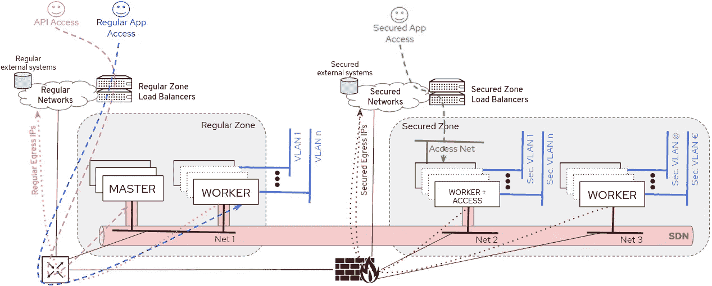

# OpenShift 工作节点中的安全区域—第四部分—用户限制和概述

> 原文：<https://itnext.io/security-zones-in-openshift-worker-nodes-part-iv-user-restrictions-and-recap-5ec0ba7bdaf9?source=collection_archive---------6----------------------->


这是关于如何在你的 OpenShift workers 中配置安全区域的最后一篇文章。您应该已经完成了前面的配置步骤:

[](https://medium.com/@luis.ariz/security-zones-in-openshift-worker-nodes-part-ii-grouping-workers-8e97f1d601ba) [## OpenShift 工人节点中的安全区域—第二部分—工人分组

### 这是本系列的第二部分，我们将配置两组不同的工作人员。

medium.com](https://medium.com/@luis.ariz/security-zones-in-openshift-worker-nodes-part-ii-grouping-workers-8e97f1d601ba) [](https://medium.com/@luis.ariz/security-zones-in-openshift-worker-nodes-part-iii-network-configuration-3a887854a4d) [## OpenShift 工作节点中的安全区域—第三部分—网络配置

### 在本帖中，我们将重点讨论在我们的安全系统中分离入站和出站流量所需的网络配置…

medium.com](https://medium.com/@luis.ariz/security-zones-in-openshift-worker-nodes-part-iii-network-configuration-3a887854a4d) 

这一次，我们将配置 RBAC 和其他限制，只允许我们的 OpenShift 集群用户的一个子集能够使用安全区域。

# 概观

现在一切都正常了。我们可以说我们已经做到了，但前提是我们完全信任我们的 OpenShift 用户，因为任何用户都可以选择何时在安全区域部署工作负载。

我们不想那样。作为集群管理员，我们希望设置某些名称空间，附加到一些用户/组，允许他们在安全区域中创建新的应用程序，而其余的用户/名称空间将不能使用它。这意味着唯一能够创建新名称空间的人是集群管理员(我们需要为其他用户禁用该选项)

我将创建两组用户:

*   普通用户
*   安全区域用户

普通用户将只能使用普通区域，而安全区域用户将被允许使用两个区域(或者只使用一个区域，如我们将看到的那样，通过配置名称空间默认节点选择器)。如果您想要设置为不受信任的用户创建区域的用例，您将需要以相反的方式配置权限，以便新的(不受信任的)用户组只能使用新的区域，而其余的用户可以同时使用这两个区域，并且还需要在名称空间中配置默认的 nodeSelector，这样用户就不需要将它包含在对象定义中来防止部署失败。

**阻止使用安全区域**

我们如何“允许”某人使用安全区域？通过在它们的名称空间中包含公差。因为我们不允许用户自己创建名称空间，所以集群管理员将知道何时包含对名称空间的容忍，以及如何将名称空间绑定到用户组，但是我们需要防止用户配置他们自己的容忍，否则，他们可能会包含使用安全区域的容忍，即使他们不应该这样做。

名称空间中有一个特殊的注释(【scheduler.alpha.kubernetes.io/tolerationsWhitelist】)列出了该名称空间上的用户可以配置的有效容差。如果用户试图配置未在此列出的任何其他容差，他将得到一个错误。我们将使用该注释。

有一件事你必须考虑到。当您创建一个 POD 时，即使您没有设置任何容差，您也可以在对象定义中找到其中的两个配置:

```
...
tolerations:
    - key: node.kubernetes.io/not-ready
      operator: Exists
      effect: NoExecute
      tolerationSeconds: 300
    - key: node.kubernetes.io/unreachable
      operator: Exists
      effect: NoExecute
      tolerationSeconds: 300
...
```

如果我们设置了 *tolerationsWhitelist* 注释，我们需要记住这一点，并将那些“默认”公差包括在允许的公差列表中，否则当您试图创建新的 PODs 时，您会发现这个错误，因为您试图使用不允许的公差(尽管您没有在对象上指定它们):

```
pod tolerations (possibly merged with namespace default tolerations) conflict with its namespace whitelist
```

因为我们不希望用户配置任何其他容差，所以我们只在注释中包括那些默认容差，不再包括，这将使他们无法使用所需的容差来使用安全区域，并且因为集群管理员将是唯一创建名称空间的人，所以这可以预先配置，用户将无法修改它。

**阻止网络策略修改**

请记住，除了容差之外，还必须在名称空间级别执行其他配置，例如防止 SDN 内部连接的网络策略

这种配置不同于前一种配置，前一种配置包含在用户不能修改的名称空间对象的注释中，它是链接到用户可以管理的名称空间的附加对象。

但是，如果集群管理员在名称空间中设置了一些网络策略，而用户随后删除了它们，会发生什么情况呢？我们应该防止用户修改网络策略，以确保这种情况不会发生。

这将通过删除用户在 NetworkPolicy 对象上的权限来完成。我将创建一个新的 RBAC 角色，按照我从一开始就遵循的尽可能少使用默认 OpenShift 配置的策略，删除这些权限，而不是从默认角色中删除它们。

**在名称空间中包含默认注释和网络策略**

每次创建命名空间时，都要进行一些配置:

1.  使用所需角色授予用户/组访问权限
2.  创建*容忍白名单*注释，以防止来自用户的不必要的容忍配置
3.  创建默认网络策略

对于第 2 点和第 3 点，我们可以执行一个配置，这将使集群管理员的工作稍微轻松一些。我们将在默认的新命名空间模板中包含一些*容忍白名单*和默认网络策略，因此每次 clusteradmin 创建新的命名空间时，这些配置将自动包含在配置中。

Multus 网络是在 Network Operator 中逐个配置的，所以我们不能将它们包含在这个模板中，也许有一天将 Multus 网络附加到名称空间会是一种更容易支持的方法，但现在就是这样做的。

**变更概要**

总之，我们需要:

*   创建两个新用户组，并在其中包含用户
*   删除用户创建自己的命名空间/项目的权限
*   创建一个新的群集角色，在该角色中，我们删除用户修改容差的权限，并删除用户修改网络策略的权限
*   修改默认命名空间创建模板以包含默认网络策略

# **OpenShift 配置(限制区域使用)**

让我们从新组开始。

**1-用户组**

我的 OpenShift 集群中已经配置了一些用户(用户 1 到用户 10)。我将添加两个新组，一个使用 OC CLI，另一个使用描述符(您可以使用 CLI 或 Web 控制台来创建它)。

```
oc adm groups new regularusers user1 user2 user3 user4 user5
```

第二组:

```
apiVersion: user.openshift.io/v1
kind: Group
metadata:
  name: securezoneusers
users:
  - user6
  - user7 
  - user8
  - user9 
  - user10
```

**2-删除名称空间创建权限**

您可以通过运行以下命令来删除项目自行设置程序权限:

```
$ oc patch clusterrolebinding.rbac self-provisioners -p '{"subjects": null}'
```

编辑`**self-provisioners**`集群角色绑定以防止角色自动更新。自动更新会将群集角色重置为默认状态。

```
$ oc patch clusterrolebinding.rbac self-provisioners -p ‘{ “metadata”: { “annotations”: { “rbac.authorization.kubernetes.io/autoupdate”: “false” } } }’
```

**3-创建一个新的群集角色，我们将在其中删除用户修改网络策略的权限**

我不会从头开始创建一个角色，我会得到一个默认的，复制它，最后修改它。在我的例子中，最佳匹配是“编辑”角色，所以我将它“导出”到一个文件中(注意不再支持 *oc export* 命令，我们将不得不手动删除一些键)

我用编辑角色对象的内容创建了一个“editrestricted.yaml”文件:

```
oc get clusterrole edit -o yaml > editrestricted.yaml
```

一旦有了文件，您需要对其进行一些更改:

*   更改对象的名称。我将角色的名称更改为 editrestricted
*   不仅要删除 *autoupdate* 键，还要删除所有元数据(不包括对象名称),因为否则，您会发现由于对象的自动升级，角色修改不会被应用。你会得到这样的东西:

```
apiVersion: rbac.authorization.k8s.io/v1
kind: ClusterRole
metadata:
 name: editrestricted
rules:
- apiGroups:
...
```

*   删除所有出现“networkpolicies”的地方。在我的例子中，有 5 次出现，其中 4 次出现在键中，而 networkpolicies 是列表中的一个额外资源，因此我们只需要删除它，但是有一次出现在 networkpolicies 是唯一资源的情况下(检查下面)，在这种情况下，您需要删除完整的条目(您的键中不能有空的资源列表)

```
...
- verbs:
      - create
      - delete
      - deletecollection
      - get
      - list
      - patch
      - update
      - watch
    apiGroups:
      - extensions
      - networking.k8s.io
    resources:
      - networkpolicies
  - verbs:
 ...
```

完成所有这些修改后，您就可以创建对象了，在本例中，我将使用 OC CLI:

```
oc create -f editrestricted.yaml
```

**4-修改默认命名空间创建模板，包括白名单容忍和默认网络策略**

作为集群管理员，您可以修改默认项目模板，以便使用您的自定义需求创建新项目。

为了在默认模板中执行修改，我们需要用配置创建一个新对象，然后在指向它的项目集群配置对象中配置 *projectRequestTemplate* 键。

我们用项目模板生成一个文件:

```
$ oc adm create-bootstrap-project-template -o yaml > projecttemplate.yaml
```

然后，我们在该文件中包含我们想要的配置。如您所见，如果您打开文件，模板是一个对象列表，当一个新项目被创建时，它将被创建。

将有一个“项目”对象，我们将在其中包含注释，以防止来自用户的容差配置(请记住在此包含 PODs 使用的两个默认容差):

```
scheduler.alpha.kubernetes.io/tolerationsWhitelist: '[{"operator": "Exists", "effect": "NoExecute", "tolerationSeconds": 300, "key": "node.kubernetes.io/not-ready"},{"operator": "Exists", "effect": "NoExecute", "tolerationSeconds": 300, "key": "node.kubernetes.io/unreachable"}]'
```

我们还包括其他网络策略对象。在我们的示例中，有两个策略允许项目内 POD 流量和来自监控系统的访问(请记住，其他网络策略必须在项目创建后进行配置，具体取决于该项目是要创建“常规应用程序”还是“安全区域应用程序”)。

模板对象的第一部分(我们执行配置的地方)如下所示:

```
apiVersion: template.openshift.io/v1
kind: Template
metadata:
  creationTimestamp: null
  name: project-request
objects:
**- apiVersion: networking.k8s.io/v1
  kind: NetworkPolicy
  metadata:
    name: allow-from-same-namespace
  spec:
    podSelector:
    ingress:
    - from:
      - podSelector: {}
- apiVersion: networking.k8s.io/v1
  kind: NetworkPolicy
  metadata:
    name: allow-from-openshift-monitoring
  spec:
    ingress:
    - from:
      - namespaceSelector:
          matchLabels:
            network.openshift.io/policy-group: monitoring
    podSelector: {}
    policyTypes:
    - Ingress
- apiVersion: networking.k8s.io/v1
  kind: NetworkPolicy
  metadata:
    name: allow-from-openshift-ingress
  spec:
    ingress:
    - from:
      - namespaceSelector:
          matchLabels:
            network.openshift.io/policy-group: ingress
    podSelector: {}
    policyTypes:
    - Ingress** - apiVersion: project.openshift.io/v1
  kind: Project
  metadata:
    annotations:
      openshift.io/description: ${PROJECT_DESCRIPTION}
      openshift.io/display-name: ${PROJECT_DISPLAYNAME}
      openshift.io/requester: ${PROJECT_REQUESTING_USER}
 **scheduler.alpha.kubernetes.io/tolerationsWhitelist: '[{"operator": "Exists", "effect": "NoExecute", "tolerationSeconds": 300, "key": "node.kubernetes.io/not-ready"},{"operator": "Exists", "effect": "NoExecute", "tolerationSeconds": 300, "key": "node.kubernetes.io/unreachable"}]'**
    creationTimestamp: null
    name: ${PROJECT_NAME}
  spec: {}
  status: {}
...
```

我们已经准备好了对象，现在需要在“openshift-config”名称空间下创建它:

```
$ oc create -f projecttemplate.yaml -n openshift-config
```

一旦在 OpenShift 集群中创建了对象，我们仍然需要在项目集群配置中引用它:

```
oc edit project.config.openshift.io/cluster
```

我们在*规范*中包含了我们已经配置好的项目请求模板名称:

```
...
spec:
  projectRequestTemplate:
    name: project-request
```

完成，现在每次创建新项目时，命名空间都将包含注释，并且将创建两个网络策略。

请记住，还有其他配置没有包含在默认模板中，例如，标签 *securityzone= secure* ，以及只有在允许名称空间使用安全区域的情况下才必须包含的默认容差。

# **配置测试(限制区域使用)**

作为集群管理员，我将创建两个名称空间，并将它们附加到我们创建的不同用户组:

*   "*RBAC-常规*"命名空间附加到"*常规用户*"组
*   "*RBAC-安全*命名空间附加到" *securezoneusers* "组

我为常规用户测试创建项目:

```
oc new-project rbac-regular
```

此时，我们可以检查名称空间中是否包含了 *tolerationsWhitelist* 注释:

```
$ oc get namespace rbac-regular -o yaml | grep tolerations scheduler.alpha.kubernetes.io/tolerationsWhitelist: '[{"operator": "Exists", "effect":
          f:scheduler.alpha.kubernetes.io/tolerationsWhitelist: {}
```

并且两个网络策略与每个项目相关联:

```
$ oc get networkpolicies.networking.k8s.io -n rbac-regularNAME                              POD-SELECTOR   AGE
allow-from-openshift-monitoring   <none>         23s
allow-from-same-namespace         <none>         23s
allow-from-openshift-ingress      <none>         23s
```

我还将创建一个项目来测试安全区域允许的用户:

```
oc new-project rbac-secure
```

由于该项目将被允许使用安全区域，我们需要在默认设置中包含一些手动配置:

*   更改*容忍白名单* 注释，以允许使用安全区域所需的容忍
*   (可选)包含一个*default tolerations***注释，这样用户就不需要在他们的 kubernetes 对象中包含容忍配置**
*   **(可选)包含默认的 nodeSelector 注释，这样用户就不需要在他们的对象中包含正确的 nodeSelector。如果您配置了默认的 nodeSelector，那么名称空间将只包含带有该标签的工作者组，因为所有部署都将包含这样的 nodeSelector。如果您想让命名空间在两个区域中创建应用程序，请不要包括它(对于其他用例，如“不受信任的用户区域”将是一个要求)。**
*   **在名称空间中包含标签 *securityzone= secure***

**我们可以在注释中包含我们正在使用的容差，但是由于我没有更多必须限制的组或容差，因此我将为该测试做的只是从名称空间 *rbac-secure* 对象中删除*容差白名单*注释，这将使该名称空间中的用户能够使用他们需要的任何容差。**

**我们还将默认包含安全区域的容错，因此用户只需在他们的部署中使用 *nodeSelector* (即使他们没有指定，容错也将始终被配置)。**

**用粗体文本检查名称空间对象中的更改:**

```
apiVersion: v1
kind: Namespace
metadata:
 **labels:
    securityzone: secure**
  annotations:
    openshift.io/description: ""
    openshift.io/display-name: ""
    openshift.io/requester: system:admin
    openshift.io/sa.scc.mcs: s0:c27,c9
    openshift.io/sa.scc.supplemental-groups: 1000720000/10000
    openshift.io/sa.scc.uid-range: 1000720000/10000
    **openshift.io/node-selector: node-role.kubernetes.io/secure-worker=
    scheduler.alpha.kubernetes.io/defaultTolerations: '[{"Key": "securityzone", "Operator":"Equal", "Value": "secure", "effect": "NoSchedule"}]'**
  creationTimestamp: "2020-07-21T07:18:06Z"
  managedFields:
...
```

**一旦我们有了项目/名称空间，作为 clusteradmin，我们就可以将权限分配给我们已经创建的用户组，赋予他们在配置步骤中生成的角色 editrestricted:**

```
$  oc adm policy add-role-to-group editrestricted regularusers -n rbac-regularclusterrole.rbac.authorization.k8s.io/editrestricted added: "regularusers"$ oc adm policy add-role-to-group editrestricted securezoneusers -n rbac-secureclusterrole.rbac.authorization.k8s.io/editrestricted added: "securezoneusers"
```

**绑定已配置，让我们运行这些测试(区域之间的网络连接保护已经在之前关于网络配置的帖子中测试过):**

*   **作为用户，我将尝试创建一个新的项目/名称空间，但应该会失败。**
*   **作为用户，我将尝试删除/创建网络策略，但应该会失败。**
*   **作为 regularusers 组的用户，我将在常规区域创建一个应用程序，它应该会成功。**
*   **作为 regularusers 组的用户，我将在安全区域创建一个应用程序，但它应该会失败。**
*   **作为 securezoneusers 组的用户，我将在常规区域创建一个应用程序，应该会成功。**
*   **作为 securezoneusers 组的用户，我将在安全区域创建一个应用程序，应该会成功。**

****1-作为用户，我将尝试创建一个新项目/名称空间，但应该会失败。****

```
$ oc loginAuthentication required for [https://api.ocp.136.243.40.222.nip.io:6443](https://api.ocp.136.243.40.222.nip.io:6443) (openshift)
Username: user1
Password: 
Login successful.You have one project on this server: "default"Using project "default".$ oc new-project hola
Error from server (Forbidden): You may not request a new project via this API.
```

****2-作为用户，我将尝试删除/创建网络策略，但应该会失败。****

**作为 rbac-regular 项目中的用户 1，我尝试列出网络策略:**

```
$ oc get networkpolicyError from server (Forbidden): networkpolicies.networking.k8s.io is forbidden: User "user1" cannot list resource "networkpolicies" in API group "networking.k8s.io" in the namespace "rbac-regular"
```

**我假设用户知道默认网络工作策略的名称，并试图删除一个:**

```
$ oc delete networkpolicies allow-from-same-namespaceError from server (Forbidden): networkpolicies.networking.k8s.io "allow-from-same-namespace" is forbidden: User "user1" cannot delete resource "networkpolicies" in API group "networking.k8s.io" in the namespace "rbac-regular"
```

**我还尝试创建一个新的网络策略:**

```
$ oc create -f - << EOF
> apiVersion: networking.k8s.io/v1
> kind: NetworkPolicy
> metadata:
>   name: allow-from-openshift-ingress
> spec:
>   ingress:
>   - from:
>     - namespaceSelector:
>         matchLabels:
>           network.openshift.io/policy-group: ingress
>   podSelector: {}
>   policyTypes:
>   - Ingress
> EOFError from server (Forbidden): error when creating "STDIN": networkpolicies.networking.k8s.io is forbidden: User "user1" cannot create resource "networkpolicies" in API group "networking.k8s.io" in the namespace "rbac-regular"
```

****3-作为 regularusers 组的用户，我将在常规区域创建一个应用程序，它应该会成功。****

**作为 rbac-regular 项目中的用户 1，我尝试创建此 POD:**

```
apiVersion: v1
kind: Pod
metadata:
  namespace: rbac-regular
  name: test-regular
  labels:
    app: test-regular
spec:
  containers:
  - name: test
    image: centos/tools
    command: ["/bin/bash", "-c", "sleep 9000000"]
```

**这是允许的，并且 pod 运行在常规区域:**

```
$ oc get pod -o wide -n rbac-regular  | grep test | awk {'print $1" " $7'} | column -ttest-regular  worker0.ocp.136.243.40.222.nip.io
```

****4-作为 regularusers 组的用户，我将在安全区域创建一个应用程序，但应该会失败。****

**作为 rbac-regular 项目中的用户 1，我尝试创建此 POD:**

```
apiVersion: v1
kind: Pod
metadata:
  namespace: rbac-regular
  name: test-secure
  labels:
    app: test-secure
spec:
  containers:
  - name: test-secure-tole
    image: centos/tools
    command: ["/bin/bash", "-c", "sleep 9000000"]
  tolerations:
    - key: "securityzone"
      operator: "Equal"
      value: "secure"
      effect: "NoSchedule"
  nodeSelector:
    node-role.kubernetes.io/secure-worker: ''
```

**不允许显示此错误:**

```
pod tolerations (possibly merged with namespace default tolerations) conflict with its namespace whitelist
```

**作为 securezoneusers 组的用户，我将在常规区域创建一个应用程序，应该会成功。**

**作为 rbac-secure 项目中的用户 8，我尝试创建此 POD:**

```
apiVersion: v1
kind: Pod
metadata:
  namespace: rbac-secure
  name: test-regular
  labels:
    app: test-regular
spec:
  containers:
  - name: test
    image: centos/tools
    command: ["/bin/bash", "-c", "sleep 9000000"]
```

**这是允许的，并且 pod 运行在常规区域:**

```
$ oc get pod -o wide -n rbac-secure  | grep test | awk {'print $1" " $7'} | column -ttest-regular  worker0.ocp.136.243.40.222.nip.i
```

****6-作为 securezoneusers 组的用户，我将在安全区域创建一个应用程序，它应该会成功。****

**作为 rbac-secure 项目中的用户 8，我尝试创建这个 POD(请记住，我没有在 POD 定义中包含*容错*或*节点选择器*，因为我们强制将其默认包含在名称空间对象中)**

```
apiVersion: v1
kind: Pod
metadata:
  namespace: rbac-secure
  name: test-secure
  labels:
    app: test-secure
spec:
  containers:
  - name: test-secure-tole
    image: centos/tools
    command: ["/bin/bash", "-c", "sleep 9000000"]
```

**它是允许的，并且在安全区域 workers 中运行(记住总是默认为 worker4，因为 worker2 和 worker3 有一个*preferno schedule*tain):**

```
$ oc get pod -o wide -n rbac-secure  | grep test | awk {'print $1" " $7'} | column -ttest-regular  worker0.ocp.136.243.40.222.nip.io
test-secure   worker4.ocp.136.243.40.222.nip.io
```

**我们可以检查安全区域容差以及群集默认容差:**

```
...tolerations:
  - effect: NoExecute
    key: node.kubernetes.io/not-ready
    operator: Exists
    tolerationSeconds: 300
  - effect: NoExecute
    key: node.kubernetes.io/unreachable
    operator: Exists
    tolerationSeconds: 300
  - effect: NoSchedule
    key: securityzone
    operator: Equal
    value: secure
...
```

# **搞定了。，让我们回顾一下我们执行的步骤**

**我们完了！，让我们回顾一下我们遵循的步骤，但首先，看一下我们配置的体系结构:**

****

****第 0 步。静态 IPs****

**创建新节点时配置静态 IP，包括安全区域访问网络。**

****第一步。给新区域的所有工人贴上标签并污染他们****

**您需要在位于该区域的所有员工中包含一个新标签(我选择创建一个新的“角色”):**

```
oc label node <newzoneworker> node-role.kubernetes.io/secure-worker=''
```

**因为我创建了一个新角色，所以我删除了这些 workers 中的默认角色:**

```
oc label node <newzoneworker> node-role.kubernetes.io/worker-
```

**创建污点以防止工作负载被安排到新区域，除非您配置了特定的容差:**

```
oc adm taint node worker2.ocp.136.243.40.222.nip.io securityzone=secure:NoSchedule
```

****第二步。给新区域的“进入”工人贴上标签并进行污染****

**在 IngressController 将位于的工作线程(可以访问安全区域访问网络的线程)中，我添加了一个额外的标签和污点:**

```
oc label node worker2.ocp.136.243.40.222.nip.io ingressaccess=true
```

**这是因为如果可能的话，我们不希望在这些节点上安排任何工作负载:**

```
oc adm taint node worker2.ocp.136.243.40.222.nip.io ingressaccess=true:PreferNoSchedule
```

****第三步。为新角色创建一个新的 MachineConfigPool****

**因为我们创建了一个新角色，所以我们需要创建一个新的 MachineConfigPool，以便允许在这些节点中进行升级:**

```
apiVersion: machineconfiguration.openshift.io/v1
kind: MachineConfigPool
metadata:
  name: secure-worker
spec:
  machineConfigSelector:
    matchExpressions:
      - {key: machineconfiguration.openshift.io/role, operator: In, values: [worker,secure-worker]}
  nodeSelector:
    matchLabels:
      node-role.kubernetes.io/secure-worker: ""
  paused: false
```

****步骤四。创建一个新的 Ingres controller****

**创建一个新的 IngressController，包括一个 namespaceSelector，以确保我们可以选择要使用的入口。**

```
apiVersion: operator.openshift.io/v1
kind: IngressController
metadata:
  name: secure-ingress
  namespace: openshift-ingress-operator
spec:
  endpointPublishingStrategy:
    type: HostNetwork 
  domain: secureapps.ocp.136.243.40.222.nip.io
  replicas: 2
  nodePlacement:
    nodeSelector:
      matchLabels:
        node-role.kubernetes.io/secure-worker: ""
        ingressaccess: "true"
  namespaceSelector:
    matchExpressions:
      - key: securityzone
        operator: In
        values:
        - secure
```

**由于我们希望在使用安全 Ingres controller 时不使用默认的 Ingres controller，因此我们在默认 Ingres controller 中配置了相反的选择器**

```
oc edit ingresscontrollers.operator.openshift.io -n openshift-ingress-operator default...
spec:
 **namespaceSelector:
    matchExpressions:
    - key: securityzone
      operator: DoesNotExist**
...
```

**最后，因为新的 IngressControllers 将在 SecureZone workers 上运行，所以您必须在 openshift-ingress 名称空间中包含 Tolaration**

```
oc edit namespace openshift-ingress...
  annotations:
    openshift.io/node-selector: ''
    openshift.io/sa.scc.mcs: 's0:c24,c4'
    openshift.io/sa.scc.supplemental-groups: 1000560000/10000
    openshift.io/sa.scc.uid-range: 1000560000/10000
 **scheduler.alpha.kubernetes.io/defaultTolerations: '[{"Key": "securityzone", "Operator":"Equal", "Value": "secure", "effect": "NoSchedule"}]'**
  managedFields:
 ...
```

****第五步。在默认命名空间中包含一个标签，以允许访问控制器流量****

**由于我们的新 IngressController 使用主机网络访问，我们必须在默认命名空间中包含此标签，以便配置所需的网络策略**

```
oc edit namespace defaultapiVersion: v1
kind: Namespace
metadata:
 **labels:
    network.openshift.io/policy-group: ingress**
  annotations:
...
```

****第六步。移除自供应项目****

**不要让用户创建他们自己的项目/名称空间:**

```
$ oc patch clusterrolebinding.rbac self-provisioners -p '{"subjects": null}'
```

**删除可能会将群集角色重置为默认状态的自动更新:**

```
$ oc patch clusterrolebinding.rbac self-provisioners -p ‘{ “metadata”: { “annotations”: { “rbac.authorization.kubernetes.io/autoupdate”: “false” } } }’
```

****第七步。修改项目创建模板****

**生成项目创建模板:**

```
$ oc adm create-bootstrap-project-template -o yaml > projecttemplate.yaml
```

**在项目中包括默认的 NetworkPolicy 对象和注释，以限制用户可以配置的容忍度:**

```
apiVersion: template.openshift.io/v1
kind: Template
metadata:
  creationTimestamp: null
  name: project-request
objects:
**- apiVersion: networking.k8s.io/v1
  kind: NetworkPolicy
  metadata:
    name: allow-from-same-namespace
  spec:
    podSelector:
    ingress:
    - from:
      - podSelector: {}
- apiVersion: networking.k8s.io/v1
  kind: NetworkPolicy
  metadata:
    name: allow-from-openshift-monitoring
  spec:
    ingress:
    - from:
      - namespaceSelector:
          matchLabels:
            network.openshift.io/policy-group: monitoring
    podSelector: {}
    policyTypes:
    - Ingress
- apiVersion: networking.k8s.io/v1
  kind: NetworkPolicy
  metadata:
    name: allow-from-openshift-ingress
  spec:
    ingress:
    - from:
      - namespaceSelector:
          matchLabels:
            network.openshift.io/policy-group: ingress
    podSelector: {}
    policyTypes:
    - Ingress** - apiVersion: project.openshift.io/v1
  kind: Project
  metadata:
    annotations:
      openshift.io/description: ${PROJECT_DESCRIPTION}
      openshift.io/display-name: ${PROJECT_DISPLAYNAME}
      openshift.io/requester: ${PROJECT_REQUESTING_USER}
 **scheduler.alpha.kubernetes.io/tolerationsWhitelist: '[{"operator": "Exists", "effect": "NoExecute", "tolerationSeconds": 300, "key": "node.kubernetes.io/not-ready"},{"operator": "Exists", "effect": "NoExecute", "tolerationSeconds": 300, "key": "node.kubernetes.io/unreachable"}]'**
    creationTimestamp: null
    name: ${PROJECT_NAME}
  spec: {}
  status: {}
...
```

**准备好模板后，在 openshift-config 名称空间中创建它:**

```
$ oc create -f projecttemplate.yaml -n openshift-config
```

**然后，您需要在集群项目配置对象中添加对此模板的引用:**

```
oc edit project.config.openshift.io/cluster
```

**检查粗体文本中的更改:**

```
...
spec:
  projectRequestTemplate:
    name: project-request
```

****第八步。创建用户组****

**我创建了两个组，每个区域一个(但是您可以创建任意多个)**

```
oc adm groups new <zone1-users> <user1> <user2> ... <usern>oc adm groups new <zone2-users> <usera> <userb> ... <userx>
```

****第九步。创建一个限制网络策略管理的新角色****

**创建一个无权访问网络策略管理的新角色。我基于默认的“编辑”角色创建了一个**

```
oc get clusterrole edit -o yaml > editrestricted.yaml
```

**在那个文件里**

*   **更改对象的名称。**
*   **移除除名称之外的所有元数据**
*   **删除所有出现“networkpolicies”的地方。**

**完成所有这些修改后，您就可以创建对象了，在本例中，我将使用 OC CLI:**

```
oc create -f editrestricted.yaml
```

****第十步。创建名称空间并分配用户和角色****

**无需进一步配置，即可使用此命令创建常规区域项目:**

```
oc new-project <project name>
```

**对于安全区域中允许的项目，需要对名称空间对象执行一些额外的步骤:**

*   **添加一个标签以选择 IngressController(示例中的 *securityzone= secure* )**
*   **移除*容忍白名单* 注释**
*   **(可选)包含一个*default tolerations***注释，这样用户就不需要在部署中包含容忍配置，如果他们不想这样做的话****
*   ****(可选)在注释中包含一个默认的 nodeSelector，这样用户就不需要在他们的部署对象中包含它。如果您配置了默认的 nodeSelector，那么名称空间将只包含带有该标签的工作者组，因为所有部署都将包含这样的 nodeSelector。如果您想让命名空间在两个区域中创建应用程序，请不要包括它(对于其他用例，如“不受信任的用户区域”将是一个要求)。****

****你可以在这里看到一个例子:****

```
**apiVersion: v1
kind: Namespace
metadata:
 **labels:
    securityzone: secure**
  annotations:
    openshift.io/description: ""
    openshift.io/display-name: ""
    openshift.io/requester: system:admin
    openshift.io/sa.scc.mcs: s0:c27,c9
    openshift.io/sa.scc.supplemental-groups: 1000720000/10000
    openshift.io/sa.scc.uid-range: 1000720000/10000
    **openshift.io/node-selector: node-role.kubernetes.io/secure-worker=**
    **scheduler.alpha.kubernetes.io/defaultTolerations: '[{"Key": "securityzone", "Operator":"Equal", "Value": "secure", "effect": "NoSchedule"}]'**
  creationTimestamp: "2020-07-21T07:18:06Z"
  managedFields:
...**
```

****通过添加我们已经创建的附加到名称空间的角色，授予用户(或用户组)访问权限。****

```
**oc adm policy add-role-to-group <new role created> <group> -n <namespace>**
```

******第十一步。为木尔图斯**创建额外的网络****

****在集群网络运营商对象中包括*附加网络*密钥****

```
**oc edit networks.operator.openshift.io cluster**
```

****在*附加网络密钥中，您必须指定:*****

*   ****您允许使用 VLAN 命名空间****
*   ****插件类型****
*   ****主界面****
*   ****IPAM 构型****

****例如:****

```
**...
spec:
 **additionalNetworks:
    - name: test-vlan
      namespace: test-securezone
      rawCNIConfig: '{ "cniVersion": "0.3.1", "type": "macvlan", "capabilities": { "ips": true }, "master": "ens4", "mode": "bridge", "ipam": { "type": "static" } }'
      type: Raw**
  clusterNetwork:
...**
```

******第十二步。到无限远处******

****添加您认为对您有意义的任何配置，例如，您可以有不同的存储类，在我们的示例中，我们可以为安全区域添加一个专用的存储类，然后限制其仅用于该区域中应用程序的 PV。天空是极限。****

********

> *****以防万一你想重新开始，或者回顾配置安全区域所执行的任何步骤:*****

****[](https://medium.com/@luis.ariz/security-zones-in-openshift-worker-nodes-part-i-introduction-4f85762962d7) [## OpenShift 工作节点中的安全区域—第一部分—简介

### 在这个系列文章中，您将看到如何将 OpenShift 工作人员分成多个安全区域。

medium.com](https://medium.com/@luis.ariz/security-zones-in-openshift-worker-nodes-part-i-introduction-4f85762962d7) [](https://medium.com/@luis.ariz/security-zones-in-openshift-worker-nodes-part-ii-grouping-workers-8e97f1d601ba) [## OpenShift 工人节点中的安全区域—第二部分—工人分组

### 这是本系列的第二部分，我们将配置两组不同的工作人员。

medium.com](https://medium.com/@luis.ariz/security-zones-in-openshift-worker-nodes-part-ii-grouping-workers-8e97f1d601ba) [](https://medium.com/@luis.ariz/security-zones-in-openshift-worker-nodes-part-iii-network-configuration-3a887854a4d) [## OpenShift 工作节点中的安全区域—第三部分—网络配置

### 在本帖中，我们将重点讨论在我们的安全系统中分离入站和出站流量所需的网络配置…

medium.com](https://medium.com/@luis.ariz/security-zones-in-openshift-worker-nodes-part-iii-network-configuration-3a887854a4d)****