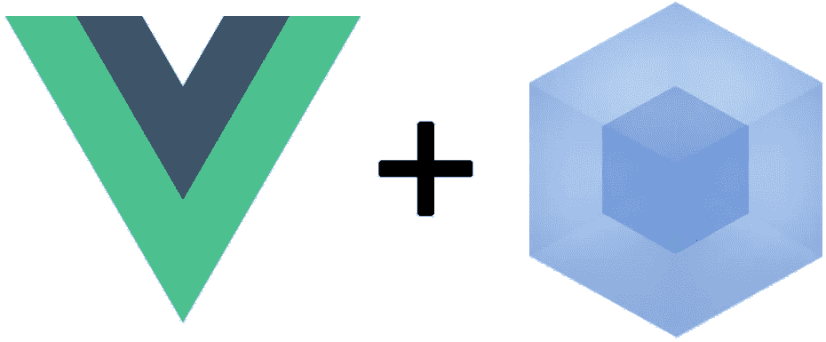

# 服务器端水化—从零开始使用 Vue 和 webpack 的 SSR(3/3)

> 原文：<https://itnext.io/server-side-hydration-ssr-with-vue-and-webpack-from-scratch-3-3-8ed228655b0c?source=collection_archive---------2----------------------->



vue+web pack | npmjs.com

这篇文章将继续我的[上一篇文章](/setting-up-webpack-for-ssr-with-vue-b6ff9125d359)，在那里我们实现了基本的服务器端渲染。现在我们将添加水合作用。如果应用程序依赖于外部资源，例如从外部端点检索的数据，则需要在我们调用`renderer.renderToString`的之前提取并解析**数据。**

源代码可以在[这里找到。](https://github.com/lmiller1990/webpack-simple-vue)

对于这个例子，我们将从 [JSONPlaceholder](https://jsonplaceholder.typicode.com/posts/1) 获取一个帖子。数据看起来像这样:

策略是这样的:

客户端渲染:

*   在应用的`mounted`生命周期钩子中，`dispatch`一个 Vuex `action`
*   `commit`回应
*   照常渲染

服务器端渲染:

*   检查我们将要创建的静态`asyncData`函数
*   将存储传递给`asyncData`，并调用`dispatch(action)`
*   提交结果
*   现在我们有了所需的数据，调用`renderer.renderToString`

[](http://vuejs-course.com/)

来看看我的 [Vue.js 3 课程](https://vuejs-course.com/)！我们涵盖了组合 API、类型脚本、单元测试、Vuex 和 Vue 路由器。

# 设置

我们需要一些新模块。即:

*   `axios` -在浏览器和节点环境中工作的 HTTP 客户端
*   `vuex` -存储数据

将它们安装在:

# 创建商店

让我们创建一个商店，首先让它在开发服务器上工作。通过运行`touch src/store.js`创建一个商店。在其中，添加以下内容:

标准 Vuex，没什么特别的，就不赘述了。

我们现在需要使用商店。更新`create-app`:

我们现在返回`{ app, store, App }`。这是因为我们稍后将需要访问`src/server.js`中的`App`和`store`。

如果你运行`npm run dev`，并访问`localhost:8080`，一切应该还在工作。更新`src/Hello.vue`，调度`mounted`中的动作，并使用`computed`属性检索它:

```
computed: {    
  post() {      
    return this.$store.state.post    
  }   
}
```

`localhost:8080`现在应该显示`title`和`Hello`。

# 获取服务器上的资源

运行`npm run build && node src/server.js`，然后访问`localhost:8000`。你会注意到`Hello`被渲染了，但是`post.title`没有。这是因为`mounted`只在浏览器中运行。使用 SSR 时没有动态更新，只有`created`和`beforeCreate`执行。更多信息见[此处](https://ssr.vuejs.org/guide/universal.html#component-lifecycle-hooks)。我们需要另一种方式来调度行动。

在`Hello.vue`中，增加一个`asyncData`功能。这不是 Vue 的一部分，只是一个普通的 JavaScript 函数。

我们必须通过`store`作为一个参数。这是因为`asyncData`不是 Vue 的一部分，所以它没有访问`this`的权限，所以我们无法访问商店——事实上，因为我们会在调用`renderer.renderToString`之前调用这个函数，`this`甚至还不存在。

现在将`src/server.js`更新为调用`asyncData`:

现在我们在渲染`app`的时候，`store.state`应该已经包含`post`了！让我们试一试:

浏览`localhost:8000`导致终端显示错误:

`XMLHttpRequest`是 Web API，不存在于节点环境中。但是为什么会这样呢？是指在客户端和服务器上都可以工作，对吗？

我们来看看`axios`:

有一堆东西。感兴趣的字段是`browser`和`main`:

`browser`是问题的来源。查看关于 npm 上的[浏览器](https://docs.npmjs.com/files/package.json#browser)的更多信息。基本上，如果有一个`browser`字段，并且 webpack build 的`target`是`web`，它将使用`browser`字段而不是`main`。让我们回顾一下我们的`config/server.js`:

我们没有指定`target`。如果我们检查文档[这里的](https://webpack.js.org/concepts/targets/#multiple-targets)，我们可以看到`target`的默认值是 web。这意味着我们正在使用面向客户端的`axios`构建，而不是 Node.js 构建。更新`config.server.js`:

现在快跑

并访问`localhost:8000`。`title`渲染完毕！将它与使用 dev 服务器的`localhost:8080`进行比较——您可以看到，当我们进行客户端获取时，标题暂时是空白的，直到请求完成。访问`localhost:8000`没有这个问题，因为数据甚至在应用程序呈现之前就被获取了。

# 结论

我们看到了如何编写同时在服务器和客户机上运行的代码。这个配置一点也不健壮，也不适合在严肃的应用程序中使用，但是说明了如何为客户端和服务器设置不同的 webpack 配置。

在这篇文章中，我们了解到:

*   关于`package.json`，具体是`browser`房产
*   webpack 的`target`属性
*   如何在客户机和服务器上执行 ajax 请求

# 丰富

许多改进仍然存在:

*   使用 Vue 路由器(服务器端和客户端)
*   更强大的数据提取
*   添加一些单元测试

源代码可在此处[获得。](https://github.com/lmiller1990/webpack-simple-vue)

*原载于* [*拉克伦的博客*](https://lmiller1990.github.io/electic/posts/server_side_hydration_with_vue_and_webpack.html) *。*