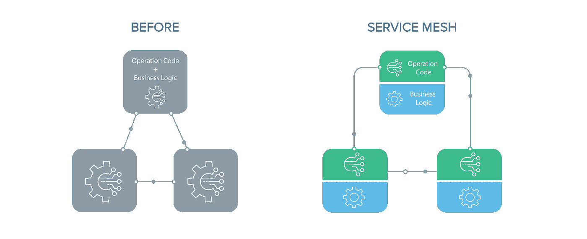

# 开发人员工作流的服务网格，系列

> 原文：<https://itnext.io/service-mesh-for-the-developer-workflow-a-series-be7f91ee145e?source=collection_archive---------7----------------------->

服务网格在很大程度上是从架构、SRE 和运营角色的角度进行讨论的，因为它提供了一种有趣的方式来解决服务和应用之间存在的困难挑战。开发人员也将从服务网格功能中获益，在这个系列中，以及伴随的研讨会 Nic Jackson([@ sherifjackson](https://twitter.com/sheriffjackson))和我( [@christianposta](https://twitter.com/christianposta) )旨在具体说明服务网格如何帮助开发人员工作流。

# 首先，什么是服务网格

服务网格是分散的应用程序基础设施，通常使用 sidecar 代理来实现，它解决了困难的服务到服务通信挑战，如请求级路由、弹性(超时、重试、电路中断)、遥测收集和安全性，而不管您使用什么语言或框架来实现服务。

在这种体系结构中，请求通过关联的 sidecar 代理流向应用程序(以及从应用程序流出)。在解决服务对服务的通信挑战时，sidecar 代理实现了困难但无差异的繁重任务。它在应用程序的进程之外运行，并且一致地实现这些功能，并且独立于所选择的应用程序编程语言或框架。

# 服务网格如何帮助开发者

当您考虑将网络代码从业务逻辑中抽象出来意味着什么时，特别是在您的团队可能在 JavaEE 上工作，而另一个团队在 Spring 上工作，另一个团队在 Nodejs 上工作的情况下，您可以想象将业务逻辑与语言或框架绑定在一起，但让连接所有这些服务的网络代码与语言无关的好处。每个团队负责整个应用程序中属于他们的部分，但是他们都需要连接在一起，以提供完整的用户体验。

让 sidecars 代理管理服务之间的流量这一抽象概念为开发人员带来了新的功能，包括:

*   **应用弹性:**开始将超时、重试和电路中断之类的事情卸载到网格中，并在做这些事情时获得一致性，而不必对应用进行代码更改，也没有不同的(部分？)每种编程语言的实现。
*   **Mutual TLS:** 这不是大多数开发人员想到的第一件事，但是 service mesh 使您的应用程序更容易设置这一点
*   **应用可见性:**在此之前，网络工程师是唯一能够在网络级别上看到应用的人。对于微服务，网络是应用运行的关键，因此这种可见性对开发人员来说非常重要。Service mesh 允许开发人员通过代理对 it 和请求吞吐量、延迟和故障率等信息进行监控，而无需更改应用程序代码。

而且还有更多机会可以发掘。我们对网络的协议级行为了解得越多，通过指标观察得越多，网络支持就越丰富——在某种程度上是这样的。在我们的研讨会中，我们将展示更多的例子，例如使用这一新发现的能力来调试我们的应用程序和服务。

# 示例之前和之后

让我们浏览一下开发人员日常生活中的一些常见场景:调试问题和测试应用程序。

**调试应用程序**

在一个纯粹的单片世界中，调试比使用微服务更容易。在尝试解决问题之前，您仍然需要在本地环境中重新创建有关生产的所有内容，以重新创建问题。您的调试器可能特定于编写应用程序的语言，而像 VM 快照和其他实用程序这样的东西使得问题的重现成为可能。

在微服务的世界里，您在本地复制生产环境的痛苦要大得多。试图找到问题就像大海捞针一样——在数百个正在运行并相互通信的服务中，它是哪一个？问题是什么？有多少服务受到影响？如果我没有编写所有这些服务会怎么样？那个应用程序是用什么语言写的，我用的是哪个调试器？

服务网格如何帮助调试？当最终用户尝试使用应用程序时，sidecars 可以看到每个服务的每个传入请求和传出流量。如果您观察这种流量，您可以推断出什么是“正常”的行为范围，然后能够检测出什么时候有问题；例如，如果一个请求发送到一个服务，但是流量没有继续发送到下一个服务。

服务网格可以提供宝贵的网络遥测信息，如请求/秒、延迟信息、失败次数等，并帮助分布式跟踪，以直观地了解服务之间的交互方式。如果您有一个服务网格，您还可以利用网格的能力来记录流经网格的流量。这种流量可能会在失败事件中保存下来，并在较低的(测试)环境中重放。对于开发人员来说，这将是一种强大的方法，可以使用他们熟悉的工具来调试服务，同时不会影响生产请求流。

**应用程序的主动测试**

对于整体式应用程序，开发人员会运行一系列测试，在每个阶段测试的范围都会变大，因为您的代码会集成到整体式应用程序中，最后会运行一系列回归测试，以确保整个代码库仍能按预期工作。这导致了更长的测试和 QA 周期，降低了开发人员向最终用户发布新功能的速度，但另一方面，应用程序在发布时已经过测试并且是静态的。

对于微服务，您可能会遇到数百个服务相互独立更新和部署的问题。一个单独的开发人员可能会负责其中的一些服务，那么除了单元测试之外，您如何对一个总是在变化的东西进行全面的集成或系统测试呢？不要介意搞清楚回归测试——你想看看你的特性回归了一百个动态系统中的哪一个？微服务的整个概念颠覆了我们对待测试的方式。

服务网格能有什么帮助？由于如此多的应用程序行为与服务之间的网络联系在一起，因此有可能利用该网络来测试您的应用程序。想象一下，对应用程序的一部分进行故障注入或增加延迟，以查看您的服务是如何响应的，以及对其下游服务产生的行为。这种由网飞推广的混沌工程的概念，遵循这样一种思想，即主动将不良行为引入生产系统，以在它们成为客户面临的问题之前发现潜在的弱点。这也通过在生产中显式测试而不是隐式测试来补充您的测试。当您不再需要更改应用程序代码、导入库或让您的混沌测试依赖于语言时，混沌工程变得更加有趣。服务网格允许您在不接触应用程序代码的情况下操作操作代码，并且您可以跨所有服务应用这些类型的测试，因为它们都运行在共享的服务网格上。

# 结论

虽然我们不认为服务网格可以解决开发人员面临的所有挑战，但我们相信它不仅仅属于运营领域，而且有可能改善开发人员的工作流程。有趣的部分是将服务网格视为交付功能的工具——那么我们能构建什么样的功能呢？我们期待在未来的博客文章中更详细地探讨这些领域——同时，请不要犹豫，随时向我们提问。

另外，如果你要去圣地亚哥的 KubeCon，Nic Jackson 和我会在 11 月 21 日星期四下午 2:25 就这个话题做一个辅导。在此获取会议详情:**【https://sched.co/Uaeb】T4**

**这个教程和这个博客系列的想法来自于哈希公司的开发者倡导者 Nic Jackson 和我最近关于我们正在使用的技术的一次讨论。因为我们都来自开发人员背景，并且都对服务网格感到兴奋，所以我们想将我们的经验应用到一起，讨论服务网格如何改进开发人员的工作流程。*原载于 2019 年 11 月 5 日*[*【https://medium.com】*](https://medium.com/solo-io/service-mesh-for-the-developer-workflow-a-series-ef279c49ab56)*。***