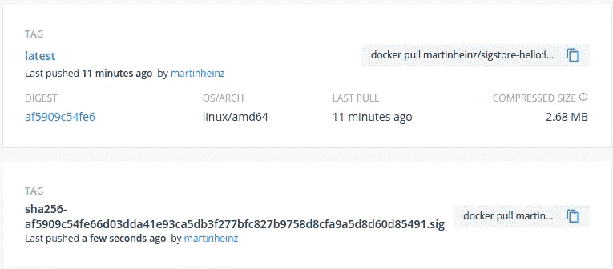

# 使用 Sigstore 和 Cosign 轻松签署软件

> 原文：<https://itnext.io/signing-software-the-easy-way-with-sigstore-and-cosign-cccc51bd65f1?source=collection_archive---------3----------------------->

## sigstore 项目和 cosign CLI 签名软件工件的实用指南

[Miltiadis frakkidis](https://unsplash.com/@_miltiadis_?utm_source=unsplash&utm_medium=referral&utm_content=creditCopyText)在 [Unsplash](https://unsplash.com/?utm_source=unsplash&utm_medium=referral&utm_content=creditCopyText) 上拍摄的照片

对软件工件进行签名有许多明显的好处，比如代码完整性或开发人员(作者)身份验证。然而，它经常被忽视，创造了一个适合供应链攻击的软件。人们不愿意签署他们的代码的原因之一是现有的工具——如 PGP——对用户不太友好，并且需要广泛的安全和/或密码学知识。

由于有了 *sigstore* 和它的`cosign` CLI，签署软件变得很容易！在本文中，我们将了解`cosign`如何工作以及如何与其他 sigstore 组件(`fulcio`和`rekor`)集成。更重要的是，我们将学习如何使用它以简单的方式对容器映像进行签名，无论有没有密钥，以及我们如何使用它来验证生成的签名和签名软件的完整性。

*注意:这是我上一篇文章* [*Sigstore:软件供应链安全解决方案*](/sigstore-a-solution-to-software-supply-chain-security-35bc96bddad5) *的后续文章，解释了什么是 Sigstore 及其组件如何工作。*

# 安装

在我们签署任何东西之前，我们首先需要 sigstore 的每个组件的所有 CLI 工具，即`cosign`、`fulcio`和`rekor`。第一个是`cosign`，我们实际上需要它来签署任何东西，它可以作为二进制文件或 Docker 镜像安装。对于第一个选项，从[发布页面](https://github.com/sigstore/cosign/releases/tag/v1.0.0)下载适当的二进制文件，并将其放在您的`$PATH`中。此外，考虑到我们正在处理安全工具，建议验证二进制文件的真实性和完整性。您可以使用发布页面上显示的命令来完成此操作。

如果你更喜欢使用 Docker 图像，那么你可以使用如下:

对于第二个组件——`fulcio`——我们不需要安装任何东西，因为我们将使用`fulcio`的公共实例。公益服务在[https://fulcio.sigstore.dev/api/v1](https://fulcio.sigstore.dev/api/v1)有，API 文档可以在[这里](https://sigstore.dev/swagger/?urls.primaryName=Fulcio)找到。

最后，还有`rekor`及其名为`rekor-cli`的命令行界面。与`fulcio`一样，我们不需要安装`rekor`，因为它可以在[https://rekor . sigstore . dev](https://rekor.sigstore.dev)以及这里的[Swagger 定义](https://sigstore.dev/swagger/?urls.primaryName=Rekor)中找到。

然而，我们希望安装 CLI，以便与`rekor`服务器进行交互。二进制文件可以在 GitHub [发布页面](https://github.com/sigstore/rekor/releases)中找到。如果您在 linux 上，您可以使用以下内容:

同样，正如在`cosign`中提到的，你应该小心使用什么样的二进制文件。因此，您可能希望使用这里概述的过程[来验证`rekor-cli`二进制。](https://github.com/sigstore/rekor/blob/main/release-verify.md)

# 艰难的道路

所有的工具都准备好了，我们可以开始签署工件了。为了更好地理解隐藏的东西，我们将首先尝试用*【艰难的方式】*——也就是说，不用所有花哨的工具。

首先我们需要一件艺术品。在本演示中，我们将使用通过以下`Dockerfile`创建的*“hello world”*Docker 图像:

然而，我们不能签署图像本身，而是签署其摘要:

接下来，我们需要一个短暂的密钥对来签署摘要。为此我们可以使用`cosign`命令，但考虑到这是*“硬路”，我们直接使用`openssl`:*

*现在，我们已经准备好签名，同时我们还可以验证签名:*

*现在我们用我们的私钥签署了工件，我们想要有一个证据证明我们是真正做这件事的人。为此，我们需要来自`fulcio`的代码签名证书。要获得它，我们必须向 OIDC 提供商认证以获得一个 ID 令牌，作为我们对`fulcio`的身份证明。*

*之后，我们签署我们的电子邮件地址，我们用来认证使用以前使用的私钥。我们这样做是为了证明我们在签名时拥有私钥。*

*最后，我们向`fulcio`请求代码签名证书，给它 ID 令牌作为授权形式，签名的电子邮件地址和我们的公钥:*

*这种*“硬方式”*方法的一个问题是，模拟 ID 令牌的认证和检索实际上并不可行。因此，在上面的代码片段中，这一步被省略了，我们直接跳到向`fulcio`提交所有内容。*

*或者，您也可以完全跳过与`fulcio`的交互，而使用您的公钥。这种方法显示在[https://github . com/sigstore/rekor/blob/main/types . MD # PK ix509](https://github.com/sigstore/rekor/blob/main/types.md#pkixx509)中。*

*接下来，我们可以继续将记录上传到透明度日志(`rekor`)。这里我们展示了带有公钥的选项和来自`fulcio`的签名证书。当使用来自`fulcio`的证书时，我们也可以删除密钥对，因为我们不再需要它:*

*除了上传之外，我们还可以检查透明日志中的记录。上面的代码片段同时使用了`rekor-cli`和`curl`来直接访问公共 API。*

*剩下要做的就是将签名上传到注册表，与容器图像一起存储:*

*就是这样。我们已经签署了我们的图像，并将其记录添加到透明日志中。这种方法是可行的，但是可能没有人愿意每天都这样做，所以让我们看看合适的工具如何使这变得简单。*

# *简单的方法*

**“艰难之路”*其实并不难，但是如果我们使用提供的工具，就会变得容易得多:*

*我们需要做的就是生成一个密钥对，然后对工件进行签名。签名后，`cosign`自动将签名上传到图像所在的注册中心。在上面的例子中，我们选择不上传签名，只将它保存到一个文件中，因为我们在前面的部分已经签名了。如果我们后来决定上传它，那么我们可以用如上所示的`cosign attach`来做。*

*同样值得指出的是，到目前为止(`cosign`版本`1.0`)，上面的代码片段不会将数据上传到`rekor`透明日志，为了使其工作，我们需要设置`COSIGN_EXPERIMENTAL=1`，例如`COSIGN_EXPERIMENTAL=1 cosign sign -key cosign.key ...`。*

*根据您的用例和工作流，也有其他方法使用`cosign`来签署工件。这些在 GitHub 的[使用页面](https://github.com/sigstore/cosign/blob/main/USAGE.md)中有详细描述。*

# *“无钥匙”*

*比简单方法更简单的是使用*“keyless”*方法，其中只使用临时密钥，这意味着您不需要生成和维护自己的密钥:*

*我们所需要做的就是在`COSIGN_EXPERIMENTAL`设置为`1`的情况下运行`cosign sign`，同时省略`-key`参数。在上面的例子中，我们还指定了 OIDC 提供者的端点，`fulcio`服务器和`rekor`服务器——这些是 sigstore 提供的公益服务的默认值，因此可以省略它们，但是为了清楚起见，在这里显示它们是为了突出显示哪些服务正在被访问/使用。您也可以用自己的实例来替换它们——如果您想在防火墙后运行所有的东西，这是有意义的。*

**

*Docker Hub 图像和签名*

# *核实一切*

*既然我们以所有可能的方式签署了工件，我们也应该尝试验证它，否则签署它还有什么意义，对吗？*

*首先让我们来看看签约图像摘要的输出结果*【辛苦】*。为此，我们可以使用`rekor-cli`:*

*这里我们有两种情况——如果我们用我们的公钥对工件签名，那么我们在验证时使用它。另一方面，如果我们使用由`fulcio`提供的签名证书，我们将使用它来代替公钥。*

*接下来是使用`cosign`的验证，它适用于使用密钥的基本签名。我们需要做的就是运行`cosign verify`，提供密钥和图像 URL:*

*最后，对于无键方法——我们可以做本质上与上面相同的事情，但是我们需要添加实验标记，并且我们可以跳过关键参数:*

# *结束语*

*在本文中，我试图概述和解释使用 sigstore，更具体地说是`cosign`来签署容器图像的基本用例和方法。然而，`cosign`有更多的选项和特性可能对你有用，比如使用其他类型的工件，使用硬件令牌或者签署`git`提交，所以我鼓励你尝试一下这个工具，看看你还能把它用在什么地方。这些选项中有很多都在精心编写的使用文档[中有所描述，所以请务必也查看一下。](https://github.com/sigstore/cosign/blob/main/USAGE.md)*

*此外，如果你想更深入地挖掘，你可以查看[“sigstore the hard way”](https://github.com/lukehinds/sigstore-the-hard-way)，这是一个从头开始设置一切的指南——包括`fulcio` CA 和`rekor`透明日志服务器。*

**本文最初发布于*[*martinheinz . dev*](https://martinheinz.dev/blog/56?utm_source=medium&utm_medium=referral&utm_campaign=blog_post_56)*

* [## 以正确的方式构建 Docker 图像

### 让我们优化 Docker 构建，以创建更小、更安全的 Docker 映像，只需普通构建的一小部分…

itnext.io](/building-docker-images-the-proper-way-3c9807524582)  [## 用 seccomp 强化 Docker 和 Kubernetes

### 您的容器可能不像您想象的那样安全，但是 seccomp 配置文件可以帮助您解决这个问题…

itnext.io](/hardening-docker-and-kubernetes-with-seccomp-a88b1b4e2111)  [## 分析 Docker 图像安全性

### 码头集装箱远没有你想象的那么安全…

towardsdatascience.com](https://towardsdatascience.com/analyzing-docker-image-security-ed5cf7e93751)*