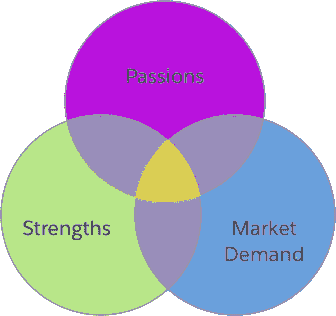

# 所以你想成为一名软件架构师？

> 原文：<https://itnext.io/so-what-is-a-software-architect-exactly-dbb6406d5747?source=collection_archive---------3----------------------->

## **软件架构**

成为软件架构师意味着什么，你需要什么样的技能才能成功

照片由[在](https://unsplash.com/@thisisengineering?utm_source=unsplash&utm_medium=referral&utm_content=creditCopyText) [Unsplash](https://unsplash.com/s/photos/female-engineer?utm_source=unsplash&utm_medium=referral&utm_content=creditCopyText) 上拍摄

首先，我是什么样的软件架构师？

我经常被问到这个问题。(主要是非程序员，比如我的医生，当他想知道为什么我问我职业的时候不能直接说“程序员”，建筑师不就是设计建筑的人吗？).

我不认为架构师只是技术“个人贡献者”轨道上的又一步。我不认为是“你做了 X 年的开发者，你不想/不擅长管理，但是是一个非常优秀的开发者，所以我们会给你更多的报酬，给你一个花里胡哨的头衔，让你觉得被重视”。我也不认为这与成为技术主管或首席工程师是一回事。

在我职业生涯的早期，在做了几年开发人员之后，我决定有一天我要成为一名架构师。我和一位建筑师密切合作，看了他的作品，心想“嘿，我很擅长这个”和“嘿，我想做这个。”

我花了一段时间才到达那里。因为成为一名建筑师的职业道路并不平坦。现在我是一个喜欢谷歌一切的人。但是我在网上找不到太多关于如何成为一名建筑师，以及建筑师到底是什么的建议。事实上，我发现许多头衔在不同的地方意味着不同的事情，许多同行和经理告诉我，我应该对我所拥有的感到高兴，并留在软件工程领域。

我又换了几次工作，学了很多东西，还有很多运气和了不起的人，他们相信我，给了我这个机会，直到我找到了我梦想的工作。

因此，我个人对这个模糊的、变色龙般的职业的看法是这样的。

建筑师最重要的特质，又名**超级大国#1。**

## 超级大国#1: **看大图**

这是最重要的特质。技术变得越来越复杂。系统现在由几十到几百个组件、服务和微服务组成。有人需要具备理解这个庞大系统的技术能力，然后根据需要深入研究细节。

这是否意味着架构师需要了解系统的一切？

这是一个很大的抱负，但实际上，根据系统的规模，同样有效的是用以下知识来补充大图知识:**去哪里找**或**问谁**你还不知道的细节，以及理解这些知识并将其纳入你不断增长的知识库的能力。

(我确实喜欢对系统的至少某些部分有非常深入的了解，这样就不会老是说“我会去查一查”；尽管如此，每个角色都有一个学习曲线，因为你对整个系统有了更深入的了解

这让我想到了**超级大国 2 号**，这与其说是一种技能，不如说是一种激情和先决条件

## **超能力#2:热爱学习**

每一天，你都必须渴望了解更多。新系统、新技术、新方法。你必须是一个自动教授者，没有人会向你灌输这些信息。你将在模糊的旧文档数据库中搜索和挖掘，阅读古老的标准和规范，打电话/聊天/发电子邮件，感觉像是在徒劳地捕捉一个十年前离开公司的开发人员的深奥事实。如果你不爱学习，并且自己做得很好，你会成为一个糟糕的建筑师。

为什么一个架构师需要知道这一切，一个随机的知道整个系统的技术人员给公司带来了什么附加值？

**架构-** 将所有的拼图拼在一起，使其全部工作。采用新功能或全新系统，并将其分解为组件/服务/微服务。编写高级架构，和/或设计，和/或规范，和/或需求(过程和文档名称在不同的组织之间有很大的不同)

这和敏捷不矛盾吗？有可能。但是首先——许多公司仍然使用敏捷和瀑布的混合，其次——敏捷的一个大挑战是规模。根据我的经验，一个架构师可以通过最初的 HLA 带来很多价值，在多个开发团队接受用户故事并使用它们之前，将产品/项目/特性/系统分解成用户故事。同样，根据我的经验——许多敏捷团队永远推迟文档。尽管这是完成的定义的一部分。

**非功能性需求——**可伸缩性、性能、弹性、安全性——当客户根据这些标准度量系统时，这些通常被推到低优先级——考虑它们是架构师的工作。

**设计-** 这个真的要看角色了。有时团队和技术领导会做出这些决定，这很好。有时，为了可重用性和一致性，我们希望所有团队都遵循一个蓝图，然后架构师需要更多地参与定义这个蓝图。有时候，架构师会更专注于特定的组件，并且是设计决策的制定者。

我所看到的是，很多时候一个头衔为“软件架构师”的架构师会更多地参与设计，而一个“系统架构师”则不那么参与，但是这确实因公司而异。

**沟通**——与工程团队——开发人员、技术负责人、QA、其他技术团队和集成架构师——的持续沟通。

现在，交流听起来很基本，但是非常熟练的技术人员发现将他们的知识转化为清晰易懂的信息是一项挑战。

这就是**第三大超级大国。**

## **超级大国#3:清晰地交流**

交流可能是外部的——架构师通常会向客户解释产品的作用？更重要的是——产品**不做**但 ***可以做***的事情——架构师通常会根据产品路线图或客户要求来定义新的功能和特性。将这一愿景转化为具体细节通常是**解决方案架构师**、**系统架构师**或**产品架构师**的职责。(还是那句话，取决于公司——感觉到一种模式了吗？)

沟通可能在公司内部进行，但仍然在您的组织外部——与执行管理层、产品和销售组织——一起定义路线图、某些功能的风险、对其他功能的需求、粗略估计(带有承诺的绝对估计应来自工程团队，但很多时候需要现场进行估计)。为了快速决策，你通常需要一个人在房间里，而不是一群经理和技术领导。

编写文档/wikis/confluence 页面/白皮书/无论你的公司使用什么样的文档风格的能力，以及通过演示、UML 和白板进行可视化交流的能力，都是一项重要的软技能。

其余的是额外收获——取决于你自己的技能和热情，以及你的角色需要什么——创新、研究技能、技术忍者超级技能、特定领域的知识(例如，我喜欢安全和密码学，而另一个架构师可能在机器学习或计算机视觉方面有很强的知识)。每个架构师通常会带来一组独特的附加值。

这与成为技术领导者有什么不同？

今天有人问我这个问题，这个问题引发了这篇文章。

我认为一个关键的区别是规模——架构师需要看到整个系统的全貌。一个技术领导通常专注于一个由 5-10 个开发人员组成的开发团队(2 个披萨饼理论，有人知道吗？)，这意味着专注于一个或几个组件/服务/微服务。

另一个关键的区别是交互——技术负责人确实需要领导亲自动手的开发，并且自己也是一名亲自动手的开发人员。她将会比一般的架构师更多地接触代码。有亲自动手的软件架构师(通常这些架构师更关注一个或几个组件。因为一旦你的规模变得非常大，你就没有那么多的时间去掌握几十个代码库。)在这里，我同意架构师和技术领导者之间的区别越来越模糊。我确实认为技术领导仍然会更关注任务管理，可能还有人员管理，而架构师会更关注产品愿景和文档。设计、技术选择和开发过程(即 CI/CD、TDD 等)通常可以由技术主管或软件架构师来完成。这通常取决于定义的角色、公司文化，以及架构师和技术领导的优势和热情。

现在，如果你非常专注，并且真正阅读了括号内的内容，你可能会对我的建议感到震惊，因为不是所有的建筑师都亲自动手。如果架构师自己都不写代码，他们怎么可能在技术上有所进步呢？

是的**超级大国#4** 很重要。

## 超级大国#4:技术专长

你必须在技术、编程、算法、逻辑、系统设计以及你的系统所使用的任何其他方面都是经验丰富的 T2。但我认为这是任何技术工程职业的基础，而不是建筑师特有的超级技能。我坚信，如果负责大型系统的架构师将大部分时间花在编写代码上，他们就没有足够的时间去做架构师应该做的其他事情。(我不是在说那 1%的高于自然的建筑师，他们有时在白天工作、象棋俱乐部和早餐之间的睡眠中编程一个新的工作睡眠)

> “那你为什么不编码呢？”
> 
> “你怀念编码吗？”
> 
> “你想回去编码吗？”

冒着被逐出软件开发姐妹会的风险，我的答案是不。

我希望我擅长开发代码。我在高中学习编程，在大学学习计算机科学，并且非常喜欢它。我有一份有趣的软件工程职业。但是除了开发代码，我还擅长很多其他的事情。作为一名建筑师，我喜欢的是我建立在许多不同的超级技能之上。我带来了多种能力的组合，在我看来，这种组合非常罕见。我喜欢在日常工作中运用这些广泛的技能。我以前也喜欢编程，但是我更喜欢我现在做的事情。

因为不管我们的头衔是什么，我坚信，为了在我们的职业生涯中找到成功和幸福，我们应该追随我们喜欢做的事情(我们的激情)，我们擅长的事情(我们的优势)，然后如果我们找到了市场需求(就像我们大多数人在技术领域做的那样)，我们就非常幸运了！

这也是我成为软件/系统/产品架构师的原因。我喜欢无中生有地创造一些东西(特别是如果它是一个很酷、有用、创新的东西)，我喜欢每天与几十个人和团队互动，不断学习、领导和创造广泛的影响，我擅长理解复杂的技术、研究和沟通，我很幸运有一份可以做这些的职业。