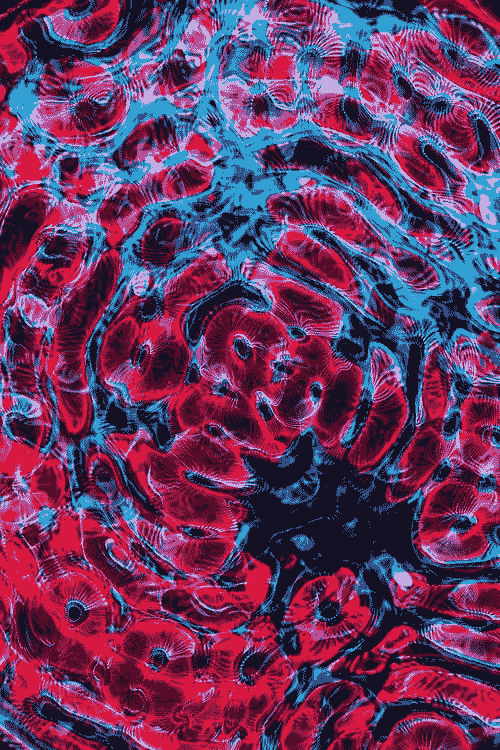

# 混沌边缘的软件开发

> 原文：<https://itnext.io/software-development-at-the-edge-of-chaos-2934f536daf5?source=collection_archive---------4----------------------->

## 混沌——复杂性和秩序

照片由来自 [Pexels](https://www.pexels.com/photo/light-red-art-pattern-11280353/?utm_content=attributionCopyText&utm_medium=referral&utm_source=pexels) 的 Sergey Katyshkin 拍摄

> 混沌的边缘是生命有足够的稳定性来维持自身，有足够的创造力来配得上生命的名字。米切尔·瓦尔德罗普先生

**当软件开发糟糕时，它能解读一个鸡蛋。**

在《复杂性:处于秩序和混乱边缘的新兴科学》一书中，你可以理解复杂性。

创建软件是复杂的，有相互关联的需求组合在一起来创建软件。软件开发团队需要找到一种有效的方法来与拥有不同水平的技术知识和业务知识的客户合作。

任何涉及许多人合作的过程都将是复杂的，并且每周都处于混乱的边缘。

软件开发团队处理软件项目会导致有序的方法或混乱的开发。

# **处于混乱边缘的软件**

软件开发团队和软件项目可以很快从有序走向混乱。结构良好的项目和混乱的项目之间的差别可能很小。

不同之处在于，成功的项目通常有一个强大的高级团队(解决方案架构师、首席开发人员、项目经理、Scrum master 和其他领导)，他们制定标准、流程、控制范围并保持一切正常。

优秀的开发团队

*   [不要让技术灾难让他们措手不及](/technical-disasters-should-not-catch-developers-unprepared-84bf3d09bfbe)
*   [顶住愚蠢项目计划的压力](https://medium.com/codex/software-project-plans-make-us-stupid-e8eb8a67687b)

什么是秩序和混乱？

*   混沌是随机不可预测的事件
*   秩序是精确可预测的事件

复杂性是混乱和秩序的结合，创造了一个让开发团队创造软件的过程。

软件项目和开发团队的过程是混乱、复杂和有序的

# **混乱**

项目越混乱，管理越差。

软件开发过程越混乱，软件质量越低，问题越多。

混乱是描述糟糕开发的一个很好的方式——当糟糕的开发人员制造软件开发混乱时会发生什么。当你开始一个混乱的项目时，目标是。

**阻止它变得更糟，并开始让它变得更好**

在一个混乱的项目中，你看到开发人员努力工作，但是没有组织，什么都没有意义。这就好像你不能相信你所看到的，因为它看起来像开发，但更多的软件会产生更多的技术债务和更多的问题。

项目上的一切都会变得混乱。它失去了控制，没有人知道为什么或改变什么来带来秩序。

*   需求是混乱且不断变化的
*   构建和部署是手动的
*   没有标准。
*   开发人员做事情的方式不同
*   没有文档—信息保存在人们的头脑或本地机器中

最初，你不确定为什么项目中的行为会导致如此多的困惑、混乱和问题。这似乎类似于有序的项目，但这是没有标准、过程、最佳实践或有序的开发方式的微妙影响。

# **复杂性**

复杂性是有序的群体一起工作。复杂性来自多个有序的群体，它们相互关联、相互依存。

当你在大型项目中工作时，复杂性是不可避免的，但是你带来了处理它的秩序。

如何让复杂的软件变得简单？

*   创建被记录和理解的标准方法
*   所有发展的一致性
*   开发自动化并创造一致性
*   标准的实施以及与代码审查的一致性
*   文档是一种痛苦，但是每个人都这样做
*   控制要求

项目的高级成员通过仪表板、报告、会议来交流进展。这消除了问题，并随着项目的进展建立了信任。

高级项目成员在问题发生前阻止问题，并快速解决问题。优秀的高层人员会介入问题，找出问题，在它们是小问题时解决它们，并给每个人充足的时间来完成工作。

当开发团队被迫快速前进时，低质量的代码就产生了，高级团队缓冲开发团队的压力，并反推。

高级团队成员保护开发团队，让他们没有分心或恐慌地创建软件。

# **当混乱打在你的脸上**

我记得参加了一个项目，我知道这个项目会很糟糕。我经理的最后一句话是

> 你做什么都不能使这个项目变得更糟，所以去把它变得更好吧

一片混乱。有 20 到 30 个开发人员/顾问以他们自己的方式改变事情，互相改写，很少有人知道发生了什么。

构建和部署会定期中断，而且几天内都无法修复。

问题从各处和令人惊讶的地方冒出来。很难确定原因和谁应该修复它。

一位经理告诉开发团队给客户他们想要的任何东西，所以需求是不断变化的。

混乱让我不知所措。令人惊讶的是，每个人都很忙，每个人都超级努力地工作。他们像蚂蚁一样忙碌，在混乱的开发环境中工作。

软件开发团队试图解决他们的问题，领导不力和缺乏开发过程。这种方法失败了，项目变得越来越糟糕，每周都落后。

他们试图超越他们糟糕的开发实践。混沌发展是一个注定的螺旋。你开发的软件越多，技术债务和问题就越多。

你创造的低质量软件越多，就越难创造更多。低质量的软件很复杂，难以理解/更改/更新/修复错误。

项目越大，质量和订单就越重要。规模放大并突出了糟糕的开发实践和问题。开发人员可以从事小项目，但要小得多

# 秩序出现了

软件开发过程不断发展。过程和标准出现在软件项目中。一个运行良好的软件项目不会停下来寻找不完美之处，它会创建一个过程并调整它使之变得更容易和更好。

有许多人为一个有效的项目做出贡献，这不仅仅是一个人的领导，而是每个人的想法。

# **我怎样才能让它变得更糟**

查理·芒格建议将问题转化，让你明白在你努力做好之前应该首先避免什么。

在软件开发中，你希望避免低质量、问题和混乱。所以，如果你故意试图让一个软件项目变得更糟，你会的

*   让所有开发人员以不同的方式编写代码
*   缺乏测试来发现生产中的缺陷
*   同意不可能的最后期限
*   创建会产生更多问题的软件
*   不断改变需求
*   所有的开发人员都是互相合作的
*   永远不要写下任何过程
*   将知识留在头脑中，然后开发人员离开
*   走捷径，创造低质量的软件
*   手动部署
*   开发人员或团队之间没有交流
*   客户和开发团队之间没有信任
*   不懂软件开发的领导
*   没有高级开发人员，很多初级开发人员
*   对他们使用的技术没有经验的开发人员

如果你实施了上面的许多技巧来创建一个混乱的项目，那么你将会把自己变成一个疯狂的项目，有现存的问题，错过的期限和长时间的工作。

# 结论

好的软件开发团队管理复杂性并创造秩序。这产生了稳定的动力，每个人都清楚流程是什么以及他们需要做什么。

糟糕的开发人员认为这是一路走来的海龟，并且相信软件项目是靠魔法运行的。

软件开发运行在一致性、简单性、标准、自动化和人们一起工作来创造平稳的势头。有序软件开发不是太快，不是太慢而是平稳。

> 慢软件是平稳的，平稳的软件开发是快速的(借用海豹突击队——慢是平稳的，平稳是快速的)

创造软件的捷径是创造质量，创造一次