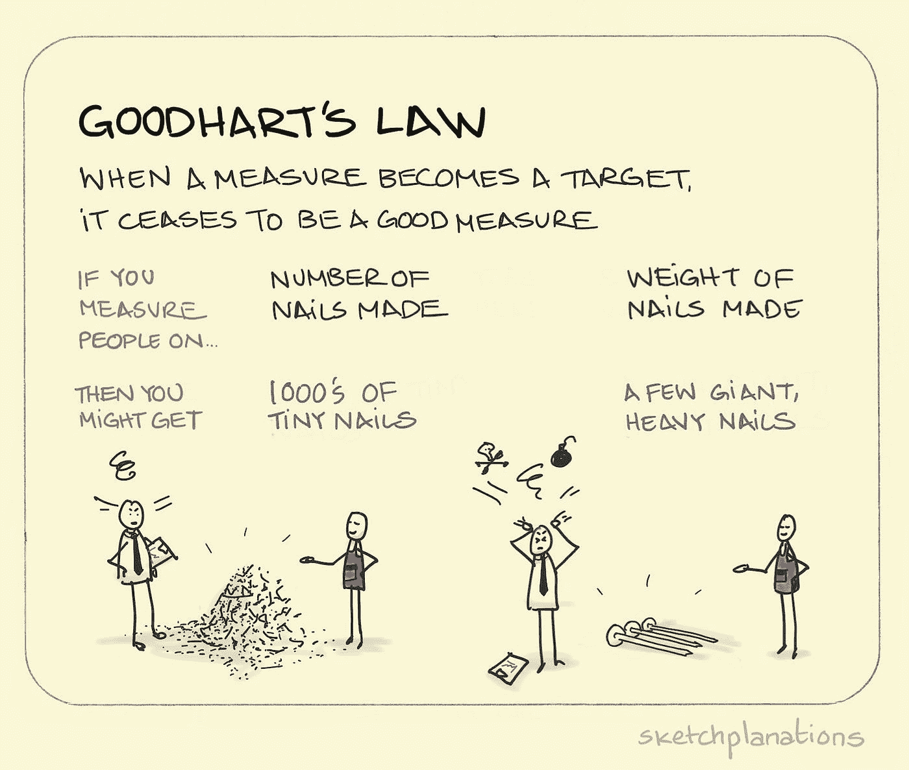

# 软件开发痴迷于忙碌

> 原文：<https://itnext.io/software-developments-obsession-with-being-busy-8dcce679f024?source=collection_archive---------2----------------------->

## 软件是在会议间隙开发的

图片由 [Jasonjung](https://www.dreamstime.com/jasonjung_info) 提供

> "你不能高估几乎所有事情的重要性."**【格雷格·麦克欧文】** [**本质主义:有纪律的追求少**](https://www.goodreads.com/work/quotes/25369241)

大多数开发人员太忙了，以至于意识不到许多项目活动是无意义的、不重要的，并且无助于创建软件。

**软件开发有一种执念就是忙**。它希望看到开发人员坐在办公桌前，编写代码和开发软件。软件项目需要高速度和大量故事点的冲刺。

[埃隆·马斯克](https://en.wikipedia.org/wiki/Elon_Musk)通过编写的代码行来评估开发人员。他警告开发人员，他希望他们每周工作 60 或 80 个小时。根据 Musk 的说法，生产率更高的开发人员会呆得更久，写更多的代码，但这真的比用更少的时间和代码做同样事情的开发人员更有效吗？

有趣的是，马斯克要求开发人员在纸上打印出代码。也许是为了加快速度，他数的是纸张而不是代码行。

# 像蚂蚁一样忙碌

重点是忙碌，完成任务，烧掉故事点，工作时间，代码行的图表。

这些是对已完成工作量的衡量。这是生产力的错觉，因为没有检查来确定它是否是正确的代码/软件。

忙碌的开发人员可能会很忙，因为他们正在做错误的事情，然后撤销它。

代码是开发过程的最后一步。它发生在验证需求、理解业务领域和设计代码之后。急于编写代码的开发人员是那些经常创建错误代码的开发人员。

质量被忽略，快速创建低质量代码的开发人员将被认为比在合理时间内创建质量的开发人员更有效。这就是格雷欣法则——为什么糟糕的开发人员会排挤优秀的开发人员。这解释了为什么[没有编写高质量代码](/there-is-no-benefit-or-incentive-for-developers-to-create-quality-code-on-software-projects-a89aae0f8c35)的动机，因为它与低质量代码价值相同，但需要更多的努力。

# 速度对速度

> 软件项目测量速度，而不是速率。

速度就是你移动的速度。速度是你向目的地移动的速度。软件项目痴迷于速度，但他们应该关注速度。

软件开发痴迷于快速进步。没有检查来查看开发是否制造了正确的软件或者是否进展到了正确的目的地。

软件项目中被度量的东西的目的是什么？

为什么测量故事点有用？
为什么测量完成的任务有用？

一个开发团队完成了大量的故事点，并且完成了大量的任务，更有可能创造出正确的软件吗？

软件项目的目标是交付计划还是创建正确的软件？

# 这是对的吗？

软件项目衡量的是数量，而不是质量。衡量做某事，但从不担心它是否正确。

忙而不是有效的一个例子是会议。

> 会议开始时，工作就停止了。

在软件项目中，许多人在会议上花了很多时间，但没有人停下来质疑这是否是一种有用的消磨时间的方式。

会议不产生工作，而是做出决定或让其他人能够工作。会议不会创造软件，而是一种支持活动。

有一种对时间表的痴迷。这衡量的是你工作的时间，而不是你做了什么或你工作的质量。

我花了很多时间阻止人们做傻事，或者撤销其他人的错误工作。低质量的代码、糟糕的开发、花在创建错误软件上的时间、bug 和错误与好的工作一样被追踪。

[软件开发是一个创造性的过程](/software-development-is-misunderstood-quality-is-fastest-way-to-get-code-into-production-f1f5a0792c69)。一个开发团队可能会花一整周的时间来开发错误的软件。软件正朝着一个没有定义但需要的软件发展，它是在这个过程中被发现的。

下面的引用概括了软件开发的过程，有时为了以后走得更快，你现在需要走得更慢。删除不需要的代码现在需要时间，但将来会节省时间。

> 我最有效率的一天是扔掉了 1000 行代码。 [**肯汤普森**](https://www.brainyquote.com/authors/ken-thompson-quotes)

创建你不需要的代码和删除它都会被算作 sprint 中的故事点。如果需求得到验证，或者代码审查可以阻止错误代码的生成。这将减少故事点，降低开发团队的生产力。

# 古德哈特定律

> 当一个度量成为目标时，它就不再是一个好的度量[古德哈特定律](https://en.wikipedia.org/wiki/Goodhart%27s_law)

当你创建一个衡量绩效的标准时，人们会改变他们的方法来达到这个标准。

在印度，当军队遇到蛇的问题时，他们会为上交的每一条死蛇提供金钱。这不但没有减少蛇的数量，反而导致当地人饲养蛇，这样他们就可以把死蛇卖了换钱。

Sketchplanations 有一篇关于古德哈特定律的文章

图片来自[草图解说](https://sketchplanations.com/goodharts-law)

当衡量成为目标时，你会有疯狂的行为。你让开发团队夸大故事点，做容易的而不是优先的任务。

软件开发的焦点变成了满足项目计划，而不是专注于创建正确的软件。必要的功能被删除以满足计划。

看起来很忙，写代码，创建软件是软件项目的衡量标准，但很少有人有兴趣检查它是否是正确的软件。

通常每个人都太忙而没有时间去检查正在创建的软件是否正确。发展的诅咒是每个人都忙得没时间思考。