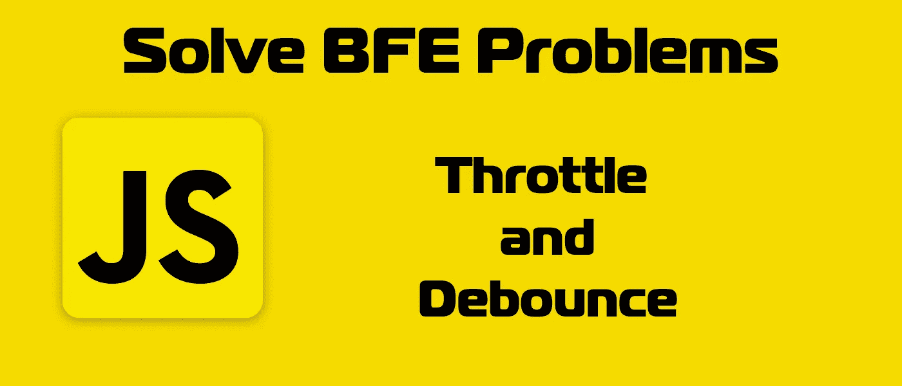

# 从 Bigfrontend (BFE)解决 JavaScript 问题:节流和去反跳

> 原文：<https://itnext.io/solving-javascript-problems-from-bigfrontend-bfe-throttle-and-debounce-87a809e5952b?source=collection_archive---------1----------------------->

在这一系列文章中，我想解决 BFE 问题([https://big fronted . dev](https://bigfrontend.dev))并分析解决方案。BFE 网站的任务是让你为前端面试做准备，并扩展你的 JavaScript 知识。

今天我要考虑 2 个问题，它们是[油门](https://bigfrontend.dev/problem/implement-basic-throttle)和[去抖](https://bigfrontend.dev/problem/implement-basic-debounce)。

# 1.喉咙

理论:

Throttle 允许您在给定的时间间隔内只执行一次该函数。

实际上:

例如，我们需要处理页面的滚动，并执行一些使用滚动坐标的 **fn** 函数。我们可以直接订阅 **onscroll** 事件，但是它会被非常频繁地调用(取决于我们滚动的速度)，但是即使我们做得很快，事件也会多于 1–2。可以在 throttle 中修饰执行的函数，每 N ms 执行一次。

它是这样工作的:

1.第一次调用 onscroll 时，修饰变量立即将调用传递给 **fn** 。用户可以看到这些变化。

2.如果我们继续滚动页面，那么 ms. Onscroll 事件将被忽略。

3.当滚动停止时，修饰功能将等待 N ms，并使用最后一个坐标执行 **fn** 。它将处理滚动停止的最终坐标。

解决方案:

我们来分析一下解决方案:

throttle 函数有两个参数:要执行的函数和超时(毫秒)

在第 7–9 行，我们需要保存我们的计时器，它是我们为在给定的时间间隔触发函数调用而创建的，我们需要保存调用上下文和参数，以便当计时器超时时，我们可以使用正确的上下文和参数执行函数。

第 11 行返回函数，因为我们需要做一个闭包，并在 throttle 中修饰原来的函数。

*const throttled = throttle(func，3)*

现在我们应该处理两个选项:第一个调用和后续调用。第一次调用应该立即生效，而不需要等待计时器超时。随后的应该被“覆盖”,而最近的应该在定时器到期时被调用。

检查是否是第一次调用是根据运行的定时器来执行的，所以在第 12 行你可以看到，如果这不是第一次调用，我们只保存上下文和参数。

如果这是第一次调用，则立即执行该功能(第 16 行),并以指定的时间间隔启动计时器(第 18 行)。对计时器内部参数的额外检查是为了，如果我们只有一个调用(我们马上进行了第一个调用),那么在时间到期后它不会被再次调用。如果有调用，那么在时间过去之后，将使用保存的上下文和参数调用函数(第 20 行)，计时器被清除(第 22 行)，最后一次调用的数据也被清除(第 23、24 行)。

# 2.去抖

理论:

一旦用户停止事件调用，该函数将仅在指定时间后执行。

实际上:

我们需要处理页面的滚动，并执行使用滚动坐标的 **fn** 函数。如果定时器启动后没有更多事件被触发，去抖将在 N ms 后调用 **fn** 。如果触发了新的事件，并且定时器没有结束，则先前的定时器取消，并且开始新的定时器。

它是这样工作的:

1.当 onscroll 第一次被调用时，修饰函数通过调用 **fn** 来启动定时器。

2.如果我们继续滚动页面，那么先前的计时器被取消，一个新的计时器开始计时。

3.如果在指定时间 N ms 内没有发生 onscroll 事件，则使用最后一个事件的上下文和参数执行 **fn** 函数。

解决方案:

去抖函数有两个参数:要执行的函数和超时。

在第 8–10 行，我们需要保存我们的定时器，它是我们在时间到期时为函数调用的触发器而创建的，我们需要保存调用上下文和参数，以便当定时器到期时，我们可以使用正确的上下文和参数来执行函数。

第 12 行返回函数，因为我们需要做一个闭包，并在去抖中修饰原始函数。

常数去反跳=去反跳(func，3)

时间到期时将运行的函数是第 16 行。我们用上次调用保存的上下文和参数调用原来的 **fn** 函数，并将它们设置为 null。

随着每个后续调用，我们应该取消计时器并重新启动它，在第 23 行取消被实现。

第 25 行通过在指定的等待时间后调用我们的 **fnCall** 函数来启动计时器。

# 结论

如你所见，这些方法的实现并没有什么困难。希望生活中描述的算法能更好的记住油门和去抖是怎么工作的，区别是什么。

在下一篇文章中，我们将分析这些问题的后续(解决[油门](https://bigfrontend.dev/problem/implement-throttle-with-leading-and-trailing-option) / [去抖](https://bigfrontend.dev/problem/implement-debounce-with-leading-and-trailing-option)与领先和落后的选择)