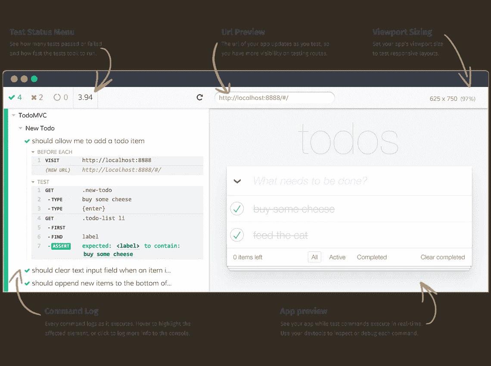
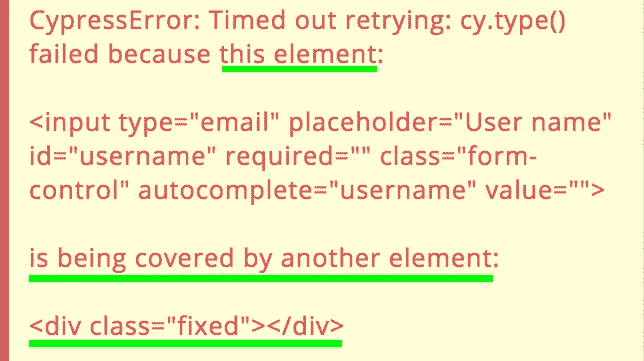

# 一些 UI 测试问题和 Cypress 方法

> 原文：<https://itnext.io/some-ui-testing-problems-and-the-cypress-way-22312ab986e3?source=collection_archive---------1----------------------->

## 为什么测试一个 web 应用程序如此困难？为什么通用浏览器自动化工具不能很好地满足用户界面/E2E 测试的需求？柏木为什么出众？

一般的特性比较不足以理解什么是主要的 UI 测试难点，以及 Cypress 如何消除它们。
在此阅读或在 [dev.to](https://dev.to/noriste/some-ui-testing-problems-and-the-cypress-way-1167) 上阅读。


由[奥拉夫·阿伦斯·罗特内](https://unsplash.com/@olav_ahrens?utm_source=unsplash&utm_medium=referral&utm_content=creditCopyText)在 [Unsplash](https://unsplash.com/?utm_source=unsplash&utm_medium=referral&utm_content=creditCopyText) 拍摄的照片

我正在 GitHub 上做一个大的 [UI 测试最佳实践](https://github.com/NoriSte/ui-testing-best-practices?source=post_page---------------------------)项目，我分享这个帖子来传播它并有直接的反馈。

这篇文章是我在 2020 年 3 月 27 日伦敦 [CityJSConf](https://cityjsconf.org/) 上演讲的基础。

测试前端应用程序带来了一些“经典”测试没有的挑战:你需要**编排一个真正的浏览器**。根据定义，浏览器是重型应用程序，您需要启动它们，通过专门设计的库来管理它们，利用一些 API 来自动化用户会进行的同类交互，然后检查前端应用程序的状态(本质上是它所显示的)是否与您期望的一样。

这个过程和相关的步骤使得 UI 测试变得困难。主要问题是:

*   **一切**都是异步的:用户模拟的交互是异步的，UI 的反应是异步的，浏览器的反应是异步的，你用来编排和与浏览器通信的工具也是异步的

```
**await** page.goto(url)
**await** page.click('[data-test="contact-us-button"]')
**await** expect(page).toMatch('Contact Us')
```

而且，一旦你需要更复杂的东西，等待一切会让你深入管理承诺和递归承诺。

*   **你自动化用户流**:所以你需要重现用户流，检查自动用户流，调试失败的(和自动的，超快的)用户流。
    想象一下，和你的一个有问题的同事并肩站在一起，你让他做点什么，这样你就可以直接用他的浏览器开发工具检查问题，但是当你需要检查问题的时候，他**不会停下来点击/输入**。当 UI 测试没有按预期进行时，您需要面对这种情况。暂停/停止一个正在运行的流程是很困难的，并且您需要多次重新启动相同的测试
*   在 web 应用程序中，有很多情况会干扰元素的交互性:元素的内部状态、标记属性、视觉外观、其他元素的外观等等。其中有些很容易被发现(例如“disabled”属性)，但有些则不容易(另一个具有更高 z 索引值的元素)。更一般地说，**很难调试原因**，因为你需要仔细检查元素本身、整个页面、自动化交互的工具等等。

自动化和测试前端应用程序是困难的，但是有一些工具不能减轻痛苦，还有一些工具可以给你超能力，继续！

# 常用工具

要自动化和测试前端应用程序，您需要两种不同的工具:

*   测试运行人员:负责执行测试本身的人
*   一个浏览器自动化工具:公开一些 API 来与一个有目的的浏览器进行交互

这些工具是独立的，当您选择的测试运行程序(例如 Jest)在终端中运行时(并为您提供所有的测试反馈)，第二个工具(Selenium 或 Puppeteer)会打开一个浏览器，执行测试中编写的命令，并返回结果。


基于终端的测试运行程序和浏览器自动化工具之间有双向通信。

**这两个工具是分离的**，这使得很多事情变得复杂！浏览器中运行的动作真的很快！你可以减慢他们的速度，但你不能暂停或停止他们！或者，更好的是，我的意思是不要交互…因为你显然可以从代码编辑器**来回跳转**，在你想要检查的步骤之后修改测试注释，重新启动测试并检查发生了什么。但这不是一个理想的流程。因为测试是一个小程序，你知道你需要重复这个步骤很多次…

当以上述方式运行测试时，出现了另一个问题:当操作在浏览器中发生时，您通常登录到终端(测试运行者工作的地方)。**你如何将它们联系起来？你在终端和浏览器控制台中都添加了时间戳记录吗？您是否在您的前端应用程序上添加了一个固定的 div 来显示正在运行的测试的名称？通过终端将浏览器中发生的事情与您所做的事情(或记录)联系起来也很困难。**

最后但同样重要的是:当您在终端中调试测试时，您调试的不是真正的 DOM 元素，而是序列化/引用的元素。终端和浏览器之间没有任何形式的双向交互，因此您不能像以前那样使用浏览器开发工具。

相信我，理解为什么一个测试会失败，或者为什么浏览器不像你期望的那样运行是非常困难的。但是你必须面对测试过程的三个不同阶段:

*   1:当您最初编写测试时
*   2:当测试失败时，您不能将任何东西投入生产
*   3:当您需要更新它们时，因为规格发生了变化

第一步和第三步非常相似，第三步可能更快，但是第一步可能会很累。#2 会让你讨厌 UI 测试，如果你正在使用的工具对你没有帮助…

# 试车目的

停下来想一想，从测试人员开始，上面提到的工具试图完成什么。

测试运行程序是为管理单元测试而设计的。显然，您可以按照自己的方式使用/插入它们，但是它们本质上是为超快速(并行)的小函数调用而设计的。他们没有类似浏览器的开发工具，但是主要问题是测试超时。每次测试都有超时，这是完全合理的。由于超时，如果测试时间太长，测试运行程序就会终止它。

但是当您将测试超时与 UI 测试需求结合起来时会发生什么呢？如你所知，用户流量可以持续很长时间。原因有很多:

*   交互本身可能会很长，包括数十次点击、打字、计算、等待等等。
*   有很多事情**根本无法控制(从持续时间的角度)**:XHR 要求的是最重要的！您无法知道 Docker 容器(或登台服务器)需要多少时间来响应。如果后端没有对接，你也必须面对网络缓慢

这些例子向您展示了 UI 测试的不可预测性。解决方案似乎很方便:增加测试超时！但这是最差的解决方案，它不起作用是因为:

*   测试超时是断头台，当出现问题时，它可以为您节省大量时间。如果你将超时设置为一分钟，你将**再等一分钟** (60 秒！！！！)如果单个测试没有按预期工作。测试持续时间过长是开发人员讨厌测试的主要原因之一，因为管道永远存在。尽管如此:在一些特定的场景中，你不能确定 60 秒是否足够…想想 AWS lambdas 在服务器运行缓慢、网络出现问题的情况下的唤醒时间…
*   调试过程呢？请记住，当测试因为超时而终止时，自动化浏览器会自动关闭...

最后但同样重要的是，记住您需要有与 DOM 相关的断言。在 UI 测试中，您不处理对象、数组和原语，但是您本质上管理 DOM 元素。像“我希望元素等于…”这样的断言是不起作用的，但显然它对单元测试是有效的。这个问题通常用外部插件解决。

# 浏览器自动化工具用途

Selenium 和 Puppeteer 的目标是一个简单的、没有魔法的 UI 自动化体验。它们并不意味着测试 UI，而仅仅是自动化用户交互。自动化和测试在某些方面有所重叠，但它们并不相同。两者都试图理解一个按钮是否是可点击的，并试图点击它，但是前者失败了，后者试图告诉你为什么失败了。前者告诉您某个元素不在页面上，而后者告诉您它不在页面上，因为之前的 XHR 请求失败了。

我们习惯于将一个测试运行程序与一个浏览器自动化工具放在一起，并试图获得它们的最佳效果，但却苦于两个非集成的不同工具所不能提供的东西。

再次谈到测试(和测试中的应用程序)可调试性:为了减慢/调试/暂停/停止/使它们工作，等等。您需要多次“休眠”测试。这是一种常见的做法，既因为它能在短期内解决问题，有时也因为你别无选择(阅读我的 [Await，不要让你的 E2E 测试休眠](https://medium.com/@NoriSte/await-do-not-sleep-your-e2e-tests-df67e051b409)帖子)。不幸的是，添加一些**“睡眠”步骤使得测试越来越糟糕**，越来越慢。正如我之前写的:测试速度慢是让开发人员讨厌 UI 测试的最常见的缺陷之一。

更多:**测试失败会发生什么？在了解如何修复 bug 之前，您可以做些什么来了解问题？如果你足够幸运，在本地发现了破测试，你的痛苦是有限的。但是，如果测试在管道中失败，如果没有 UI，您怎么知道发生了什么呢？有没有添加一些降落伞自动截图？有没有比截图更好说话的？不幸的是没有…**

你甚至需要利用第三方调试工具(React DevTools，Vue DevTools 等。)但他们在受控浏览器上的安装过程并不是世界上最便捷的。

最后但同样重要的一点是:中断服务器并断言 XHR 请求可以被认为是测试实现细节…但我不这么认为，原因有二:

*   当谈到黑盒测试时，我们指的是避免测试事物如何工作的(好)实践，只关注它做了什么。应用于前端应用程序，这意味着只测试应用程序向用户公开的功能，而不是应用程序如何公开它(不管它是否与 React 或 Vue.js 一起工作，如果它将数据保存到 localStorage 或 sessionStorage 中)。这同样适用于客户机/服务器通信，但是理解由于错误的 XHR 请求而没有发生某些事情可能是困难的(特别是当您在无头模式下运行自动化浏览器时)。而您从断言请求有效负载、响应有效负载、响应状态等获得的帮助。，是无价的(**总是关心一次测试在多大程度上驱使你在失败的情况下识别问题**)。
*   如果您使用 Pact 或类似的工具测试客户机/服务器契约，您不需要这样做，但是您的工作流中有这些类型的测试吗？
*   如果你是一个前端开发人员，你知道你不能总是在后端完成他们的工作之后工作。但是，如果他们为您提供完整的 JSON 响应，存根后端允许您完成所有的前端编码工作，留下最后一英里的工作来检查当您集成前端和后端时，一切都按预期工作。这是生产力的问题。

# 隐性测试挑战

上述考虑产生了另一个问题:**测试代码应该尽可能简单**。测试可以让你检查所有的东西都像预期的那样工作，但它们毕竟是小程序。因此，随着时间的推移，你需要维护它们。由于你需要一段时间来理解它们(如果你需要几个小时来理解测试为什么和如何工作是不可行的，测试必须帮助你，而不是像糟糕的代码那样使你的生活变得复杂)，它们的代码不应该复杂(阅读我的[软件测试作为文档工具](https://medium.com/@NoriSte/software-tests-as-a-documentation-tool-e1c463bad1be)的帖子)。

但是，不是为像 UI 测试这样的困难任务而创建的工具不会帮助您编写简单的测试代码。并且您的测试生活变得更加艰难，再次…因此您注定要花费大量时间调试一个失败的测试，而不是了解在您的前端应用程序中什么是不工作的(假设有什么东西坏了…)。**结果是更少的测试可信度** …

# 赛普拉斯来救援了

不要担心，我没有因为你的悲伤而报道这个戏剧性的情况😉但只是让你意识到你不需要混合在一起的通用工具，你需要一些有目的的东西！我想到了两个工具: [Cypress](https://www.cypress.io/) 和 [TestCafé](https://devexpress.github.io/testcafe/) 。两者都非常有效，因为他们心中只有一个目标:重新发明(或修复？)UI 测试界。

我专注于柏树，稍后我会比较它们。
赛普拉斯是如何解决以上所有问题的？首先…

# Cypress 有一个用户界面

是的，你通过终端启动 Cypress，但是你通过它的 UI 消费它[！而且 UI 是和你的应用并列的！看一下这个预览](https://docs.cypress.io/guides/core-concepts/test-runner.html)



[命令日志 UI](https://docs.cypress.io/guides/core-concepts/test-runner.html) (左侧)与您的前端应用程序(右侧)一起运行。

这是什么意思？[命令日志 UI](https://docs.cypress.io/guides/core-concepts/test-runner.html) 的主要特点是什么？

*   **你对 Cypress 正在做的事情有直接的反馈**。每次你让 Cypress 通过它的命令(`cy.click`、`cy.type`等)与页面进行交互。)，Cypress 为测试运行程序添加了一个日志。这种详细的自动日志记录在编写测试和调试测试时都非常有用。它极大地提高了您的生产率，因为它是自动的，而且与您的应用程序并行。

但是，正如我告诉你的，在编写 UI 测试时，缺乏可追溯性是一个很大的缺失…让我给你介绍一下…

*   **交互式时间旅行**:不确定应用程序如何到达特定命令或测试如何失败？你会看一下上一步的用户界面吗？这就是为什么命令日志是交互式的！你可以将鼠标悬停在各种记录的步骤上，看看应用程序如何看待某个特定的步骤！或者，显然，您可以锁定一个步骤并检查 DOM，检查应用程序在该步骤之前/之后的样子，等等。这是另一个救命的特性，无论是在第一种方法中(当你不知道测试工具可能是一个噩梦时调试测试)还是在每天的测试工作中。它使得测试检查如此方便，以至于你完全忘记没有它测试是怎样的。
    观看它的运行

命令日志允许时间旅行。

其他命令日志实用程序包括:

*   命令的丰富日志:点击命令会在浏览器 DevTools 中显示更详细的日志
*   断言检查:单击断言会在浏览器 DevTools 中显示预期值和结果。您不需要使用更详细的日志记录来重新启动测试
*   如果你侦察到 XHR 呼叫，命令日志会显示一个侦察到的/存根化的呼叫的恢复以及它们被调用的次数

…此外，看看[在官方赛普拉斯文档](https://docs.cypress.io/guides/core-concepts/test-runner.html#Command-Log)中的功能。

# 柏树指挥部

**命令是异步的**默认情况下，看看下一个片段

```
cy.visit(url)
cy.click('[data-test="contact-us-button"]')
cy.contains('Contact Us').should('be.visible')
```

你注意到什么了吗？不，原因很简单:为什么要管理等待，而 UI 中的所有东西都需要等待呢？Cypress“等待”您，这意味着如果当您试图与 DOM 元素交互时，它还没有准备好，没问题！Cypress 会重试(默认情况下为 4 秒)直到它可以与元素交互(用户方式，因此只有在元素可见、未被禁用、未被覆盖等情况下)。).因此您可以**完全避免面对前端固有的不同步**！

上面的特性还有一个效果:你还记得不太好的测试超时吗？好吧，算了吧！在 Cypress 中，**测试没有超时**！您避免猜测(并根据需要不断调整)测试持续时间，每个命令都有自己的超时时间！如果出了问题，测试很快就会失败！如果测试顺利，它不会面临测试超时的风险！

最后但同样重要的是:DOM 相关命令以您需要的方式报告 **DOM 相关错误**。看一下下面的例子:



Cypress 从用户/DOM 的角度清楚地报告了这个问题。

用户不能在输入元素中输入的原因很明显。Cypress 并不是唯一一个拥有像用户一样的命令的工具，但是它的发音错误相当罕见。

# 测试质量

开发人员在测试时会犯很多常见的错误。有些错误可以忽略不计，但有些则不然。柏树迫使你避免一些错误，如何？

*   带 **AAA-quality** [**文档**](https://docs.cypress.io/guides/overview/why-cypress.html) :看一下吧，里面包含了很多[最佳实践和反模式太](https://docs.cypress.io/guides/references/best-practices.html)。每个人都同意文档的质量
*   **重置状态**:测试不共享状态，因为 cookies、localStorage 等。每次测试前都会被重置。很明显，你可以创建智能命令来保持测试的独立性(共享状态的真正问题是测试的独立性，看看我的课程中的一个[的例子)，但是你不能跳过重置。这是专家，相信我😉](https://noriste.github.io/reactjsday-2019-testing-course/book/sharing-authentication-state.html)
*   排除恢复测试的可能性，如果断言失败，就不能继续。您确实需要使您的测试更加稳定，即使有时看起来很难。这是一个成功的选择，否则，您将被允许编写糟糕的测试
*   **有很多等待助手** : [重试能力](https://docs.cypress.io/guides/core-concepts/retry-ability.html#Commands-vs-assertions)和[自动等待](https://docs.cypress.io/api/commands/wait.html#Syntax)是救命稻草，让你可以关心你的应用和测试，而不是等待元素之类的东西。Cypress 允许您等待 DOM 元素、XHR 请求、页面加载，它**根据需要调整超时**(XHR 请求或页面加载可能比输入元素出现的时间更长)而不需要固定时间的睡眠(再次阅读我的 [Await，不要让您的 E2E 测试睡眠](https://medium.com/@NoriSte/await-do-not-sleep-your-e2e-tests-df67e051b409)文章)。
    如果你需要编写一个自定义等待，我的 [cy.waitUntil 插件](https://github.com/NoriSte/cypress-wait-until)就是你需要的😉

# 生产力

赛普拉斯在另一个非常重要的话题上胜出:生产率。每个人都问我“测试在多大程度上降低了工作速度？”。嗯，我的一般反应是，如果我写测试，我需要多 30%-40%的时间来编写同样的代码。但是编写一个完整的测试套件和自动化你的工作是有区别的。我写了一篇文章专门讨论这个话题:[前端生产力提升:Cypress 作为你的主要开发浏览器](https://medium.com/@NoriSte/front-end-productivity-boost-cypress-as-your-main-development-browser-f08721123498)。

我在这里不重复所有的事情，但是考虑一下:

*   使用 Cypress 非常容易自动化您的开发流程。自动测试-保存应用程序或测试代码时重新启动，使您能够**避免手动点击/键入**同样的步骤来检查您正在使用的新功能
*   Cypress 利用持久化的 Chrome 用户，你可以**安装你选择的开发工具**并在 Cypress 控制的浏览器中使用它们
*   Cypress 允许您**完全控制服务器**，既可以监视、等待和断言 XHR 请求，也可以使用静态 JSON 响应代替服务器响应。后者将您的开发提高了 10 倍，毕竟，您是一名前端开发人员，您需要找到一种没有真正后端的工作方式(除非您非常幸运，可以在本地机器上运行它)
*   您可以完全访问您的应用程序所属的窗口对象。这是在生产力方面的另一大特点，使用前端应用程序公开的功能等。

# 排除故障

我在上面解释了为什么调试一个没有一些专用特性的测试会是一场噩梦。有两种失败的测试调试:

*   当你写测试的时候
*   当 CI/CD 管道中的测试失败时

Cypress 有两个惊人的解决方案:

*   [**播放/暂停**](https://docs.cypress.io/api/commands/pause.html) **功能**:无论是通过编程还是通过 UI，你都可以暂停和恢复测试。是的，它甚至提供了一步一步的导航，就像您习惯于在代码中放置断点并一步一步地处理一样。使用播放/暂停两次，没有它你就不能编写测试😊
    播放/暂停和时间旅行提供了惊人的体验，让你完全忘记了常见的耗时调试烦恼
*   **自动截图和视频**:如果一次测试失败，Cypress 会保存测试最后一步的截图。有时，最后一步可以让你明白发生了什么(特别是如果你添加了许多口头断言，[在这里你可以阅读](https://noriste.github.io/reactjsday-2019-testing-course/book/utility-in-case-of-failure.html)如果没有好的分步断言，你会有什么风险)但是如果一个截图对你没有那么大的帮助… Cypress 录制了整个测试的视频，包括测试运行器 UI。有时，自动记录使我能够以最简单的方式发现与 CI 相关的问题。

# 常见问题解答

我将 Cypress 作为一个完美的工具，现在我预计他们会问我一些常见的问题:

*   赛普拉斯是免费的吗？是的，免费，开源，麻省理工学院许可。只有当你想利用它的[仪表盘服务](https://www.cypress.io/dashboard/)时，你才需要付费。一句话:您希望 Cypress 托管您的测试视频吗？你必须付费，否则，一切都是免费的
*   除了类似 Chrome 的浏览器，Cypress 还支持浏览器吗？
    除了 Chrome 和 Edge 80+，Cypress 支持 Firefox。
*   我引用了 TestCafé，主要区别是什么？
    - **TestCafé没有类似于测试运行器 UI** 的东西，这是一个很大的缺失 IMHO
    - TestCafé等待 DOM 元素超时，而 Cypress 等待相同的超时。因此，使用 TestCafé，您必须手动校准等待，以避免长时间运行的测试，使用 Cypress，您可以忘记它
    - TestCafé没有完整的 XHR 请求检查，这是有争议的，但我认为这是一个重要的功能，具有高度可靠的测试和有用的错误报告
    - **TestCafé支持所有现有的浏览器**！这是一个独特的功能，Cypress 并不支持所有的浏览器，也不会支持移动浏览器。请注意，跨浏览器的需求被高估了，但是如果您真的需要，TestCafé是您的完美工具
    另外，如果您是一名经验丰富的 TestCafé开发人员，我真的希望听到您的经验来丰富本文和我的一般 TestCafé知识😊
*   有柏树的瑕疵？很明显！它有一个关于 window.fetch 的[历史问题](https://github.com/cypress-io/cypress/issues/95#issuecomment-343214638)，迫使你使用 Axios 或者[添加一个变通方法](https://dev.to/matsilva/fetch-api-gotcha-in-cypress-io-and-how-to-fix-it-7ah)，并且你可能需要一些额外的步骤来管理 OAuth，因为你的应用程序运行在 iframe 中。但是它仍然是 UI 测试中最受欢迎的工具之一
*   更一般的是:记住我们谈论的是 UI 测试，Cypress 在这方面做得特别好。如果你只是需要自动化一个浏览器(为了数据抓取或其他什么),不要使用它！

# 结论

让我重述一下我上面列出的问题和解决方案:

*   前端测试中的一切都是异步的，Cypress 几乎透明地管理它
*   逐步调试:Cypress 的时间旅行和播放/暂停功能是你最好的朋友
*   如果失败，Cypress 会给出明确的错误
*   调试变得很方便，由于并行测试/应用程序的运行，识别缺陷不再是一场噩梦
*   自动截图和视频在失败的情况下
*   Cypress 测试没有超时，Cypress 命令有
*   Cypress 允许你完全不用后端工作，这是最简单的方法
*   Cypress 有很多可以提高你工作效率的特性
*   Cypress 的目标只有一个:让 UI 测试变得简单😊

我引用 Cypress 网站上的一段话来结束这篇文章😊

> 网络已经进化了。
> 最后，测试也已经开始。

你好👋我是 Stefano Magni，我是一名充满激情的 JavaScript 开发人员、T2 的柏树大使和 T4 的讲师。我作为一名高级前端工程师为 WorkWave 做远程工作。
我喜欢创造高质量的产品，测试和自动化一切，学习和分享我的知识，帮助他人，在会议上发言和面对新的挑战。
你可以在 [Twitter](https://twitter.com/NoriSte?source=post_page---------------------------) 、 [GitHub](https://github.com/NoriSte?source=post_page---------------------------) 、 [LinkedIn](https://www.linkedin.com/in/noriste/?source=post_page---------------------------) 上找到我。你可以找到我最近所有的文章/演讲等等。这里。