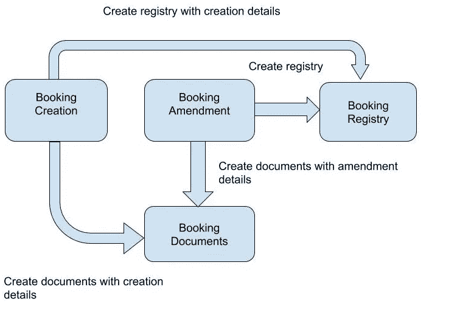
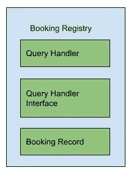
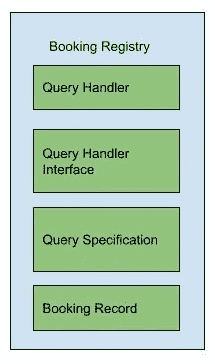
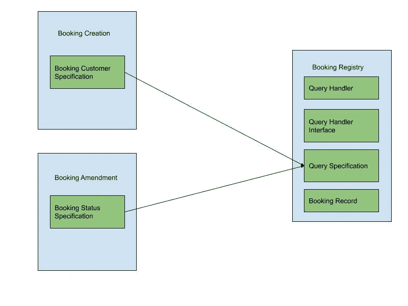
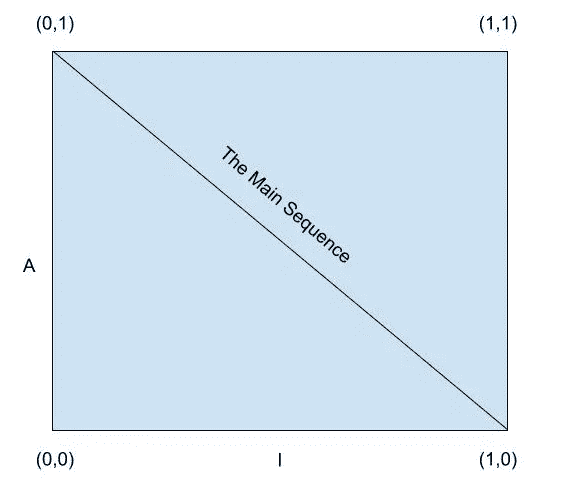
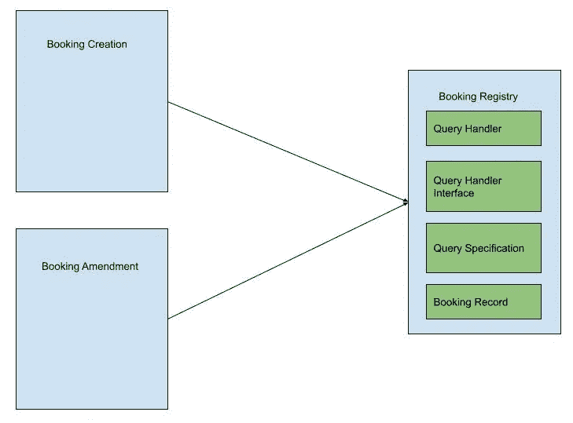
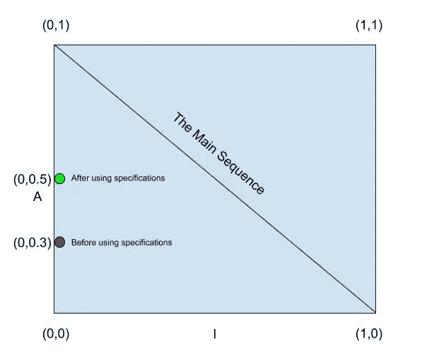
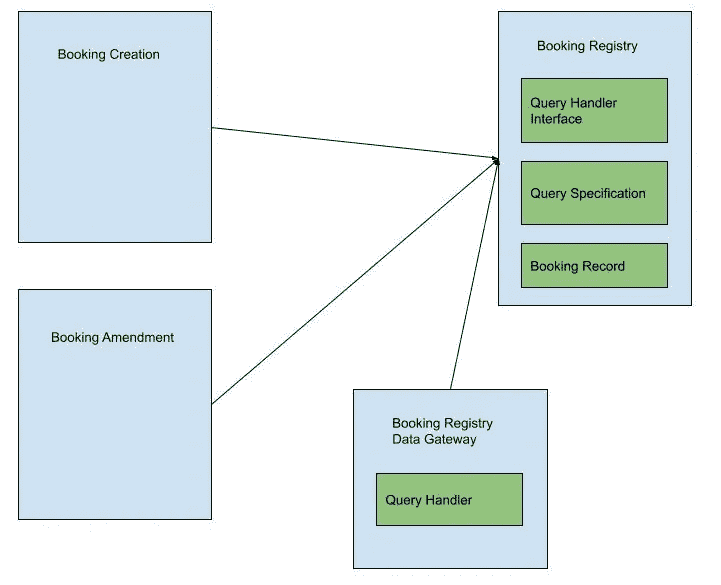
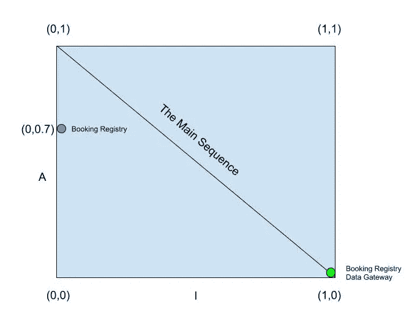

# 如何度量软件架构的稳定性

> 原文：<https://itnext.io/specification-pattern-and-how-to-quantify-the-improved-software-stability-9a7cf5a74f1f?source=collection_archive---------4----------------------->


马库斯·斯皮斯克在 [Unsplash](https://unsplash.com/s/photos/stability?utm_source=unsplash&utm_medium=referral&utm_content=creditCopyText) 上的照片

## 摘要

使用稳定性和抽象度量，我们可以度量软件架构的稳定性。为了展示这些度量标准，我将一步一步地展示如何应用这些度量标准，以及如何利用设计模式来改进它们。我将使用的设计模式是规范模式。

## 酒店预订系统案例研究

这篇[文章](https://medium.com/@samousavih/common-closure-principle-the-story-of-an-evolving-architecture-6919b452c8db?source=friends_link&sk=ad7c99d1c4790186cff1d91061cf1c8d)详细描述了酒店预订系统的架构。然而，为了本文的目的，我们简单地回顾一下。该系统用于预订和修改酒店住宿。它由四个组件组成，预订创建组件、预订修改组件、预订文档组件和预订注册组件。预订创建包含了创建新预订的所有逻辑和策略，预订修改也做了类似的工作来更改之前创建的预订。这两个组件可以与其他两个组件通信，以创建或修改预订记录和预订文档。图 1 显示了系统的架构。本文的重点是预订注册中心及其与其他组件的通信。



图 1-预订系统的整体架构及其组件之间的通信

## 预订注册表组件和查询实现

如上所述，预订登记处保存所有的预订记录。此外，它还允许我们称为客户端的其他组件查询注册表以检索所需的记录。一些客户可能需要已经完成的预订记录列表，其他客户可能需要仍在进行中的记录。他们还可以根据不同的标识符或数据字段获取预订记录，例如，一个客户的所有记录或一个预订 id 的一个记录。这些查询在预订注册中心内部实现。实现它们最简单的方法是使用一个叫做查询处理程序的类。这个类为每个可能的查询提供了方法。每个方法都知道如何从数据存储中获取数据，在本例中，数据存储是一个数据库，并分别将结果映射到一个数据模型。预订的数据模型也是驻留在该组件中的一个类。数据模型是一种简单的数据结构。还有一个描述查询处理程序类外观的接口，它是在 registry 组件中定义的。下图(图 2)显示了所有提到的部分。



图 2-预订注册表中的类别

如果我们放大查询处理程序类，我们可以看到每个查询的方法。这里显示了该类的伪代码。

```
Class BookingRegistryQueryHandler
 extends IBookingRegistryQueryHandler{
  BookingRecord GetBookingRecordsById(BookingId id){}
  BookingRecord[] GetBookingRecordsByStatus(BookingStatus status){}
  BookingRecord[] GetBookingRecordsByCustomer(CustomerId id){}
    ...  
}
```

并非所有这些方法都被每个客户端调用。有些人可能只打一个电话，有些人可能做更多。还可以有在一个或多个这些客户端之间共享的方法。随着产品的增长和新特性的实现，这些方法也需要改变。因此，这个类和父组件需要修改。这些变化会发生在不同的时间，出于不同的原因。每次新功能需要一种新的方法来获取带有新参数的数据时，我们也需要测试和重新部署预订注册组件。更糟糕的是，跨系统的不同组件和不同子域共享查询可能会导致不稳定，因为这些组件会不同地增长。

如上所述，这种架构违反了两个原则。第一个[打开关闭原则](https://en.wikipedia.org/wiki/Open%E2%80%93closed_principle)，因为我们不能在不修改其内容的情况下扩展查询处理程序类。第二个原则是**[常见的关闭原则](https://medium.com/@samousavih/common-closure-principle-the-story-of-an-evolving-architecture-6919b452c8db?source=friends_link&sk=ad7c99d1c4790186cff1d91061cf1c8d)因为我们在不同的时间因为不同的原因不得不改变预订注册表组件。**

## **规格模式**

**规格模式在 [DDD 书](https://www.amazon.com/Domain-Driven-Design-Tackling-Complexity-Software/dp/0321125215)中有详细解释。这本书还定义了什么是规范。**

> **规范允许客户描述(即指定)它想要什么，而不关心如何获得它**

**为了实现这一点，我们需要向预订注册组件添加一个规范类。然后，每个客户都需要根据他们想要的预订记录查询来定义自己的派生版本的规范。此外，我们还可以将 booking registry 中的 specification 类变成一个抽象类。这是有帮助的，因为我们不期望任何客户创建类的实例，他们必须总是扩展它。这是我们新设计的样子。**

****

**图 3-带有规范的预订注册表**

**查询类如下所示:**

```
**Class BookingRegisteryQueryHandler
 extends IBookingRegisteryQueryHandler{
 BookingRecord[] GetBookingRecordsBySpecification(Specification s){}
}**
```

**这里是规范类:**

```
**abstract class Specification {
 abstract bool IsSatisfiedBy(BookingRecord b)
}**
```

**现在，每个客户端都可以通过扩展抽象类来驱动新的规范。这里有一些例子。**

```
**class BookingStatusSpecification extend Specification {
    BookingStatus status
    bool IsSatisfiedBy(BookingRecord b){
       return b.Status == status
    }
}class BookingCustomerSpecification extend Specification {
   CustomerId id
   bool IsSatisfiedBy(BookingRecord b){
       return b.Customer.Id == id
   }
}**
```

**上面显示的两个规格可能位于不同的组件中，下面是组件规格概述。**

****

**图 4-客户可以扩展抽象规范类**

**最终预订注册表更具可扩展性。因为一个新的特性或一个全新的组件而添加一个新的查询，您需要做的就是扩展抽象规范类，并在客户端组件中实现一个新的规范类。因此，我们不再需要修改预订注册表中的任何类或代码。此外，现在更改预订注册中心的原因比以前少了很多，我们不再需要因为其他组件而更改、测试和重新部署组件。虽然我们取得了很大的进步，但我们不会就此止步。在下一节中，我们可以测量和量化新架构的稳定性。**

## **稳定性和抽象度量**

**在[清洁架构](https://www.amazon.com/Clean-Architecture-Craftsmans-Software-Structure/dp/0134494164)一书中，有一章叫做组件耦合，详细描述了这些度量。我们探索的第一个指标是稳定性指标。它可以用下面的公式计算。**

```
**I = FanOut╱(FanIn+FanOut)**
```

**扇出和扇入是指向和指向组件的依赖项的数量。它的范围在 0 到 1 之间。如果 I = 0，我们说这个分量是最大稳定的，如果 I =1，我们说它是最大不稳定的。**

**抽象度量，也称为 A-度量，是通过这个等式计算的**

```
**A = Na╱Nc**
```

**Na 是组件中抽象类和接口的总数，Nc 是组件中类的总数，包括抽象类、接口类和具体类。也类似于 I-metric a-metric 具有范围从 0 到 1 的值。如果组件仅由抽象类或接口组成，则 A-metric 为 1。相反，如果所有的类都是具体类，则为 0。**

**使用上述指标，我们可以绘制一个名为 A/I 图的图表，并指出每个组件。下一张图显示了图表。**

****

**图表 5- A/I 图**

**主序列是理想情况下所有组件应该被映射的地方。因为越稳定的组件应该越抽象，反之亦然。理想成分是最稳定同时又最抽象或最不稳定同时又最具体的成分。要了解更多细节以及为什么会这样，请看《干净的建筑》一书。并非所有的组件都位于主序列上，因此我们使用此等式计算到主序列的距离。**

```
**D = ┃A+I-1┃**
```

**d 也具有介于 0 和 1 之间的值。组件的 D 度量越小，它就越接近主序列。当值为 0 时，该组件在主序列上。**

## **计算预订注册表组件的 D-metric 改进**

**为了计算 D 度量，我们需要首先计算 A 和 I 度量。根据图表 6，我们可以做数学。正如您在这个图中看到的，预订注册组件包含两个接口和抽象类，它们是查询处理程序接口和查询规范类。此外，它总共有 4 个类。因此，A 度量是 2/4 = 0.5。**

**I-metric 也可以使用相同的图表来计算。因为扇入是 2，因为另外两个组件依赖于预订注册表，扇出是 0，因为它不依赖于任何其他组件。所以 I-metric 是 0/(0+2) = 0。最后，D 度量的计算公式如下**

**D =┃0.5+0 -1┃ = 0.5。**

****

**图 6-计算 A 度量和 I 度量**

**让我们看看我们改进了多少 D-metric。如果我们在使用规范模式之前计算 D 度量，值将是 0.7。因此，我们可以看到，通过应用规范模式和使用抽象规范类，我们能够将 D 度量从 0.7 提高到 0.5。**

**此外，我们可以利用图 7 中的 A/I 图来可视化重构前后组件的 D-metrics。**

****

**图 7——可视化重构前后组件的 D-metrics**

## **我们能更进一步吗？**

**最后的组件设计，还是有一些痛点。在预订注册表中，我们在同一个组件中有一些抽象类和一些具体类。问题是，它们是否以同样的原因同时改变？答案是否定的。查询处理程序类包含我们用来获取预订记录的查询的细节。这个类知道数据存储，并且可能知道这里使用的框架。它还与数据存储模式相结合。因此，这个类可能会因为任何这些细节而改变。模式中的任何变化，使用新的框架或查询优化都可能影响这个类。然而，由于上述原因，接口、规范类甚至预订记录数据结构都不太可能改变。因此，将它们放在同一个组件中没有太大意义。为了进一步改进，让我们在架构中添加一个新组件。我们可以称之为预订注册数据网关。这里是新组件的架构外观。**

****

**图 8-添加预订注册数据网关**

**最后，如果我们计算指标并指出 A/I 图上的两个组件，它看起来像 digram 9。**

****

**图 9-预订注册表和预订注册表网关显示在 A/I 图上**

**如图所示，结果是有希望的。我们将预订注册表重构为两个新的竞争对手，D 指标分别为 0.3 和 0。**

## **结论和讨论**

**软件质量总是很难衡量。然而，使用提到的指标对此有很大的帮助。一个软件质量的数学模型将会给我们机会来构建更精确和有用的软件工具，这些工具可以给我们提示和指导，在这种情况下，是更稳定的软件。**

**数学模型仍然告诉我们，还有改进的余地。booking registry 的 D-metric 是 0.7，我们仍然可以选择更多的重构来达到更好的结果。这可以通过在预订注册组件中为预订记录添加一个新的抽象类来实现，然后将预订记录实现移动到预订注册数据网关中。这使得两个组件的 D 度量都等于 0。然而，预订记录应该是一个简单的数据结构。当一个新的抽象类看起来和它驱动的具体类几乎一样时，它没有太大的意义。此外，在稳定性方面，它似乎对我们的架构没有太多好处。因此，尽管模型预测我们仍然可以改进我们的架构，但何时停止是由我们决定的。**

**我没有提到规范模式的实现方面。在某种程度上，这取决于系统用来获取数据的基础设施和框架。基础设施和框架也可能迫使你改变规范类的结构。然而，规范模式的主要意图仍然是相同的。还涉及到其他一些问题，包括查询性能。要查看该模式的实现，请查看这篇文章。**

**-D 度量实际上是 0.66666…**