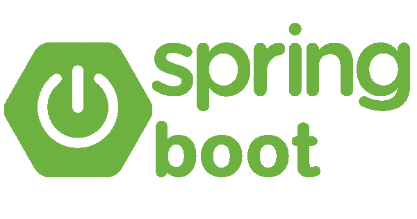

# Spring Boot:学徒食谱

> 原文：<https://itnext.io/spring-boot-apprentice-cookbook-61db5a3f6450?source=collection_archive---------2----------------------->

是建立在框架 [Spring](https://spring.io/projects/spring-framework) 之上的一个 web 框架。它是为更容易使用和更快实施而设计的。这是通过尽可能自动地配置应用程序及其环境来实现的。作为一个新人，我可以说它让框架真的很容易进入。

我的学识让我阅读了大部分的参考文档，这些文档写得很好，给了你很多关于 Spring Boot 内部行为的见解。该文档给出了很多细节，因此本文旨在采用相反的方法，并指出使用 Spring Boot 实现 API 所需的概念。我将用一组相关文档的链接来补充每个部分，如果你想进一步了解的话。

顺便提一下，本文将在一个使用 Gradle 作为构建系统的 Java 项目中使用 2.4.2 版的框架。但是，这些信息仍然适用于任何兼容的语言和编译系统。

本文将涵盖用 Spring Boot 创建 API 的以下几个方面:

*   启动项目
*   创建 REST 端点
*   处理错误
*   连接到持久层
*   对结果进行分页
*   测试应用程序
*   打包应用程序

# 启动项目

这部分可能是最简单的，因为在 https://start.spring.io/[Spring Boot 提供了一个包生成器。我们可以选择所有需要的模块，并检索带有构建系统、依赖项和主应用程序类的归档项目。](https://start.spring.io/)

在这个生成器之外，为了声明一个 RESTful API，我们的项目应该定义 Spring Boot *starter web* 依赖。starter*依赖项是由 Spring Boot 打包的一组现成可用的特性。*

引导 Spring Boot 项目的最小依赖性

应用程序的 main 方法应该包含在任何类中，我们应该在其上应用注释`@SpringBootApplication`。这个注释负责大量的自动配置，即组件注入和 web 服务器启动。

典型的 Spring Boot 应用

启动服务器就像使用嵌入式命令`./gradlew bootRun`一样简单。服务器将启动，但是我们目前没有任何端点可以服务。

> 文档链接:
> 
> [@SpringBootApplication](https://docs.spring.io/spring-boot/docs/2.4.2/reference/htmlsingle/#using-boot-using-springbootapplication-annotation)
> 
> [启动器依赖列表](https://docs.spring.io/spring-boot/docs/2.4.2/reference/htmlsingle/#using-boot-starter)

# 创建 REST 端点

要创建控制器，我们只需用`@RestController`注释任何类。然后，我们可以使用`@RequestMapping`将该控制器中的任何方法配置为端点。

`@RequestMapping`通过提供 URL、HTTP 动词、预期的数据类型等等来帮助我们配置端点。它既可以应用在类上，也可以应用在方法上，应用在类上的配置将被下面的方法继承，并且路径被连接起来。

为了控制我们的端点状态代码，我们将返回一个`ResponseEntity`，包含响应消息和`HttpStatus`。

具有单个端点的简单 REST 控制器

使用`HttpStatus`作为响应代码，并将消息转换为 JSON 对象，`ResponseEntity`将自动转换为 HTTP 响应。在将*映射*到 JSON 对象的基础上，Spring Boot 配置 [Jackson](https://github.com/FasterXML/jackson) 将任何类的所有`public`属性或 getters 映射到一个 JSON 对象。

来自我们端点的响应

> 文档链接:
> 
> [@RestController 和@RequestMapping](https://docs.spring.io/spring-boot/docs/2.4.2/reference/htmlsingle/#getting-started-first-application-annotations)
> 
> [@RequestMapping API 文档](https://docs.spring.io/spring-framework/docs/current/javadoc-api/org/springframework/web/bind/annotation/RequestMapping.html)
> 
> [自定义 Json 序列化](https://docs.spring.io/spring-boot/docs/2.4.2/reference/htmlsingle/#howto-customize-the-jackson-objectmapper)

# 高级端点配置

现在我们有了一个控制器，我们可能想要定义动态 HTTP 端点。为此，需要记住的主要注释是:

*   `@RequestBody`:通过 java 类定义 body 结构。
*   `@PathVariable`:定义端点 URL 的可变子部分。
*   `@RequestParam`:定义一个查询参数。

下面的控制器展示了带有两个端点的三个注释，每个注释根据查询返回一个自定义的“Hello World”。

端点配置展示

上面定义的端点可以如下使用:

来自上述端点的响应

> 文档链接:
> 
> [@RequestBody](https://docs.spring.io/spring-framework/docs/5.2.8.RELEASE/spring-framework-reference/web.html#mvc-ann-requestbody)
> 
> [@路径变量](https://docs.spring.io/spring-framework/docs/5.2.8.RELEASE/spring-framework-reference/web.html#mvc-ann-requestmapping-uri-templates)
> 
> [@RequestParam](https://docs.spring.io/spring-framework/docs/5.2.8.RELEASE/spring-framework-reference/web.html#mvc-ann-requestparam)

# 处理错误

默认情况下，对于任何成功的请求，Spring Boot 将返回 HTTP 代码 200，如果端点未注册，将返回 404，对于任何错误，将返回 500。我们已经看到，使用`ResponseEntity`使我们能够为成功的请求覆盖这种行为，但是我们仍然需要更精细地处理错误代码。

为此，我们将定义自定义 API 异常，这些异常将被自动转换为 HTTP 代码。这种转换是由一个扩展了`ResponseEntityExceptionHandler`并用`@ControllerAdvice`注释的类来完成的。在这个类中，我们可以使用注解`@ExceptionHandler`和`@ResponseStatus`来定义处理异常的方法。

简单的异常处理向 API 添加 400 和 404 错误代码

在项目中定义了`ControllerAdvice`之后，控制器抛出的任何异常都将被解析并转换为绑定的`ResponseStatus`。

引发异常的端点示例

异常端点的错误代码

我们的异常处理非常简单，不返回任何有效负载，但是可以在`ResponseEntityExceptionHandler`的方法中实现异常解析。

> 文档链接:
> 
> [ResponseEntityExceptionHandler](https://docs.spring.io/spring-boot/docs/2.4.2/reference/htmlsingle/#boot-features-error-handling)
> 
> [@ControllerAdvice](https://docs.spring.io/spring-framework/docs/5.2.8.RELEASE/spring-framework-reference/web.html#mvc-ann-controller-advice)
> 
> [@异常处理程序](https://docs.spring.io/spring-framework/docs/5.2.8.RELEASE/spring-framework-reference/web.html#mvc-ann-exceptionhandler)
> 
> [@ResponseStatus](https://docs.spring.io/spring-framework/docs/5.2.8.RELEASE/spring-framework-reference/web.html#mvc-ann-exceptionhandler-return-values)

# 连接到持久层

## 配置

要使用数据库，我们需要 *Java 持久性 API* (JPA)包和任何持久层的实现。前者将安装接口 API，而后者将提供实现和驱动程序。

为了查明在两个不同的数据库之间切换所需的最小变化，我们将同时展示与 [PostgreSQL](https://www.postgresql.org/) 和 [H2](https://www.h2database.com/html/main.html) 的集成。首先，让我们声明我们的依赖关系:

要添加到生成系统中的依赖项

第二步是配置`application.properties`中的访问。属性文件是我们第一次也是最后一次担心我们的持久性配置。在这个文件中，注释掉的 3 行是唯一要从 PostgreSQL 切换到 H2 的部分。

比较 H2 和 PostgreSQL 配置的属性文件

> 文档链接:
> 
> [数据库配置](https://docs.spring.io/spring-boot/docs/2.4.2/reference/htmlsingle/#boot-features-configure-datasource)
> 
> [可用属性](https://docs.spring.io/spring-boot/docs/2.4.2/reference/htmlsingle/#data-properties)

## 定义模型

定义模型就像使用在 [JSR-317](https://www.jcp.org/en/jsr/detail?id=317) 上定义的注释一样简单。这些注释可以通过包 *javax.persistence、*获得，该包可以通过 JPA 依赖项获得。

例如，下面的代码创建了一个*交付*实体。我们的实体标识符是字段 *id，*，由于注释`@GeneratedValue`，它将在数据库中每个新保存的实体上自动初始化和增加。

*注意:所有公开可用的属性都将被设置到 API 响应中实体的 JSON 表示中。*

交付 Bean 示例

为了确保我们的数据类的一致性，我们应用了来自 [JSR-303](https://jcp.org/en/jsr/detail?id=303) 的`@NotNull`验证，这些验证可以在端点上执行，我们将在下一节中看到。约束包含在包*javax . validation . constraints*中，可通过依赖关系`spring-boot-starter-validation`获得。

使用 bean 验证所需的依赖关系

> 文档链接:
> 
> [实体声明](https://docs.spring.io/spring-boot/docs/2.4.2/reference/htmlsingle/#boot-features-entity-classes)
> 
> [javax.persistence API 文档(@Entity，@Column，@Enumerate，…)](https://javaee.github.io/javaee-spec/javadocs/javax/persistence/package-summary.html)
> 
> [@生成的值](https://javaee.github.io/javaee-spec/javadocs/javax/persistence/GeneratedValue.html)
> 
> [javax . validation . constraints API 文档(@NotNull)](https://javaee.github.io/javaee-spec/javadocs/javax/validation/constraints/package-summary.html)

## 暴露模型

为了与我们的模型进行交互，我们必须定义一个[存储库](https://docs.spring.io/spring-data/commons/docs/2.4.2/api/org/springframework/data/repository/Repository.html)，例如一个`CrudRepository`。这样做就像用空类扩展类一样简单。Spring Boot 将自动实现与实体交互的功能。

我们对这个组件`@Repository`进行注释，使其可用于依赖注入。然后，我们可以在任何类中注入和使用存储库，例如直接在控制器中。使用`@Autowired`将自动检索上述*声明的`@Repository`。*

*注意:* `*@Repository*` *和* `*@Service*` *的行为与主注射注释* `*@Component*` *完全相同，只是能够标记出语义上的不同。*

微型控制器创建和读取交货。

我们使用注释`@Valid`来确保我们上面定义的约束在 sent *Delivery* 主体上得到满足。

与持久性 API 的交互

*注意:H2 是一个内存数据库，所以每次服务器重启时数据都会被清除。*

> 文档链接:
> 
> [CrudRepository API 文档](https://docs.spring.io/spring-data/commons/docs/2.4.2/api/org/springframework/data/repository/CrudRepository.html)
> 
> [弹簧组件声明](https://docs.spring.io/spring-boot/docs/2.4.2/reference/htmlsingle/#using-boot-spring-beans-and-dependency-injection)
> 
> [javax.validation API 文档(@Valid)](https://javaee.github.io/javaee-spec/javadocs/javax/validation/package-summary.html)

# 对结果进行分页

这一部分说明了 Spring Boot 如何很好地集成了 web API 的一些经典特性。为了对我们之前的实体*交付的访问进行分页，*我们只需将存储库的扩展类从`CrudRepository`更改为`PagingAndSortingRepository`。

分页存储库实现

这个存储库实现提供了一个新方法`findAll(Pageable)`返回一个`Page`。类`Pageable`配置返回的页面和页面大小。

展示分页的索引端点

然后，端点将根据请求提供整个`Page`对象的数据。

> 文档链接:
> 
> [分页和分类存储 API 文档](https://docs.spring.io/spring-data/commons/docs/2.4.2/api/org/springframework/data/repository/PagingAndSortingRepository.html)
> 
> [页面请求 API 文档](https://docs.spring.io/spring-data/commons/docs/2.4.2/api/org/springframework/data/domain/PageRequest.html)
> 
> [页面 API 文档](https://docs.spring.io/spring-data/commons/docs/2.4.2/api/org/springframework/data/domain/Page.html)

# 测试应用程序

Spring Boot 提供了各种工具，通过一组 API 和[模拟](https://en.wikipedia.org/wiki/Mock_object)来轻松测试控制器。大多数情况下，`MockMvc`将使我们能够发送请求和断言响应内容，而不必担心技术问题。

例如，我们正在测试上一节中的 *POST* 端点。其中一个测试成功地创建了一个*交付*实体，第二个测试模拟了一个来自数据库的错误。

为了避免依赖持久层的物理实例，我们使用`@MockBean`注入了我们的 DeliveryRepository 实例，它创建并注入了我们组件的模拟。

> 文档链接:
> 
> [@SpringBootTest](https://docs.spring.io/spring-boot/docs/2.4.2/reference/htmlsingle/#boot-features-testing-spring-boot-applications)
> 
> [@AutoConfiguredMockMvc](https://docs.spring.io/spring-boot/docs/2.4.2/reference/htmlsingle/#boot-features-testing-spring-boot-applications-testing-with-mock-environment)
> 
> [@MockBean](https://docs.spring.io/spring-boot/docs/2.4.2/reference/htmlsingle/#boot-features-testing-spring-boot-applications-mocking-beans)
> 
> [MockMvc api 文档](https://docs.spring.io/spring-framework/docs/current/javadoc-api/org/springframework/test/web/servlet/MockMvc.html)

# 打包应用程序

Spring boot 还简化了作为独立 jar 或 docker 映像的应用程序打包。

*   要创建一个准备运行的 *fat jar* ，执行`./gradlew bootJar`。
*   要构建一个 *docker 映像*，执行`./gradlew bootBuildImage`。

请注意，docker 不喜欢在图像名称中使用大写字符，但是我们可以轻松地自定义图像名称和版本。

自定义您的 docker 图像名称

> 文档链接:
> 
> [创建一个应用程序 fat jar](https://docs.spring.io/spring-boot/docs/2.4.2/reference/htmlsingle/#getting-started-first-application-executable-jar)
> 
> [配置 Docker 图像](https://docs.spring.io/spring-boot/docs/2.4.2/reference/htmlsingle/#boot-features-container-images)

# 结论

Spring Boot 可以和一些注释一起使用，并且会为你管理大部分的配置。但是，如果需要的话，可以覆盖大部分配置来提供您自己的行为。这使得它成为一个很好的框架来设计概念的证明，同时如果项目增长了特定的需求，还保留了优化的空间。

如果你想更多地了解这个框架，我不能过分强调参考文档[的质量，它给出了非常好的细节。](https://docs.spring.io/spring-boot/docs/current/reference/htmlsingle/)

如果你想玩一些代码，你可以在 GitHub 上的一个示例交付 API [中找到所有这些概念。](https://github.com/aveuiller/frameworks-bootstrap/tree/master/SpringBoot)