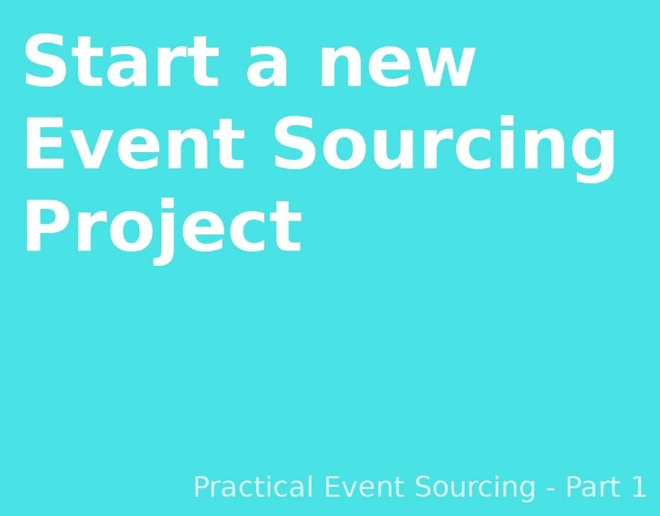

# 使用事件源架构启动新项目

> 原文：<https://itnext.io/start-a-new-project-with-an-event-sourcing-architecture-59f8b8d0cf7?source=collection_archive---------2----------------------->



我坚信，大多数(如果不是全部的话)现实生活中的流程驱动的应用程序可以从事件源中受益匪浅。如果一个系统需要知道过去发生了什么，那么事件源是一个很好的架构选择。

我希望那是 simple🧞！

我发现许多工程师、产品负责人和开发人员相信或假设，将事件源作为他们系统的架构模式来实现是一个昂贵的决策。可能是，也可能不是。

用一个事件源域构建一个新的系统并不太昂贵，在我看来，这并不是很多工作。例如，比直接从某个 GrapghQl API 更改持久化状态要简单得多。是的，你确实需要写更多的类来表示事件和命令等等。所有这些都可以使用一些 CLI 代码文件生成工具轻松生成。即使你不使用生成器，考虑到没有一个模型的后果，代表业务领域，你正在解决的问题或者你正在提供的商业机会，简直是粗心和不专业的。

我不是说你应该在你所有的项目中实现一个事件源架构，或者，如果你不这样做，你就不是专业的。然而，我想说的是，你应该总是有一个单独的领域模型。DBAL、雄辩或任何你用来抽象你的持久机制的东西都不应该成为你的真理来源。有很多原因可以解释为什么这种说法成立，太多了，无法在此一一列举。然而，我想说的是，在规划新项目的软件架构时，事件源应该是讨论的一个候选。既然你是一个专业人员，并且你理解大多数过程驱动的系统需要一个业务域，那么，你的选择是你的域是否应该遵循一个基本的 DDD(域驱动设计)架构，或者通过使用一个 CQRS 架构模式分离命令和查询责任来更进一步。您还可以选择将所有这些可靠的架构结合起来，并为当前保留尽可能多的信息，更重要的是，通过事件源为将来的使用保留尽可能多的信息。

> *数据收集和保留的好处应该在你的新项目的成本/收益分析中考虑。*

如果您，一个构建新产品的工程师，已经决定实现事件源模式作为您系统领域的主要架构，那么，本文将帮助您开始。更重要的是，本文是我撰写的系列文章中的第一篇，向您展示如何成功且经济高效地启动和完成基于事件的应用程序。

当我第一次或第二次咨询正在构建事件源系统的软件开发机构和软件工程实验室时，我会被问到一系列特定的问题，例如，他们应该使用哪个 PHP 事件源框架，或者他们是否仍然可以使用 Symfony 或 Laravel 应用程序框架。在某种程度上，这些问题是多余的，因为域不应该依赖于访问应用程序。然而，从其他角度看，情况并非如此。正如我将在本文中解释的那样，规划外部依赖非常重要，不规划实现和集成会非常昂贵。

# 事件采购示例项目

我能帮助您、工程师、产品负责人或我将在本系列文章中提到的两者的最佳方式是使用一个示例事件采购项目。建立事件采购项目需要几个组成部分，您计划和评估项目的最佳方式是了解建立和调整这些组成部分所需的工作量。

为了说明计划和构建一个基于事件的应用程序需要什么，我选择使用一个简单的待办事项应用程序…我开玩笑的😂，待办事项应用程序遍布网络，它们太简单，不适合这种模式。相反，我和你们一起，将建立一个基于网络的分类列表应用程序。一个缩小版的[牙龈树](https://www.gumtree.com)。

对于这个示例项目，我将关注主要的业务问题，即列表域。在这一系列文章中，我将向您展示我计划、设计和开发基于事件的列表应用程序的过程。我故意选择这个领域(或问题),因为我和你一样了解它，当然，除非你自己创建了 GumTree😂。

在这一系列文章中，我将解释拥有一个列表 Web API 所需的一切，它为成员提供了起草和发布列表的能力，为他们希望出售或购买的商品做广告。因此，我将写关于规划、如何解决该业务的问题(或提供机会)、设置开发环境、开发公共/共享模型、开发第一个集合、使用 CQRS 方法应用和调度事件、实现系统需求的具体实现、测试、跨域结果、读取模型和通过应用程序的访问。

我应该继续下去，对吗？但是从哪里开始呢？从业务和服务提供的角度来看，我会从事件风暴开始。但是，还应该计划实现基础设施和与外部服务的集成，以确保项目的可行性。

我们很幸运，因为我们的域和系统不使用外部服务。然而，我想强调的是，这是一个*罕见的*场景！根据您正在构建的产品，您可能会遇到集成问题。就在最近，我正在开发一个智能公寓系统，其内部硬件提供商没有公共 API。问题是，是的，大多数普通服务提供商都有 API，但在现实世界中，许多供应商通过不提供可访问的 API 来保护他们的 IP(知识产权)。

> *无论你是在开发一个事件源领域还是使用任何模式的应用程序，预先确定集成的可能性都是值得的。*

这个示例事件采购项目没有任何外部服务需求，并且基础设施需求很容易实现，因为它们很常见。

# 事件风暴

和 DDD(领域驱动设计)一样，头脑风暴源于事件的领域也应该从领域开始。开发一个新的企业系统最危险的部分是不理解业务领域，因此浪费了几天、几周甚至几个月的工作。从领域向上开始设计系统是有意义的。从领域开始你的设计也迫使项目的涉众开始使用一种无处不在的语言，在有限的上下文中为术语画线，并确保系统的可行性。

我们的列表领域将变得微不足道，因为我们了解这个领域，也因为我限制了许多特性和条件😜

事件是事件源领域的一等公民，在事件风暴练习中，我首先遵循参与者实现所需功能的过程。我不会在这一系列文章中讨论身份验证和成员资格，但是，我仍然会在代码中包含一个基本的成员域，因为列表域中的`OwnerIdentifier`本质上是一个`MemberIdentifier`。此外，因为我将说明一个域如何监听来自另一个域的事件，因此我需要不止一个域。

# 成员发布列表所遵循的流程

1.  据推测，注册会员将点击*创建列表*按钮，并导航到包含描述列表的表格的屏幕。一个列表将有一些必需的细节和一些可选的细节。
2.  然后，该成员还可以添加一些图像，以便列表的查看者可以更好地理解所列出的项目。
3.  然后，该成员可以发布列表供其他成员查看。
4.  会员可以随时取消列表。这通常是在出售或获得所列物品，或者成员决定不出售或不需要该物品时进行的。
5.  清单的有效期为 14 天。但是，只要列表发布的总天数不超过 14 天，成员就可以暂停列表，然后恢复列表。
6.  列表在 14 天后自动过期。过期的房源不在公共网站上列出。
7.  列表所有者可以更改列表的标题。
8.  列表所有者可以将列表放在不同的类别中。
9.  列表所有者可以从列表描述中分离图像。
10.  刊登物品拥有者可以对刊登物品重新定价。

所以，这个过程很简单。我留了很多可能的特征。显然，在现实生活中，这种类型的应用程序将允许有兴趣的成员与列表所有者进行评论、消息传递和其他方式的交流。

# 提取事件

记住这个过程(或者写在贴在板上的便利贴上)，然后我开始从这个过程中提取有价值的事件。我想到了以下事件:

```
ListingDescribed(...)
ListingImageAttached(...)
ListingPublished(...)
ListingPaused(...)
ListingResumed(...)
ListingCancelled(...)
ListingExpired(...)
ListingRenamed(...)
ListingReCategorised(...)
ListingRePriced(...)
ListingImageDetached(...)
```

这个过程本身告诉我们的不仅仅是成员将在列表上执行哪些事件。虽然我现在不会这样做，但是我已经详述的过程也告诉我们需要什么样的读取模型，以及在事件发生之前需要满足的一些业务规则。

在整个项目的开发过程中，我们会经常回到这个过程描述。

## 你喜欢读这篇文章吗？

[订阅](https://keith-mifsud.me/contact)在我发布新文章和代码库时收到电子邮件通知。

# 基础设施计划

正如我已经解释过的，尽管规划应用程序和基础设施实现与业务领域无关，事实上，领域与这一层是分离的，但是如果您(包括团队)第一次使用事件源，或者如果您的系统需要一些罕见的实现，尽早规划这些场景是非常明智的。

我们的示例项目没有使用任何古怪的第三方 API 或任何罕见的数据库引擎。因此，我不需要系统基础设施的任何详细计划。在本系列的下一篇文章中，如果我们要将系统部署到云或远程部署，我们将设置我们的开发环境，它将类似于生产环境。所以，[订阅](https://keith-mifsud.me/subscribe)，当我发表的时候我会发邮件给你。

当您计划如何分配您的事件采购计划时，您将考虑许多不同的分配策略。我建议你，正如我每次带领团队时所做的那样，不要仅仅因为某个策略受欢迎就选择它，而是要关注它对产品所有者和使用该产品的用户的价值。例如，即使我向公众发布了这个示例项目，我也不会选择微服务架构。这种类型的系统可能会变得繁忙，因此可能需要通过添加更多资源来进行垂直扩展，但它服务于特定的领域，不需要对功能进行重大扩展。

这种垂直增长很容易用现代技术来扩展。我们的项目将使用容器来满足个人的基础设施需求。因此，如果我们使用像 [Kubernetes](https://keith-mifsud.me/blog/...) 这样的容器编排器，我们可以很容易地复制和增加每个实例。

另一方面，假设产品所有者决定开始使用外部服务提供新特性。比如集成了 TrustPilot 的企业会员审核系统(仅供参考，我不喜欢这个服务，很容易被欺骗)。工程师可以在一个单独的微服务中构建和运行集成，我们的系统可以通过 REST API 或 Pub/Sub 远程消息传递 API 访问该微服务。

# 我应该在 PHP 中使用哪个事件源框架？

有几个著名的和一些不太流行的框架为事件源应用程序的各种元素提供帮助，包括测试帮助。但是，我发现我不喜欢使用任何现成的框架，原因有几个。其中一些原因是特定于特定框架的，但是，总的来说，我发现使用框架，我最终会在我的领域源代码中扩展供应商类。除了我的领域源代码中的运行时编程语言，我不想要任何依赖。框架的内部结构也使得使用适配器模式在域内调整框架变得非常困难，如果不是不可能的话。

# 百老汇大街

2014 年， [Qanditate](http://qandidate.com/) 开源[百老汇](https://github.com/broadway/broadway)，一个为 CQRS 和事件源应用提供几个基础设施和测试助手的包。当我面临设计&开发第一个用 PHP 编写的企业级应用程序时，我发现这个包非常有用。当时，我已经在生产中使用了事件源，但没有使用 PHP。你可能已经知道，我喜欢 PHP，现在我用 PHP 写的代码比用任何其他编程语言写的都多。然而，在过去，人们会因为在 Sprint 规划会议上简单地提到这三个字母(P.H.P .)而被嘲笑。如今，我已经使用百老汇开发了半打事件源系统。

我喜欢百老汇的主要原因是这个*框架*让你构建代码的方式非常类似于 Martin Fowler 描述的作为企业应用架构模式的事件源。因此，这很容易掌握，而且我对我正在构建的系统很有信心。

我不喜欢百老汇的地方和我不喜欢其他事件源框架或助手库的地方是一样的。具体来说，我不喜欢在不使用 Symfony 框架时必须做的大量布线工作。场景测试助手是伟大的，直到他们不是。如果不重写具体的类，比如说`InMemoryEventStore`，这些帮助器就无法扩展，因为它被声明为 final，或者给你的域源代码添加更多的外部依赖。

仅仅用一个例子来阐述这个事实，如果你想写一个子域之间的集成测试。即一个域监听另一个域的事件。你不能。然而，只要您准备好了，至少可以编写自己的基于缓存的事件存储，您就可以编写自己的场景测试用例。这种反模式不断累积，最终在您的域的名称空间下得到一个百老汇的副本。

# 证明

Prooph 是一组紧密丢失的 CQRS 和事件源组件。它们写得很好，但是记录很差，而且在我个人看来，不够直观。我已经在客户项目中实现了四次 Prooph，在个人或沙盒项目中又实现了几次。不幸的是，这从未成功。我喜欢 Prooph 的一些地方，但总的来说，我觉得它很难，无法证明额外工作的合理性。

我发现 Prooph 非常具体，并且专注于消息总线。我不希望我的领域依赖于基础设施。我明白，在任何情况下，他们都有得有失。但是我相信在我的领域中使用 Prooph 是利大于弊的。

希望，不用说，我的意见仅仅是，意见。我相信每个为开源做出贡献的人都是传奇🏆感谢百老汇和普罗夫，请继续与我们分享你们的作品。

我相信大多数工程师和开发人员都会同意我的观点，当你用一种语言开发事件源时，开发基础设施和测试抽象并不困难。然后由我们来设计如何实现这些抽象。无论是使用像普罗夫和百老汇这样的库，还是构建我们自己的库。我发现构建自己的库更容易，但是，这主要是因为我不希望在我的领域源代码中有外部依赖，而不是因为这些库中有任何一个是不好的。

我确信，如果没有百老汇的帮助，我不会成为用 PHP 构建复杂商业系统的如此成功的工程师。不幸的是，Prooph 来的晚了很多，我已经习惯了百老汇希望我用的代码结构方式，这可以追溯到与。网络语言。

在这一系列文章中，我将使用自定义事件源基础设施抽象，谁知道呢，也许我还会实现一些第三方库来实现这些抽象。

# 我还能用 Symfony 或者 Laravel 吗？

当然，你可以使用任何一个或更多或更少的其他应用程序框架，微框架，自定义 HTTP 库，你能想到的。

一个团队是否可以使用这个或那个的问题让我畏缩。这是因为领域源代码不应该有具体的依赖关系。相信我，这类问题很常见。

我经常使用 Laravel，它为我的 ***应用*** 提供了很多帮助和一个结构。是的， ***应用*** 也许还有一些基础设施配置但仅此而已。我的域名不依赖于 Laravel，Symfony 或 Zend Framework，甚至 DBAL 或一些 HTTP 路由器。我的申请确实如此，这是申请的唯一目的，不是吗？

应用程序框架帮助我为我的软件提供了一个入口。甚至可能使用依赖注入、将接口绑定到具体的类和一般的引导。Laravel 还帮助我用控制器和请求处理器、应用程序级验证、认证和其他 ACL 需求来构建我的 HTTP 层。这就是我用拉弗尔和赛姆福尼的全部原因。我不想从零开始开发路由器和会话机制，因为泰勒·奥特威尔和杨奇煜·普登西耶已经掌握了我的系统中这些几乎从未改变的方面。

我不可能牺牲几个月甚至几年的工作来建立一个代表业务领域的源代码。它解决的问题和所有项目涉众的血汗，只是因为我不希望我的团队给一个框架增加任何东西。你只需要花费一个项目来开发一个适合你的系统，只需要花费你所有的项目和业务来升级你的框架。将你的框架用于它的目的。

在这一系列文章中，您将看到我如何使用 Laravel，它在多大程度上是事后想起的，以及框架是如何被抛弃的。

# PHP 中事件源的开发工作流

我们将采取的建立该示例事件采购项目的流程可能不适合您和您的团队。我将首先构建模型，然后使用应用程序胶进行基础设施实现。

然而，根据您团队的规模和堆栈技能的划分，您最有可能让一个或多个工程师构建模型，让其他开发人员实现基础设施层的抽象，并在应用层将东西绑定在一起。对于如何构建工作流，没有一种方式是万能的。这个主题取决于团队和项目。如果您、您的团队或您的公司需要跨团队管理活动采购项目的指导，请[联系](https://keith-mifsud.me/contact)，我可以帮助您。

# 祝你愉快

在本文(事件源系列文章的第一篇)中，我解释了在系统中实现事件源域时应该采取的初始步骤。概括地说，领域规划从事件风暴开始，但是您或其他团队成员应该总是预测集成和实现需求。这种规划通常发生在决定在企业应用程序中使用哪种架构模式之前，应该作为可行性研究。该研究确保产品所有者在当前和可预见的未来获得最佳价值。考虑到纵向和横向增长、成本和价值。

这篇文章和这个系列是针对新的事件采购项目。对遗留系统进行现代化改造还有其他变量，这里没有涉及。我可以[帮助您实现传统系统的现代化](https://keith-mifsud.me/contact)

在下一篇文章中，我们将计划基础设施和实现需求。随后是另一篇文章，我将在其中开发通用(或共享)模型。我会尽力尽快发表下一篇文章，如果你想在我完成后收到我的邮件，你可以订阅。

*原载于 2019 年 7 月 16 日*[*https://Keith-MIF sud . me*](https://keith-mifsud.me/blog/start-a-new-project-with-an-event-sourcing-architecture)*。*