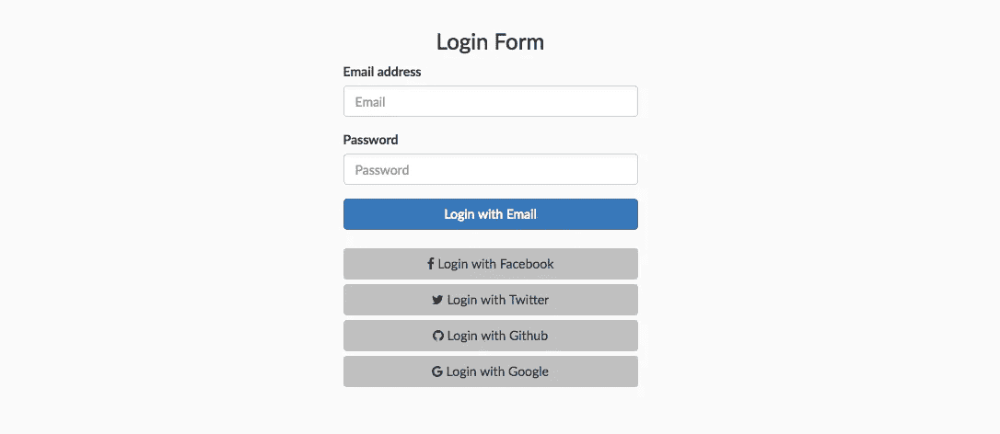
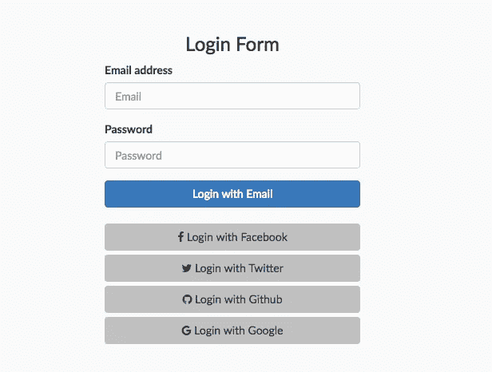
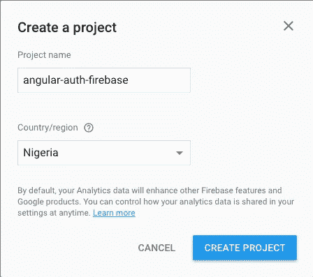
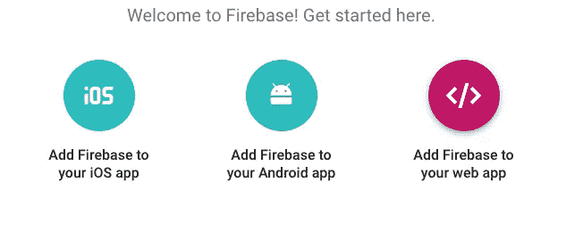
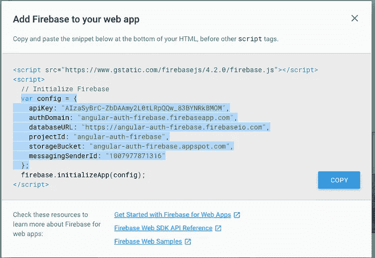
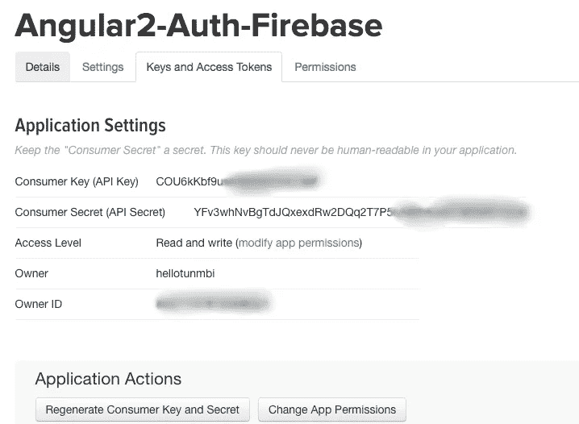
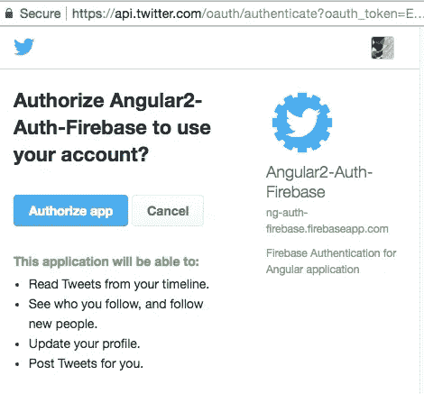
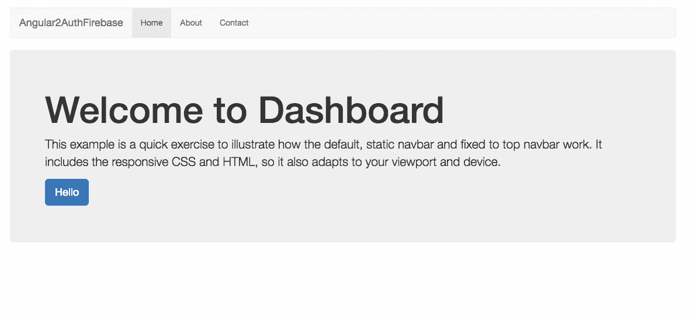
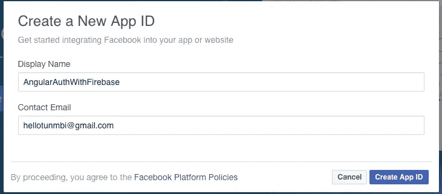
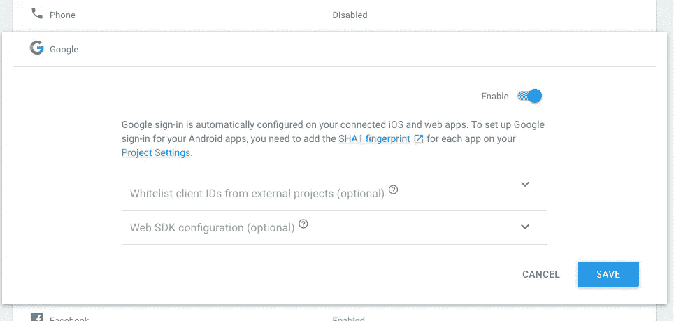

# 在 Angular 2 —第 1 部分中完成逐步 Firebase 身份验证

> 原文：<https://itnext.io/step-by-step-complete-firebase-authentication-in-angular-2-97ca73b8eb32?source=collection_archive---------0----------------------->



使用 Firebase 在 Angular 中完成身份验证

Firebase Authentication 提供后端服务、易于使用的 SDK 和现成的 UI 库，用于向您的应用程序验证用户。它支持使用密码、电话号码、流行的联合身份提供商(如 Google、脸书和 Twitter、Github 等)进行身份验证。

这是第 1 部分。它太长了，所以我不得不把它分成两部分。

在整个课程中，我将把**简称为***。请注意，Angular 1 也被称为***。话虽如此。****

**在本教程中，我将带您了解如何使用以下登录方法在 Angular 应用程序中轻松处理身份验证:**

*   **推特**
*   **脸谱网**
*   **常规电子邮件/密码**
*   **开源代码库**
*   **谷歌邮箱**

**一般来说(哦不好意思，编码)**

**按照以下步骤创建新的 Angular 应用程序。我们将使用角度 cli。或者，您可以跳过这一步，在我的 github 存储库中克隆应用程序的初始版本**

```
**$ ng new angular2-authentication-firebase
$ cd angular2-authentication-firebase
$ ng serve$ npm install --save font-awesome angular2-fontawesome**
```

**在上面的代码中，我们使用 angular-cli 创建了一个新的 Angular 应用程序。我们进入目录，使用 *ng serve* 命令为应用程序提供服务。此外，我们引入了 FontAwesome 库，这样我们就可以利用它的图标。**

**在此步骤之后，如果您的浏览器没有自动打开，请访问 *http://localhost:4200***

**通过将以下代码行添加到 src/styles.css 文件中，在应用程序中包含 bootstrap 和 fontawesome:**

```
**@import "~bootstrap/dist/css/bootstrap.min.css";
@import "~font-awesome/css/font-awesome.css";**
```

****克隆启动库并开始使用****

**我已经创建了一个 starter Angular 2 应用程序，[在这里克隆它](https://github.com/hellotunmbi/angular2-authentication-firebase/tree/starter)。它预装了以下内容。最终版本是[在这里找到](https://github.com/hellotunmbi/angular2-authentication-firebase/tree/final)**

*   **一个登录组件和一个仪表板组件，编写了它们的 html 和 css。**
*   **自举的 html 和 css。**
*   **font awesome——社交图标**

**运行命令:**

```
**npm install**
```

**看起来是这样的:**

********

**登录组件和仪表板组件页面**

## **让我们添加身份验证**

**创建一个 firebase 应用程序。访问[firebase.google.com](http://firebase.google.com)并点击签到。然后单击转到控制台。**

**点击添加一个项目，你会看到下面的图像，相应地填写如下:**

****

**创建一个关于 firebase.google.com 的项目**

**进入仪表板后，单击将 Firebase 添加到您的 web 应用程序，并复制配置设置，如下图中突出显示的那样:**

********

**在您的终端中运行以下命令，以获取 angularfire2 进行身份验证:**

```
**$ npm install angularfire2 firebase --save**
```

**转到 src/environments/environments . ts 并粘贴配置，就像下面的代码一样:**

```
***// src/environments/environments.ts*export const environment = {
   production: false,
   firebase: {
      apiKey: "<Your_API_KEY_HERE>",
      authDomain: "AUTH-DOMAIN-HERE",
      databaseURL: "DATABASE-URL-HERE",
      projectId: "PROJECT-ID-HERE",
      storageBucket: "STORAGE-BUCKET-HERE",
      messagingSenderId: "MESSAGING-SENDER-ID-HERE"
   };
};**
```

**转到 app.module.ts 并导入 AngularFireModule、AngularFireDatabaseModule 和 AngularFireAuth 模块。还要导入环境配置。**

**也将它们添加到 NgModule decorator 下的导入中，如下所示:**

```
***// src/app/app.modules.ts*import { BrowserModule } from '[@angular/platform-browser](http://twitter.com/angular/platform-browser)';
import { NgModule } from '[@angular/core](http://twitter.com/angular/core)';import { AppRoutes } from "./app.routes";import { AppComponent } from './app.component';
import { LoginComponent } from './views/login/login.component';
import { DashboardComponent } from './views/dashboard/dashboard.component';**import { environment } from '../environments/environment';
import { AngularFireModule } from 'angularfire2';
import { AngularFireDatabaseModule } from 'angularfire2/database';
import { AngularFireAuthModule } from 'angularfire2/auth';**[@NgModule](http://twitter.com/NgModule)({
  declarations: [
    AppComponent,
    LoginComponent,
    DashboardComponent
  ],
  imports: [
    BrowserModule,
    AppRoutes,
    **AngularFireModule.initializeApp(environment.firebase, 'angular-auth-firebase'),
    AngularFireDatabaseModule,
    AngularFireAuthModule**
  ],
  providers: [],
  bootstrap: [AppComponent]
})
export class AppModule { }**
```

**让我们创建一个认证服务来实现认证。我们创建服务，以便我们的所有组件可以随时随地访问和使用它。使用 angular cli，我们可以这样做:**

```
**$ ng generate service services/auth**
```

**这将在 *src/app/services* 文件夹中创建 auth.service.ts。将其导入到您的模块中。然后，我们将它添加到 app.module.ts 中的提供程序中。**

```
***// src/app/services/app.module.ts*import { BrowserModule } from '[@angular/platform-browser](http://twitter.com/angular/platform-browser)';
import { NgModule } from '[@angular/core](http://twitter.com/angular/core)';import { AppRoutes } from "./app.routes";import { AppComponent } from './app.component';
import { LoginComponent } from './views/login/login.component';
import { DashboardComponent } from './views/dashboard/dashboard.component';import { environment } from '../environments/environment';
import { AngularFireModule } from 'angularfire2';
import { AngularFireDatabaseModule } from 'angularfire2/database';
import { AngularFireAuthModule } from 'angularfire2/auth';**import { AuthService } from './services/auth.service';**[@NgModule](http://twitter.com/NgModule)({
  declarations: [
    AppComponent,
    LoginComponent,
    DashboardComponent
  ],
  imports: [
    BrowserModule,
    AppRoutes,
    AngularFireModule.initializeApp(environment.firebase, 'angular-auth-firebase'),
    AngularFireDatabaseModule,
    AngularFireAuthModule
  ],
  providers: [**AuthService**],
  bootstrap: [AppComponent]
})
export class AppModule { }**
```

**在 auth.service.ts 文件中，导入 AngularFireAuth、firebase 和 Observable。创建一个可观察的用户变量，在构造函数中注入 FirebaseAuth，并创建登录方法。您的 auth.service.ts 变成:**

```
**// src/app/services/auth.service.tsimport { Injectable } from '[@angular/core](http://twitter.com/angular/core)';
import { Router } from "@angular/router";import { AngularFireAuth } from 'angularfire2/auth';
import * as firebase from 'firebase/app';
import { Observable } from 'rxjs/Observable';[@Injectable](http://twitter.com/Injectable)()
export class AuthService {
  private user: Observable<firebase.User>;constructor(private _firebaseAuth: AngularFireAuth, private router: Router) { 
      this.user = _firebaseAuth.authState;
  }}**
```

## **使用 Twitter 登录**

**转到 Firebase 控制台。单击右侧的“身份验证”菜单项。点按“登录方式”,然后选取“Twitter”。启用它。**

**去 dev.twitter.com/apps 的[创建一个应用程序。填写信息，包括将托管您的应用程序的有效 URL。](https://dev.twitter.com/apps)**

**单击“密钥和访问令牌”选项卡。复制用户密钥(API 密钥)和用户机密(API 机密)，然后粘贴到 Firebase 控制台中。保存。**

****

**当你点击保存，它会为你生成一个链接。从 firebase 控制台复制链接。转到 Twitter 开发者仪表板上的**设置**选项卡，将链接粘贴到回拨 URL 字段。这非常重要(见下图)。**

********

**从 firebase 控制台复制链接到 twitter 回拨 URL**

**在您的 auth 服务中添加 signInWithTwitter()函数，如下所示:**

```
**// ...auth.service.ts...    
    signInWithTwitter() {
      return this._firebaseAuth.auth.signInWithPopup(
        new firebase.auth.TwitterAuthProvider()
      )
    }
...**
```

**在您的 app/views/login.ts 中，导入 AuthService，将其注入构造函数并实现 Twitter 登录**

```
**// src/app/views/login/login.component.tsimport { Injectable } from '[@angular/core](http://twitter.com/angular/core)';import { AngularFireAuth } from 'angularfire2/auth';
import * as firebase from 'firebase/app';
import { Observable } from 'rxjs/Observable';[@Injectable](http://twitter.com/Injectable)()
export class AuthService {
  private user: Observable<firebase.User>;constructor(private _firebaseAuth: AngularFireAuth) { 
      this.user = _firebaseAuth.authState;
  }signInWithTwitter() {
      return this._firebaseAuth.auth.signInWithPopup(
        new firebase.auth.TwitterAuthProvider()
      )
    }}**
```

**在您的登录 html 文件中添加 click 函数。打开 login.component.html 并添加点击功能。参见下面的片段:**

```
**<button type="button" class="btn btn-block" **(click)="signInWithTwitter()"**>
   <i class="fa fa-twitter" aria-hidden="true"></i>
      Login with Twitter
</button>**
```

**转到您的网络应用程序，然后单击“使用 Twitter 登录”按钮。它会要求您授权应用程序或使用您的 twitter 凭据登录，然后带您到仪表板页面。**

********

**授权 twitter 应用程序并登录仪表板**

## **2.与脸书一起登录**

**要使用脸书进行认证，请访问[developer.facebook.com](http://developer.facebook.com)并用您的 Facebook 凭证登录。创建/添加新应用。键入显示名称并创建应用 ID**

****

**单击侧面菜单中的设置。复制应用程序 ID，显示应用程序秘密，并复制它。去你的 firebase 控制台。在登录方法下，启用 facebook 并输入应用 id 和应用密码。**

**现在，让我们将 signInWithFacebook()函数添加到登录组件和登录 html 中。**

```
**// login.component.ts...
   signInWithFacebook() {
      this.authService.signInWithFacebook()
      .then((res) => { 
          this.router.navigate(['dashboard'])
        })
      .catch((err) => console.log(err));
    }
...**
```

**在我们的登录 html 文件中，让我们一次性添加所有的登录。我们的 html 变成了:**

```
**// login.component.html...
<div class="form-group">
    <button type="buton" class="btn btn-block" (click)="signInWithFacebook()">
      <i class="fa fa-facebook" aria-hidden="true"></i> 
      Login with Facebook
    </button><button type="button" class="btn btn-block" (click)="signInWithTwitter()">
      <i class="fa fa-twitter" aria-hidden="true"></i>
      Login with Twitter
    </button><button type="button" class="btn btn-block" (click)="signInWithGithub()">
      <i class="fa fa-github" aria-hidden="true"></i>
      Login with Github
    </button><button type="button" class="btn btn-block" (click)="signInWithGoogle()">
      <i class="fa fa-google" aria-hidden="true"></i>
      Login with Google
    </button>
</div>                  
...**
```

## **使用 Google 登录**

**对于 Google 帐户登录，在 firebase 控制台中启用 Google 身份验证，然后单击 Save**

****

**让我们将该函数添加到 auth.service.ts 文件中，如下所示:**

```
**// src/app/services/auth.service.ts...signInWithGoogle() {
    return this._firebaseAuth.auth.signInWithPopup(
      new firebase.auth.GoogleAuthProvider()
    )
  }...**
```

**添加以下函数很重要:isLoggedIn()和 Logout()。如果用户登录，isLoggedIn()将返回一个布尔类型。这将确保某些页面和显示仅对授权用户可用。**

**logout()函数在被调用时，将当前用户注销。一旦用户使用完应用程序，保护应用程序也很重要。**

**完整的 auth.service 文件如下所示:**

```
**import { Injectable } from '[@angular/core](http://twitter.com/angular/core)';
import { Router } from "[@angular/router](http://twitter.com/angular/router)";import { AngularFireAuth } from 'angularfire2/auth';
import * as firebase from 'firebase/app';
import { Observable } from 'rxjs/Observable';[@Injectable](http://twitter.com/Injectable)()
export class AuthService {
  private user: Observable<firebase.User>;
  private userDetails: firebase.User = null;constructor(private _firebaseAuth: AngularFireAuth, private router: Router) { 
      this.user = _firebaseAuth.authState;this.user.subscribe(
        (user) => {
          if (user) {
            this.userDetails = user;
            console.log(this.userDetails);
          }
          else {
            this.userDetails = null;
          }
        }
      );
  }signInWithTwitter() {
    return this._firebaseAuth.auth.signInWithPopup(
      new firebase.auth.TwitterAuthProvider()
    )
  }signInWithFacebook() {
    return this._firebaseAuth.auth.signInWithPopup(
      new firebase.auth.FacebookAuthProvider()
    )
  }signInWithGoogle() {
    return this._firebaseAuth.auth.signInWithPopup(
      new firebase.auth.GoogleAuthProvider()
    )
  }**isLoggedIn() {
  if (this.userDetails == null ) {
      return false;
    } else {
      return true;
    }
  }****logout() {
    this._firebaseAuth.auth.signOut()
    .then((res) => this.router.navigate(['/']));
  }
}**logout() {
    this._firebaseAuth.auth.signOut()
    .then((res) => this.router.navigate(['/']));
  }
}**
```

**感谢你花时间阅读这篇文章，希望对你有所帮助。我将出版第二部分，这将需要:**

*   **GitHub 认证**
*   **常规注册/登录**
*   **保护仪表板页面**

**谢谢！敬请分享，点赞，评论。另外，你可以在 Twitter 上关注我@ [hellotunmbi](https://twitter.com/hellotunmbi) ！**

****更新！！！****

**[第二部分可以在这里找到](https://medium.com/@hellotunmbi/part-2-complete-step-by-step-firebase-authentication-in-angular-2-25d284102632)**

**如果你觉得这篇文章很有帮助，并且想阅读更多，知道我什么时候发表相关文章，请订阅我的时事通讯。我保证不会给你发垃圾邮件。**

**[](https://www.buymeacoffee.com/hellotunmbi)**