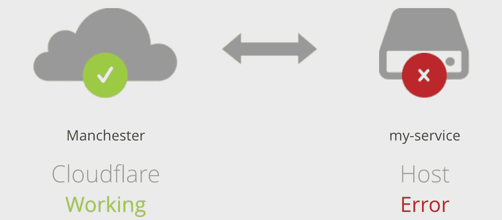

# 提高服务/应用弹性的步骤

> 原文：<https://itnext.io/steps-to-great-service-app-resilience-273c82305c9c?source=collection_archive---------9----------------------->

鸣谢:Cloudflare

我经常看到开发人员在没有考虑一些基本原则的情况下就匆忙地为应用程序“增加弹性”。我把这个列表放在一起，试图帮助指导人们正确地构建弹性应用程序，并添加适量的弹性。不要不先做基础工作就实施很酷的新断路器技术！

1.  后退
2.  超时设定
3.  监视
4.  发信号
5.  异步的
6.  断路器
7.  健康检查
8.  高度可用
9.  自动缩放

# 后退

你应该一直考虑如果出了问题该怎么办。有时让默认句柄处理错误是好的，但通常做一些事情会更好。如果系统不能从错误中恢复，你至少应该考虑以友好的方式警告客户。有些错误可能是由可选组件引起的，在这种情况下，您应该考虑返回默认值并继续处理。恢复将被弹性的其他部分使用。

# 超时设定

如果您通过网络调用，如 HTTP 请求或 DB 调用，最好添加一个超时。网络本质上是不稳定的，你在编程时应该预料到网络会崩溃。最糟糕的失败模式之一是请求花费了非常长的时间。通常在这种情况下，应用程序的所有线程都会被消耗，或者池会被阻塞。根据您的应用程序，当只有一小部分有问题时，所有请求都可能开始出错。通过给请求添加超时，可以很容易地解决这个问题。大多数库都支持超时，但遗憾的是，它们的缺省值通常是无限的。尽量将超时时间设置得尽可能短，这样即使出现问题，客户也不会受到太大影响。

# 监视

您的应用程序具有“弹性”固然很好，但是能够从问题中恢复也很重要。在一个完美的系统中，应用程序会自我恢复，但实际上通常需要做一些事情。为了帮助找出哪里出错了，需要修复，应用程序应该在日志中输出错误，并公开度量标准。现在可以构建仪表板来帮助可视化指标、发现异常并找出路线原因。

# 发信号

现在，您的应用程序正在公开指标，并且您有一些漂亮的仪表板，您是否打算雇人整天盯着它们。我希望您的答案是否定的。当您的指标以某种方式运行时，有工具可以发送通知。例如，当服务响应时间超过 1 秒时，您可以编写一个警报。添加提醒意味着开发人员可以花更多的时间开发，花更少的时间查看图表。它还允许在工作时间之外支持他们继续生活，并且只需要对问题做出响应。

# 异步的

您关心所有 API 调用的结果吗？客户可以在以后找到结果吗？通过从主流程中取出一些东西，它允许您使用诸如队列之类的系统。大多数队列都有重试失败消息的功能，这让您有更多的成功机会。队列还可以消除通常会导致问题的流量突发。如果你不关心事情的结果，那么异步地做将会阻止任何错误到达客户。

# 断路器

断路器是一种工具，如果下游服务出现问题，它可以阻止应用程序向下游服务发送请求。例如，您的服务使用的 GitHub API 超时了。您设置了 300 毫秒的超时，并且您的 API 为每个请求调用 GitHub 4 次，但是您的服务在没有 GitHub 的情况下仍然带来了价值。您的请求现在占用了 1.2s，客户不满意。断路器将监控请求失败的频率，如果超过阈值，将停止发送请求。使用断路器，您的客户只会错过有问题的功能。断路器将定期允许请求进入服务，如果成功，将再次允许请求。

# 健康检查

运行状况检查允许您快速检查服务是否正常运行。通常实现为一个简单的 HTTP 请求，返回显示健康状态的 JSON。健康检查应该验证服务所需的所有东西都是可访问的，比如数据库。由于健康检查依赖于下游服务的健康状况，因此您需要非常小心级联故障。最好只检查下游服务是否可访问，而不是检查它是否健康。如果你的应用程序不能访问某些东西，它还能运行吗？如果是这样，它可能不应该在其健康检查。例如，一个应用程序只能定期从数据库加载数据。如果数据库关闭，服务仍然可以提供数据，即使是可能过时的数据。

# 高度可用

服务器偶尔会出现故障。机架和数据中心偶尔会出现故障。这可能是由于硬件软件，甚至是人为事故。无论什么问题，你都希望你的服务是可用的。让应用程序的多个实例在不同的地方运行可以为您提供这种保护。您可以尽可能极端地使用多个实例，在多个数据中心运行，甚至在不同的国家运行。重要的一点是拥有一个负载平衡器，它将流量导向健康的应用程序实例。当一个实例变得不健康时，负载平衡器应该停止向它发送流量。

# 自动缩放

您的应用程序正在起飞，越来越多的客户正在使用它。您还会注意到，在晚上，您的客户没有使用您的应用程序，您的服务器处于闲置状态。自动扩展允许您在池中添加和删除服务器，从而在需要时为更多客户提供服务。当您不需要服务器时，缩小规模还可以限制服务器的成本。您可能无法预测客户何时会开始使用您的应用程序。电视上可能会有一个广告，它会吸引大量的用户。拥有自动伸缩功能允许您的应用程序对客户需求做出反应，并提供良好的客户体验。