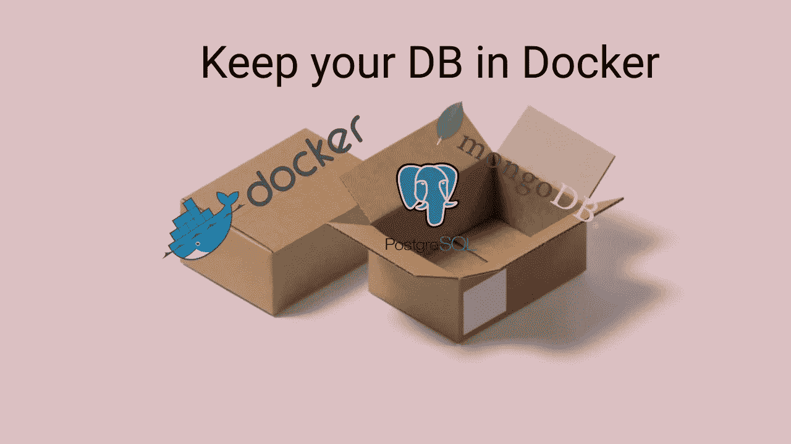

# 停止本地安装 DB 使用 Docker 进行 MongoDB 或 PostgreSQL 的本地开发

> 原文：<https://itnext.io/stop-installing-db-locally-use-docker-for-local-development-for-mongodb-or-postgresql-ff560893f38e?source=collection_archive---------2----------------------->



如果您正在阅读这篇文章，那么您可能在本地开发环境中的笔记本电脑上安装数据库时遇到了问题。

对我来说也一样，我在持续运行它们、清理它们或者让不同的项目使用同一个数据库时遇到了问题。有时配置东西来支持不同的版本是一场噩梦。

但幸运的是，我将告诉您如何避免所有这些，并保持您的开发环境干净和可预测。

这很简单，但你必须使用码头集装箱。也就是说，举例来说，要在本地使用 MongoDB，你必须运行 MongoDB docker 容器，猜猜这比在本地运行 MongoDB 要容易得多！

虽然有一些学习曲线，但是保持环境的整洁会给你带来巨大的好处，当它不能工作的时候，不用用巨大的依赖包和配置地狱来破坏它。有了 Docker container，您可以在完成项目后随时删除 MongoDB container，而不必担心任何系统遗留问题。

让我们在这里看一个基本的例子，以清楚地说明如何为您现有的项目使用 PostgreSQL docker 容器。一天前，我们已经在这个频道上完成了这个 TypeScript TypeORM 初学者工具包。如果你还没去看，请一定要看！

这个项目有一个带有连接设置的 PostgreSQL 依赖项，这意味着如果你在本地编码，那么你必须有一个数据库来运行这个项目。所以要运行 postgres 的 Docker 容器，我们首先要在 Dockerhub 上查找，那里有很好的文档[https://hub.docker.com/_/postgres](https://hub.docker.com/_/postgres)

深入研究之后，您将得到一个类似这样的命令来运行您的本地数据库。

```
docker run --name postgre-db -e POSTGRES_PASSWORD=password -e POSTGRES_DB=node_starter -d postgres
```

通过用`docker ps`检查 docker 运行的服务，您将看到我们没有映射到主机的 postgresql 端口`5432`，这意味着您的 Node.js 应用程序将无法访问它。

```
~ docker ps
CONTAINER ID   IMAGE      COMMAND                  CREATED          STATUS          PORTS      NAMES
fc9fd9feb427   postgres   "docker-entrypoint.s…"   30 seconds ago   Up 28 seconds   5432/tcp   postgre-db
```

这意味着当我们启动一个服务时，我们必须映射一个端口，并保持它可以从主机访问。否则，它将只是一个运行在您机器上的虚拟 docker 容器。但是要记得移走之前做好的集装箱，否则码头工人会抱怨集装箱的命名。

```
~ docker kill postgre-db && docker rm postgre-db
~ docker run --name postgre-db -p 5432:5432 -e POSTGRES_PASSWORD=password -e POSTGRES_DB=node_starter -d postgres
```

现在，如果您运行`docker ps`，您将看到一个很好的输出，其中包含我们的 postgres 端口被映射到主机的信息，并且我们现在能够从本地 Node.js 服务使用 postgres 连接。

```
~ docker ps
CONTAINER ID   IMAGE      COMMAND                  CREATED         STATUS         PORTS                    NAMES
fb74c76f8415   postgres   "docker-entrypoint.s…"   5 seconds ago   Up 4 seconds   0.0.0.0:5432->5432/tcp   postgre-db
```

我们只需配置 Node.js 服务，使用与容器启动时提供的相同的 PostgreSQL 密码和 db 名称。

对于 MongoDB 或 MySQL 或任何其他正式作为 Docker 容器存在的数据库来说，这是完全相同的，因此您可以查找它们并运行命令。另一个例子是 MongoDB 这样使用

```
docker run --name mongodb -p 27017:27017 mongo
```

这里要简单得多，因为 Mongo 不要求您预先创建数据库名称，您可以使用连接字符串来创建数据库名称，模式是自动的，因此您在这里需要的配置要少得多，但是与 PostgreSQL 一样，您不需要在本地安装它，它只是一个 Docker 容器，您可以随时删除它，或者为不同的应用程序保持不同的版本，或者只更改绑定端口，甚至不需要更改数据库配置。

是啊！它给你带来了很多方便，但是要注意，每当你移除容器时，它可能会清理你的数据，你必须定义单独的 Docker 容器卷来保持你的数据的持久性。例如，使用 MongoDB，只需将一个特定的路径挂载到一个本地目录，就可以保持数据的持久性。

```
docker run --name mongodb -p 27017:27017 -v /my/own/datadir:/data/db mongo
```

现在，您的容器将把来自 MongoDB 数据和模式文件的所有内容放在您的`/my/own/datadir`文件夹中，这意味着如果您移除了容器，您仍然会拥有您的数据，如果这是您对本地开发感兴趣的东西的话。

通常我只是不移除数据库容器，有时我只是停止它们，或者如果我重启我的机器，只要我在本地开发中需要它们，我就通过运行`docker start mongodb`来启动它们。

这可能就是这个简短但有力的提示，它帮助我保持我的系统比以前干净得多。实际上，我几乎在每个开发环境应用程序中都使用 Docker，但这是一个完全不同的故事…

— —

来源[https://tigran . tech/running-PostgreSQL-MongoDB-and-other-databases-locally-with-docker/](https://tigran.tech/running-postgresql-mongodb-and-other-databases-locally-with-docker/)