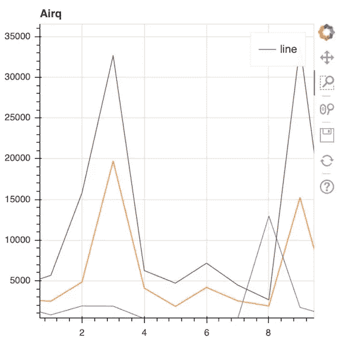

# 细流优于烧瓶。

> 原文：<https://itnext.io/streamlit-kills-flask-1773c33fdc88?source=collection_archive---------0----------------------->

当不需要安全性时，使用 Streamlit 作为您的 Web 应用程序基础。如果您需要 Web 应用程序的安全性，请使用 Flask、FastAPI 或 Django 包。


当细流有了保障，烧瓶就灭绝了。图片来源: [Unsplash](https://unsplash.com/photos/u6OnpbMuZAs) [马修·麦格里](https://unsplash.com/@matmacq)

我正在将基于 Flask 的应用程序重构为基于 Streamlit 的应用程序。Streamlit for Machine Learning 应用程序已被证明在维护费用方面更好，因为它们将我们的技术债务降低了大约 80%。

随着我们继续将基于 Flask 的应用程序重构为基于 Streamlit 的应用程序，技术债务可能会减少 95%。

[](https://towardsdatascience.com/avoiding-technical-debt-with-ml-pipelines-3e5b6e0c1c93) [## 避免 ML 管道的技术债务

### 开始考虑管道而不是脚本，以避免开发 ML 系统时的技术债务。

towardsdatascience.com](https://towardsdatascience.com/avoiding-technical-debt-with-ml-pipelines-3e5b6e0c1c93) 

诚然，通过更换工作瓶的应用，我们违反了 ***【不破，不修】*** 的教义。

我认为使用 Streamlit 来" ***替换没有损坏的东西*** *"* "既是预防性维护，又能提高开发人员和用户的工作效率。

# 早先的帖子被再次访问。

在之前的帖子中，我使用简单的 *hello World 将 Flask 与 Streamlit**进行了比较！***举例。我们发现 Flask 需要 7 行代码，而 Streamlit 需要两行代码。

[](https://medium.com/swlh/part-1-will-streamlit-kill-off-flask-5ecd75f879c8) [## Streamlit 会杀死 Flask 吗？

### 好吧，标题有点戏剧性。怎么样… Streamlit 将取代许多基于烧瓶的应用程序。

medium.com](https://medium.com/swlh/part-1-will-streamlit-kill-off-flask-5ecd75f879c8) 

我将 Flask 和 Streamlit 放在 Docker 容器中，其环境是 Python 3.7。我使用 Docker，以便我们可以比较 Flask 和 Streamlit。此外，使用 Docker 图像，Flask 和 Streamlit 示例可以很容易地在您的平台上重现。

我发现为**烧瓶**或**细流创建 **Docker** 容器的努力没有区别。**本地 web 服务器或云提供商上的生产应用程序。

注意:在本文中，我没有使用生产服务器，比如[Heroku](https://www.heroku.com/)。

# 我们在这个博客里做什么？

我创建了一个比 *Hello-world 更复杂的应用程序！。* Flask 和 Streamlit 比较有输入、熊猫数据框显示和绘图的 web 应用实现。

我们将使用 Docker 来比较 Flask 到 Streamlit **，**以及实例可以在您的平台上轻松重现。

# 烧瓶是什么？

构建网站时，你应该有一个健壮的框架，能够处理所有类型的功能和事件。Python 全栈软件工程师中最受欢迎的包之一是 Flask。

烧瓶的一些参考资料包括:

[](https://medium.com/fintechexplained/flask-host-your-python-machine-learning-model-on-web-b598151886d) [## Flask —在 Web 上托管您的 Python 机器学习模型

### 了解如何使用 Python Flask 将您的机器学习模型转化为业务

medium.com](https://medium.com/fintechexplained/flask-host-your-python-machine-learning-model-on-web-b598151886d) 

> 可以把 Flask 想象成一个软件包的集合，它可以帮助你轻松地创建一个 web 应用程序。这些组件可以被组装和进一步扩展。

[](https://blog.miguelgrinberg.com/post/the-flask-mega-tutorial-part-i-hello-world-legacy) [## 烧瓶大型教程，第一部分:你好，世界！

### 这是我将记录我用 Python 编写 web 应用程序的经历的系列文章的第一篇…

blog.miguelgrinberg.com](https://blog.miguelgrinberg.com/post/the-flask-mega-tutorial-part-i-hello-world-legacy) [](https://scotch.io/bar-talk/processing-incoming-request-data-in-flask) [## 处理 Flask 中的传入请求数据

### 在任何 web 应用程序中，您都必须处理来自用户的请求数据。Flask 和任何其他 web 框架一样，允许…

scotch.io](https://scotch.io/bar-talk/processing-incoming-request-data-in-flask) 

# 什么是 Streamlit？

Streamlit 是一个开源的 Python 框架，使我们能够开发和部署基于 web 的应用程序。

[](https://www.streamlit.io) [## streamlit——构建定制 ML 工具的最快方式。

### Streamlit 是一个面向机器学习和数据科学团队的开源应用框架。在…中创建漂亮的数据应用程序

www.streamlit.io](https://www.streamlit.io) [](https://towardsdatascience.com/how-to-write-web-apps-using-simple-python-for-data-scientists-a227a1a01582) [## 如何为数据科学家使用简单的 Python 编写 Web 应用？

### 无需了解任何 web 框架，即可轻松将您的数据科学项目转换为酷炫的应用程序

towardsdatascience.com](https://towardsdatascience.com/how-to-write-web-apps-using-simple-python-for-data-scientists-a227a1a01582) 

> Web 框架很难学。为了一些看似简单的事情，我仍然会对所有的 HTML、CSS 和 Javascript 感到困惑。

我们需要知道如何使用 Javascript、HTML、CSS、 [WTForms](https://wtforms.readthedocs.io/en/stable/) 和/或 [Bootstrap](https://pythonhosted.org/Flask-Bootstrap/) 和/或 Flask-RESTful 和/或其他 Flask 兼容包，才能成为一名合格的 Python 全栈 Flask 软件工程师

我发现 Flask 是一个健壮的框架。所有的扩展使它更加强大。更重要的是，它通过提供适合您的包扩展来适应您的编程风格。

一个好的全栈 Flask 程序员有多年的经验。然而，一个优秀的 Streamlit 黑客(像机器学习科学家一样)需要数周的经验来设计、开发和部署一个生产就绪的基于 web 的仪表板。

只有当我需要 Flask 的安全时，我才使用 Flask。否则，我使用 Streamlit。

如果我们是 Python Streamlit 机器学习或深度学习科学家，我们不需要了解 Javascript、HTML、CSS 等..，以及堆栈中不同的 POST/GET URL 包。相反，我们的 Web 客户端软件堆栈由 Streamlit 和 Docker 组成。就是这样！

[](https://medium.com/better-programming/2020-001-full-stack-pronounced-dead-355d7f78e733) [## 全栈宣告死亡

### 欢迎 2020 堆栈

medium.com](https://medium.com/better-programming/2020-001-full-stack-pronounced-dead-355d7f78e733) 

> 结果是专业化。前端开发人员处理 HTML、CSS 和 JavaScript。后端开发人员处理主机操作系统、HTTP 服务器和数据库。精通这两种语言的开发人员被称为全栈开发人员。
> 
> 专业化是一件好事。直到它不是。一方面，这意味着团队可以并行工作以缩短开发周期。另一方面，这意味着我们必须额外努力沟通初始需求和变更单规范，否则我们将冒着失去并行工作成果的风险。
> 
> 因此，拥有一个全栈开发团队，没有可区分的前端/后端组，似乎是一个好主意。

# 快速入门:从 Github 克隆。

在您选择的目录中完成以下操作:

```
[git clone https://github.com/bcottman/webApps.git](https://github.com/bcottman/webApps.git)
```

在另一个博客中，我们创建了包含所有代码的`/`树。使用与上次不同的父目录中的`git clone`来获取更新(或者使用相同的父目录并覆盖您对原始代码*所做的任何更改)。或者……我会让你决定如何管理你的文件系统。*

## 1.输入和数据帧显示的 Flask 实现。

对于我们的 Flask 微服务的第一个实现，我显示了一个熊猫数据帧。

来自浏览器 URL 的`dataset`参数被返回并分配给运行在服务器上的`dataviewer1.py`中的`dataset_name`。这是服务器代码中的基本变量设置(即`[http://localhost:5000/show?dataset=Airq](http://localhost:5000/show?dataset=Airq).)` [)。](http://localhost:5000/show?dataset=Airq).)

```
import pandas as pd
from pydataset import datafrom flask import Flaskapp = Flask(__name__)
app.debug = True@app.route('/show', methods=['GET'])
def dataViewer_1():
    dataset_name = request.args.get('dataset')
    if dataset_name == None:
        dataset_name = 'Aids2'  #default if no arg passedif type(data(dataset_name)) != pd.core.frame.DataFrame:
        return('Bad dataset name:{}'.format(dataset_name))return data(dataset_name).to_html(header="true", table_id="table")if __name__ == "__main__":
    app.run()################# requirements.txt file
Flask>=1.1.1
pandas 
pydataset
```

输出[=>]:


使用 df.to_html 部分显示 Airq 数据集

## 2.用 HTML 实现熊猫数据帧显示。

感谢[https://stack overflow . com/questions/22180993/pandas-data frame-display-on-a-网页/22233851](https://stackoverflow.com/questions/22180993/pandas-dataframe-display-on-a-webpage/22233851) ，把我从学习 HTML 和 Bootstrap 中解救出来。毕竟我是一个没有耐心的 ML 科学家。

Bootstrap 是 Flask 提供的大量扩展之一。

```
## dataViewer-2.py
import pandas as pd
from pydataset import data
from flask import Flask, request, render_template
from flask_bootstrap import Bootstrapapp = Flask(__name__)
app.debug = True
Bootstrap(app)@app.route('/show', methods=['GET'])
def dataViewer_2():
    dataset_name = request.args.get('dataset')
    if dataset_name == None:
        dataset_name = 'Aids2'if type(data(dataset_name)) != pd.core.frame.DataFrame:
        return('Bad dataset name:{}'.format(dataset_name))df = data(dataset_name)return render_template("df.html", name=dataset_name, data=df.to_html())if __name__ == "__main__":
    app.run()### df.html

<h1>{{name}}</h1>
{{data | safe}}
################# requirements.txt file
Flask>=1.1.1
pandas 
pydataset
flask_bootstrapoutput[=>]:
```


使用 HTML 和 bootstrap/base.html 部分显示 Airq 数据集

使用我们自己的 HTML 模板，我们可以定制网页布局。

我将留给读者用 CSS 或任何 Flask 扩展来进一步定制。

## 3.抵御 CSRF 攻击的 Flask 实现。

我使用 wtform 包来防止[跨站请求伪造](http://en.wikipedia.org/wiki/Cross-site_request_forgery) (CSRF)攻击。我们使用`WTForm app.config['SECRET_KEY'].`在你的控制台中的命令是:

```
$  python -c 'import os; print(os.urandom(16))'
```

我将生成的密钥放在我的`dataView-3.py`文件的顶部。

```
from flask import Flaskapp = Flask(__name__)
app.debug = True
app.config['SECRET_KEY'] = '\xbfx\x02\xf7\xeao\ro\rp&Q\xa1\xbdV\xd9'#<more code...>
if __name__ == '__main__':
   app.run(debug=True, host='0.0.0.0')
```

我没有放入`@app.route`。结果是:

输出[=>]:

```
Not Found
The requested URL was not found on the server. If you entered the URL manually please check your spelling and try again
```

## 3.将所有这些与 pandas 数据帧图的 Flask 实现放在一起。

```
# !/usr/bin/env python
# -*- coding: utf-8 -*-__author__ = "Bruce_H_Cottman"
__license__ = "MIT License" import pandas as pd
from pydataset import data
from flask import Flask, request, render_template, session
from flask_bootstrap import Bootstrap
from bokeh.plotting import Figure
from bokeh.models import ColumnDataSource
from bokeh.embed import components
from bokeh.resources import INLINE
from bokeh.util.string import encode_utf8
from bokeh.palettes import Spectral11app = Flask(__name__)
app.debug = True
app.config['SECRET_KEY'] = '\xbfx\x02\xf7\xeao\ro\rp&Q\xa1\xbdV\xd9'
Bootstrap(app)@app.route('/show', methods=['GET'])
def dataViewer():
    dataset_name = request.args.get('dataset')
    if dataset_name == None:
        dataset_name = 'Aids2' if type(data(dataset_name)) != pd.core.frame.DataFrame:
        return('Bad dataset name:{}'.format(dataset_name)) df = data(dataset_name)
    session['dataset_name'] = dataset_name return render_template("df.html", name=dataset_name, data=df.to_html())@app.route('/plot')
def dataViewer_4(): dataset_name = session['dataset_name'] if dataset_name == None:
        dataset_name = 'Aids2' if type(data(dataset_name)) != pd.core.frame.DataFrame:
        return('Bad dataset name:{}'.format(dataset_name)) if type(data(dataset_name)) != pd.core.frame.DataFrame:
        return('Bad dataset name:{}'.format(dataset_name)) # get dframe by name
    df = data(dataset_name)
    # Create a ColumnDataSource object bp_df = ColumnDataSource(df)
    # Create  plot as a bokeh.figure object
    plot = Figure(height=400,
                       width=400,
                       title=dataset_name,
                       ) x_ax = [str(i) for i in range(df.shape[0])]
    palette_ = Spectral11[0:len(df.columns)] for n, cname in enumerate(df.columns):
       plot.line(x=x_ax, y=list(df[cname].values)
                 , color=palette_[n]
                 , legend='line') # grab the static resources
    js_resources = INLINE.render_js()
    css_resources = INLINE.render_css() # render template
    script, div = components(plot)
    html = render_template(
        'index_.html',
        plot_script=script,
        plot_div=div,
        js_resources=js_resources,
        css_resources=css_resources,
    )
    return encode_utf8(html) if __name__ == "__main__":
    app.run(debug=True, host='0.0.0.0')### df.html

<h1>{{name}}</h1>
{{data | safe}}
################# index_.html
<!doctype html>
<html lang="en">
  <head>
    <meta charset="utf-8">
    <meta http-equiv="content-type" content="text/html; charset=utf-8">
    <title>Embed Demo</title>
    {{ js_resources|indent(4)|safe }}
    {{ css_resources|indent(4)|safe }}
    {{ plot_script|indent(4)|safe }}
  </head>
  <body>
    {{ plot_div|indent(4)|safe }}
  </body>
</html>################# requirements.txt file
Flask>=1.1.1
flask_bootstrap
pandas
bokeh
pydataset
```

输出[=>]:



**嵌入在**烧瓶**中的数据集 **Airq** 的散景**图

我使用了工具栏中的散景缩放来放大数据集中的线条。我用散景创建交互式图形，避免直接使用 Javascript，

# 简化`dataViewer.py`的实施

在这个`dataViewer.py,`的实现中，我使用了 Streamlit。我真的不需要把这个实现分成几个步骤，因为这个`dataViewer.py`是 Python、一些 Streamlit 函数和 pandas 包。

```
import streamlit as st
import pandas as pd
from pydataset import datadf_data = data().sort_values('dataset_id').reset_index(drop=True)
st.dataframe(df_data)  #choicesoption = st.selectbox(
    'select a dataset do you like best?', df_data['dataset_id'])dataset = data(option)if isinstance(dataset, (pd.core.frame.DataFrame,   pd.core.series.Series)):
    st.dataframe(dataset)
    st.line_chart(dataset)
```

输出[=>]:


显示和绘制 airq 的简化选择。

streamlit 实现需要 10 行 Python 代码语句，这些代码引用了包:Streamlit、pandas 和 pydataset。pydataset 包包含 750 多个数据集。

在您的实现中，`dataset_ids`(数据集名称)在显示顶部的描述框和下拉选择框中按字母升序排序。

请注意当您单击选择框时，它是如何展开的。

您选择的数据集显示在从上往下数的第三个框中。Streamlit 的一个特性是数据集的呈现是动态的，每一列的值按升序或降序排序。此外，如果显示框的宽度或高度不足以显示所有的列或行，则它可以在水平轴或垂直轴上滚动。

在最后一个框中，我们可以看到数据集的折线图。每行对应于数据集的一个数字列(要素)。

在这个 Streamlit 微服务的实际现场实现中(与此处显示的静态截图相反)，您可以水平或垂直拖动来更改水平或垂直比例。您也可以放大和缩小来更改大小。

在 Streamlit 的掩护下，在 Javascript、HTML、CSS、JSON 和 web 通信的网页的选定端口上来回输出。虽然我放弃了一些底层的控制，但我已经获得了一个将 Python 脚本转换成全功能 web 应用程序的强大机制。

在许多方面，我们在这里进行的比较类似于使用第四代高级语言(Streamlit)到机器汇编程序(Flask、Javascript、HTML、CSS、JSON、post/get 等)。).

我将把它作为一个编程练习，让您扩展这个实现，为不同图表的选择提供一个选择框。

# 流线型`dataView.py in Docker Container`

Dockerfile:

```
**FROM** python:3.7
#EXPOSE 8501
**WORKDIR /**dataViewer
**COPY** requirements.txt .**/**requirements.txt
**RUN** pip3 install **-**r requirements.txt
**COPY** . . .
**CMD** streamlit run dataViewer.py
```

要构建容器…

```
$ docker build -f Dockerfile -t dataviewer-streamlit:latest ..
```

其中`requirements.txt`是…

```
streamlit
pandas
pydataset
```

要运行容器…

```
$ docker run -p 8501:8501 dataviewer-streamlit &
```

`dataViewer.py and HelloWorld.py` 的 Streamlit 的 Docker 容器的区别在于容器的名称和`requirements.txt.`中的条目

## Docker 的问题

如果你得到任何这些信息，你需要启动或重启 Docker。我在 Mac 上，所以我重启 Docker 桌面。

```
Cannot connect to the Docker daemon at unix:///var/run/docker.sock. 
Is the docker daemon running?.**<or>**ERRO[0050] error waiting for container: EOF
```

通过在`:5000.`港运行不同的容器，你会在 **Docker** 中遇到这个非常模糊的问题

```
docker: Error response from daemon: pull access denied for 5000, repository does not exist or may require ‘docker login’: denied: requested access to the resource is denied.
```

修复如下所示，并在您的终端窗口中键入。(我确定还有更好的。)

```
docker stop $(docker ps -a -q)
docker rm $(docker ps -a -q)# remove port assignments
```

1.  找出占用您想要释放的端口号(例如`5000`)的进程 ID (PID)。(为您的操作系统确定合适的命令)

```
sudo lsof -i :5000
```

第二步。使用其`<PID>.`终止当前正在使用该端口的进程

`sudo kill -9 <PID0> ... <PIDn>`

# 摘要

在本文中，我比较了基于 Flask 和基于 Streamlit 的 web 应用程序。我使用了一个具有输入、交互式数据集显示和数据集数值列的折线图的示例。

Flask 需要大约 *100 行代码*，而 Streamlit 需要*十行代码*来指定我们的示例。

我已经用 Flask 编程一年了。我现在理解了一个全栈程序员用来开发一个基于 Flask 的应用程序的大量知识。我敬畏他们。

我们的全栈团队使用 Flask 需要大约三个星期，使用 Django 需要一个多星期，才能将新的 ML 应用程序投入生产。

如果你是一个 Streamlit 黑客(像我一样)，你不需要知道 Javascript、HTML、CSS、JSON、POST/GET URL 包、`wget`等等。

我能够在 4 天内设计、编码、测试、部署一个基于 Streamlit 的 ML 仪表板。

我没有考虑将 ML 应用程序投入生产所需的所有其他“粘合”代码。

平心而论，脸书，谷歌。等人还不能将 Streamlit 用于他们面向公众的网站。然而，作为一名大部分时间都在用 Python 库编码的机器学习科学家，Streamlit 提供了一个简单的 Python API。

我希望你已经找到了这篇比较 Streamlit 和 Flask 的博客，有一个例子，很实用。

我期待在未来的博客文章中比较其他情况下的 Streamlit。