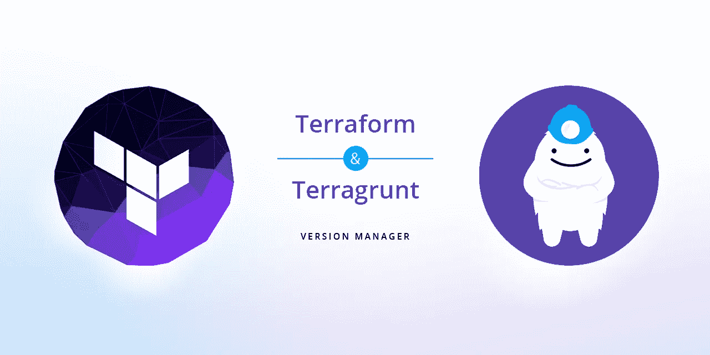

# 使用 terragrunt 构建 terraform 项目—第二部分

> 原文：<https://itnext.io/structuring-terraform-project-using-terragrunt-part-ii-ab0dc08b2bc6?source=collection_archive---------1----------------------->

图片来源: [terraenv](https://github.com/aaratn/terraenv)

*这是我关于使用 terragrunt 构建 terraform 项目的系列文章的第二部分。如果你能阅读这个系列的第一篇文章，你就能很好地理解我的思考过程。*

 [## 使用 terragrunt 构建 terraform 项目—第一部分

### 这篇文章旨在提供一个关于如何构建你的 terraform 项目的观点，并用 terragrunt 对它进行配置…

itnext.io](/structuring-terraform-project-using-terragrunt-part-i-4c6e936c4858) 

我们已经讨论过使用 terraform 和 terragrunt 构建中小型项目。我在上一篇文章中描述的设置对于跨多个部署环境的单个或少数几个服务是有效的，但是如果有更多的服务打包在其中，它可能会变得有点难以管理和扩展。我之前采用的方法是 mono repo 方法，我将所有的 terraform 和 terragrunt 代码打包在一个 repo 中。Mono repo 作为一个单一的事实来源工作得很好，对于理解整个基础设施的复杂性和依赖性非常有帮助，但是从维护和可扩展性的角度来看，它增加了大量的开销。

 [## 平台单一回购与多重回购:大辩论

### 在 HashiCorp 论坛、帖子、博客，甚至在会议或网络研讨会上，一个常见的问题是:我应该…

www.hashicorp.com](https://www.hashicorp.com/blog/terraform-mono-repo-vs-multi-repo-the-great-debate) 

在这种情况下，多重回购方法正好出现在中间。分解 mono repo 的想法同样适用于 IaC 项目，就像它适用于应用程序项目一样。它减少了对单个存储库的维护，并允许您单独配置每个项目。但就像应用程序一样，你不能从第一天就为 IaC 创建多个回购协议；你总是从单一回购开始，并在需要时采取多重回购途径。

## **单一回购**

## 优势

*   整个基础设施的单一事实来源
*   更容易理解所有服务

## 不足之处

*   许多基础设施代码并不是对每个人都有用
*   浏览太多代码可能有点困难！
*   很难在不破坏其他任何东西的情况下扩展和构建新功能
*   导致单个状态文件，这在您被 terraform 代码的不同部分/版本的更改阻塞的情况下可能是一个问题

## 多重回购

## 优势

*   一种很好的方法，可以从不关心的用户那里抽象出底层细节，例如不同的层
*   较低级别配置问题的可能性较小
*   更容易针对不同的需求对不同的模块和提供者进行版本控制；当模块或提供程序的更新对其他组件有影响时很有用
*   允许开发团队相互独立

## 不足之处

*   与理解项目结构相关的学习曲线

 [## 单一与多重-哪种回购结构适合你？AdinErmie.com

### 最近，在从事一个地理位置分散的大型多团队项目时，有人提出了这样一个问题:“我们是否应该…

adinermie.com](https://adinermie.com/mono-vs-multi-which-repo-structure-is-right-for-you/) 

当然，所有方法都有权衡，但根据我的经验，与我们开始时使用的单一回购相比，多回购方法更容易扩展和管理。对于 IaC 多回购方法，项目必须按照层来实现，每一层都构成多回购方法的单一回购。我们可以使用上一篇文章中的应用示例，来识别层并为它们提取单声道回购。这些层最终会以回购的形式出现:

一个近乎理想的 terraform 和 terragrunt repos 设置，用于设置和配置您的基础设施代码

将项目结构分解为多个层有几个好处:

*   确定基础设施中的基本组件，这些组件通常保持静态，不会改变
*   从基础模块到层次结构中更高模块的依赖性模块的容易导入和引用，而无需改变基础模块
*   易于识别新的需求/错误修复，并限制错误的传播范围

我们最初考虑了如何构建我们的 terraform 项目，以便在模块开始在 repo 中增长时保持可扩展性。最终，所有模块都打包在一个 terraform repo 中，基础架构模块有自己的文件夹，这些模块的配置放在子文件夹中。想法是让模块在其单一回购中增长，一旦管理规模增长，以基础层的形式分离组件并采用多层方法。

 [## 云计算服务|微软 Azure

### 有目的地发明，实现成本节约，并通过 Microsoft Azure 的开放和…

azure.microsoft.com](https://azure.microsoft.com/en-us/) 

在 terraform repo 中，部署`base_infrastructure`模块的层次结构将允许代码结构保持有序，易于维护和调试。我们详细讨论了一种可扩展且简洁的方法，以使我们的 terraform 代码反映云中存在的层次结构的实际状态，并使我们更容易以相同的顺序配置我们的 terragrunt 配置:

尽管我们在 Azure 上运行着各种各样的服务，但用于`base_infrastructure`的 terraform 代码从未增长到我们必须在多回购中分解它的程度。对于 application_infrastructure 代码，我们必须迎合新的回购，因为代码将为我们的用户生成新的环境，所以我们希望它与`base_infrastructure`完全不同。这个设置的一个基本例子是我们为`base_infrastructure`部署 Kubernetes。我们有一个 Kubernetes 的多节点部署，为我们的客户运行应用程序，并与多个其他服务进行交互( [Azure Blob](https://azure.microsoft.com/en-us/services/storage/blobs/) 、 [Azure KeyVault](https://azure.microsoft.com/en-us/services/key-vault/#product-overview) 、 [Azure DevOps](https://azure.microsoft.com/en-us/products/devops/) 、 [Azure CosmosDb](https://azure.microsoft.com/en-us/products/cosmos-db/) 等)。).为了使所有这些都具有可伸缩性和可维护性，我们必须以这样一种方式进行设置，即 Kubernetes 与其他 Azure 服务的一些基本连接和部署总是存在的，其余的是根据需求提供的。

这是我们的 Kubernetes 部署在 terraform 中的一个示例。请注意，实际上它比看起来要复杂得多，我们花时间描述了 IaC 中的所有组件。

`base_infrastructure`的 terragrunt 项目的相应文件夹结构将如下所示:

不要被基本模块级别的 README.md 文件所迷惑，我们在每个基本模块中都添加了这些文件来解释开发人员的内容和组织

对应用程序进行类似的设置，用户可以导入现有的基础设施并使用它来部署他们的应用程序，而不是设置基础设施组件。导入部分可以通过两步方法轻松管理:

*   在 terraform repo 中设置数据源模块，该模块将在您的应用程序 repo 中导入现有基础架构
*   在目标应用程序 terragrunt 中设置依赖关系，以便从数据源导入所需的数据和变量

一个应用程序在 terragrunt 配置中的简单展示

在 terragrunt 中设置多重回购包括三个步骤:

*   使用所有 terraform 代码设置 terraform repo
*   将不同的“分层”terragrunt 组件分解到它们的 repos 中
*   设置导入方案，通过该方案将依赖关系从其他仓库导入到现有仓库

 [## 用多种状态组织

### 我们讨论用 Terraform 以适合多个团队的方式管理基础设施。

cloudcasts.io](https://cloudcasts.io/course/terraform/organizing-with-multiple-states) 

第一部分是最容易设置的。保持代码和配置相互远离，可以更快地进行故障排除，并在保持 terraform 代码干燥的同时，保持问题区域相互区分。我们在 terragrunt 中配置了一个 git 引用方案，它可以灵活地引用特定分支或标记版本的 terraform 代码。事实证明，这在开发冲刺、修补程序和调试期间非常有用，您可以对 terraform 代码进行更改，并引用您的更改分支。对于安装在 Kubernetes 上的名为 ingress-nginx helm-chart 的样本 terraform 模块，这可以通过以下方式建立:

使用 terragrunt 维护多回购策略的真正魔力！

可能会有更复杂的需求，即[在全球多个地区设置](https://cloud.google.com/kubernetes-engine/docs/concepts/types-of-clusters)和[配置](https://helm.sh/)多个 Kubernetes 集群，或者在同一组织的多个团队中部署托管数据块。上面定义的项目设置的好处是，它可以很容易地映射到一个非常复杂的基础设施设置，如上所述，同时使开发团队可以很容易地确定贡献或调试的区域。

 [## Terraform 为多个项目组织模块/代码

### 很抱歉添加了一个直接的回答，我仍然不能添加评论。所以从我的工作经验来看，尤其是在…

devops.stackexchange.com](https://devops.stackexchange.com/questions/14470/terraform-organising-modules-code-for-multiple-projects)  [## Terraform 多状态文件最佳实践示例

### 不幸的是，环境的概念对不同的人和组织有不同的含义。对某些人来说…

stackoverflow.com](https://stackoverflow.com/questions/44288602/terraform-multiple-state-files-best-practice-examples) 

我意识到如果有一个像 Kubernetes 这样的`base_infrastructure`组件的运行示例，就能更好地理解这个主题，并重视在建立所提到的结构时所投入的洞察力和时间，这将是我未来文章的一部分。让我知道你如何为你的组织设置基础设施代码。听听其他人是如何做的以及如何做得更好将会很有趣。