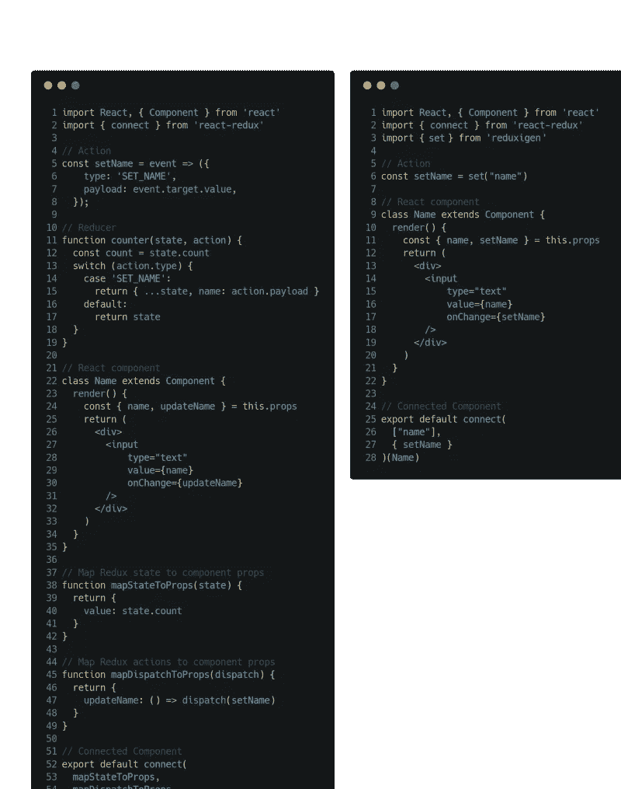

# 使用 Reduxigen 的超级简单状态管理:一步一步

> 原文：<https://itnext.io/super-simple-react-redux-apps-with-reduxigen-step-by-step-16ef9b884dd3?source=collection_archive---------5----------------------->

Reduxigen 是一个简单得可笑的状态管理系统。它将管理状态简化为两件事:

1.  状态
2.  功能

Reduxigen 是建立在 Redux 之上的，所以基础比较扎实。事实上，它可以与现有的 Redux 实现共存，和/或与其他 Redux 生态系统工具(如 Redux Saga)一起工作。就像 Redux 一样，Reduxigen 并不局限于在 React 应用中使用。

为了了解 Reduxigen 有多简单，让我们将其与 Redux 进行对比:



Reduxigen 几乎只有不到一半的代码(~25 行)。如果你把你需要处理的每一个状态都乘以这个数，那会有很多代码。

如果您想开始使用 Reduxigen，这篇文章将会有所帮助。在这篇文章中，我们将一步一步地使用 Reduxigen 构建一个联系人应用程序。我们将涵盖从基本更新到异步操作的所有常见用例。

本指南假设您具备 React、Redux 和 React 路由器的基本知识。

完整应用程序的代码可从这里获得:[联系人管理器](https://github.com/reduxigen/contact-manager)。

# Reduxigen 概述

## 状态

状态只是一个普通的 JS 对象。

## 行动

*动作*是更新状态的功能。Reduxigen 配有四个动作:

1.  *设置*:简单的同步状态更新。当您只想将输入映射到状态值时,`set`非常有用。
2.  *更新*:展示更新状态块的能力。类似于 reducer 接收更新并返回新状态的方式。
3.  类似于更新，但是它从异步请求中接收数据。
4.  *动作*:允许你创建一个可以应用于多种状态的动作。例如，可以应用于您所在州的多个计数器的递增函数。

# 设置

为了简化应用程序的创建，我们将使用`create-react-app` (CRA)来引导一切。确保你已经安装了 CRA。然后，在命令提示符下，键入:

```
$> create-react-app contact-manager
```

接下来，`cd`进入由 CRA 创建的目录，并安装附加的依赖项:

```
$> cd contact-manager
$> yarn add redux redux-thunk react-redux reduxigen react-router react-router-dom material-ui
```

我们将使用以下目录结构:

```
/src
  /components
     /component-one
       component-one.js
       component-one-actions.js
  /state
     state.js
  /store
     store.js
  app.js
  index.js
  site.css
```

# 预赛

示例应用程序使用 Material-UI 使联系人列表看起来更漂亮。Material-UI 使用`Roboto`谷歌字体。我们将为该应用添加快速简单的方式`Roboto`。通过在`<head>`中添加以下内容来修改`public/index.html`:

```
<link href="https://fonts.googleapis.com/css?family=Roboto:300,400,500" rel="stylesheet">
```

# 状态

我们将开始用状态编码应用程序。创建一个名为`/src/state/state.js`的文件。默认状态如下所示:

# 存储和根缩减器

状态将保存在 reducer 中——就像 Redux 一样。Reduxigen 使用单个减速器，即`root-reducer`。`root-reducer`包含在 Reduxigen 的`actions`库中。

为了将状态传递给 reducer，在`/src/store/store.js`中创建一个存储。我们将使用远程 API，所以我们需要`redux-thunk`中间件。因为 Reduxigen 是建立在 Redux 之上的，所以我们可以访问整个 Redux 生态系统。让我们也设置 ReduxDevTools。

我们的商店将是这样的:

## 商场布线和连接

现在，我们需要连接商店以做出反应，并设置路由。在`index.js`文件中，更新代码如下:

# 视图

我们的应用程序将有两个视图:

1.  联系人列表
2.  联系人详细信息

首先创建`components`文件夹:`/src/components`。所有的文件:视图、动作等等，都将包含在一个组件的文件夹中。

## 联系人列表

我们将通过创建所需的动作来开始开发联系人列表。创建一个名为`src/components/contacts`的文件夹。在该文件夹中，创建动作文件:`contacts-actions.js`。对于我们的 API，我们将使用免费的 JSON 占位符测试服务。

`contacts-actions.js`文件应该是这样的:

*   `asynchUpdate`方法的第二个参数是`asyncOp`。将函数作为此参数传递。函数必须返回一个承诺(函数- >操作- >承诺)。在作为`asyncOp`参数传入的函数中定义的参数将是您在调用此操作时可以传递的参数。例如:

*   当您在异步操作中使用`fetch`时，您可以选择传递一个额外的参数——方法`fetch`。`fetch`方法是`fetch`应该调用以返回其数据的方法(例如，json、blob、& c .)。Reduxigen 会自动检测你是否在用`fetch`。默认情况下，当您使用`fetch`时，Reduxigen 使用`json`方法。例如，如果你的 API 返回一个`blob`，你只需要传入`fetchMethod`参数。
*   下面是使用`axios`时`getContacts`的样子:

*   所有`async` `actions`自动将`*_loading`和`*_error`字段添加到它们正在更新的字段的状态中。在上面的文件中，`contacts`是异步更新的。因此，Reduxigen 向应用程序状态添加了`contacts_loading`和`contacts_error`字段。当`contact`正在更新时(即，它处于加载状态)，将`contacts_loading`设置为`true`。一旦异步操作完成，它被设置为`false`。如果在异步操作期间出现错误，`contacts_error`将被设置为`true`。默认设置为`false`。
*   `asyncUpdate`方法有三个参数:1)名称，2)异步操作，3)数据操纵器。

1.  姓名。要调度的 Redux 操作的名称。
2.  Asnch 操作。返回承诺的函数。
3.  数据操纵者。这个功能有点像减速器。一旦数据从异步操作返回，它就和状态一起被传递给数据操纵器。这个函数应该返回一个更新应用程序状态的对象。这里有一个例子:

下一步是创建视图。创建一个名为`contacts.js`的文件。

我们在第 27 行调用`setCurrentContact`动作。`set`动作可以用一个值显式调用，如上所述，也可以传递给一个 DOM 事件。如果向它们传递了一个 DOM 事件，它们会自动使用`event`的`target.value`属性来获取它们的值(有关这种用法，请参见 Contact Details 组件)。

如上所述，Reduxigen 为所有异步更新的字段提供了加载和错误属性。`contacts_loading`支柱用于在获取触点时显示装载指示器。

`ContactsList`现已完成。

## 联系方式

**动作
创建一个名为`src/components/contact-details`的文件夹。在该文件夹中，创建动作文件:`contact-details-actions.js`。**

`contact-details-actions.js`文件应该是这样的:

需要注意一些事情:

*   您可以使用任何有效的`lodash/set`路径用`set`更新嵌套对象属性。
*   先前的`state`可用于`update`和`action`功能:

**查看**
创建一个名为`contact-details.js`的文件。

需要注意一些事情:

*   为了更新`currentContact`(第 58 行)，我们使用内联函数将`contact`属性传递给`updateContact`方法。

联系方式完整。

## 包扎

完成应用程序还有三个任务:

*   消息组件
*   标题组件
*   网站 CSS

**消息组件** :
消息是一个无状态的功能组件，当联系人更新时，显示保存成功消息。创建`components/message/message.js`:

消息组件有一些 CSS。创建`src/components/message/message.css`:

**页眉组件** :
页眉是页面顶部的一个简单链接，使导航更容易。创建`components/header/headers.js`。

**站点 CSS** :
最后，更新`src/index.css`文件如下:

我们完了！

如果您想运行应用程序，请使用:`yarn start`，并在浏览器中导航至`http://localhost:3000`。

# 摘要

Reduxigen 让状态管理变得真正简单。使用它可以极大地减少您必须编写和管理的代码量。您所拥有的只是状态和更新状态的函数。需要管理的代码更少。你可以发展得更快。而且，您可以专注于编写重要的代码。