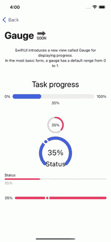

# SwiftUI 仪表—显示进度的新方式

> 原文：<https://itnext.io/swiftui-gauge-new-way-of-progress-showing-25fb58fb11e3?source=collection_archive---------4----------------------->

## 使用新的本地 SwiftUI 组件轻松显示进度


照片由 [Aron 视觉效果](https://unsplash.com/@aronvisuals?utm_source=medium&utm_medium=referral)在 [Unsplash](https://unsplash.com?utm_source=medium&utm_medium=referral) 上拍摄

> 本文是 iOS 16 和 Mac OS 13 中 SwiftUI4 新功能系列文章的一部分。如果你愿意看以前的文章，这里有第一篇文章的链接:[**swift ui navigation stack——如何去深度链接和有什么新内容**](https://medium.com/better-programming/swiftui-navigation-stack-how-to-deeplink-and-whats-new-64b1401cb9af) 。其余的你可以直接在我的个人资料页面找到🚀。现在让我们继续阅读。

再次向你问好！今年，随着 iOS16 的发布，SwiftUI 迎来了重大变化，其中有一个很小但非常有趣和强大的新方式来为用户显示操作进度。

我在说什么？关于量表！这些视图旨在向用户显示正在发生的任务或动作的进度，例如:

*   等待文件被下载
*   等待鸡蛋煮熟
*   显示手机游戏中任务的进度
*   展示你周日骑自行车的速度

对于我们这些开发者来说，所有这些实例都非常适合使用**标尺**。好了，让我们停止闲聊，进入这个组件的实现。

因此，仪表有 5 种风格(**仪表**风格):

*   线性容量
*   附件循环容量
*   附属通告
*   附属线性容量
*   附属线性

您可以看到以下所有样式:



下面你会发现这个屏幕的代码，它是我作为学习场所和知识库制作的[库](https://github.com/LSWarss/iOS-16-MacOS-13-SwiftUI-Showdown)的一部分。它有一个进度发布器`Double`和一个`Timer`，后者在主线程上每 1 秒更新进度发布器+0.25。

```
struct GaugeScreen: View {
    var feature: Feature
    @State private var progress: Double = 0
    let timer = Timer.publish(every: 1, on: .main, in: .common).autoconnect()

    var body: some View {
        VStack {
            Text(feature.description)
                .font(.footnote)
                .padding()
                .multilineTextAlignment(.center)

            Gauge(value: progress) {
                Text("Task progress")
                    .font(.title)
            }  currentValueLabel: {
                Text(progress.formatted(.percent))
                    .font(.footnote)
            } minimumValueLabel: {
                Text(0.formatted(.percent))
                    .font(.footnote)
            } maximumValueLabel: {
                Text(100.formatted(.percent))
                    .font(.footnote)
            }
            .gaugeStyle(.linearCapacity)
            .padding()

            Gauge(value: progress) {
                Text("Status")
                    .font(.footnote)
            } currentValueLabel: {
                Text(progress.formatted(.percent))
                    .font(.footnote)
            }
            .padding()
            .gaugeStyle(.accessoryCircularCapacity)
            .tint(.orange)

            Gauge(value: progress) {
                Text("Status")
                    .font(.footnote)
            } currentValueLabel: {
                Text(progress.formatted(.percent))
                    .font(.footnote)
            }
            .scaleEffect(2.0)
            // To make the circular ones bigger you need to use scaleEffect and for the linear frame will be sufficient
            .padding()
            .gaugeStyle(.accessoryCircular)
            .tint(.indigo)

            Gauge(value: progress) {
                Text("Status")
                    .font(.footnote)
            } currentValueLabel: {
                Text(progress.formatted(.percent))
                    .font(.footnote)
            }
            .padding()
            .gaugeStyle(.accessoryLinearCapacity)
            .tint(.pink)

            Gauge(value: progress) {
                Text("Status")
                    .font(.footnote)
            } currentValueLabel: {
                Text(progress.formatted(.percent))
                    .font(.footnote)
            }
            .padding()
            .gaugeStyle(.accessoryLinear)
            .tint(.pink)

            Spacer()

        }
        .onReceive(timer) { _ in
            if progress < 1.0 {
                withAnimation {
                    progress += 0.025
                }
            }
        }
        .navigationTitle(feature.title)
    }
}
```

其中的每一个在设计中都有自己的角色，例如，第一个非常适合文件下载，第二个非常适合作为阅读应用程序(如 [Instapaper](https://www.instapaper.com) )角落中的一个小指示器，用于显示阅读文章的当前进度。

第三个在 iOS16 即将推出的[锁屏小工具](https://developer.apple.com/documentation/widgetkit/creating-lock-screen-widgets-and-watch-complications)中被大量使用。最后两个比第一个更有味道。第四将是非常好的一个极简的飞机上的应用程序，也许？还是星舰？第五个是我最喜欢的，我会在位置和乘坐火车或汽车的过程中使用。

因此，仪表，在我们如何使用它们以及如何在它们上面显示数据方面非常灵活，可能会在许多有用的应用程序中成为一个主要的帮助。我们可能会看到它们在苹果用户界面和 UX 语言中被更多地采用，我真的很期待。

如果您对我在下面的文章中嵌入的部分的更深入的实现感兴趣，您会发现一个包含所有新 SwiftUI 特性的存储库，我到目前为止一直在研究这些特性，将来也会这样做。因此，如果您对某些功能感兴趣，您可以启动它或添加一个问题。感谢阅读。

*我感谢我可爱的女朋友帮助编辑这篇文章。*

[](https://github.com/LSWarss/iOS-16-MacOS-13-SwiftUI-Showdown) [## GitHub-lsw arss/iOS-16-MAC OS-13-swift ui-摊牌:新的 SwiftUI 4 为 iOS16+提供了示例应用程序

### 你正面临着 iOS16 和 MacOS13 的全新功能。下面你会看到…

github.com](https://github.com/LSWarss/iOS-16-MacOS-13-SwiftUI-Showdown)