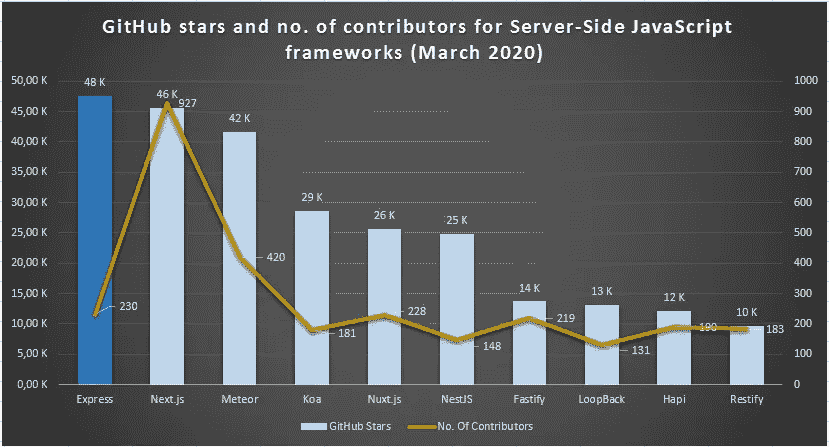

# 基于节点克隆的任务调度

> 原文：<https://itnext.io/task-scheduling-with-node-cron-fe4acde2eb9c?source=collection_archive---------4----------------------->

作为开发人员，我们发现自己处于需要在给定的频率或时间执行动作的情况下。如果我们想要定期触发数据库备份，或者如果我们想要在每周日的游戏中触发大型事件。有一个工具对此并不陌生:cron(来自希腊语单词“时间”,χρόνος (Chronos )),由 AT & T 贝尔实验室于 1975 年 5 月发布，用于类似 Unix 的计算机操作系统。

## Cron 是什么？


Cron 是什么？宝贝不要安排我…不要安排我..不再有…

Cron 是一个基于时间的作业调度器，这意味着它可以调度作业在固定的时间、日期或间隔自动定期运行。由于 Cron 最适合调度重复性的任务，我们可以想到前面的例子(备份数据库或者触发游戏中的群体事件)。

对于第一种情况，假设我们有一个类似 Google Drive 或 Dropbox 的服务。用户将他们的文件上传到我们的云服务器，这些文件在用户需要的时候都是可用的。为了避免丢失数据，我实现了一个备份系统，每小时触发一个功能，将云服务器数据备份到备份服务器。我会使用一个 cron 作业，配置为每个系统小时调用一次备份函数。

对于第二种情况，我们有一个在线游戏，成千上万的玩家同时玩。要在每周的某个时间实现一次事件，我们可以使用 cronjob 来说明“在 UTC 时间每周六下午 6 点调用 initiateCastleSiege”。

## 它是如何工作的？

cron 作业的操作由 crontab (cron 表)配置定义，如下所示:

```
# ┌───────────── minute (0 - 59)
# │ ┌───────────── hour (0 - 23)
# │ │ ┌───────────── day of the month (1 - 31)
# │ │ │ ┌───────────── month (1 - 12)
# │ │ │ │ ┌───────────── day of the week (0 - 6) (Sunday to Saturday;
# │ │ │ │ │                                   7 is also Sunday on some systems)
# │ │ │ │ │
# │ │ │ │ │
# * * * * * <command to execute>
```

每一行的语法都需要一个由五个字段组成的 cron 表达式，这五个字段代表执行函数的时间，后面跟一个要执行的函数。

## 使用 Express.js 的现代解决方案

根据对人力资源专业人士和开发人员的 [2020 CodinGame 年度调查](https://www.codingame.com/work/codingame-developer-survey-2020/)，十大热门编程语言将 JavaScript 排在第一位。71%的调查对象投票支持 JavaScript，它是目前最受欢迎的编程语言。它被广泛用于 web 和后端开发。
作为最流行的 JavaScript 语言，Express 是最流行和最广泛采用的 JavaScript 框架(Github stars 也是如此):



stars 的 Github 服务器端 JavaScript 框架

## node-cron [ [Github](https://github.com/node-cron/node-cron)

node-cron 模块是一个基于 GNU crontab 的 Node.js 纯 JavaScript 的小型任务调度器。

我们将构建一个简单的 Express 服务器，每 10 秒显示一条消息，然后我们将讨论 node-cron 具有的特性。

## 例子

要下载 Node.js，请遵循官方网站([https://nodejs.org/en/download/](https://nodejs.org/en/download/))中的说明。它适用于 Windows、macOS 和 Linux。我用的是谷歌 Pixelbook，配有 ChromeOS 和 Linux 操作系统，效果很好。
第一步，我们将创建一个存放文件的文件夹，里面有一个 index.js。我们将使用以下命令安装 express 和 node-cron 的 NPM 库:

> npm 安装—保存快速节点-cron

我们在 index.js 文件中添加:

> const express = require(' express ')；
> const cron = require(" node-cron ")；
> const app = express()；
> 
> cron.schedule("*/10 * * * * * "，function(){
> console . log(" Hello World！");
> })
> app.listen(3000，function() { console.log('服务器在线')；});

在我们运行执行“node index.js”的程序后，我们将看到“Hello World！”每 10 秒发一条消息。

## 其他节点 cron 功能

您可以使用由逗号分隔多个值:

```
cron.schedule('1,2,4,5 * * * *', () => {
  console.log('running every minute 1, 2, 4 and 5');
});
```

定义值的范围:

```
cron.schedule('1-5 * * * *', () => {
  console.log('running every minute to 1 from 5');
});
```

以步长值为例:

```
cron.schedule('*/2 * * * *', () => {
  console.log('running a task every two minutes');
});
```

甚至使用名字:

```
cron.schedule('* * * January,September Sunday', () => {
  console.log('running on Sundays of January and September');
});
```

使用时区:

```
cron.schedule('0 1 * * *', () => {
   console.log('Running a job at 01:00 at America/Sao_Paulo timezone');
 }, {
   scheduled: true,
   timezone: "America/Sao_Paulo"
 });
```

此外，可以使用以下生命周期来声明和触发任务，使其不是在程序启动时开始，而是在某个操作时开始:

```
var cron = require('node-cron');var task = cron.schedule('* * * * *', () =>  {
  console.log('stopped task');
}, {
  scheduled: false
});//Start: Start the scheduled task
task.start();//Stop: The task won't be executed unless re-started
task.stop();//Destroy: The task will be stopped and completely destroyed
task.destroy();
```

最后，为了验证 cron 表达式:

```
var cron = require('node-cron');

var valid = cron.validate('59 * * * *');
var invalid = cron.validate('60 * * * *');
```