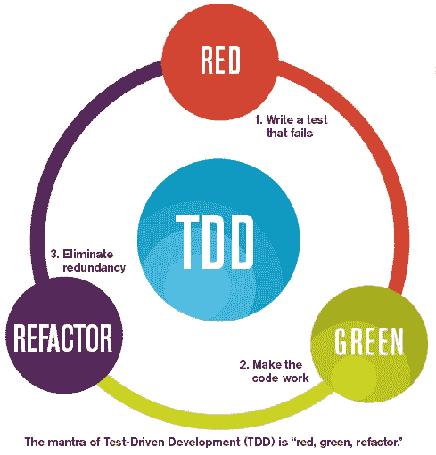

# 颤振中的 TDD 第 1 部分:试验驱动开发简介

> 原文：<https://itnext.io/tdd-in-flutter-part-1-introduction-to-test-driven-development-c130b9e82f36?source=collection_archive---------1----------------------->

在这个系列中，我将解释如何将测试驱动开发(简称 TDD)的原则应用到一个 Flutter(或 Dart)项目中。

第一部分将致力于 TDD 的基础知识，并试图理解何时使用它。

# 什么是 TDD？

你知道他们说什么，一张图片胜过千言万语，所以这里是测试驱动开发周期的一个代表:

但具体是什么意思呢？如果我们在开始编写任何东西之前考虑一个新创建的项目，你应该能够编写一个失败的测试，然后编写通过测试所需的代码，然后如果需要，你可以重构代码，通过编写另一个测试再次重复这个循环。

当然，测试应用程序中的所有东西并不总是相关的，尤其是在用 Flutter 开发的时候，你很少需要测试你的整个 UI 并确保你的每个 AppBar 都正确显示。但是，如果您的应用程序正在使用来自外部服务的数据，那么对一些 API 调用进行单元测试，或者如果您的应用程序非常依赖数据库，那么进行与数据库相关的测试，这可能会很有意思。最终，TDD 将极大地提高代码的稳定性和质量，尤其是如果你维护或贡献一些开源代码的话。通过这样做，你将完成两件事:

1.  你将会避免你的代码或者别人写的代码中的回归。如果您决定对代码进行一些重构，添加一个行为，或者对您所依赖的一些服务进行更改，您将能够立即看到项目的哪个部分不能像以前一样工作。
2.  你的代码将更容易遵守[固体架构](https://en.wikipedia.org/wiki/SOLID)中描述的**接口分离原则**和**依赖倒置原则**。因为要使你的代码可测试，你需要分离你的接口和代码的抽象部分。(感谢“鲍勃叔叔”)

# 你将在 Flutter 中看到的第一个测试

您可能已经知道了，但是当您创建一个新的 Flutter 项目时，您的项目的`test/`文件夹中会为基本计数器应用程序生成一个测试文件。

代码本身足够清楚，基本上它将模拟你的小部件渲染和动作，它的目的是模拟一些用户输入，它将期望包含一些特定的文本小部件。

这被称为小部件测试，目标是验证小部件是否具有预期的行为。虽然测试你的 UI 也很重要，但这并不总是最容易编写的测试。在以后的文章中，我们将看到如何通过使用小部件快照与 [golden_toolkit](https://pub.dev/packages/golden_toolkit) 包进行比较来测试您的 UI。

在 Flutter 中，你会发现三类自动化测试:

1.  **单元测试**:测试单个函数、方法或类。
2.  **小部件测试**:测试单个小部件。
3.  **集成测试**:测试一个完整的 app 或 app 的大部分。

现在你可能想尝试一下单元测试，在我看来，它们可能是最容易开始编写的。如果您不知道从哪里开始，不要担心，我们将在本系列的第二部分看到如何编写单元测试。

如果你等不及下一篇文章，你已经可以从官方的颤振文档中查看[单元测试介绍](https://flutter.dev/docs/cookbook/testing/unit/introduction)。

# 结论

感谢你阅读这篇文章，我尽量保持简单的解释。在下一部分中，我将解释如何编写单元测试，虽然我还没有一个完整的路线图，但我计划在将来解释如何模拟依赖关系，并通过快照比较来测试小部件。如果你想在下一个版本中看到一些特定的主题，你可以留下评论。

当然，如果你喜欢这篇文章，想表达你对这个系列的支持，你可以鼓掌(最多 10 次)和/或发表评论。另外，如果你对下一部分感兴趣，请不要犹豫，跟着我，我们会通知你的。