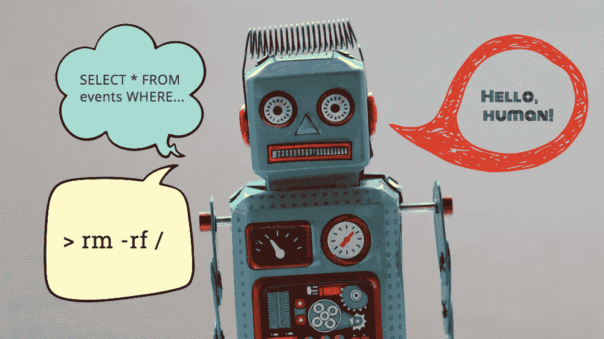
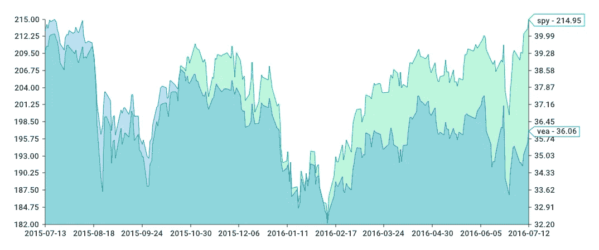
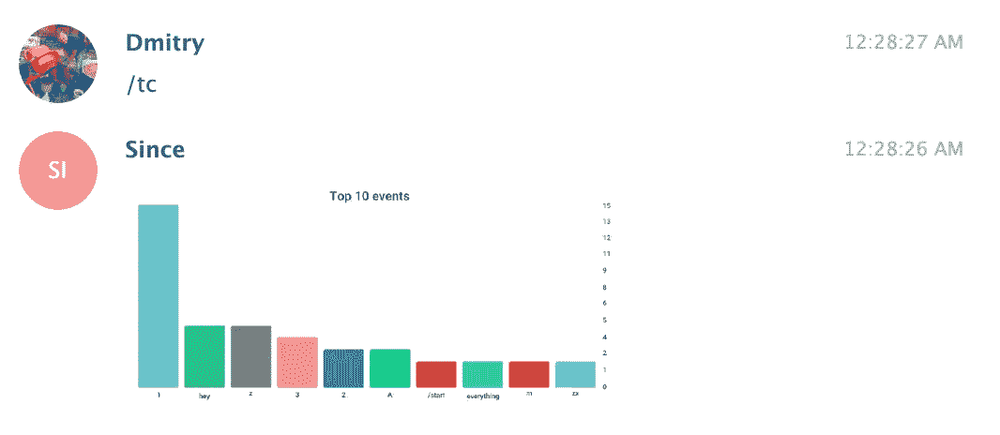

# 围棋电报机器人:图表

> 原文：<https://itnext.io/telegram-bot-in-go-charts-2226265b04cc?source=collection_archive---------2----------------------->



自从我写了关于我正在建造的机器人的文章以来，已经有很长时间了。生活发生了。很多。现在，当事情安定下来，我可能又有时间和精力来编写更多的机器人程序，并在这个过程中写一些东西。

上次机器人学了一些[文本命令](https://medium.com/@detunized/telegram-bot-in-go-speak-robot-16c54d655455)。现在是时候画一些漂亮的画了。今天我想添加几个图表命令。

使用 Telegram API 可以发送图像(以及视频或任何其他文档)，它不仅限于文本消息。我所需要的是一种生成图像并把它发送出去的方法。快速搜索后，我偶然发现了[围棋图](https://github.com/wcharczuk/go-chart)。将图表渲染成内存中的 PNG 和 SVG 文件，这正是我所需要的。这里有一个例子:



不过，我对可视化股票价格不太感兴趣。我有自己的数据要处理。第一步是画一些简单的东西。上次我添加了显示 10 个最常记录的事件的`/top`命令。如果能以条形图的形式看到，那就更好了。有请`/topChart`号指挥。



这样的图表看起来有点太小太丑了，但是一旦你点击它们，它们就会放大。这个图表的代码非常简单:

```
func (c context) topChart(args string) {
    num := parseTopArgs(args)

    // Get values from the DB and convert
    values := make([]chart.Value, 0, num)
    for _, e := range c.getTopEvents(num) {
        values = append(
            values,
            chart.Value{Label: e.name, Value: float64(e.count)},
        )
    }

    // Chart settings
    response := chart.BarChart{
        Title:      fmt.Sprintf("Top %d events", num),
        TitleStyle: chart.StyleShow(),
        Background: chart.Style{
            Padding: chart.Box{
                Top: 40,
            },
        },
        Width:    num * 100,
        Height:   512,
        BarWidth: 80,
        XAxis:    chart.StyleShow(),
        YAxis: chart.YAxis{
            Style:          chart.StyleShow(),
            ValueFormatter: chart.IntValueFormatter,
            Range: &chart.ContinuousRange{
                Min: 0,
                Max: values[0].Value,
            },
        },
        Bars: values,
    }

    // Render and send
    c.sendChart(response)
}
```

为了获得这些值，我使用了以下查询:

```
SELECT name, COUNT(name) freq FROM events
    WHERE user = ?
    GROUP BY name
    ORDER BY freq DESC
    LIMIT 10
```

并且用`go-chart`渲染购物车是微不足道的

```
buffer := &bytes.Buffer{}
err := chartSettings.Render(chart.PNG, buffer)
```

现在,`buffer`保存了 PNG 文件的字节。它可以保存到磁盘或通过 Telegram API 发送，如下所示:

```
image := tgbotapi.FileBytes{Name: "chart.png", Bytes: buffer.Bytes()}
_, err := c.bot.Send(tgbotapi.NewPhotoUpload(c.message.Chat.ID, image))
```

很简单。

另一个想法是使用条形图显示特定事件的每日活动，如下所示:


近看是这样的:


我认为非常酷的是为选定的事件绘制类似于 GitHub 活动的图表。在 GitHub 上看起来是这样的:


容易吗？不完全是。我花了很多时间试图复制它。我一开始试着给自己省点麻烦，用堆叠条形图，但是没用。于是我只好从头开始，卷起袖子自己干。大约五百行之后，我得到了这个:


足够满足我的需求了。这篇文章包含了相当多的代码。也许我会另发一篇帖子，描述使用`go-chart`绘制图表的过程。这是可行的。问题是测试。特别是如果你想支持各种不同的选项，比如可配置的轴标签、图例、标题、字体大小等等。挺繁琐的。我声明:**在我的机器上工作！**发货！

## 下一步是什么

这个机器人似乎拥有所有的基本特征。当然，它们不是很坚固，也不是很完美，但是它们还可以工作。是时候开始用了。我需要想办法把它部署到某个地方并让它运行起来。DevOps 的东西。我想知道我是否需要一个 Kubernetes 集群。

如果你好奇，可以在 GitHub 上找到代码[。这个版本被标记为`day-6`。](https://github.com/detunized/since-bot/tree/day-6)

*原载于 2019 年 6 月 6 日【detunized.net】[](https://detunized.net/posts/2019-06-06-telegram-bot-in-go-charts/)**。在*[*Twitter*](https://twitter.com/detunized_net)*或*[*LinkedIn*](https://www.linkedin.com/in/dmitryyakimenko)*上关注我。***