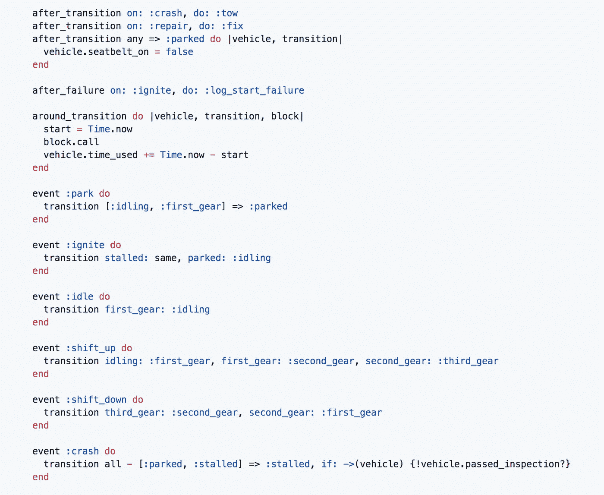

# 终结者:国家机器之死 II——拯救

> 原文：<https://itnext.io/terminator-death-to-the-state-machines-ii-salvation-d46bd273e7f2?source=collection_archive---------5----------------------->

*注:如果你还没有阅读本故事的第一部分*[*/帖子*](/terminator-death-to-the-state-machines-i-rise-of-the-machines-33a643f48a6d) *，请阅读！它为你提供了一些我为什么写这篇文章的背景知识，以及我稍后将讨论的解决方案的一些背景知识。*

[*点击这里在 LinkedIn*](https://www.linkedin.com/cws/share?url=https%3A%2F%2Fitnext.io%2Fterminator-death-to-the-state-machines-ii-salvation-d46bd273e7f2) 上分享这篇文章

# 概述

(国家)机器已经接管。这个世界(或者至少是你的代码库)正在燃烧。每个人都已经失去了接触任何机器相关代码的希望。技术债务高得令人无法忍受，每个新功能都在不断增加。在这个时候，你会重新考虑你的选择。

在我们的团队中，我们确实有这种遗留代码，这是一种真正的痛苦。它是我们网站的支柱——一个在数据库中有数百万条记录的模型，它有 1200 行代码。其中 250 行来自状态机。等等，让我强调一下:**状态机**。是的，其中有两个状态机。不要介意它已经是一个代码气味，但是你如何从那恢复？

# 某事的开始

让我们往回走一点。在我们之前的一个项目中，有人讨厌国家机器。特别是我们代码库中的遗留状态机。鉴于我的状态机背景(如前所述，我有多个项目使用不同的状态机 gem，我知道如何很好地处理它们)，我是一个使用它们的倡导者，并想知道为什么他想要删除它们或不在新项目中使用它们。

他当时是指定的负责人，他想使用自己的实现[使用](https://medium.com/selleo/essential-rubyonrails-patterns-part-1-service-objects-1af9f9573ca1) [服务对象](https://hackernoon.com/service-objects-in-ruby-on-rails-and-you-79ca8a1c946e)和 [POROs](http://codesthq.com/blog/2015/hi-im-poro.html) 。我对此表示了疑虑，但最终我还是尊重他，只要他知道自己在说什么，那就不是问题——最糟糕的情况是我说‘我早就告诉过你了！’然后使用宝石，这本来是很容易的。

一开始很奇怪。那种不用状态机的感觉。在对拉请求做了一些回顾之后，我注意到它更容易阅读了。魔法变少了，一切都变得清晰了！他发现了一些东西，但是在某些地方有一些奇怪的怪癖。但这是你对革命者的期望。他是我们的约翰·康纳。

# 革命！

让我们快进到现在。几个项目之后，我们已经改进了对状态机的处理。我们现在有了服务对象，它们的存在只是为了修改状态，并在一个地方完成任何必要的回调/副作用。

让我们回过头来解剖一下我们捕获的一辆[t800](https://en.wikipedia.org/wiki/Terminator_(character)):

https://github.com/state-machines/state_machines#example 的一个片段

从这里我们可以看到，这台机器有十亿个状态。好吧，我夸张了，它只有四个。但是它有七个触发事件，有一系列的`after_transitions`回调，甚至还有一个`after_failure`。让我们暂时关注一下坠机事件。

在这个例子中，汽车只有在没有停车或熄火的情况下才会发生碰撞。当它真的崩溃时，它会把它原来的状态变成`stalled`，而且只有在车辆没有通过检查的情况下(等等，什么？).老实说，我不确定最后那句话。为什么要有检查的支票？我的意思是一辆车可能会撞车，不管它是否被检查过。不过，不管怎样。这是一个例子，也证明了这个 DSL 难以阅读(和理解)。

哦，我们忘记了一些事情。你也错过了吗？差不多？反正在截图上面可以看到`after_transition on: :crash`。这基本上意味着，在崩溃事件被调用后，它将调用方法`tow`。很简单——如果你了解业务逻辑的话。

在我们的约翰·康纳的带领下，我们已经将这种模式变得更加简单和明确。首先，在现有的模式下，你不会关心转换等等。每次状态改变时，它都会在转换和检查后做所有这些事情，而且会神奇地发生(顺便说一句，只有当您使用适当的状态改变方法时)。在这个例子中，如果我们希望汽车崩溃，我们基本上只需调用`car.crash!`，它将通过状态机逻辑。

如果你的状态机逻辑是可靠的，那么一切都很好，但是这通常发生在什么时候呢？几乎没有。

# 继续前进。

好吧，革命已经开始了。我们开始一点一点地拆除国家机器。循序渐进。在我们上面虚构的例子中，我们让状态机站在那里，但是查看了所有调用`crash!`的地方。为什么？所以我们知道何时需要使用状态机。然后，我们创建了一个服务对象，它只做一件事:将状态从“无论如何”更改为“崩溃”。像这样:

我删除了汽车检查的条件，因为它令人困惑

非常简单的课程。当然，它可能有更多的行，但是也很容易测试。有人可能会说，这些宝石已经过测试，我同意，但谁说它会永远工作？以后升级到 Rails 7 会怎么样？这只是 Ruby(除了`update_attributes`)所以升级不会有太大影响。不需要学习 DSL，发生了什么是非常明显的。

除此之外，我们将`car.crash!`的所有呼叫替换为`Vehicle::Crasher.new(car).run`。这只是我们团队在命名/创建服务对象时达成一致的模式:

*   它必须是描述它做什么的名词:`Vehicle::Crasher`
*   总是调用的方法是`#run`
*   [始终创建一个实例](https://codeclimate.com/blog/why-ruby-class-methods-resist-refactoring/)

键入那个`car.crash!`确实要长得多，但是现在我们不必猜测会发生什么！它还从`Car`(或`Vehicle`)中删除了大部分代码，放入它自己的小洞穴中。

现在一切都更容易阅读，更加直观和明确。关于撞车的一切都在`Crasher`类中，而不是由不同的人组织的前/后/前后转换中的一些逻辑。现在我们都知道哪些事件发生或被触发。新开发人员可以轻松阅读代码，而不必研究我们为状态机使用的任何宝石。

我们可以多活一天。

*敬请关注最后一期！我将探讨与机器的战争是如何结束的(至少对于那个巨大的模型来说)以及我们将做些什么继续前进。*