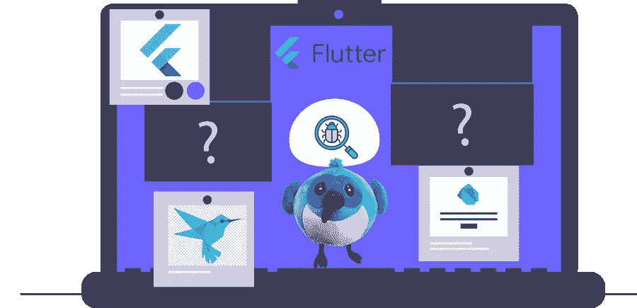

# 颤振的试验驱动发展

> 原文：<https://itnext.io/test-driven-development-in-flutter-e7fe7921ea92?source=collection_archive---------2----------------------->



试验驱动的发展颤振

测试驱动开发(TDD)是软件开发中的一个原则，它禁止我们在编写测试之前编写代码/实现。

根据 Bob 叔叔的说法，TDD 有 3 条规则:

> *1。除非是为了通过失败的单元测试，否则不允许编写任何产品代码。*
> 
> *2。不允许编写任何超过足以导致失败的单元测试；编译失败就是失败。*
> 
> *3。除了足以通过一个失败的单元测试之外，您不允许编写更多的产品代码。
> ——鲍勃大叔(*[*http://butunclebob.com/ArticleS.UncleBob.TheThreeRulesOfTdd*](http://butunclebob.com/ArticleS.UncleBob.TheThreeRulesOfTdd)*)*

这是一个我们必须重复的循环。我们对我们想要实现的东西写一个测试，这样当测试运行时，结果将是“失败”,然后我们写一个**足够**的实现，这样测试就通过了。然后，我们修正我们的代码质量，这可能是我们忽略的，因为我们关注于使测试通过而不使测试失败。

有些人试图先写实现，再写测试，然后只提交测试。这就是现在人们应该如何对待 TDD。你应该注意到，你只能实现足够通过测试的代码(Bob 叔叔的规则 3)。

# 颤振中的 TDD

为了理解 Flutter 中的这个概念，让我们跳到一个实际的例子中。出于本教程的目的，我将使用 PiggyX 应用程序。这些代码可以在 Github 上找到。点击[这里的](https://github.com/Mastersam07/PiggyX)进入代码。

我们将创建并测试几个简单的功能:`EmailFieldValidator`、`PasswordFieldValidator`。让我们通过创建一个名为`loginpage.dart`的新文件来分离登录逻辑，并实现如下:

```
class EmailFieldValidator {
  static String *validate*(String value) {
    return false;
  }
}

class PasswordFieldValidator {
  static String *validate*(String value) {
    return false;
  }
}
```

让我们为上面的验证器编写测试。我们转到测试文件夹，删除默认的`widget_tests.dart`，并添加一个名为`fieldvalidators_tests.dart`的新文件。我们实现如下所示的测试:

```
import 'package:PiggyX/ui/loginpage.dart';
import 'package:flutter_test/flutter_test.dart';

void main() {

  test('empty email returns error string', () {

    final result = EmailFieldValidator.*validate*('');
    expect(result, 'Email can\'t be empty');
  });

  test('non-empty email returns null', () {

    final result = EmailFieldValidator.*validate*('email');
    expect(result, null);
  });

  test('empty password returns error string', () {

    final result = PasswordFieldValidator.*validate*('');
    expect(result, 'Password can\'t be empty');
  });

  test('non-empty password returns null', () {

    final result = PasswordFieldValidator.*validate*('password');
    expect(result, null);
  });
}
```

在上面的内容中，我们预计会出现以下情况:
i)电子邮件字段不得为空
ii)密码字段不得为空
如果我们想要，我们可以扩展测试用例，但出于本教程和本[应用程序](https://github.com/Mastersam07/PiggyX)的目的，我们将坚持使用这两个。

当我们尝试在实现之前运行`flutter test`时，您可能会看到`+0 -4: Some tests failed`。这告诉我们，0 个测试通过(+)，4 个测试失败(-)😪 😪 😪。

让我们现在在 TDD 模式下修复它们吧！

前往`loginpage.dart`并修理`EmailFieldValidator`:

```
static String *validate*(String value) {
  return value.isEmpty ? 'Email can\'t be empty' : null;
}
```

再次运行测试，您应该会看到`+2 -2`。

现在让我们前往`loginpage.dart`并用以下代码修复`PasswordFieldValidator`:

```
static String *validate*(String value) {
  return value.isEmpty ? 'Password can\'t be empty' : null;
}
```

再次运行测试，您应该`+4: All Tests Passed!`💃 💃 💃

您已经使用 Flutter 以 TDD 方式成功测试了您的应用程序！你应该得到一些荣誉。现在，可以安全地完成我们的循环了，因为我们特性的目标现在已经完成了(只制作 UI)！

这些代码可以在 GitHub repo [PiggyX](https://github.com/Mastersam07/PiggyX) 中找到。

**加分** 对于嘲讽依赖，可以利用 [mockito 包](https://pub.dev/packages/mockito)。例如，我们需要能够模拟来自应用程序需求的数据，以便根据 API 进行身份验证，而不是依赖于实时 API，模拟实时 web 服务或数据库以根据情况返回特定结果，使用 firebase.e.t.c 进行操作。我们需要做的就是通过手动编码或使用 [mockito 包](https://pub.dev/packages/mockito)创建一个类的替代实现。你可以遵循这个关于[嘲讽](https://flutter.dev/docs/cookbook/testing/unit/mocking)的指南。

如果您有任何问题，请随时发表评论🙂。

# 参考资料:

[颤振测试](https://flutter.dev/docs/cookbook/testing)
[测试颤振 app](https://flutter.dev/docs/testing)
[嘲讽依赖使用 Mockito](https://flutter.dev/docs/cookbook/testing/unit/mocking)
[Mockito 包](https://pub.dev/packages/mockito)