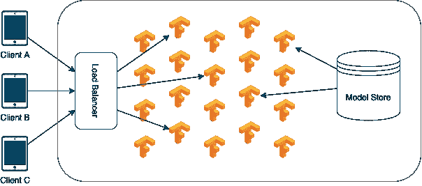
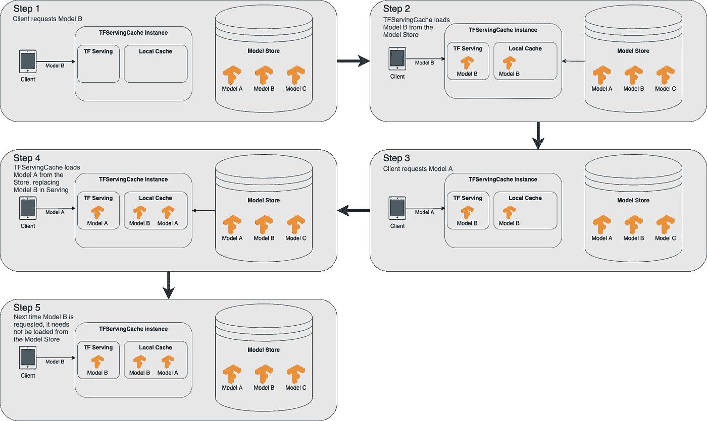
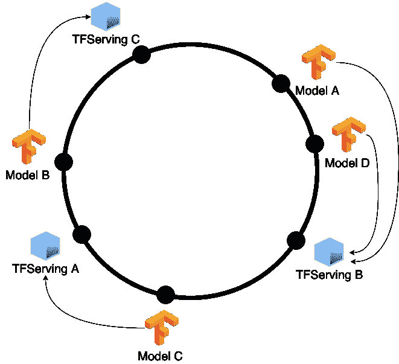
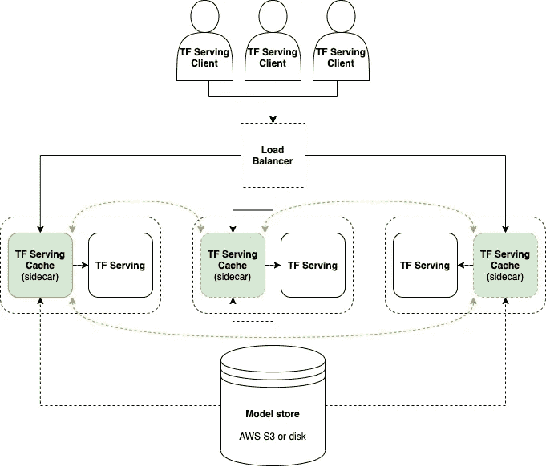
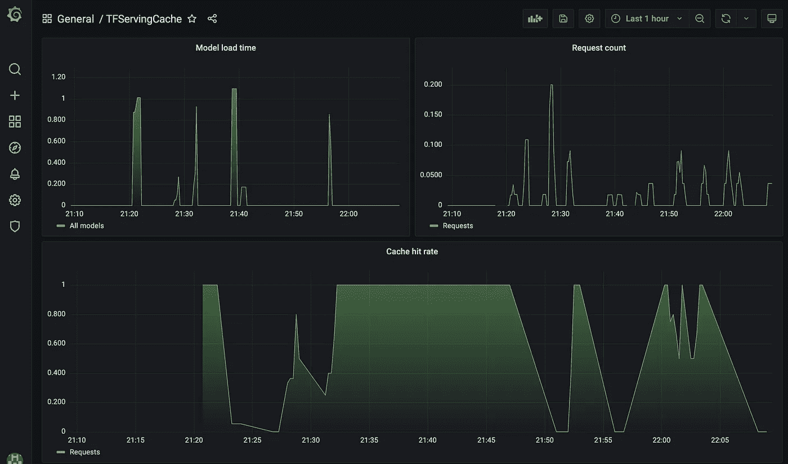

# TFServingCache:为 Kubernetes 中的张量流模型提供服务的分布式 LRU 缓存

> 原文：<https://itnext.io/tfservingcache-a-distributed-lru-cache-for-serving-tensorflow-models-in-kubernetes-d3c4bb959d56?source=collection_archive---------2----------------------->

[TFServingCache](https://github.com/mKaloer/TFServingCache) 是一个开源项目，通过 TensorFlow 服务和 Kubernetes 在高可用性设置中为数千个 TensorFlow 模型提供服务。在本文中，我将解释它解决了什么问题以及它是如何工作的。

## **张量流发球的局限性**

将 TensorFlow 模型投入生产的“官方”方式是使用 [TensorFlow Serving](https://github.com/tensorflow/serving) 工具，它是 TFX 的一部分。虽然这在要服务的模型数量很少时工作得很好，但是它不能很好地扩展到数千个模型，例如当模型是按租户或用户来训练时。这不是一个不合理的场景，也是我在工作场所遇到的一个场景。TensorFlow Serving 不支持大量模型有几个原因，我现在简单解释一下。

首先，TF Serving 将所有模型加载到主内存中。如果延迟很重要，这很好，但是如果模型的数量很大，这就不好了。如果模型在不使用时可以卸载到二级存储，那就太好了。

第二，不支持在几个 TF 服务服务器之间分发模型。这意味着不能简单地通过添加更多节点来扩展 TF 服务。人们必须注意请求路由以及模型在不同服务之间的分布。

最后，所有被服务的模型必须在文件系统上是可访问的。虽然像 AWS S3 这样的 blob 存储服务可以安装在一个文件系统中，但是它极大地增加了设置的复杂性。在理想的设置中，当使用 API 请求模型时，TensorFlow 服务将从模型库中获取模型，例如像 S3 这样的存储服务。

TFServingCache 项目试图解决这三个问题。

# TF 服务协议的重新实现

在我进入 TFServingCache 如何解决上述问题之前，我想解释一下它的 API。

受中间件如 [PgBouncer](https://www.pgbouncer.org/) 所采用的方法的启发，TFServingCache 重新实现了 TensorFlow 服务协议。这意味着 TFServingCache 与现有的客户端和库兼容，无需修改。当客户端请求 TensorFlow 模型预测时，TFServingCache 通过拦截请求并将其重定向到正确的 TF 服务实例来充当负载平衡器。它还确保模型是从模型库中加载的。

TFServingCache 支持由 TensorFlow 服务实现的 REST 和 gRPC 协议。

TFServingCache 可以像 TensorFlow 服务一样调用，并且支持 REST 和 gRPC

# 模型的动态加载和卸载

当模型准备好被服务时，它们被存储在一个*模型库*中。模型库可以是 blob 存储，如 AWS S3 或 Azure Blob 存储，或者任何已挂载的卷。当一个模型被存储在模型库中时，它并没有被主动提供服务，但是一旦一个模型被客户机请求，它就被加载到一个 TF 服务实例中。TFServingCache 管理哪个实例应该服务于模型——我将在本文后面更深入地探讨这个问题。

通过使用模型库，新模型的部署变得非常简单。只需将它们放入存储库中，TFServingCache 将在需要时提取它们。

模型的动态加载和卸载伴随着延迟增加的代价。每次请求新模型时，都需要从模型库中下载并加载到 TF Serving 中。为了避免重复重新获取相同的模型，每个本地 TF 服务实例都包含一个最近最少使用的(LRU)缓存。这意味着当加载新模型时，一段时间没有使用的模型将被驱逐。如果客户端遵循时间局部性原则，也就是说，如果在短时间内多次调用相同的模型，由于缓存的原因，加载时间可能可以忽略不计。此外，缓存确保了服务实例上一致的内存和磁盘使用。

模型被动态加载并存储在本地缓存中

# 使用一致散列分发模型

TFServingCache 的内部结构受到了分布式键值存储的启发，这在有点名气的 [DynamoDB 论文](https://www.allthingsdistributed.com/files/amazon-dynamo-sosp2007.pdf)中有所介绍。但是，TFServingCache 不是分布式键值存储，而是分布式模型服务器。下面解释它是如何工作的。

## 一致散列法

当负载平衡节点时(在本例中，TF 服务实例)，必须决定请求应该被路由到哪个节点。做出这个决定有许多方法，每种方法的适用性取决于分布式系统的需求。为了阐明一致散列的使用，我对比了两种常见的负载平衡算法。

第一组也是最简单的一组算法是那些独立于请求的算法。这类算法的例子有随机和循环路由。虽然这两种方法都提供了请求的统一分布(假设实现良好)，但缺点是缓存变得无效，并且服务必须是无状态的。

第二组路由算法是那些依赖于请求本身的算法。这在例如分布式键值存储中是相关的，其中必须知道特定键值存储在哪个节点上。在这种情况下，请求基于密钥(在请求中提供)进行路由。一种基于请求的路由方法是一致性散列法。在一致哈希中，节点分布在一个“哈希环”中。基于例如其主机名或 IP 地址的散列，每个节点在散列环中都有一个值。为了定位给定请求的节点，请求关键字也被散列到散列环中的一个位置。该请求然后被路由到顺时针移动的散列环中的相邻节点。

TensorFlow 模型和 TFServing 实例放在具有一致散列的单个散列环中

与另一组路由算法相比，一致性哈希方法不能保证请求的均匀分布，但它支持缓存和有状态节点。为了降低节点停机或过载的风险，一致散列法可以与随机化算法相结合，以在 *N* 个相邻节点中分发请求，而不是仅在一个节点中分发。

## TFServingCache 中的服务发现和模型路由

当预测请求发送到 TFServingCache 时，该请求可以由任意 TFServingCache 实例接收。然后，实例将根据一致的散列法，将请求路由到为该请求提供服务的实例。TFServingCache 实现了自动服务发现，因此每个实例都知道所有其他实例，因此能够将请求直接路由到正确的实例。自动服务发现允许在集群中无缝地添加和删除节点，例如支持基于负载的动态扩展。当添加或删除节点时，模型将最终分布在剩余的节点中。

TFServingCache 知道所有节点，因此能够将模型请求路由到正确的 TFServing 实例

TFServingCache 的服务发现机制依赖于外部系统的可用性，并且支持 Kubernetes、etcd 或 Consul。

TFServingCache 中一致哈希的实现使用模型名称和版本作为哈希键。因此，所有模型都均匀地分布在服务节点上，不管 TFServingCache 是为单个模型的大量版本服务，还是为几个不同的模型服务。TFServingCache 还在 *N* 个节点之间采用随机路由来支持负载平衡和高可用性。

# 普罗米修斯矩阵

大多数严肃的生产服务都需要监控。TFServingCache 通过提供几个现成的 Prometheus 指标使监控变得容易。每个型号都提供了缓存命中/未命中、错误计数和响应时间。除了在 Grafana 中进行监控之外，这还允许根据缓存未命中或响应时间自动扩展集群。

TFServingCache 附带了对 Prometheus 和 Grafana 的支持

# 如何开始

虽然 TFServingCache 不依赖于任何特定的环境，但是启动和运行它的最简单方法是使用 Helm 将其部署到 Kubernetes 集群。Github 页面上的文档描述了舵图支持的配置。

TFServingCache 仍然是一项正在进行的工作。如果你想投稿，请告诉我或者看看 [Github 页面](https://github.com/mKaloer/TFServingCache)🚀