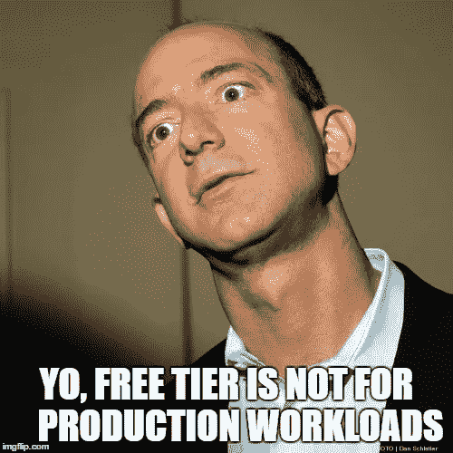
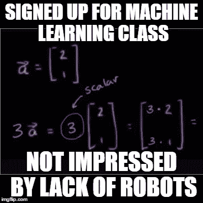
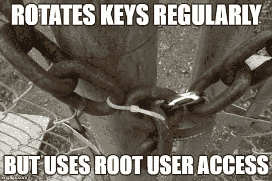

# 云计算的 7 大变化

> 原文：<https://itnext.io/the-7-major-changes-coming-to-the-cloud-958d6584a85e?source=collection_archive---------7----------------------->

*云现在是商业技术的主要门户。然而，随着创新的加速，我预测主要平台将会发生巨大的变化。*

对于狂热的云观察者来说，推测未来几年可能发生的事情既有趣又有用。几乎在每个方面，云的功能和采用都遵循了库兹韦尔的“T2”指数增长(T3)理论，所以至少跟上最大的云提供商的功能发布是一项兼职工作。

然而，我正在掸掉我的水晶球，试图让你一瞥 [**re:Invent 2019**](https://www.portal.reinvent.awsevents.com/portal/) 。正如比尔·盖茨所说，“我们总是高估未来两年将发生的变化，低估未来十年将发生的变化。”互联网和 iPhone，比尔。

# 1.价格下降，采用率上升。这是一个简单的问题。

原始定价:是的，是的，它会继续下跌，这本身几乎不是一个令人惊讶的预测，但原因会有所不同。以前的降价(迄今为止 AWS 已经有 60 多次大幅度降价)主要是关于规模效益和将更低的成本传递给客户。然而，其中许多都是在基于云的竞争非常少的情况下发生的。

我预计，未来的价格下降将是对目标服务的直接反应，在这些服务中，成本更高，竞争对手进行比较——明显的目标将是数据库(RDS)和机器学习。云专有产品和传统供应商产品之间的定价差距也将开始扩大——例如，想想亚马逊 Aurora 与甲骨文的成本。

我还预测“免费层”的大规模扩展，允许开发者以更大的月积分玩整个套件，但实现的方式不会为了搭便车而蚕食较小的生产负载。这并不意味着更小的发票——一个不变的趋势是更低的价格导致更大的使用量。

# 2.大数据中的大麻烦…针对内部部署

大数据战争甚至还没有宣布，但他们正在到来。公司开始意识到，大数据是他们运营中的下一个变革工具，并且只有在云环境中才能真正发挥作用。

大数据的采用周期大致是这样的:收集更多数据，分析数据，完善模型，收集更多数据。唯一确定的结果是数据存储成本和复杂性飙升，云提供商将带着工具冲进来提供帮助。

在内部，它大大低估了未来的数据存储需求。这就像旧时代的计算机拥有千字节的内存，然后似乎很快机器就以更低的价格拥有千兆字节的内存。目前被认为是大型的本地数据库是那些老式的计算机，许多公司都在为这些而挣扎。想象一下，如果您公司的所有数据都将从千字节增长到千兆字节、万亿字节或十亿字节，会是怎样的情形？

处理这些数据的复杂性将完全脱离内部部署，云提供商将为我们提供数据分析和处理工具，这在目前看来是不可能的。我说的是“1 的大 O”，为外面的书呆子们准备的圣杯式的东西。我预计新的类似 SQL 的语言将由此产生，让超级用户能够掌握大规模的传统查询，同时也让机器学习工具和服务 API 能够访问和操作这些数据。

这将把内部 IT 从优化任务中解放出来，因为云提供商每次都会胜过您。这还意味着我们不再担心我们随身携带的大量信息，因为这些工具将简化管理并隐藏其复杂性。如果你考虑技术如何隐藏了悄然发生在手机上的媒体数据爆炸，同样的事情正在发生在云中的大数据上。

# 3.机器学习会从幼儿园毕业。

机器学习似乎正在解决世界上所有的问题，但只有少数公司理解它，他们吸引了所有拉杠杆的聪明孩子。对于我们这些没有数学博士学位的人来说，这是一个问题，他们希望它更好莱坞，而不是线性代数。

当 IBM 的总裁有一个著名的预测时，ML 目前是计算机在 40 年代的水平，“我认为世界市场上可能有五台计算机。”历史投入了巨大的努力来嘲笑这个人，但从他的角度来看，这似乎非常合理。你可以对 ML 说同样的话——也许现在只有几十家公司能从机器学习中受益*。*

*但是在 IBM 可笑的注定失败的预测几年后，我现在一直带着 5 台电脑。同样，我预测机器学习将发展到惠及每家公司，云将是实现这一目标的途径——但在 5 年内，而不是 70 年内。*

*一个经常被忽略的小事实:机器学习源于大数据。到目前为止，我们已经看到了一些人工智能即服务产品的最开始，这些产品可以做一些可爱的事情，如识别人脸和朗读文本。下一波基于云的 ML 工具将提供 GUI 和命令行抽象接口，让您构建定制服务来提取模式。还记得 20 年前 Excel 是如何让你分析大量的表格并给出图表的吗？这些工具将提供一种等价的方式来发现超出人类分析能力的洞见，但对点击鼠标的大众来说是可用的。*

**

*我想我为这家伙工作过！*

# *4.分散化和小型数据中心的兴起。*

*到目前为止，云计算的趋势是一些大公司用数据中心覆盖全球，这使得任何没有十亿美元的人都更加难以竞争。但这只是云推广的第一阶段，其目前的状态类似于互联网的原始主干。为了让互联网发挥出最大潜力(即零延迟地将小猫视频直接传输到我家)，最后一英里由全球数千家提供商完成。*

*随着边缘计算的发展，云将会大规模分散，这将有利于一个尚未出现的行业。对于世界各地所有不属于亚马逊或谷歌的现有数据中心，将有机会“插入”云，成为自己的提供商。目前，云的增长受限于大型企业的发展速度，但这将是亚马逊市场的云等价物，允许 AWS 超越自己的平台限制。*

*关于这在实践中如何运作以及对安全性、延迟和可靠性的影响有许多问题，但我有信心这些问题会得到解决。这将把最复杂的云资源带到世界的最边缘。现在，第三世界的一些城镇有手机，但没有干净的水——很快，他们就会有 AWS。*

# *5.多云化来了。算是吧。*

*技术经理和首席信息官仍然对云供应商锁定感到不安，尽管内部锁定多年来一直为高尔夫日和慈善活动提供资金。我倾向于淡化绝对信任 AWS 或谷歌的重要性，但我承认这对许多企业来说是不舒服的。*

*虽然云计算似乎是一个显而易见的未来，但当所提供的服务很少对等时，这很难实现。你可以在任何地方存储备份，但是尝试构建一个 AMI，它可以在 Azure *或* Google 上启动负载平衡的实例。这就像制作你自己的杏仁牛奶——完全可能，但只是*为什么*？解决一个不存在的问题增加了巨大的管理复杂性。*

*“云的云”的概念仍将牢牢占据第三方供应商的舞台，因为这些供应商更适合接受让它工作的疯狂挑战。这些服务将针对那些不习惯直接使用 AWS 的公司，并且看起来可以在一系列云提供商之间平等地管理您的服务。他们会宣传找到最便宜的提供商的好处，并在云中断的情况下提供另一层容错。*

*在我看来，整个想法的问题在于，这种好处是基于不信任，而不是现实。我还认为，有人会利用这种不信任，建造一些技术上并不太好的东西，从而获得巨额财富。*

# *6.混合云动物再次流行起来。*

*威廉·吉布森说“未来已经到来——只是分布不均匀。”的确如此——这解释了为什么 200 万美国家庭仍在使用拨号上网，以及为什么混合云动物永远不会被放出去吃草。*

*我遇到的许多云布道者都预测混合云会消亡，因为混合云效果不好，公共云更好。但这种完全正确的逻辑忽略了一个事实，即后期采用者仍然认为在某个地方看到自己的数据意味着他们有更多的控制权。*

*这相当于现代人因为不信任银行而把钱放在床垫下。但是有事业心的人已经发现，卖一个带钱箱的床垫比用事实、概率和常识说服人们使用银行更有利可图。*

**

*目前，混合服务可以帮助您踏上缓慢但不可避免的公共云之旅。但我认为，未来将会看到一些来自供应商的技术上奇怪的解决方案，让您将云数据快照回本地，为“额外特殊的私有”数据创建专属的本地区域，并将环境复制回私有云。虽然今天这些都以某种形式存在，但我预测产品将围绕这些概念构建和销售。这些是未来的云拨号产品。*

# *7.安全和认证成为工业。*

*虽然如果正确理解、实施和维护，云安全已经非常强大，但它也很难管理。很快，IAM 角色、用户、凭证和证书激增，这使得很容易无意中打开访问，并且很难跟上请求和更改的管理。*

**

*在这里，我们将看到大量的改进(在机器学习的帮助下)，就像将谷歌今天的登录与雅虎今天的登录进行比较一样！谷歌使用机器学习来创建一个认证过程，这远远领先于定义互联网时代的基本用户名和密码匹配。我预计多因素智能身份认证工具会将这种复杂性带到云中，因此我们将开始讨论身份认证的“可信度”。*

*至于安全，这是另一个今天几乎不存在的行业，与它将如何增长相比。云工具集将不断发展，以动态防止错误配置，并实时识别不良行为，所有这些都不需要在客户端进行太多设置。这将自动防御常见攻击、数据窃取技术和常见入侵。我们发现，在保护机器方面，人类远不如机器。*