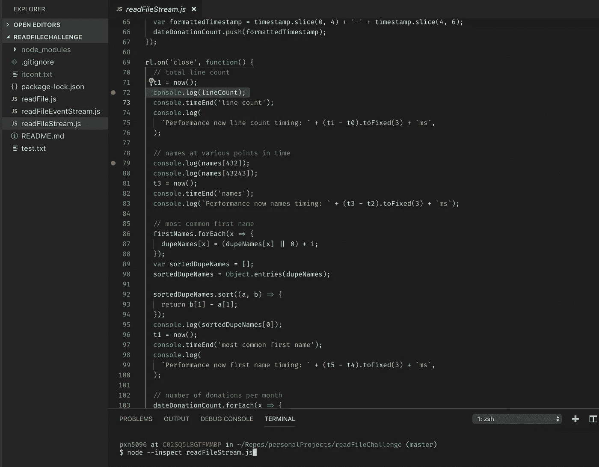
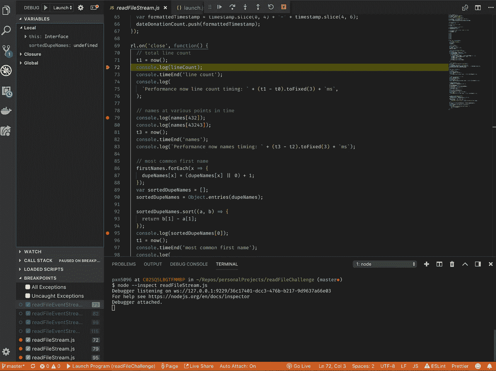
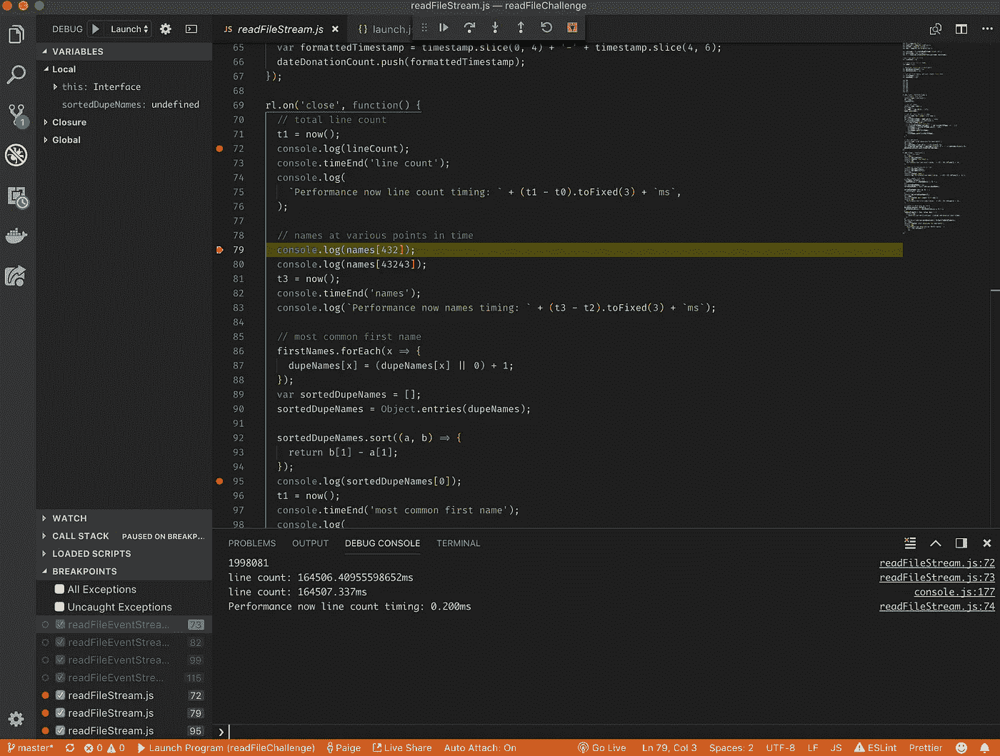
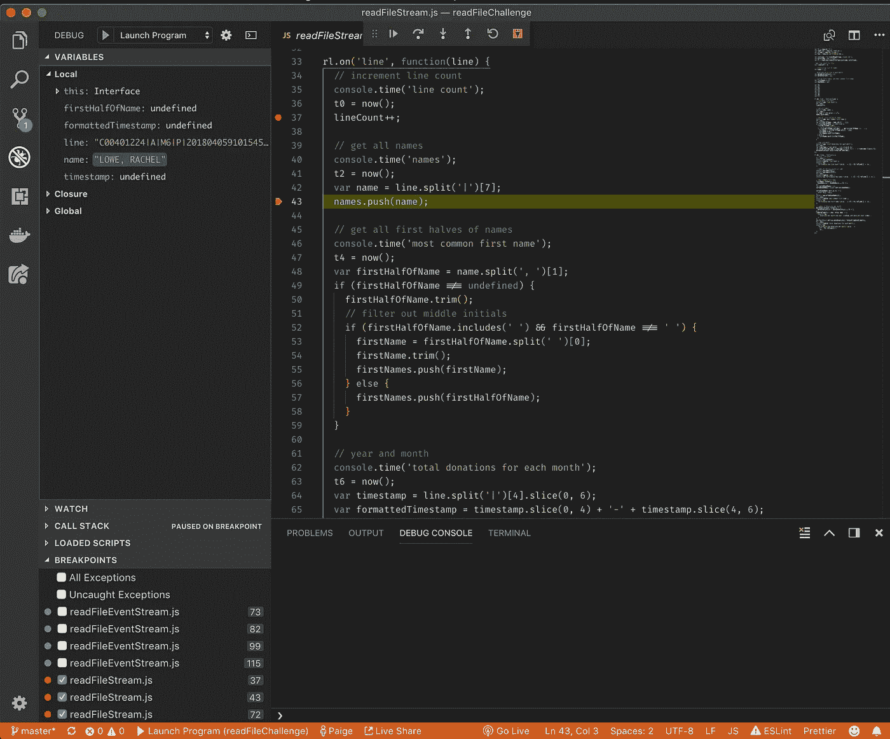

# 调试 Node.js 最简单的方法——使用 VS 代码

> 原文：<https://itnext.io/the-absolute-easiest-way-to-debug-node-js-with-vscode-2e02ef5b1bad?source=collection_archive---------0----------------------->

# 让我们面对现实吧…调试 Node.js 是(并且一直是)一种痛苦。

## **进入 Node.js** 调试之痛

如果你曾经有幸为 Node.js 项目编写过代码，你就会明白我所说的调试并找出问题所在并不容易。

与浏览器中的 JavaScript 或具有 IntelliJ 等强大 IDE 的 Java 不同，您不能只是在任何地方设置断点，刷新页面或重启编译器，并缓慢地遍历代码检查对象，评估函数并找到突变或缺失的变量等。你就是不能，而且很臭。

但是调试是可能的，只不过需要多费一点力气。让我们回顾一下这些选项，然后我将向您展示我在自己的发展过程中遇到的最简单的方法。

## **node . js 中调试的选项**

有很多方法可以调试你行为不端的 Node.js 程序，我在下面列出了它们，如果你愿意的话，可以通过链接了解更多。

*   如果你曾经写过一行 JavaScript，这个已经被证明是真正的待机状态，真的不需要更多的解释。它内置于 Node.js 并在终端中打印，就像内置于 JavaScript 并在浏览器控制台中打印一样。

在 Java 里是`System.out.println()`，在 Python 里是`print()`，你懂了吧。这是最容易实现的方法，也是在干净的代码中添加额外信息的最快方法——但它也可以(有时)帮助您找到并修复错误。

*   **Node.js 文档**`**—-inspect**`**——node . js 文档本身明白调试并不是最容易的，所以他们制作了一个[方便的参考资料](https://nodejs.org/en/docs/guides/debugging-getting-started/)来帮助人们入门。**

**这很有用，但是说实话，除非你已经编程一段时间了，否则这并不是最容易理解的东西。它们很快就掉进了 UUIDs、WebSockets 和安全隐患的兔子洞，我开始感到力不从心。我对自己说:一定有一种不那么复杂的方法来做这件事。**

*   ****Chrome DevTools**——[保罗·爱尔兰](https://medium.com/u/6d5456230083?source=post_page-----2e02ef5b1bad--------------------------------)早在 2016 年就写了一篇关于使用 Chrome dev tools 调试 Node.js 的很棒的[博文](https://medium.com/@paul_irish/debugging-node-js-nightlies-with-chrome-devtools-7c4a1b95ae27)(2018 年更新)，从表面上看，这听起来很简单，并且像是调试的一大进步。**

**快进了半个小时，我仍然没有成功地将 DevTools 窗口连接到我的简单节点程序，我不再那么确定了。也许我只是不能遵循指示，但 Chrome DevTools 似乎使调试变得比它应该的更复杂。**

*   **JetBrains 是我最喜欢的软件开发公司之一，也是 IntelliJ 和 WebStorm(仅举几个例子)的开发者，JetBrains 很棒。他们的工具有一个奇妙的插件生态系统，直到最近，他们毫无疑问是我的首选 IDE。**

**有了这样一个专门的用户群，就出现了许多有用的文章，如[和](https://www.jetbrains.com/help/webstorm/running-and-debugging-node-js.html)，它们介绍了调试节点，但类似于节点文档和 Chrome DevTools 选项，这并不容易。在 WebStorm 准备就绪之前，您必须创建一个调试配置，附加正在运行的进程，并在首选项中做好一些配置。**

*   ****Visual Studio 代码** —这是我的节点调试新黄金标准。我从没想过我会这么说，但我完全相信 [VS 代码](https://code.visualstudio.com/download)，团队发布的每一个新功能都让我更喜欢这个 IDE。**

**VS 代码做了所有其他调试 Node.js 的选项都做不到的事情，它让调试变得非常简单。如果你想对你的调试更感兴趣，你完全可以，但是他们把它分解成足够简单，任何人都可以很快上手并运行，不管你对 ide、Node、编程等有多熟悉。太棒了。**

## ****在 Node.js 中设置 VS 代码进行调试****

****

**抱歉，我无法抗拒这个迷因——它实在是太合适了。好了，让我们来看看如何设置 VS 代码来调试节点。我假设你已经从我上面发布的[链接](https://code.visualstudio.com/download)下载了 VS 代码，所以我们准备开始设置它。**

**打开**首选项>设置**，在搜索框中输入“节点调试”。在扩展选项卡下，应该有一个名为“节点调试”的扩展。从这里，点击第一个框:**调试>节点:自动连接**并将下拉菜单设置为“开”。你现在差不多可以走了。是的，真的很简单。**

****

**下面是您应该在设置选项卡下看到的内容。将第一个下拉菜单“调试>节点:自动附加”设置为“开”。**

**现在，转到 Node.js 项目文件，通过单击文件左侧您希望看到代码停止的地方来设置一些断点，并在终端中键入`node --inspect <FILE NAME>`。现在看着奇迹发生…**

****

**看到红色断点了吗？请参见终端中的“节点—检查 readFileStream.js ”?就是这样。**

****VS 代码调试进行中****

**如果你需要一个 Node.js 项目来测试这个，你可以在这里下载我的 repo。它是用来测试 Node 的不同形式的大量数据流的，但是对于这个演示来说，它工作得非常好。如果你想了解更多关于节点和性能优化的流数据，你可以在这里和[这里](/streams-for-the-win-a-performance-comparison-of-nodejs-methods-for-reading-large-datasets-pt-2-bcfa732fa40e)看到我的帖子。**

**一旦你点击了`Enter`，你的 VS 代码终端应该在底部变成橙色，表示你处于调试模式，你的控制台会打印一些类似`‘Debugger Attached’`的信息。**

****

**橙色工具栏和“调试器已连接”消息将告诉您 VS 代码在调试模式下运行正常。**

**一旦您看到这种情况，恭喜您，您正在 Node.js 中以调试模式运行！**

**现在，您可以在屏幕的左下角看到您的断点(并且可以通过复选框打开和关闭它们)，并且您可以像在浏览器中一样通过小的 play、step over、step in、restart 等来单步执行代码。IDE 顶部中间的按钮。VS 代码甚至用黄色突出显示了断点和您已经停止的那一行，这样更容易理解。**

****

**点击顶部的播放按钮，从代码中的一个断点跳到下一个断点。**

**当您从一个断点跳到另一个断点时，您可以看到程序在 VS 代码 IDE 底部的调试控制台中打印出了`console.log`,黄色突出显示也将跟随您。**

****

**正如你所看到的，当我们在断点上停止时，我们可以在 VS 代码的左上角看到我们可以在控制台中浏览的所有局部范围信息。**

**正如您所看到的，随着程序的进展，我越深入断点，越多的输出到调试控制台，并且在这个过程中，我可以使用 VS 代码左上角的工具探索本地范围内的对象和函数，就像我可以在浏览器中探索范围和对象一样。不错！**

**很简单，是吧？**

## **结论**

**Node.js 调试不一定要像过去那样令人头疼，也不需要涉及代码库中的 500 个`console.log()`来找出 bug 在哪里。**

**Visual Studio 代码的 Debug > Node: Auto Attach 设置使它成为了过去，我个人非常感激。**

**过几周再来看看，我会写关于使用 Puppeteer 和 headless Chrome 进行端到端测试，或者使用 Nodemailer 在 MERN 应用程序中重置密码的文章，所以请关注我，以免错过。**

**感谢您的阅读，我希望这能让您了解如何在 VS 代码的帮助下更轻松有效地调试 Node.js 程序。非常感谢鼓掌和分享！**

****如果你喜欢读这篇文章，你可能也会喜欢我的其他博客:****

*   **[使用 Node.js 读取非常非常大的数据集&文件(Pt 1)](/using-node-js-to-read-really-really-large-files-pt-1-d2057fe76b33)**
*   **[Sequelize:用 Node.js 实现 Sequel 数据库的 ORM](https://medium.com/@paigen11/sequelize-the-orm-for-sql-databases-with-nodejs-daa7c6d5aca3)**
*   **[Streams For the Win:node . js 方法读取大型数据集的性能比较(第二部分)](/streams-for-the-win-a-performance-comparison-of-nodejs-methods-for-reading-large-datasets-pt-2-bcfa732fa40e)**

****参考资料和更多资源:****

*   **Github，节点读取文件回购:[https://github.com/paigen11/file-read-challenge](https://github.com/paigen11/file-read-challenge)**
*   **Node.js 文档—检查器:[https://nodejs . org/en/docs/guides/debugging-getting-started/](https://nodejs.org/en/docs/guides/debugging-getting-started/)**
*   **Paul Irish 关于使用 Chrome DevTools 调试 Node.js 的博客:[https://medium . com/@ Paul _ Irish/debugging-node-js-night lies-with-Chrome-DevTools-7 C4 a1 b 95 AE 27](https://medium.com/@paul_irish/debugging-node-js-nightlies-with-chrome-devtools-7c4a1b95ae27)**
*   **JetBrains 文档，运行和调试 node . js—[https://www . JetBrains . com/help/web storm/Running-and-Debugging-node-js . html](https://www.jetbrains.com/help/webstorm/running-and-debugging-node-js.html)**
*   **Visual Studio 代码下载:【https://code.visualstudio.com/download **
*   **VS 代码调试 Node.js 文档:[https://Code . visual studio . com/docs/nodejs/nodejs-Debugging # _ attaching-to-nodejs](https://code.visualstudio.com/docs/nodejs/nodejs-debugging#_attaching-to-nodejs)**