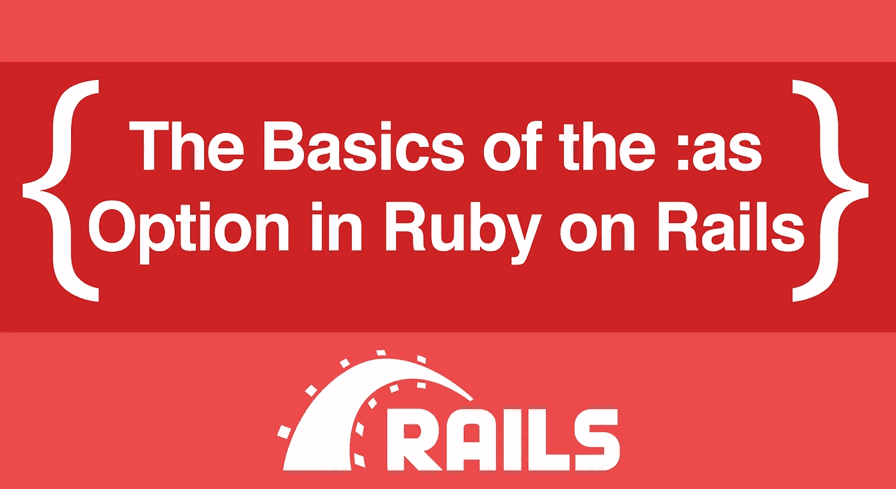

# Ruby on Rails 中:as 选项的基础知识

> 原文：<https://itnext.io/the-basics-of-the-as-option-in-rails-ca28de7e3303?source=collection_archive---------4----------------------->

## 快速轻松地定制您的路线助手



## :as 允许您自定义路线助手

简单地说，您可以在您的`routes.rb`文件中使用:as 选项，并定制或覆盖您的路由助手。但是在我们深入:as 之前，让我们确保我们知道什么是路由以及路由助手做什么。

## 快速概述:路线和路线助手

假设我们有一个班级学生和一个表格学生，他们都完全遵循 REST 约定，因为我们在 routes 文件中使用了#resources:

```
resources :students 
```

当我在我的控制台上运行`rake routes`时，这些都是 Rails 友好地为我创建的路线:

```
~/Coding/stdnt-example$ rake routes Prefix Verb   URI Pattern                  Controller#Action
    students GET    /students(.:format)          students#index
             POST   /students(.:format)          students#create
 new_student GET    /students/new(.:format)      students#new
edit_student GET    /students/:id/edit(.:format) students#edit
     student GET    /students/:id(.:format)      students#show
             PATCH  /students/:id(.:format)      students#update
             PUT    /students/:id(.:format)      students#update
             DELETE /students/:id(.:format)      students#destroy
```

神奇。如果你不熟悉这四栏，我们主要关注第一栏“前缀”和第三栏“URI 模式”。我们使用基于前缀的路由助手，然后它们把我们带到 URI 的页面。路线助手是这些家伙:

`student_path(@student)`

取代了这种丑陋:

`“/students/#{@student.id}”`

我们从哪找来的那个路线助手？我们所做的只是在前缀中添加了“_path”。就是这样。在该表中，前缀“学生”与`/students/:id`页面相关联。如果我们想使用一个路线助手到达`/students`，它将只是`students_path`。

路由助手是在代码中编写路径名的更友好、更简洁、更安全的方式。你应该使用它们。很多。

## 资源不足时自定义路线

资源方法很棒，但它不能涵盖所有内容。自定义路线仍然需要手动输入。比方说，我们想要一个特殊的页面，显示 a 学生在所有课程中的最好成绩，如果你愿意，也可以是书呆子的最高分页面。这不属于#resources 的自动生成路线，我们必须定制一条路线:

```
# routes.rb 
get '/students/:id/grades', to: 'students#grades'
```

但是现在当我们运行`rake routes`时，我们得到这个:

```
Prefix Verb   URI Pattern                    Controller#Action
    students GET    /students(.:format)            students#index
             POST   /students(.:format)            students#create
 new_student GET    /students/new(.:format)        students#new
edit_student GET    /students/:id/edit(.:format)   students#edit
     student GET    /students/:id(.:format)        students#show
             PATCH  /students/:id(.:format)        students#update
             PUT    /students/:id(.:format)        students#update
             DELETE /students/:id(.:format)        students#destroy
             GET    /students/:id/grades(.:format) students#grades
```

蹩脚。动态路由意味着 Rails 不知道如何自动生成前缀。没有它也能很好地工作，用户仍然可以导航到它，但是这意味着我们每次在代码中使用它的时候都必须键入这个怪物:

`“/students/#{@student.id}/grades”`

Rails 的全部意义在于让代码神奇地为你编写。如果 rails 通常是大卫·科波菲尔让自由女神像消失，那么一个没有路线助手的页面就像你 7 岁的表弟让你选一张卡片。糟透了。

相反，让我们使用:as 来获得一个定制的路由助手！

```
get '/students/:id/grades', to: 'students#grades', as: 'grades'
```

这给了我们这个前缀:

```
Prefix  Verb  URI Pattern                     Controller#Action# ...those old routes still
grades  GET   /students/:id/grades(.:format)  students#grades
```

## 覆盖预设

也可以创建一个不遵循惯例的路径助手。假设我们有一个页面供新生获取账户，`/students/new`，还有一个页面供新生获取信息，`/new-students`。这是一个人为的例子，但无论如何，关键是，你有两个听起来相似的 URI，因为生活是不公平的。因此，因为`students/new`实际上更像是一个注册页面，所以让我们避免混淆，创建一个路由助手来完成这个任务:

```
# these 3 lines are in our routes.rb file resources :students 
get '/students/new', to: 'students#new', as: 'register'
get '/new-students', to: 'students#new_students,' # ...which gives us these routes: 
Prefix Verb   URI Pattern                  Controller#Action
    students GET    /students                students#index
             POST   /students                students#create
 new_student GET    /students/new            students#new
edit_student GET    /students/:id/edit       students#edit
     student GET    /students/:id            students#show
             PATCH  /students/:id            students#update
             PUT    /students/:id            students#update
             DELETE /students/:id            students#destroy
    register GET    /students/new            students#new
new_students GET    /new-students            students#new_students
```

现在我们不再混淆`new_student_path`和`new_students_path`，而是简单地用`register_path`和`new_students_path`来代替。

## 较短的定制路线

Rails 知道如何为非动态路由生成 rails 助手，但有时我们需要更短的助手。以这条路径为例，它显示了顶级区域的最佳学生:

```
get '/students/region-1/top-20', to: 'students#tops'
```

Rails 自动制作路线助手:`students_region_1_top_20_path`。恶心。与其输入这么长的内容，我们不如给我们的路线起个别名:

```
get '/students/region-1/top-20', to: 'students#tops', as: "r1_top20"
```

现在的路线助手只是`r1_top20_path`。

## 这是最基本的！

对于大多数基本站点来说，#resources 和 Rails 本身会为你处理路由和路由助手。但是了解如何定制和手动操作总是好的。另外，:as 还有其他一些用法，在处理作用域和嵌套的 [Rails 文档](http://guides.rubyonrails.org/routing.html)中有描述，所以我推荐好奇的人去看看。我希望这有所帮助，一如既往，不要犹豫问任何问题或指出混淆/错误的部分，如果你发现他们。

大家编码快乐，

迈克