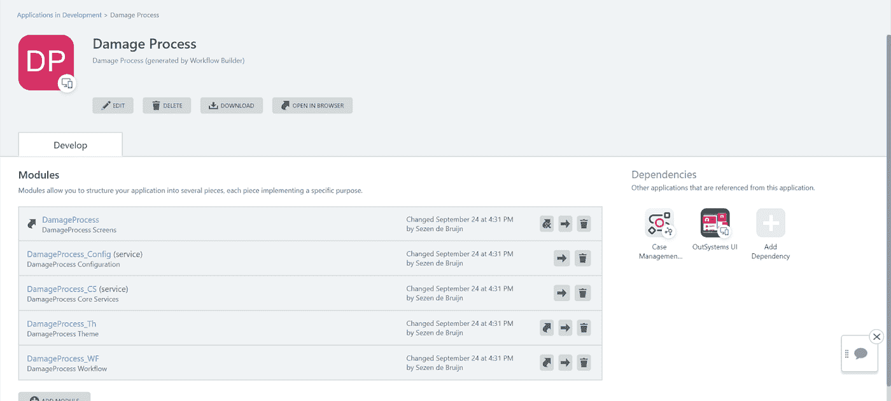
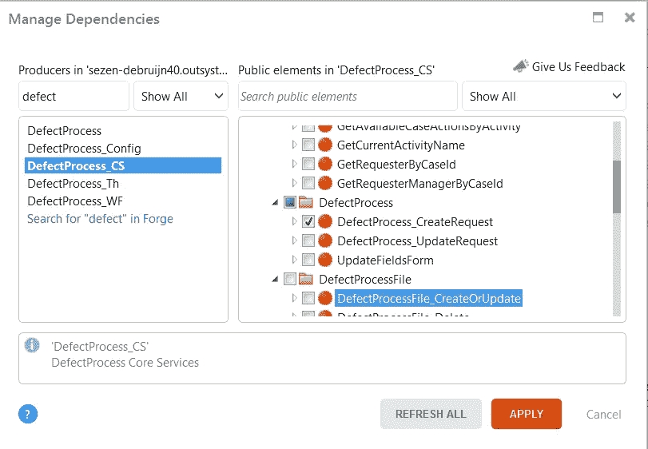
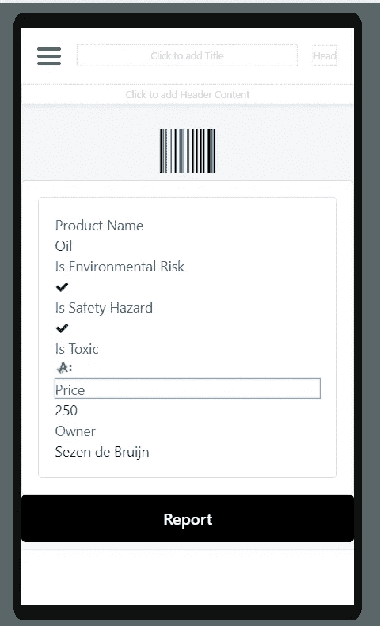

# 欺诈者案例管理框架指南

> 原文：<https://itnext.io/the-cheaters-guide-to-case-management-framework-1a6424419b50?source=collection_archive---------3----------------------->

我以前写过关于 OutSystems 案例管理框架的文章，试图让每个人都了解如何使用它。但是我必须承认:当我构建一个案例管理框架实现时，我总是作弊。

我倾向于从工作流构建器应用程序开始，并在其上扩展，而不是从头开始构建。

所以今天我向你介绍:案例管理骗子指南！

为了了解如何“破解”workflow builder 应用程序，使其成为高度定制的产品，您需要了解 Workflow Builder 应用程序的结构。

现在，您的工作构建器流程附带了 5 个模块，但您不需要关心所有的模块！

让我们简单讨论一下:

*   **< WBNameAPP >** : *(屏幕)*这是一个没有任何下划线的模块，它包含了你的 UI。您关心这个，因为您可能希望使用这些屏幕来扩展提供给用户的功能。现在加 UI 不一定意味着要处理这个模块，但这是一个选项。所以记住这个。
*   **_Config:** *(配置)*老实说，在我的经验中，这一款并不常见。您所需要知道的是，这是存储角色的地方，它提供了一些向组分配任务的功能。暂时忽略它。
*   **_CS** : *(核心服务)*如果您想在您的案例管理框架上进行更高级的扩展，您可能需要使用这一个，因为这是您设置元数据的地方。因此，如果您想添加一个额外的状态或电子邮件模板，您必须在这里这样做。此外，如果您希望轻松地与其他模块中的案例管理框架进行交互，您将需要从该模块中导入静态实体。最后但同样重要的是，这是你的主要实体居住的地方。
*   **_Th:** *(主题)*这是你的主题(如 app CSS 样式表)，所以除非你想做一些影响整个 app 的深远的样式改变，容易被忽略。我对 CSS 的态度是，如果你不威胁它，它也不会威胁你，所以对它敬而远之。
*   **_WF** : *(工作流)*这是你的流程所在的地方！因此，它对我来说是最令人兴奋的，也是我最想改变的模块。想要添加自动步骤吗？稍微改变赋值方法？添加额外的条件，或者旋转整个不同的子流程？这就是它所在的地方！

现在你对应用程序结构有了基本的了解，让我们来谈谈扩展方法。在 Service Studio 中有两种扩展 Workflow Builder 应用程序的方法:
侵入式和非侵入式。顺便说一句，这些不是官方术语，它们只是描述了我对它们的感觉。
侵入式方法有点像寄生虫:你进入应用程序，改变它并接管它的控制权。Workflow Builder 失去了对应用程序的所有控制，而您现在拥有它。

取得应用程序的所有权。

非侵入式方法稍微客气一些:您允许 Workflow Builder 保持控制，并且您只需与它作为公共操作提供的那些方法进行交互。

像往常一样，礼貌并不能让你毫不留情地控制局面，但如果 Workflow Builder 应用程序是由另一方制作和控制的，它确实会让你赢得更多的朋友。

好了，说够了，让我们开始黑吧！

因为礼貌仍然受到重视，所以让我们从工作流构建器应用程序的非侵入性扩展开始。

**无创扩展**

这种策略最适合在应用程序之上提供额外的 UI，但是其他小的改变也可以通过这种方法实现。这种方法的一个很好的例子是在工作流中添加一个移动前端。移动应用程序可以让经常处于非办公环境中的人高效地完成原本很难完成的事情。想象一下，使用条形码扫描仪扫描工厂中的机器，以所有必要的上下文信息和最少的输入量来报告缺陷。

那么，如何在 Workflow Builder 应用程序之上构建一个(移动)应用程序呢？这当然取决于你想让它做什么！在这个例子中，我将重点关注启动一个请求，但是您也可能希望显示案例的信息，或者使用户能够在应用程序中执行分配的任务。
我希望我将在侵入性方法中充分涵盖后两种情况，以便您能够推断如何在非侵入性方法中实现这一点。因此，您只需专注于从移动界面提交案例，而无需侵入 Workflow builder 应用程序。

你需要什么:

*   需要用户登录的移动应用程序
*   拥有 **< WBAppName >请求者**角色的用户
*   **<WB appname>_ Create**动作
*   一个 CaseFiles 列表变量放在您想要使用前面提到的 create 动作的地方。

如何做:

1.  打开您的移动应用程序，转到您构建案例提交逻辑的位置。这个案例应该(在我看来)考虑到用户的方便而构建，因此可能不会以完全正确的方式为您想要提交的案例提供数据。那很好。您将进行一些映射:-)
2.  抓住你的 **< WBAppName > _Create** 动作，找出动作中的数据结构和你屏幕中的数据之间的区别。开始构建逻辑，将您的可用信息转化为适合您案例的正确结构。关于这一行动，你需要了解以下一些具体情况:
3.  需要填充案例文件列表结构。也就是说:你不需要添加任何文件，你只需要有一个这个结构的变量，并把它传递给 Create 动作。
4.  创建操作只对以请求者角色登录的用户有效，所以要么构建您的屏幕以便只有那些人可以访问它，要么构建一些异常处理来处理当他们没有那个角色时您将不可避免地得到的错误。当然，第一种解决方案在这里是更可取的。
5.  不用说，您的 CaseId 是创建操作的无效标识符:-)。
6.  如果您想变得更有趣，请确保在评估用户是否为日期和布尔值提供了空值的地方添加逻辑，并利用“SourceEmptyFields”来共享该信息。(例如，如果实际意图是 null 值，而不是故意将某个布尔值设置为 false，则可以通过将特定属性设置为 True 来实现这一点。)这将确保该值在 workflow builder 应用程序中显示为空，而不是显示空值。
7.  测试一下。对于踢和傻笑，尝试改变工作流生成器中的工作流，看看它仍然工作。走礼貌路线多好啊！

是的，真的很简单。想看我做这个吗？[这里的](https://youtu.be/i3oGLFD2j7s)是一个小视频，展示了我使用这种方法，以非侵入性的方式创建和扩展工作流程。

这就是我今天留给你们的。

在我的下一篇文章中，你会看到黑暗面(他们有饼干！)并使用侵入式方法，通过 Workflow Builder 应用程序侵入我们的系统。

我计划讨论以下问题:

*   添加升级和委托，
*   设置和使用电子邮件模板，
*   理解和改变屏幕，
*   当然还有理解和改变工作流程！

想象一下我们会有多开心！