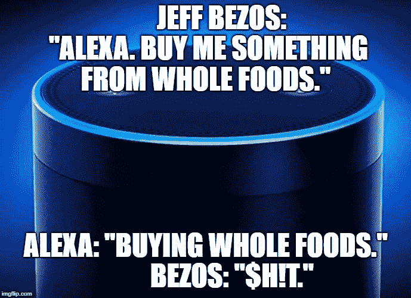
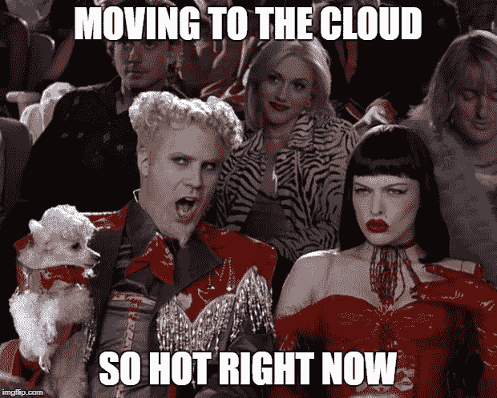
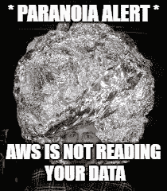
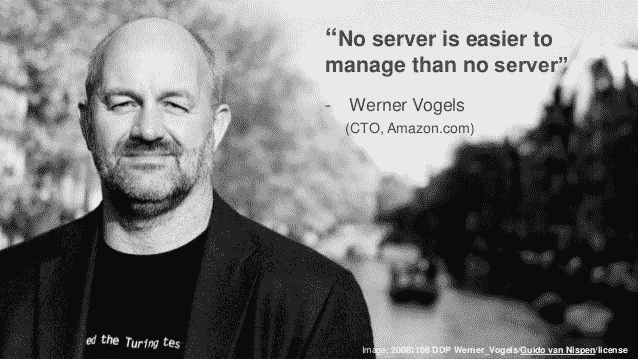

# 10 分钟后的云

> 原文：<https://itnext.io/the-cloud-in-10-minutes-4449baae3db3?source=collection_archive---------0----------------------->

*针对需要快速了解云计算的企业领导和 IT 经理的简明摘要。*

喝杯咖啡，我们走吧…

[*点击这里在 LinkedIn*](https://www.linkedin.com/cws/share?url=https%3A%2F%2Fitnext.io%2Fthe-cloud-in-10-minutes-4449baae3db3) 上分享这篇文章

## 这是什么东西？

你知道发电站是如何取代自己发电的吗？还记得我们把所有的商品工作外包给更便宜的地方吗？事情就是这样开始的——IT 中所有商品化的、难以管理的非增值垃圾都被集中到一个整洁的小堆中，由其他人来管理。服务器、网络和存储变得商品化。顺便说一下，拥有发电站是个坏主意。

## 为什么叫云呢？

主要是出色的营销，但更像是“互联网+”。这和天气没有关系，如果你忘记这个类比可能会更好。云是比内部管理更好、更便宜的基础设施。

## 这是什么时候开始的？

有各种各样的版本可以追溯到大型机，康柏公司在 20 世纪 80 年代创造了这个术语，但是人们普遍认为当前版本始于 10 年前。当互联网变得快速和无处不在时，云开始了——这是一个在发生之前你无法想象会发生的行业。

## 亚马逊和这有什么关系？

亚马逊的电子商务增长正在打击他们的内部 IT，他们开始解决与黑色星期五和其他零售哨声周围的大规模、不可预测的需求相关的扩展问题。他们修复了它，然后意识到他们可以把它作为一个平台来卖，赚一些钱。

## 等等，他们为什么卖秘制酱？

就像卖可乐配方一样，对吗？不尽然——它的圣杯是出售你的平台，以便在未来巩固你的地位。四骑士——亚马逊、苹果、脸书和谷歌——都使用同样的“手指插入馅饼”策略。打个现实世界的比方，信用卡网络是最接近的东西——每当你买玉米卷或汽油时，Visa 和 Mastercard 都会得到几分钱。成为平台，长生不老。

## 和亚马逊、谷歌、微软的厂商锁定怎么办？

无论是 IBM 的大型机、Windows desktop 还是 Oracle 软件，我们总是被供应商锁定在内部部署上。相比之下，有了云，锁定就不是什么问题了(而且你可以使用多个云)，但是你仍然要依赖一个供应商。

## 这不是只针对大企业吗？

肯定不是。这已经成为初创公司的默认方式，中小型企业也很容易采用这种方式。可以说，大公司获益最大，但这对每个人都适用。请记住，这是“互联网+”，互联网对各种规模的企业都非常有效。

## 谁在使用云？

[财富 500 强中有 80%](https://news.microsoft.com/bythenumbers/ms-cloud) 只使用微软的云，AWS 案例研究列表[从 Brooks Brothers 到 GE。在这一点上，每个主要行业都在某种程度上处于云中，尤其是那些互联网安全已被证明不可能在内部实现的行业(部分原因是那些该死的客户和他们的手机)。至于政府，国家安全局，联邦调查局和其他缩写也在那里。](https://aws.amazon.com/solutions/case-studies/all/)

## 谁是主要参与者？

归结起来就是三大巨头——AWS(亚马逊)、谷歌云平台和微软 Azure。AWS 约占整个市场的 35%,而接下来的两家各占 10%左右。其余的由几十个小玩家负责。一般来说，人们认为亚马逊在云竞赛中远远落在了后面，尽管整个市场的增长速度是我在这个行业中从未见过的。

## 云的主要优势是什么？

首先是大量可靠的存储和计算，它们管理您的应用程序和数据库以及数据中心中的所有东西。这就是云的无聊之处。第二是全球可用性、冗余性和耐用性，它们可以被设计到内部无法达到的水平。这有点令人兴奋。

第三个是移动开发、自动化、机器学习和大数据的云服务的集成生态系统，这也没有真正的非云对等物。这是 IT 的未来，所以让我们制造一些噪音。

此外，在业务方面，云有一些有趣的副作用，敏捷性是关键之一。一旦你的 IT 人员将所有无用的、商品化的工作外包出去，你就可以让他们重新做有生产力的事情。

## 什么样的应用程序可以在云中运行？

有时称为“工作负载”，您可以运行从网站和移动应用程序到虚拟桌面、数据库和企业软件的任何东西。还有混合选项，其中一些部分在内部运行，而其他部分在云中运行。

限制因素是延迟(到达云所需的时间)和互联网连接。如果你有片状或没有互联网，它不会工作。如果您对某些机器有严格的延迟要求，您可以将数据输入到云中，但将处理留在设备上。非云用例越来越少，甚至延迟问题也正在被解决。

## 这怎么可能安全？

这就像葛兰素史克的药物制造比冰毒实验室更安全一样——将商品化的活动转移给专业人士，消除了业余时间的混乱。云提供商有数百种措施来提供“云”的安全性，您可以利用所有这些好处。

“云中”的安全性(您管理的部分)归结于加密，确保您遵循架构和开发级别的最佳实践，并持续监控变更、漏洞和攻击。

很难理解的一点是，仅仅因为你的信息在公共互联网上传播，并被其他人存储，并不意味着它不安全。这与直觉相反，但架构良好的基于云的解决方案比您可以在内部做的任何事情都更安全。

## 但说真的，云厂商不是在看我的数据吗？

不，因为(a)他们无法读取加密的客户数据，(b)涉及的数据量之大，就像从海啸中装满一杯水一样，以及(c)他们没有兴趣，就像银行没有兴趣偷你的钱一样。最重要的是，*他们无法读取客户加密的数据*。

看在上帝的份上…

## 我一直读到的 S3 水桶漏水是怎么回事？

S3 是 AWS 用户存储文件的地方，默认情况下这些文件是私有的。一些公司公开开放私有存储桶，因为他们:

1.  不明白它们是如何工作的
2.  不了解许可，或者
3.  懒得正确使用 CloudFront。

如果你的车没锁就被偷了，你不能责怪梅赛德斯。这不是云的弱点——你仍然可以误用云，对它进行糟糕的配置。

## 我确信我可以在自己的数据中心完成所有这些工作。

不，您无法从 1 个、2 个或 5 个数据中心构建全球业务和持久性。您无法处理从固定基础架构的快速扩展，也无法在您拥有硬件时进行缩减。你不能从成千上万的工程师不断发布改进中获益。

更重要的是，有些云技术几乎没有对等物。无服务器将在未来 2-3 年内成为“做事的方式”，这需要使用云。人工智能和机器学习，由于对训练模型所需的海量数据的依赖，对大多数公司来说只是云。是的，这个也要来了。

## 等等，什么是无服务器？

无服务器是在不管理基础设施的情况下运行代码的能力。有什么不喜欢的？

*   开发人员喜欢这样，因为这简化了他们管理应用程序的方式。
*   IT 领导者喜欢这一点，因为它很好地解决了扩展性和可用性问题。
*   首席信息官喜欢它，因为它优化了“您支付什么”与“您使用什么”的难题。您只需在代码执行时付费，不管是一年一次还是一秒钟一万次。

如果你不认识这个人，立即在 Twitter 上关注他。

## 我可以忽略云吗？

早期采用阶段已经结束很久了，云现在已经成为主流。这将难以避免的主要原因是，以前回避云的供应商现在正将其作为主要的交付工具。这意味着，随着时间的推移，您已经使用的软件的未来版本将转移到云中，您需要了解这将如何影响您的 IT。

## 我对自己现有的知识很满意。这似乎是新的和可怕的。

没错，但这也是一次让自己看起来像英雄的机会。云学习曲线并不像看起来那么陡峭，转型机会影响着从产品开发到成本控制的方方面面。对于那些曾经觊觎首席执行官职位但无法摆脱支持模式的首席信息官来说，云是实现这一目标的途径。

相反，如果你不能解决这个棘手的问题，你将会失去你最好的 IT 员工，让他们去做那些公司，看着你的基础设施变得脆弱和昂贵，最终被愿意的人取代。这算是动力吗？

成为 IT 英雄。让它下雨。

## 但是我的朋友说<insert something="" bad="" here="">关于云。</insert>

你的朋友有 AWS 认证吗？没有吗？每一波技术都有来自某个地方的勒德分子的回应，尽管云远非完美，但大多数抱怨和末日预言都来自没有体验过云的人。

## 我从哪里开始？

旅程从决定开始。迁移到云的公司有既定的模式，通常从备份、灾难恢复和 web/移动应用程序开始。

重要的部分是从一个给你在组织中最大成功机会的项目开始，因为在这个过程中会有培训和学习。不要羞于寻求供应商的帮助，但也不要期望先移动核心应用程序。

一旦您有了几个迁移(如果您允许的话，这些迁移会很快)，势头就会建立起来，制定一个全面的策略就会容易得多。会很棒的，相信我。