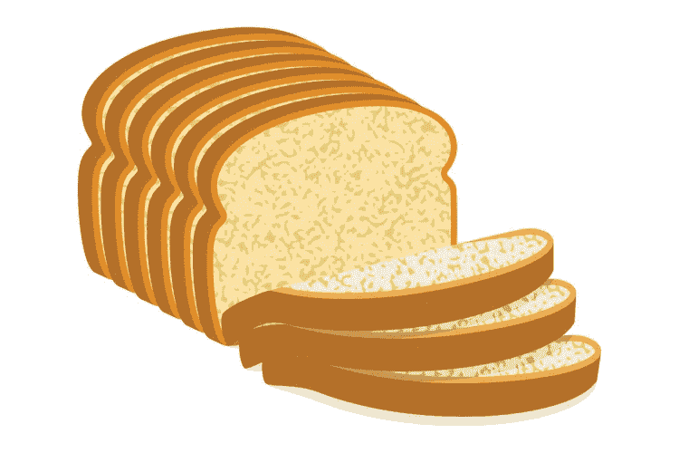

# 最终的 JavaScript 切片到 Ruby 切片转换清单

> 原文：<https://itnext.io/the-definitive-javascript-slice-to-ruby-slice-conversion-cheatsheet-e9c0b4b5c503?source=collection_archive---------5----------------------->



来源:[https://www . Thomas net . com/articles/daily-bite/the-slice-is-right](https://www.thomasnet.com/articles/daily-bite/the-slice-is-right)

## JavaScript 的`slice`语法带有**两个**参数:

`str.slice(startingIndex, **nonInclusiveEndingIndex**)`

```
'elephant'[3] // 'p''elephant'[6] // 'n''elephant'.slice(3, **6**) // 'pha'
```

## Ruby 的`slice`语法与**的两个**参数:

`str.slice(starting_index, **length**)`

```
'elephant'[3] #=> 'p''elephant'.slice(3, **3**) #=> 'pha'
```

为了模拟 JavaScript 指定开始和结束切片索引的方式，我们可以执行以下操作:

`str[starting_index...non_inclusive_ending_index]`

```
'elephant'[3] #=> 'p''elephant'[6] #=> 'n''elephant'[3...6] #=> 'pha'
```

## JavaScript 的`slice`语法带有**一个**参数:

`str.slice(**startingIndexToGetRestOfTheStringFrom**)`

```
'elephant'[3] // 'p''elephant'.slice(3) // 'phant'
```

## Ruby 的`slice`语法带有**一个**参数:

`str.slice(**the_one_index_from_where_to_get_that_one_character_from**)`

```
'elephant'[3] #=> 'p''elephant'.slice(3) #=> 'p'
```

为了在 Ruby 中模拟 JavaScript 的切片方式，我们可以做以下事情:

`str**[**starting_index_to_get_rest_of_the_string_from, **-1]**`

```
'elephant'[3] #=> 'p''elephant'[3, -1] #=> 'phant'
```

## Ruby 的#drop 方法

如果我们在 Ruby 中处理数组，我们可以利用`#drop`方法，它的行为就像 JavaScript 的`slice`方法一样，只有一个参数。

```
['e', 'l', 'e', 'p', 'h', 'a', 'n', 't'].drop(3)#=> ['p','h','a','n','t']
```

可惜的是，`#drop`不是一个字符串方法。

```
'elephant'.drop(3) #=> undefined method `drop' for "elephant":String
```

# 来源

[切片和拼接:Ruby 和 JavaScript Gotchas](https://walsh9.net/programming/slicing-and-splicing) :基本上，每当我试图不混淆 Ruby 和 JS 之间的切片语法时，我总是谷歌搜索这篇文章。把我的帖子看作是这个帖子的备忘单版本，加上 Ruby 的`string[i..-1]`和一个关于`#drop`的旁白。

[Stack Overflow——Ruby 相当于 Phython 的“array[i:]”来选择 I 之后的所有数组元素？](https://stackoverflow.com/questions/22693648/ruby-equivalent-to-pythons-arrayi-to-select-all-array-elements-after-i):这里的海报真的很爱他们的`#drop`方法，可惜 Ruby 里的字符串不支持`#drop`。