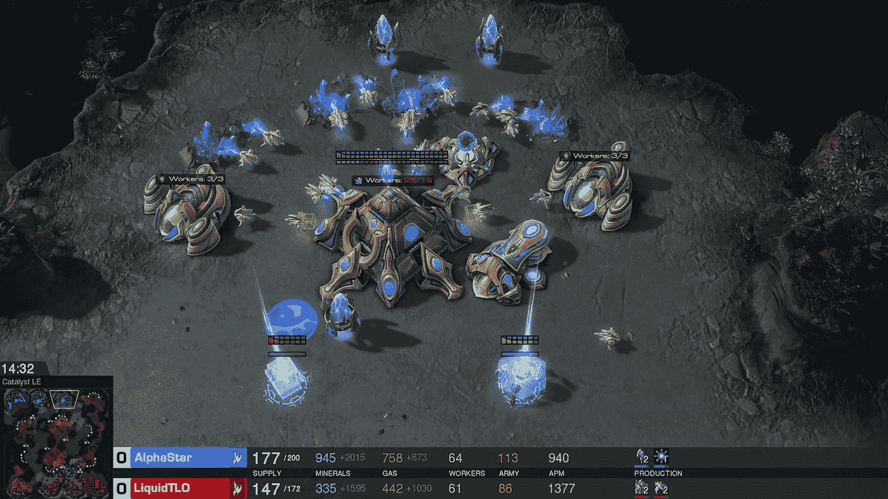

# 阿尔法星的进化

> 原文：<https://itnext.io/the-evolution-of-alphastar-cefff389b9d5?source=collection_archive---------1----------------------->

DeepMind 演示 AlphaStar 击败人类玩家

几天前，DeepMind 宣布了他们的星际争霸 2 机器学习机器人的最新版本，现在被称为 AlphaStar。自从他们在 2017 年 8 月宣布[星际争霸 2 学习环境](https://twitter.com/deepmindai/status/895331840264814592?)以来，发生了太多的变化。大卫·西尔弗因其在像 [AlphaGo](https://deepmind.com/research/alphago/) 这样的项目中的强化学习经验而受到高度评价，他已经加入了这个团队，这个团队似乎已经有了很大的发展。

回到 2018 年的 Blizzcon，DeepMind 展示了一个机器人，它在最难的游戏 AI 中取得了 50%左右的胜率，相当不错但并不令人兴奋，那么在过去的几个月里发生了什么变化？我想他们会很乐意展示决定性的击败 TLO 和马纳，但似乎他们还没有准备好。

从现在开始，我将推测车队可能做出的决定。我不知道团队的内部运作，也不知道他们使用的神经网络配置，但对我来说，他们似乎以重要的方式改变了他们的方法，以提高他们的成功。

坦率地说，我是 PySC2 框架的贡献者，我与 DeepMind 团队有过一些互动。这可能会影响我的看法。我从未从 DeepMind 获得任何经济或其他利益。我确实收到了暴雪的一些财务报销来参加 AI 峰会，明显少于我的开销。

# “全图”视图

当 PySC2 首次启动时，它只支持通过“屏幕”和“小地图”进行交互。这非常类似于人类与游戏的互动方式。在演示中，我们看到 AlphaStar 可以看到他们的整个地图，其详细程度与之前的“屏幕”功能大致相同。

PySC2 中屏幕和小地图观测的演示

随着[原始单元](https://github.com/deepmind/pysc2/blob/master/pysc2/lib/features.py#L432)的引入，这一功能似乎已经成为可能。最重要的是，代码注释提到:

> 这与 feature_units 不同，因为它包括屏幕外的单位和隐藏单位，并且单位位置是根据世界单位而不是屏幕单位给出的

这句话对我来说最重要的部分是“屏幕外的单位”和“世界单位”。不要对“隐藏单元”部分做过多解读，从我的理解来看，这并不像听起来那么邪恶，API 在这里只暴露了有限的信息。

演示“全图”观察和行动

对我来说，这是我见过的最重大的变化。虽然许多人可能认为这是一个“骗局”，但我真的认为这是对难度和复杂性的合理降低。我的猜测是，这是一个短期的调整，以证明他们的机器人可以在更简单的场景中做得很好。

训练机器人理解屏幕如何适应整个世界是一个复杂的问题。机器人似乎很难理解屏幕外的单位如何继续移动。还有一个风险是，机器人知道移动屏幕会暴露敌人，这可能会导致负面结果，这可能会阻止它将屏幕移动到敌人单位附近。它可能不知道屏幕移动没有导致敌人单位出现。

最终，我毫不怀疑 DeepMind 将增加他们的机器人的复杂性，使其在局限性方面更像人类。我这样说是因为这似乎是共同领导奥里奥尔·维尼亚尔斯认为他的最终目标，一个与人类在同一水平上竞争的“纯粹”机器人。

我们已经看到了这方面的一些进展。当机器人第一次玩 TLO 和马纳时，从我对 DeepMind 评论的理解来看，屏幕运动有点像脚本。这似乎是明智的，API 允许机器人在世界空间中观察，但它仍然必须在屏幕空间中行动。唯一的例外是暴雪已经修改了 DeepMind 的 API，并且还没有发布修改(这种情况会发生)。

***更新*** *:我被告知，画面移动是 DeepMind 在事后添加的，目的是让回放更有趣，实际上并不是机器人为了执行动作而与游戏互动的一部分。*

后来，当机器人在直播比赛中发挥法力时，他们提到机器人已经被训练成自己移动屏幕。这不是一个小壮举！它增加了许多动作的复杂性，因此机器人现在必须知道移动屏幕是成功序列的一部分。它还大大增加了行动空间，这取决于小地图的分辨率。

# 他们从人族转到了神族

如果你看看 2017 年的最初作品，你可能会发现他们最初有一个人族机器人。这似乎合乎逻辑，人族相对于神族或虫族有一些优势:

*   建筑物没有能量或蠕变限制，因此放置并不困难。只要有建造的空间，和必要的先决条件，它就可以建造。
*   海军陆战队只消耗矿物，可以射击地面和空中单位，不需要额外的建筑。这将允许机器人在早期取得相当大的成功。

DeepMind 宣布星际争霸 2 学习环境

即使在早期，他们面临的主要问题是，他们的机器人经常会抬起并飞离建筑物。他们的论文中提到了这一点。

> 最成功的代理，基于没有记忆的完全卷积架构，通过使用人族提升和移动建筑物到攻击范围之外的能力，设法避免了持续的损失。这使得简单的人工智能很难在 30 分钟的时限内获胜。

根据我的经验，即使对于脚本机器人来说，提升和降落建筑物也很难操纵，神经网络似乎很容易陷入“不要输”的结果中。

还有一个“bug”让我很沮丧，可能也是导致 DeepMind 决定脱离人族的原因。当试图放置一个附加组件时，API 中存在一个错误，不能正确接收“快速”操作。这是人类按下相关热键时采取的动作，附加组件会自动放置在建筑物旁边。不幸的是，API 要求您指定放置附加组件的屏幕位置，如果位置不够近，建筑物就会升起，就像没有足够的空间一样。这将触发建筑物着陆问题，并且必须通过正确的命令来着陆以便放置附加组件。

那么他们为什么会选择神族而不是虫族呢？显然是航空母舰！不过说真的，看起来爬行蔓延和建筑物和单位的持续变形对机器人来说是很难学会管理的事情。

***更新:*** *我被告知实际上有一个关于孵化基地集合点的 bug 可能会妨碍有效的虫族训练*

# PySC2 改进:工人计数

这是最初的 PySC2 中令人难以置信的遗漏之一，让我感到困惑和愤怒。我不能可靠地编写一个机器人来正确地管理工人，因为没有简单的方法来告诉多少工人在一个基地或 vespene 间歇泉，但这些信息对人类来说是免费的。如果我不能手动编写机器人脚本，机器学习机器人会怎么做？

没有适当的工人管理，很难有效地收集矿物和气体，这使得很难生产更先进的单位和研究升级。有可能你所有的工人都依赖天然气，而你没有矿产收入，反之亦然。这是我进步的主要障碍。

为了解决这个问题，我在 PySC2 中创建了[特性单元](https://github.com/deepmind/pysc2/blob/master/pysc2/lib/features.py#L166)功能，公开了理想的和当前的工作人员数量。这是后来作为原始单元功能的一部分建立的。有了这些新信息，AlphaStar 有效管理资源就会容易得多，因为它可以对原始数据做出反应，而不是试图解释屏幕上的单元位置。

描述机器人与最难的游戏人工智能的互动

# PySC2 改进:订单长度

游戏中最重要的一个细节是单位生产和升级的进度，这个细节似乎缺少或者很难从 API 数据中提取出来。虽然你可以在选择建筑时获得这些数据，但人类实际上可以看到建筑上方的进度条，以指示当前生产项目的进度，因此如果机器人必须选择一个单位才能获得这些数据，它将处于不利地位。此外，当您选择生产建筑时，您可以看到排队的物品数量。这不容易从 API 中提取。

为了至少深入了解生产过程，在原始单元中添加了[订单长度](https://github.com/deepmind/pysc2/blob/master/pysc2/lib/features.py#L194)属性。虽然它没有公开生产进度，但是它公开了排队项目的数量。这将有助于机器人跟踪生产队列，给出更可靠的操作结果。

据我所知，order length 属性也可以用来跟踪一些事情，比如一个单位需要执行的动作数量，比如移动、攻击、建造建筑。这再次为机器人提供了更加一致的信息，这是以前无法获得的，也使机器人更难跟踪其行动的结果。

# 他们采用并放弃了 RGB 层

当我参加 Blizzcon 2017 的人工智能峰会时，有一个功能似乎真的让人们兴奋起来，这个功能是 RGB 层。这本质上是游戏的图形表示，就像人类看到的一样。这可能是机器人观察游戏最纯粹的方式。我的猜测是，人们(包括 DeepMind)认为这将开放使 [Atari](https://deepmind.com/research/publications/playing-atari-deep-reinforcement-learning/) 机器人适应《星际争霸 2》环境的能力，因为这些机器人完全基于图形游戏输出。

谷歌在 2018 年的 I/O 上展示了一个简单的 Pong 代理

我不认为 RGB 层能够像他们所希望的那样进行调整，这种方法现在似乎已经被放弃了。RGB 层可能会在未来的某个日期重新引入，因为它似乎确实代表了对机器学习的一个重大挑战，即观察少量视觉信息并将其与对未知环境的整体理解联系起来的能力。

# 一张地图

能够看到一个新的地图，并立即应用之前的学习，以在新的环境中发挥最佳似乎是一个有效而复杂的挑战。即使对于脚本机器人来说，至少告诉机器人自然和第三个资料片的位置，以及敌人的可能位置也是很重要的。将训练减少到单个地图是降低复杂性的清楚和明显的方法。

我想象这实际上可能是 AlphaStar 的下一个扩展之一，使用卷积神经网络(CNN)等概念来理解与地图较小部分或特征的交互，这可能在其他地图中很常见或相似。

# 单一对手比赛

你可能已经注意到 AlphaStar 目前只在神族 vs 神族镜像对决中比赛，这是之前用 [OpenAI 的 Dota 2 bot](https://blog.openai.com/openai-five/#restricted) 尝试过的。这实际上有一些好处，首先，它简化了提供给机器人的关于敌人的信息，而不是必须考虑所有种族的可能性，数据集更加有限。

镜像对决的另一个好处是每场比赛产生两倍的信息量。两个玩家对学习过程的贡献是一样的，包括为了赢该做什么，以及因为会导致失败而不该做什么。这个过程俗称“自玩”，由 AlphaStar 以 AlphaStar 联盟的形式进行演练。

毫无疑问，AlphaStar 最终将参加所有比赛，但是目前 API 中存在一些限制和错误，可能会延迟进度。

# 从人类录像中监督学习

AlphaGo 最初是在人类游戏中训练的，但最终演变成了 [AlphaGo Zero](https://deepmind.com/blog/alphago-zero-learning-scratch/) ，它只能通过与自己对弈来学习。AlphaStar 似乎也走在同样的道路上，首先从人类录像中学习，最终很可能会在与自己对抗的游戏中进行纯粹的训练。

在人类重播上训练机器人是一种很好的方式，可以确保你的神经网络结构是健全的，并产生可靠的结果，本质上你是在测试你的机器人可以做合理的统计分析和结果预测工作。一旦你证明你可以让它自由，探索未知，并想出新的策略，如过量生产探针。

# TPUs

虽然神经网络结构和机器学习技术已经取得了重大进展，但硬件因素不容忽视。谷歌一直在开发被称为张量处理单元的处理硬件，这些处理硬件是专门为尽快计算神经网络任务而设计的。

暴雪开发了一个修改版的星际争霸 2，它的运行速度和计算速度一样快，这意味着整个游戏可以在几分钟内完成(或者更快)。这些游戏玩得越快，研究人员就能越快确定他们的网络架构是否产生了预期的结果。

设计和测试网络架构的加速过程允许比以前更快的适应和发展循环。在演示过程中提到，机器人在与人类对手比赛的间隙接受了一两周的训练。随着硬件能力的提高，同样的事情可以在几天甚至几小时内完成。

# 他们作弊了吗？

我看到一些人说 AlphaStar 赢了，因为它使用了不可能的高 APM 来实现疯狂的微。这可能是真的，我还没有足够彻底地调查回放，以了解这种或那种方式。在我看来，DeepMind 似乎不太可能向高度技术化的观众发布这样的重播，而不期望他们找到这些信息。“作弊”这个词意味着一些故意的恶意，我认为这是极不可能的，因为这会对团队的声誉产生显著的负面影响。

AlphaStar 与 LiquidTLO 竞争

为 DeepMind 辩护，我能立刻想到两个场景。首先，他们只是失算了。虽然这似乎有点不太可能，但考虑到他们团队中令人惊叹的大脑，然而如果他们在很长一段时间内平均 APM，那么他们的指标可能会有点不可靠，极高的爆发随后是极低的爆发。据我所知，这个机器人是很快组装起来的，所以他们可能没有足够重视这个指标。

我能想到的第二种情况是，他们认为额外的 APM 来自“无效”的动作，不是在传统的 EPM 意义上，而是在补偿人类如何与游戏交互，以及机器人必须如何通过 API 与游戏交互之间的差异。这些行动可能包括相机移动或信息发现(见我对生产进度的评论)。

***更新:*** *我被告知相机移动对 APM 没有贡献。我确实有一个未经验证的理论，即执行“全图”动作的方式可能会提升 APM。*

在任何情况下，即使有一个增强的 APM，我认为机器人能够学会利用这一点并表现良好是非常不可思议的。我确信，任何与“不公平的”杀伤人员地雷有关的问题都会得到处理。

对我来说，机器人能看到人类看不到的整个地图的细节这一事实要重要得多。APM 问题似乎是可以解决的，只需调整执行和/或衡量行动的方式。能够在看不到整个地图的情况下表现良好是一个更难克服的障碍。