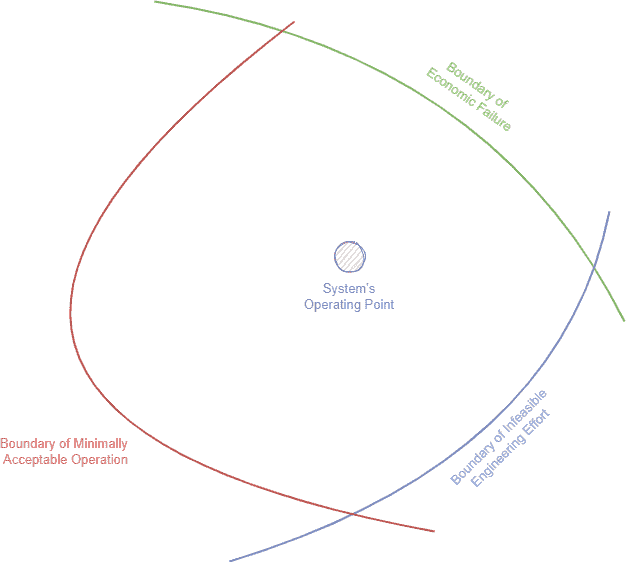
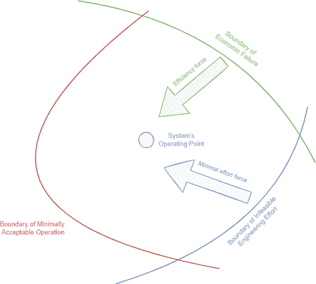
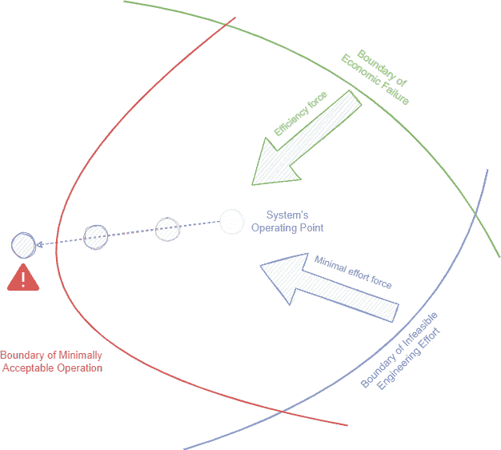

# 质量保证失败的原因

> 原文：<https://itnext.io/the-forces-opposing-quality-assurance-a14544a82105?source=collection_archive---------3----------------------->

奇怪的是，我们不再问为什么我们的软件不能工作，而是问它最初是如何工作的。我把这解释为现代系统的复杂性和质量保证不够努力的症状，这种质量保证跟不上现代应用程序不断增长的挑战。

事实上，质量并不是一个经得起时间考验的静态属性，我们不能简单地实现它就完事大吉。相反，它是一种腐朽而短暂的特质，我们必须通过公司各层的深思熟虑的行动和过程来关心和培养它。尽管保证质量和稳定性是软件工程中不可替代的优先事项，但我们仍然见证了严重的事件，这些事件通常会给业务带来巨大的影响。

# 事故致因模型

Rasmussen [提出了一个事故因果关系模型](http://sunnyday.mit.edu/16.863/rasmussen-safetyscience.pdf),在该模型中，他阐述了风险管理背景下系统的不同界限，展示了维护安全所需的勤勉。下图显示了对该模型的修改。

改编了拉斯姆森的风险模型

一个给定的成功的商业模型总是在图中描绘的三个边界内运行

*   经济失败的**边界**代表一个企业的经济可行性，一个在边界之外运作的系统在经济上是不可行的。
*   **不可行工程努力边界**代表构建和维护给定系统的努力或人力。在这个界限之外运行的系统非常复杂，或者工作人员不具备构建或维护它们所需的知识。最初，Rasmussen 将其命名为不可接受的工作负荷的边界，例如在战争时期超过工作时间，这最好地解释为软件工程系统中不可行的工程努力。
*   最低可接受操作的边界代表系统在不发生冲击事故的情况下所能达到的极限。一旦一个系统的运行点越过了这个界限，一个有影响的事故就必然会发生。

# 内在的力量

前两个边界产生自然力，将系统的工作点推向最低可接受操作的边界。如果没有刻意的行动来维持和保护质量，标准软件系统的操作点将会缓慢而确定地向那个边界移动，最终当边界被突破时会产生一个有影响的事件。

影响系统工作点的力

> **效率力**

企业的主要目标是盈利。这个目标创造了一种力量，使系统的运行点远离经济失败的边界。造成这种自然压力的因素有几个，例如:

*   产品创新和自然产品进化；
*   尽可能高效地组织资源和团队以实现业务目标的管理工作；
*   基础设施成本降低和优化；
*   不真实的截止日期和雄心勃勃的业务承诺；
*   频繁的优先权转移。

这种对经济失败边界相反方向的压力不一定是坏的，一个企业必须继续发展其特性并保持盈利才能存在。然而，盲目地坚持这些做法而没有刻意的反压力，必然会在系统中产生重大事件。我敢肯定，当您听说由于过于雄心勃勃的截止日期、频繁的功能优先级转移或由于利润目标而系统地将产品开发置于技术发展之上而导致的关键事件时，您不会感到奇怪。

> **最小作用力**

软件工程团队的正常操作有一定程度的自由度，允许变更、改进和优化。这种自由度对于持续改进行动至关重要，同时也为组织提供了空间，使其能够做出改变，从而最大限度地减少特定计划所需的工作。这些优化很容易陷入一种误区，即虽然最大限度地减少了劳动力，但也为事故的发生创造了条件。这些可能包括:

*   选择战术解决方案，而不是完全可扩展和可维护的解决方案(例如，由于过于雄心勃勃的截止日期)；
*   增加技术债务以加速任务；
*   决定使用熟悉的过时技术，因为与升级或使用正确的技术相比，这需要更少的努力；
*   将没有经验的人投入到一个项目中；
*   未能组建拥有合适技能的团队或提供足够的培训；
*   架构和领域的不熟悉和复杂性。

不幸的是，由最小化努力、技术债务或糟糕的设计选择引起或影响的事件太频繁了。这些因素在与不可行工程努力的边界相对的系统操作点上产生一个力。

# 系统失败的压力

这些力将不断地将系统的工作点推向最低可接受操作的边界。一旦遭到破坏，系统将遭受一次有影响的事故。

由其他力量的压力引起的事件

考虑到这一点，我们可以问什么样的动作会将系统的工作点推离最低可接受操作的边界？例如，一个有影响的事件，激烈地将操作点推离边界，不管它需要多少成本或多少工作量，我们都必须解决这个问题。例如，事故通常是质量保证实践的驱动力，但是仅仅对它们做出反应很难是一个可持续的策略。

# 建立复原力

防止事故发生的唯一方法是用有效的反作用力对抗这些力量。如果保持质量的正确策略和深思熟虑的行动到位，我们就可以调解由其他边界引起的压力，并防止重大事件。

所有力量之间的平衡

然而，这需要公司做出合理的努力和坚定的承诺，投资于恢复行动。这些因素有助于形成有效的复原力:

> **工程管理**

工程管理不仅仅是人员管理。一个经验丰富的工程师经理应该知道做战术解决方案和增加技术债务对系统的长期可伸缩性、性能和可维护性的影响。虽然有时是必要的(毕竟是业务使公司在经济上可行)，但技术债务不能被遗忘，需要通过深思熟虑的策略来管理。工程经理在维护系统的性能和可维护性方面起着关键作用。根据公司的背景，它可以遵循不同的方法，例如:在实施技术债务解决方案以遵守业务期限之后，在路线图中保证空间以实施结构化解决方案；与利益相关者协商增加产品计划的努力，以解决技术债务；为路线图中技术计划的需求辩护，等等。

> **培训和知识分享**

保证每个工程师都有正确的专业知识、背景，以及对系统和他们工作的影响的整体看法，这对于避免事故和意外情况是至关重要的。这可以是一系列不同性质的行动，如通过结对编程、代码审查、知识共享等确保正确的指导到位；系统的高级文档(例如通过 DDD 的环境图)；紧密的领导指导和对每个案例的适应性发展计划的定义；易于访问实时流程、绩效指标和用户反馈循环等。

> **监控、追查、危言耸听**

监控、跟踪和危言耸听是理解系统如何随时间变化的关键。使用正确的工具和数据检索机制，可以监控系统，了解操作点与最低可接受操作的边界有多接近，并在关键事件发生前采取行动。通过有效的 SLI 和 SLO 定义以及关键业务流程的确定性概述，我们可以全面了解系统的性能并预测可能出现的问题。这尤其与具有几个移动部件的分布式系统相关，在这种情况下很难对系统有一个全面的了解。

> **弹性策略**

一个重要的方面是保证在开发过程中的一切都是建立在弹性的基础上的。这可以从设计具有回退过程的弹性高级解决方案到重试、断路器或隔离模式的低级实现。它还包括基础设施方法，如负载平衡器、速率限制器，以及通过相同应用程序的几个实例实现高可用性等。

> **缓解和反应**

同样重要的是，要有合适的工具来减轻可能出现的错误情况，并使系统恢复正常运行。对潜在关键事件的快速反应可以极大地限制其影响。为此，通常需要从头开始设计缓解策略和工具。例如，这可以包括在事件驱动系统中停止或倒带消费的工具；恢复丢失或不一致数据的方法；快速回到不同来源的能力等。

> **正确的质量保证政策**

质量保证包括几个不同的方面，重要的是要了解系统从哪些方法中获益最大，并相应地进行调整。端到端测试可能适用于单一系统，但是高度复杂的分布式系统可能会受益于自动化、预生产和生产验证的组合。质量保证还涉及到从规范到持续交付的流程设计，以保证实时生态系统中意外问题的影响最小。总的来说，有一个持续不断的需求来保持对质量保证实践的投资，并且有一个持续关注的承诺来发展它们。为了满足业务需求而对这些过程的懈怠会很快将系统的操作点转移到不可接受的操作的边界。

> **持续改进**

建立一种持续改进的文化，并保持开发和交付过程的迭代是保持其他力量健康平衡的关键。

一个重要的陷阱是避免一个比其他两种力量更强的弹性力量。例如，一个为了保持稳定性而冻结发布次数过多的公司可能会被能够更快交付的竞争对手超越。如果有非常复杂的质量保证过程，使得交付过程过于复杂和耗时，也会发生同样的情况。

# 结论

关键是保持各种力量之间的健康平衡。每一个都有一个目的，关键是保证一个力量不会被其他力量压倒。然而，这与复原力尤其相关。通常，其他两个是有机地维护的，很容易降低行动的优先级以维护系统的弹性和保证质量，因此会导致向最低可接受操作边界的不平衡。

弹性通常是知道最低可接受操作的界限在哪里，并保证系统的操作点不会违反它。这种模式提出了需要有深思熟虑的行动和战略，以保持质量。如果没有坚定的警惕、有意义的行动和对质量过程的有意承诺，有影响的事件是不可避免的。相对于业务优先级而言，容易被忽略的事情。对于最好的公司来说，作为工程师，我们的使命不仅是提高意识，而且是质量流程的坚定守护者，扮演一个真正有弹性的力量来保护我们的系统和用户。

如果你有兴趣加入 Medium，我会非常感谢你使用我的推荐页面，谢谢！

 [## 通过我的推荐链接加入 Medium—Hugo Rocha

### 作为一个媒体会员，你的会员费的一部分会给你阅读的作家，你可以完全接触到每一个故事…

medium.com](https://medium.com/@hugo.oliveira.rocha/membership)