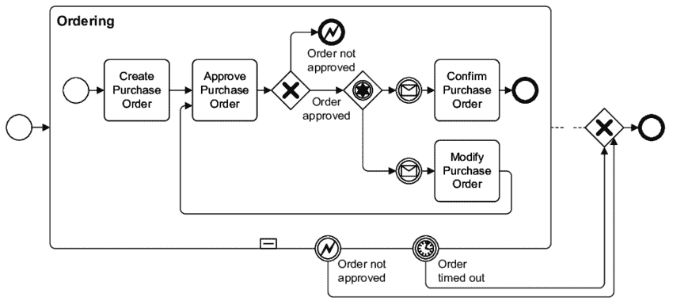

# 现代企业:代码中的商业

> 原文：<https://itnext.io/the-modern-enterprise-business-in-code-c6a5e0f4ed7e?source=collection_archive---------6----------------------->

第 1 篇—机器人过程自动化

这些文章是给谁的？

我将撰写一系列文章，在这些文章中，我们将学习现代机器人过程自动化技术、应用于商业的人工智能以及其他与创新、商业和技术相关的主题。

作为埃森哲的一名全职数据科学家，我参与了许多 RPA 项目，在过去三年中，我一直在严格研究该领域，并开发了一套最佳实践以及一个 python 库，允许业务分析师和计算机工程师深入研究 RPA 世界。你可以在 https://dkatz23238.github.io/[的我的博客上关注我的文章和代码。](https://dkatz23238.github.io/)

这些文章面向任何人，他们不仅想学习如何用 python 开发 RPA，还想在组织中建立 RPA 卓越中心，使用 AI 增强 RPA，并学习一般的 BI 和数据科学概念。我们将讨论为什么 Python 是 RPA 开发和自动化的理想选择，具体的编程概念，RPA 概念，并创建演示解决方案。不需要预先的编程知识，因为我们可以一路学习。如果你已经知道如何编程，但想学习更多关于机器人过程自动化的知识，这些文章也将是有用的。

如果你想今天就开始制作 RPA，来看看我的图书馆[这里](https://github.com/dkatz23238/pybotlib)。

所有的材料和内容都是完全免费的，任何人都可以使用。这第一篇文章之后将是视频和更多文章，深入探讨自动化、RPA 和 AI 的世界，以及商业世界中的创新。

在本文中，我们将为 RPA 领域的进一步发展构建一个坚实的理论背景。

**简介**

RPA 代表“机器人流程自动化”,是指使用虚拟机器人进行模拟人类工作的活动，以及机器计算，以实现业务流程自动化。
在数字时代，这些数字机器已经成为大多数公司的头等大事。据市场专家估计，到 2025 年，RPA 的开发和实施市场价值将达到 31 亿美元。

我开发了一个定制库，其中包含了用 python 创建 RPA 所需的所有工具。我会定期给这个包添加更多功能，你可以在我的 GitHub 上查看。
我的私人分支将拥有更多功能，但不能保证稳定性。稍后将提供更详细的教程，这些教程遵循 RPA 和业务流程的理论基础。

在本系列的最后，我们将深入分析一个业务案例，并构建一个 RPA 来解决它。我构建该库的主要原因是我在使用封闭源代码供应商解决方案时不断遇到障碍，使用固定供应商技术通常会带来 30% — 50%的 RPA 实施失败率；然而，使用像 Python 这样的开放技术，让我们利用集体知识的整个世界来解决更高层次的业务问题。

要开发企业级 RPA，我们不仅必须了解我们选择用于开发和生产的技术堆栈，还必须对我们正在为其开发自动化的业务和组织有一个明确的了解。了解业务流程管理背后的理论对于成功实施 RPA 至关重要。

**什么是 RPA？**

RPA 是一组技术和最佳实践，旨在通过将模拟人类交互与业务应用程序和系统以及机器专用任务相结合来实现业务流程自动化。当谈到业务应用程序和系统时，我们可以想到一系列经典的系统，如 CRM 和 ERP。
但随着全球经济的数字化进程加快，商业运作的几乎每个方面都将依赖于某种系统，无论是公司内部的还是外部的。

由于这种数字化浪潮，大多数后台办公工作都局限于各种业务系统的交互，以完成定义狭窄的任务，这些任务很容易由数字助理或机器人执行。RPA 不仅是一款软件，还是组织内部创新和现代化的驱动力。

企业总是试图实现更高水平的效率，以便在竞争中获得优势。尽管 RPA 相当新，但它的老兄弟，BPM 领域，却相当古老。没有转变到新的数字范式的企业将被他们的竞争对手消灭，如果他们还没有…(重磅炸弹谁？).在深入研究 RPA 之前，我们必须了解磁场的来源。

**业务流程管理。**

BPM 是一个广泛的学科，它与商业、经济、技术和物流领域交叉，以[发现](https://en.wikipedia.org/wiki/Business_process_discovery)、[模型](https://en.wikipedia.org/wiki/Business_process_modeling)、[分析](https://en.wikipedia.org/wiki/Business_analysis)，衡量、改进、优化和[自动化](https://en.wikipedia.org/wiki/Business_process_automation)业务流程。BPM 专注于通过管理业务流程来提高公司绩效。

这门学科被认为诞生于 19 世纪晚期，工业革命开始全面成熟。这个领域的贡献者可以追溯到泰勒、福特和法约尔的时代。过程的标准化、劳动分工和许多其他方法在这一学科的发展中具有重要意义。在整个 20 世纪，该领域主要关注工业企业的质量保证领域，我们开始真正看到统计方法和计算机在促进和加强企业努力方面的应用。

90 年代的. com 热潮和万维网的广泛应用引发了数字 BPM 工具时代的到来。有关 BPM 领域主要事件的详细列表，请查看 Frank J. Wyatt 的链接。

机器人流程自动化是业务流程管理领域的自然发展。它是使用数字机器人来执行一组特定的严格定义的任务，以执行关键的业务流程。它也为人类无法完成的任务提供了机会。

BPM 以及数字自动化、人工智能、认知计算、互联网 3.0 和其他创新技术的使用，使得大规模经济只有在信息时代才能实现。新的商业模式成为可能，现有的商业模式也在逐年增强。

考虑到每个流程或计划都只是实现企业战略的一种手段，在组织内采用 RPA 技术将是 21 世纪的关键区别。机器人流程自动化可以使用不同的工具开发，最著名的是闭源供应商解决方案，如 Automation Anywhere 或 UIPath。

RPA 也可以使用不同的编程语言(如 C#、Python 和 Java)开发，无需前期许可成本。我的 RPA 开发的成熟解决方案是使用 Python 和开源工具，并有大量的社区人员参与其中。

在我参与的许多 RPA 项目中，我总是觉得我能构建的自动化功能有限。尤其是在这个时代，大多数年轻的专业人士要么知道一些编程的基础，要么愿意学习基础知识，闭源供应商软件应该只被用作定制自动化的垫脚石。Zappier 或 Microsoft Flow 等在线自动化解决方案是对 python 中自定义 RPA 解决方案的极大补充，因为它们允许许多应用程序到应用程序任务的自动化。然而，当涉及到完整的端到端自动化时，它们非常弱，因为它们缺乏有效应用业务逻辑的灵活性。

**企业界**

采用 RPA 的组织通过建立 RPA 服务中心来实现这一目标，自动化工程师和业务专家在该中心共同工作，为从前台到后台部门的不同内部客户创建自动化。集中 RPA 中心可以实现敏捷的开发流程、可扩展性和灵活性。较小的公司通常会外包给外部顾问。

关于 RPA，必须了解一些关键事实:

*   90%的业务应用程序没有提供与新的数字解决方案集成的简单方法。集成这些系统的唯一方法是使用 RPA。100%的遗留系统不提供任何形式的 API 或系统集成便利。
*   RPA 可以处理临时、重复和实时业务案例。
*   RPA 推动组织形式化和标准化他们的业务流程。
*   RPA 的发展通过减少特定业务流程所需的人员数量(减少全职员工)来实现硬性节约。
*   RPA 开发不需要大规模的系统集成预算或资源，例如全面的 ERP 集成。可以在组织内建立一个小型 RPA 服务卓越中心，并轻松扩展到向不同的内部和外部客户提供数百项服务。例如:如果您的组织正在使用旧式 ERP 系统，但希望添加新功能(如智能发票管理)，您的组织可以构建 RPA 来与您的旧式系统交互，并为您提供此服务。没有必要迁移您的整个 ERP。

**RPA 系统的组件**

rpa 系统的组件有多种形式，具体取决于供应商和/或实施方法，但是，它们几乎总是包含三种不同的工具，这三种工具相互交互以形成一个系统:rpa 代理、rpa 服务器和 RPA 开发人员工具包。

*特工*

RPA 代理是指在单个主机上执行的应用程序/代码，用于执行 RPA 开发人员编写的特定业务逻辑。单个代理独立地执行业务逻辑和任务，并且可以扩展以满足不断发展的需求。根据公司的不同，主机将运行微软的 Windows 或者某种 Linux。较大的组织通常有自定义的 MS Windows 映像，为与企业应用程序的交互提供额外的安全性和功能。大多数封闭解决方案只能在 MS Windows 上运行(如 Blue Prism 和 Automation Anywhere)。然而，定制的 RPA 解决方案通常运行在 Linux 上，因为它们具有轻量级、简单性、灵活性和总体安全优势。运行 RPA 的主机最好尽可能轻便。

*服务器*

RPA 代理往往独立工作，由中央服务器进行协调。RPA 服务器将运行后端数据库、代码版本控制软件以及特定于任务的微服务，可以开发这些微服务来处理计算密集型任务。
如果 RPA 团队正在使用 python 或 Java 代码，他们肯定会运行某种 git 服务器来对代码进行版本控制，并且通过使用 Docker 等容器化应用程序，我们可以轻松构建安全的定制 RPA 服务器，这些服务器可以托管各种服务和后端任务。

*开发者工具包*

RPA 开发中最重要的因素是将项目公之于众的开发人员和业务专家。用于 RPA 实施的每个工具堆栈都将包含一个开发人员工具包。这些工具允许开发人员设计、开发、测试和实现 RPA。RPA“蓝图”或源代码是使用工具包开发的，然后可以部署到主机上，在那里作为代理运行。我创建的 python 库 Pybotlib 是一个用 Python 开发 RPA 的工具包。

**分析 RPA 开发的业务流程**

编程可用于开发各种不同的产品，包括智能手表应用程序、网站、移动应用程序、真实世界的嵌入式系统等等。

为了成为一名成功的自动化工程师，不仅要对技术工具有很强的理解，还要有很强的业务流程管理能力。
需要理解的最重要的概念来自管理和组织设计领域。

企业有各种形状和规模，它们的结构配置是由许多经济、社会、政治、内部和外部因素决定的。即使影响组织结构的许多潜在变量是相似的，相同类型的组织(e.j .保险公司)也可以有非常不同的组织设计。组织的最高层决定了策略和文化，这种策略和文化渗透到组织较低层的计划和操作中。

每当着手一项新的 RPA 开发时，了解该流程的来龙去脉以及它在组织金字塔中的位置是至关重要的。谁是它的利益相关者，过程的输入是什么，它的输出是什么，它的重现是什么，以及过程中形式化的实际水平。除了了解我们的业务流程，我们还需要制定工作计划，并将我们的工作分成不同的阶段。

**造型**

有三个简单的模型可以帮助我们回答这些问题，因此将促进和加快我们的 RPA 开发流程。

软件开发生命周期

第一个模型帮助我们确定 RPA 开发的可靠项目计划。

尽管 RPA 与其他类型的应用程序有很大的不同，但我们可以遵循传统的软件开发生命周期方法来规划我们的项目。

1.  **分析:**开发人员对要开发的应用进行需求分析。
2.  **设计:**一旦分析了需求，就计划开发具体的组件。
3.  **开发:**通过编码或其他方式，如在界面内工作(如在 Automation Anywhere 或面向物联网的语言 Node Red 中)，设计的组件被赋予生命
4.  测试:我们对开发的应用程序进行筛选并评估其满足需求的能力的阶段。
5.  **维护:**一旦任何类型的软件被开发和测试，它就被投入生产，在那里它需要被监控和修复任何问题。在某些情况下，一旦投入生产，开发人员可以返回到第 1 步，继续将更多的功能集成到应用程序中，并扩展 it 服务器的需求。

几乎所有的软件周期都会遵循这 5 个步骤。

在 RPA 开发中,“需求分析”与我们对业务流程的理解以及我们能够对 RPA 开发产生影响的最有效方式紧密相关。

计划好我们的阶段后，第一步是参与业务流程理解。这是我们努力的目标，即发现当前的业务流程，并最终设计一个可实施的 RPA 解决方案。

我们可以将初始分析分为两个主要部分:配置分析和过程分析。第一个涉及过程在组织内的位置和范围，而第二个关注过程本身的细节。

**业务层级和自动化**

当在您的组织中建立 RPA CoE(一组业务和技术专家，他们一起在公司中创建自动化)时，您很可能将服务于广泛的客户，并且将不得不处理跨越组织不同末端的项目。了解您的流程在组织中的位置是非常重要的。一个需要理解的有用模型是用于层次分析的明茨伯格模型，它是以加拿大管理学者亨利·明茨伯格的名字命名的。他的一个分析集中在配置上，配置是设计和分析组织的一个关键维度。下面简要介绍了该模型及其对我们 RPA 开发流程的益处:

1.  **战略顶点**是最高管理层及其支持人员。在学区，这是学校的督学和行政内阁。
2.  **运营核心**是实际执行组织任务的工人。教师是学区的运作核心。
3.  **中间线**是中下层管理。校长是学区的中层管理者。
4.  **技术结构**是分析师，如工程师、会计师、规划师、研究员和人事经理。在学区内，教学、业务、人事、公共关系、研发等部门构成了技术结构。
5.  **支持人员**是提供间接服务的人。这可能包括人力资源、设施、安全和维护

因此，在 RPA 开发中，确定以下内容非常重要:

*   谁是业务流程的主要利益相关者？
*   涉及公司的哪些部门？
*   执行哪些单独的功能？
*   在流程的不同阶段需要哪些授权或批准？
*   流程的范围是什么？有时流程范围没有明确定义，RPA 实施将澄清范围，并允许成员拥有业务流程的特定部分。

这些关键部分的相互协调、指挥机制、集中化和正规化及其相互关系是一个组织成败的决定性因素。明茨伯格分析的一个主要观点是，你在组织金字塔中的位置越低，通常就会有更高程度的形式化和过程文档。对于 RPA 开发人员来说，这是一个很好的机会，因为这意味着许多较低级别部门的工作仅限于定义狭窄且记录良好的任务。

知道流程位于何处，谁是参与者，涉及哪些部门，会影响谁将帮助我们在整个组织中扩展我们的自动化。构建服务于几个组的不同 RPA 是很常见的。作为一名自动化工程师，你将有机会听到来自不同利益相关者的观点，这是一个独特的观点，将使你能够提供更高质量的咨询和开发服务。

记住这一点总是有用的:组织的最高层定义了贯彻到战术和运营中的战略和文化。没有过程是孤立存在的，在一天结束时，每个过程都是一组松散耦合和协调的狭义定义的任务集。了解如何开发虚拟机器人来执行这些松散耦合的任务，然后将它们协调到一个价值系统中，这是 RPA 实施成功的关键。

**流程分析**

继续我们分析的第二个方面，这让我们理解我们真正所指的**业务流程**并介绍我们在进行 RPA bot 开发之前必须问的一系列问题。

让我们给业务流程和自动化找一个字典定义:

“业务流程是能够实现特定组织目标的一项或一组活动。业务流程应该有明确的目标，尽可能具体，并有一致的结果。”

“自动化是技术及其应用的创造，目的是控制和监测各种商品和服务的生产和交付。它执行以前由人类执行的任务。”

当我们提到一个业务流程时，我们指的是一组接受某种输入、付出努力并产生某种输出的活动。流程的输入和输出可以随后提供给其他业务流程，也可以由其他业务流程提供。流程是指活动的一般输入-转换-输出关系。当我们提到执行过程的特定方式时，我们指的是程序。相同的过程可以通过不同的程序实现。形式化和标准化是组织可以记录过程并通过策略来执行它们的手段。大多数组织都会以职能手册和流程图的形式，用文字和图形来表示他们的程序。这些表示不仅描述了理想的业务流程，还应该考虑可能出现的自然差异。这些差异或例外通常可以被狭义地定义，并减少到一个可能结果的小列表，例如:“提交的表格不正确”、“系统中找不到客户号”、“身份证号缺少一个数字”等。

**业务流程图示例(流程图格式)**

业务流程不是孤立存在的。他们是整个系统的一部分，这个系统是从一个组织的使命和愿景中渗透出来的。组织内的整个信息流和流程被称为价值链。企业的价值链是构成企业的所有业务流程、政策、目标、计划、战略和计划的总和。随着业务流程的日益数字化，越来越多的数据和信息将成为某些流程的输入或触发因素，变得越来越数字化。因此，了解包含可以在计算机上运行的文件和系统的数据类型非常重要。从简单的。txt 文件转换为一个巨大的 SQL 数据库，公司将有各种各样的业务流程以不同的方式数字化。一旦一个组织采用 RPA 并建立了正式的 CoE，构建的 RPA 越多，您就有越多的知识和代码来处理更多的自动化。

作为 RPA 开发人员和自动化工程师，我们的工作是理解和分析业务流程，并设计将组织的需求与 RPA 的能力相结合的提案。从本质上说，我们不仅编写和测试代码，而且还设计现有流程的新程序。虚拟员工的出现打开了许多以前不存在的新大门。不熟悉 RPA 开发的人可能连这些简单的事情都想不到。

当咨询特定的团队时，有许多技术可以用来发现和理解业务流程。你可以参考官方文件，如功能手册和流程图，但你也可以直接采访相关员工。为了对流程有一个全面的了解，采访流程的接收者以及其他利益相关者也很重要。

一旦工程师清楚了当前的事务状态，他们“按现状”记录过程是很重要的。这对于衡量 RPA 开发可以产生的效率至关重要。回想起来，最终的 RPA 开发和随之而来的新程序应作为“未来”解决方案进行记录和原型制作。

总结我们对业务流程的分析，在考虑自动化流程时，请记住分析以下几个方面:

*   流程中使用的数据的性质是什么？数据数字化了吗？为了访问数据，需要查询多少系统？数据以何种特定的文件格式存储？
*   在我们的业务流程中有多少具体的输入？输入可以是 web 应用程序或桌面界面中的特定字段，也可以是某个事件的接收。
*   业务流程中有多少是基于标准化的规则和人的判断。通常，你在组织中的职位越低，你的流程就越正式
*   业务流程的稳定性如何？流程是否会发生许多变化？我们与之互动的系统会有很多变化吗？这些问题对于估计我们可能需要为 RPA 提供多少维护非常重要。
*   我们的自动化需要处理多少异常。例外是现实世界中任何不按预期执行的事件。这种情况的一个例子是收到一个不正确填充的表单，并且由于这种差异而不得不采取特定的操作。

清除业务流程的基础知识让我们确保对与机器人流程自动化相关的关键概念有一个牢固的理解。

**RPA 风味和分类**

可以开发不同类型的 RPA 实施。主要分类是由于其出席的性质。如果 RPA 可以在远程环境中完全自主运行，那么我们认为此 RPA 是无人值守开发。另一方面，如果 RPA 只是帮助用户，而机器人没有在无人值守的环境中运行，那么我们认为这个 RPA 确实需要有人值守。为了实现无人值守的解决方案，总是倾向于设计足够多的业务流程，这自然会节省更多的人员。

RPA 的两种类型是:

**出席:**RPA 在人工监督下运行，用于提高生产率/效率。这种类型的 RPA 可以通过双击快捷方式来触发。很多时候，出于安全原因，组织的 IT 部门没有必要的安全设置来完全自动化流程并为 RPA 提供访问系统的凭据，因此我们可以创建半自动机器人，除了将机密凭据输入系统之外，它可以做任何事情。

**无人值守:**RPA 能够端到端运行流程，无需人工直接协助。这些 RPA 更受欢迎，因为它们可以实现更高的节约，并且可以在虚拟云环境中运行，从而提供更高级别的可扩展性。

**识别并与系统交互**

RPA 开发的一个重要元素是与各种业务系统(如 ERP、CRM、云存储、网页等)进行交互的能力。在大多数情况下，RPA 将直接模拟人类活动，因为系统不提供另一种操作方式。

然而，在某些情况下，系统或应用程序通常以 REST HTTP API 的形式提供 API，其中不需要模仿人类交互，并且可以通过使用 HTTP 请求以编程方式完成与系统的修改/交互。所有编程语言和 RPA 环境都包括使用 http 请求的方法。

当模仿人类活动时，有三种主要的自动化技术可供我们使用。通过 API 与系统交互总是最好的，但是大多数遗留系统不提供这个特性，所以我们只能选择模仿人类。根据与您交互的系统/应用程序的具体情况，会有不同的交互方式。

*基于网络的互动*

当一个应用程序被托管在互联网上时，它可以通过一个 URL 经由网络浏览器被访问。大多数应用程序都有一个可以访问的 web 客户端，与这些系统的主要交互是通过 web 进行的。在这种情况下，我们最重要的工具就是自动化 HTML web 元素的交互。这意味着我们将通过编程告诉我们的机器人如何找到特定的按钮、下拉菜单、链接或输入，让我们的 RPA 解析并处理 HTML 数据。这个过程很容易用 pybotlib 来完成，因为它提供了一些方法来健壮地选择 web 元素。

与网页交互的一般过程是启动自动化的 web 浏览器会话，并继续与元素进行交互。

例如:如果我们要创建一个创建发票的 RPA，我们将让 RPA 通过 URL 访问网站，然后在该页面上查找“创建新发票”按钮。这可以很容易地用 pybotlib 完成，我在大多数 RPA 项目中都使用这个库。

*桌面客户端交互*

有时应用程序没有 web 客户端，不能从浏览器访问。SAP netweaver 就是一个例子，因为 SAP 的用户通常必须通过桌面应用程序访问 ERP 系统。大多数生产力软件，如 Adobe Suite，只有桌面版本。尽管 Excel Online 已经存在，但 Excel 电子表格通常是用 MS Excel 处理的。当我们需要自动化一个既没有 API 也没有 web 界面的应用程序时，我们只剩下两个工具:窗口句柄(GUI 脚本)或击键自动化。

击键自动化是指 RPA 直接向应用程序发送鼠标点击和键盘敲击。尽管这种方法非常简单，但不建议仅使用这种技术来创建 RPA。主要原因是没有像 web 自动化中那样的程序化反馈。如果你发送一个点击到你的屏幕上，没有办法 100%确认这个点击是在你想要的特定按钮上执行的。

使用桌面应用程序的推荐方法是使用脚本语言和窗口句柄自动化。这种技术不是简单地发送击键和点击屏幕的特定位置，而是实际上与有问题的应用程序“对话”,并知道我们与这些应用程序交互的方式。其中一些桌面应用程序拥有自己的脚本语言，这些语言易于编写，并且可以从 Python 中完美地执行。Excel 的 VBA 和 SAP GUI 脚本就是很好的例子。

*HTTP API*

免责声明:关于 HTTP API，infosec 有很多方面。确保在没有 IT 支持或进一步研究的情况下，不要与组织中的任何企业 API 进行交互。

HTTP(超文本传输协议)是在万维网上传输文件(文本、图形图像、声音、视频和其他多媒体文件)的一组规则。该协议基于计算机科学中一个非常常见的设计模式:服务器客户端模型。一台计算机作为客户机向服务器请求某种数据，服务器提供数据。该协议的细节超出了本文的范围；但是，我们希望确保我们了解该协议的某些方面:

1.  如前所述，http 用于两台计算机相互通信。一个叫做客户端，另一个叫做服务器。客户端将向服务器发送请求，服务器将始终发送响应。有不同类型反应。例如，当一个 GET 请求被发送到一个找不到的 URL 时，标准响应是 404。当一切正常时，响应应该是 200。有不同类型的响应，但我们唯一需要知道的是大约 200 (201，202 等)的任何东西。)通常表示“一切正常”，而大约 400 表示响应有错误。再比如:403 表示未经授权。状态代码为 200 的每个响应都有与之相关的内容。对我们来说，我们需要知道的唯一事情是 http 响应将有一个状态代码和内容。(响应还包含带有内容元数据的标题。
2.  当客户机想从服务器请求数据时，它将通过互联网发送一个 http 请求。有不同类型的请求。我们将讨论的唯一一个是 GET 和 POST。具体来说，http 请求的不同类型是 http 方法。
3.  GET 请求是最常见的请求。当我们从我们的浏览器访问一个网站时，我们的浏览器从 facebook 服务器发送一个 http 请求，然后将所有的内容返回给浏览器。
4.  我们可以使用几乎任何编程语言或 RPA 供应商解决方案来让 http get 请求并处理响应。
5.  GET 请求不发送任何附加数据。
6.  另一种 HTTP 请求是 POST 请求。常规浏览器不发送 POST 请求。这个请求是为了在服务器之间发送信息，通常采用 JSON 格式。我们也可以使用 Python 来发送 POST 请求。
7.  知道 http 请求被发送到唯一的资源定位器是很重要的。根据请求发送的位置，响应的结果。

这是我们需要了解的关于 http 的基础知识。

http API 是一个应用程序编程接口，我们使用 http 进行交互。许多企业提供 API 作为服务。

例如，SAP fieldglass 是一个用于时间表管理的业务平台。该应用程序可以通过浏览器进行交互，或者使用 http 通过互联网以编程方式与 API 进行交互。当我们想要通过 API 与系统交互时，我们将编写代码以某种特定的顺序发送 http 请求来实现某个目标。大多数现代企业应用程序都实现了 https API。

HTTP API 是一种通过 web 公开的服务。它是通过互联网发送特殊消息进行交互的应用程序的一个特征。现代应用程序通常有一个访问系统的 API。在这种情况下，强烈建议使用 API 来解决我们的自动化问题，因为这些工具是为编程自动化而设计的。

API 通常要求用户首先生成 API 密钥，以便以编程方式访问任何类型的系统。记住 RPA 的黄金法则:如果系统有 http API，使用该 API 来自动化您的业务流程。开发在桌面交互上使用 web 交互的 RPA 更容易失败。需要更多的发展。所有 RPA 软件都提供了处理 http 请求的功能。随着世界经济越来越数字化，没有 HTTP API 的遗留系统将会消亡。不幸的是，今天大多数商业系统没有 HTTP API，如果我们想要自动化，我们必须求助于桌面和 web 自动化。

**异常处理**

现实世界充满了差异，我们无法控制的变量越多，我们业务流程的某个阶段不按预期运行的可能性就越大。业务流程中可能会出现各种各样的异常。如果您公司处理的每张发票都需要与采购订单相关联，但有一天收到的发票却没有与之相关联的采购订单，这就是一个例外。如果某个进程由于服务器或应用程序关闭而无法执行，这是异常的另一个例子。

重要的是要区分您可以通过编程预期的异常(您可以预期会发生的异常)和那些完全出乎意料的异常。

在大多数情况下，可以考虑的异常将有一组严格定义的任务来执行。我们可以将这种业务逻辑编码到我们的 RPA 中，以应对我们预期会发生的每个异常。如果我们知道有时可能会收到没有关联采购订单的发票，我们可以让 RPA 自动向报告此信息的特定人员发送电子邮件。

发生的和不期望的异常应该以不同的方式处理，应该记录这些异常并联系相应的 RPA 维护人员。这种错误的一个例子是，如果网页改变了它的布局，而 RPA“用来”按下的特定按钮组不再在网页上。这将导致 RPA 失败。Python 有一个最简单但最强大的异常处理机制。当 RPA 由于意外原因失败时，我们应该将此事件记录为执行错误。当我们的 RPA 中出现执行错误时，开发人员有必要关注 RPA，并对机器人进行必要的修改，以使其再次正常工作。

**测井**

由于其自主的性质以及在某些情况下无人值守的执行方法，每个 RPA 都必须有一个完全可审核的操作轨迹，这一点至关重要。大多数公司将要求他们的 RPA 卓越中心不仅维护日志，还维护围绕可能发生的某些事件的治理模型，例如记录由于错误导致的 RPA 执行失败。对于业务流程本身来说，记录 RPA 生成的事务性数据以供进一步分析(如有必要)也很重要。以标准化方式记录所有 RPA 还将允许我们连接 Tableau 或 Power BI 等 BI 工具，以便为 RPA CoE 客户端创建交互式报告。

RPA 将生成的两种主要类型的日志是执行日志和事务日志。

*执行日志*:这是关于 RPA 本身的启动、停止、故障和一般执行的信息。如果机器人每天早上 8 点运行一次，RPA 将生成的第一条日志消息将是“正在启动进程”。因为这些数据与业务本身无关，而是与 RPA 的技术方面相关，这是将它们与事务性日志区分开来的关键。

*事务日志*:业务流程多种多样，有许多不同的形状和大小，当 RPA 用于自动化业务流程时，RPA 留下标记消息的踪迹是很重要的，这允许业务分析师和利益相关者知道 RPA 正在做什么，以及它执行了什么事务。与执行日志记录不同，事务日志记录高度依赖于业务流程。一些非常简单的流程可能不需要事务日志，而其他流程可能需要保留事务日志。Pybotlib 自动生成一个 csv 文件，该文件存储在本地，可以记录执行和事务消息。

**RPA 项目的成功因素**

正如所有的公司和商业计划一样，有一种艺术和技术可以让事情变得正确，每个计划都可以不断改进。在 RPA 开发中，有无数的因素涉及到从技术专业知识到商业敏锐度，这些因素对于正确的交付是必不可少的。根据经验和研究，以下是一些应该考虑的成功因素:

*   从更容易的开发开始 **:** 构建一个业务流程矩阵，并根据它们通过自动化将为业务增加的价值(影响)以及开发时间和业务流程工程实现所需的努力(努力)对它们进行评分。从努力程度最低、影响最大的项目着手。没有必要让开发变得过于复杂，从简单的项目开始会让您的 RPA 团队掌握处理更复杂项目所需的技能。每个企业都有自己的麻烦，RPA 开发人员需要时间来完全理解它们。
*   在开始任何代码之前了解流程 **:** 在进行实际开发之前，花时间清楚地了解业务流程的来龙去脉总是值得的，即使这只是原型开发。有必要与当前的业务流程所有者进行深度访谈，不仅了解核心业务流程，还了解它在业务层级中的位置。
*   使用敏捷方法 **:** 在整个开发过程中与业务专家保持持续的对话，交付中间结果，并使用持续的反馈作为设计 RPA 的指南。孤立地开发 RPA 是对金钱和时间的巨大浪费，在向利益相关方展示时，您会发现 RPA 并没有以最佳方式满足业务需求。
*   不要把你的组织局限在一种工具上:看起来使用一种独特的解决方案是正确的选择；然而，自动化项目将受益于用最好的技术来执行的任务的拆分。例如，将 UIPath 与执行高级业务逻辑的 python 脚本集成在一起，将比直接从 UIPath 组件执行高级逻辑更容易。

我希望这本 RPA 入门书是有用的，并且将打开您的业务流程自动化之路，最好是使用 python(因为我喜欢 Python，并且真的相信它优于任何其他解决方案)。请继续关注更多内容，尤其是技术教程。

**参考书目&延伸阅读**

1.  [**https://www . ui path . com/solutions/whites/from-pilot-to-full-scale-RPA**](https://www.uipath.com/solutions/whitepapers/from-pilot-to-full-scale-rpa)
2.  [**http://www.redbooks.ibm.com/redbooks/pdfs/sg248356.pdf**](http://www.redbooks.ibm.com/redbooks/pdfs/sg248356.pdf)
3.  **[https://www . automation anywhere . com/images/Enterprise-class-Security-for-RPA . pdf](https://www.automationanywhere.com/images/Enterprise-class-Security-for-RPA.pdf)**
4.  **[**https://www.nrc.gov/docs/ML0907/ML090710600.pdf**](https://www.nrc.gov/docs/ML0907/ML090710600.pdf)**
5.  **[**https://www . grandviewresearch . com/press-release/global-robotic-process-automation-RPA-market**](https://www.grandviewresearch.com/press-release/global-robotic-process-automation-rpa-market)**
6.  **[**https://www.uipath.com/blog/why-rpa-deployments-fail**](https://www.uipath.com/blog/why-rpa-deployments-fail)**
7.  **[**https://www . research gate . net/figure/Example-of-a-business-process-model-with-exceptions _ fig 3 _ 226414616**](https://www.researchgate.net/figure/Example-of-a-business-process-model-with-exceptions_fig3_226414616)**