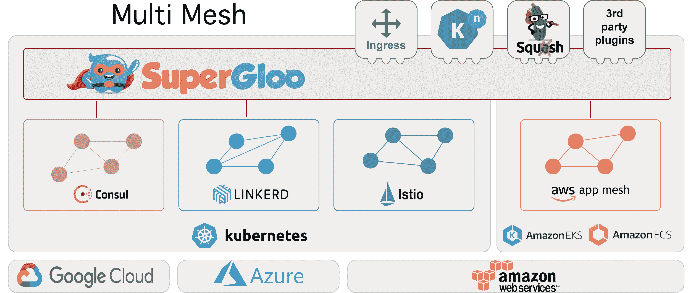

# 对标准服务网格 API 的需求

> 原文：<https://itnext.io/the-need-for-a-standard-service-mesh-api-f143e42e2a8b?source=collection_archive---------4----------------------->

服务网格有助于解决在转向云原生架构时面临的应用联网挑战，特别是有利于小型协作服务(如微服务架构)的架构。当我们与世界各地的云原生技术终端用户会面时，我们发现人们确实正在将服务网格投入生产，并开始看到这样做的好处。与此同时，我们看到了行业需要标准服务网格 API 的迹象。

以下是我们认为服务网格 API 是必要的几个原因:

*   当前出现的不同实施方法
*   服务网格是较低层；将建立在基础之上，需要稳定性
*   必要时网格实现的联合
*   实施升级

# 不同的实施方法

服务网格的世界正在升温。我们有像 Istio 和 Linkerd 这样已经存在了一段时间的实现，我们有像 AWS App Mesh 和 Consul 这样的新进入者，我们还有来自其他供应商的即将到来的实现。这些网格各有优缺点，但有一点是肯定的:服务网格世界是动荡的，赢家还远未决定。

除此之外，事实上相当多的组织已经有了“看起来像服务”的网状结构，很可能是他们构建的，他们不能就这样把它拆掉，从头开始。如果你在这个时候全押在一个服务网格上，你可能会发现你选错了。有了统一的 API，您就可以两面下注，从一个实现开始，如果需要的话，可能会迁移到另一个实现。

# 扩展服务网格

就像 Kubernetes 对于应用程序一样，服务网格是另一个底层的管道，它本身不应该直接暴露给开发人员。开发人员应该与自动化工具和工作流的“平台”进行交互，这些工具和工作流最终可能会驱动 Kubernetes 和 service mesh 等底层组件。在这种情况下，平台最终成为一套“粘合”技术，它配置管道和管道以交付平台功能。服务网格实现了安全性、可观察性、弹性等 80%的既定目标。最后的 20%需要集成和适应到一个组织的平台中。构建这宝贵的最后一英里，20%的代码只有在底层的 80%是稳定和一致的情况下才能成功。在这个交叉点上定义良好的 API 将有助于实现这一点。

# 服务网格实现联盟

随着当前可用的和即将出现的多种服务网格实现，您可能会遇到一种合理的情况，其中多种网格技术要么是可取的，要么是经济上正确的选择，要么是无法合理避免的。例如，假设您今天在一个单一的网格技术上投入了全部(比如说，Linkerd)。您可以使用这个网格在内部部署您的应用程序，围绕其假设和实现细节构建您的工作流。然后你决定全押 AWS。您可以随身携带 Linkerd 并部署它(这将是一个好主意！)但是 AWS 提供服务网格，App Mesh，可以在 EC2、EKS、Fargate 等网站上免费使用。哦，它的控制面板是 100%为你管理的。这可能是一个很好的理由，利用您现有的网格投资，将其与 AWS 应用程序网格联合，并利用统一的网格 API 来构建您的工作流。

# 实施升级

比方说，您在一个服务网格中投入了所有资源，然后希望进行升级。正如我们之前所建立的，服务网格市场仍在兴起:任何特定的实现也是如此。对于来自任何一个网格实现的每个点发布，我们可以预期看到 API/假设的变化以及不稳定性。随着这些 API 在每个版本中的发展，您需要一种稳定的方式来使用网格和升级。构建一个稳定的、独立于网格的界面有助于解决这个问题。

# 我们如何在 Solo.io 解决这个问题

我们[期待服务网格生态系统出现这种情况已经有一段时间了](https://medium.com/solo-io/https-medium-com-solo-io-supergloo-ff2aae1fb96f)。随着我们继续针对巨大的社区和客户兴趣/对话来测试和确认我们的假设，我们已经将如何处理这一问题的计划付诸行动。 [SuperGloo 是一个开源项目](https://supergloo.solo.io)，我们正在为服务网格构建统一的 API，并在此基础上提供服务网格管理功能。

在 SuperGloo 中，我们专注于围绕流量转移、路由控制、统一网格入口、安全性、多集群等内容的统一 API。目前，SuperGloo 支持 [Linkerd](https://supergloo.solo.io/mesh/install-linkerd/) 、 [Istio](https://supergloo.solo.io/mesh/install-istio/) 、 [AWS App Mesh](https://supergloo.solo.io/mesh/register-appmesh/) 以及即将推出的 Consul 支持，以及一个用于添加您自己的 Mesh 实现的 SDK(或者便于将来快速添加其他实现)。本周，我们还[宣布了一个名为服务网格中心](https://techcrunch.com/2019/05/15/solo-io-wants-to-bring-order-to-service-meshes-with-centralized-management-hub/)的服务网格中央管理/存储库，它建立在 SuperGloo 之上，帮助管理带有相关扩展的多个网格。

随着服务网格生态系统的快速发展，以及#KubeCon 的出现，请密切关注这一领域！

*原载于 2019 年 5 月 18 日*[*https://medium.com*](https://medium.com/solo-io/the-need-for-a-standard-service-mesh-api-d89be65f8fb3)*。*