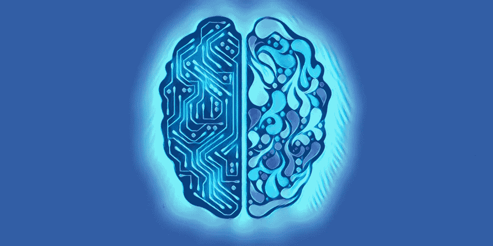
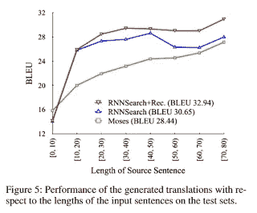
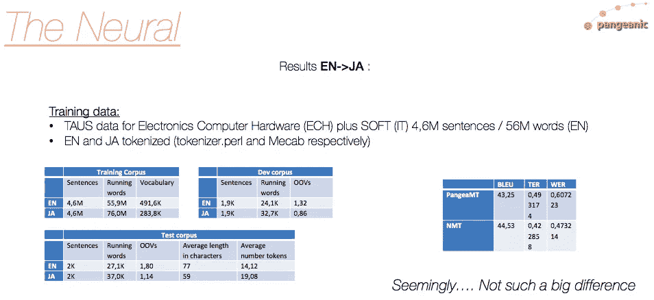
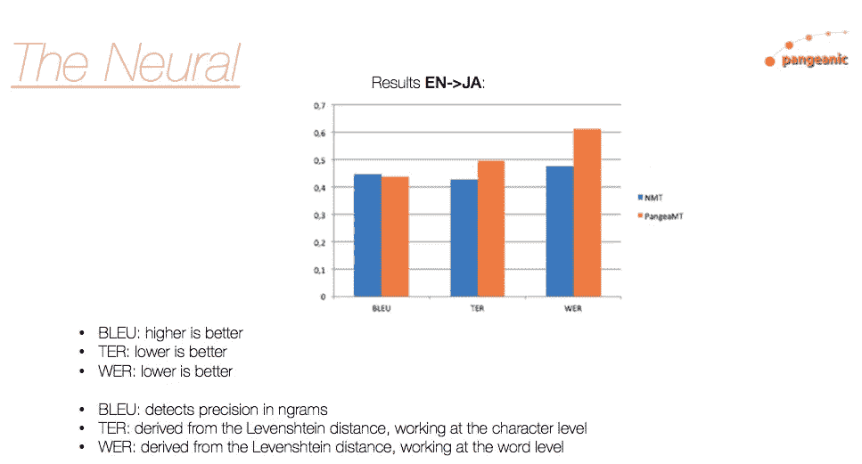
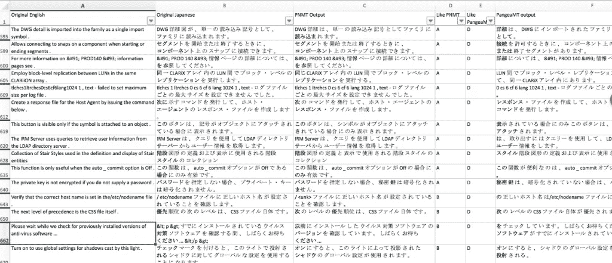
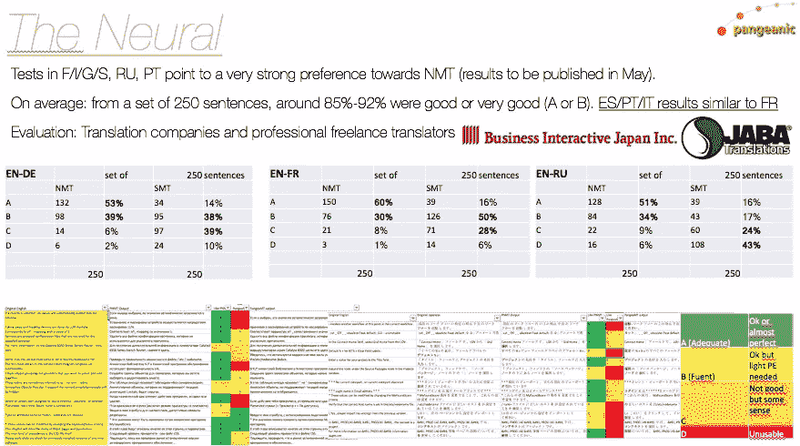

# 正在进行的神经机器翻译的势头

> 原文：<https://itnext.io/the-ongoing-neural-machine-translation-momentum-a1d18c1fed1b?source=collection_archive---------1----------------------->

这假定你已经知道一些关于神经机器翻译(NMT)的知识以及围绕它的激动人心的事情。如果没有，这里 *可以得到一个基本的概述* [***。NMT 社区现在有 4 个不同的开源项目，我在帖子里提到过。但这意味着你必须使用黑盒。NMT 是深度学习的领先应用之一，也是更具挑战性的应用之一，因为对于计算语言社区来说，机器翻译通常是一个非常困难的领域。上面的链接和***](https://kv-emptypages.blogspot.com/2016/06/) **[***这个***](https://kv-emptypages.blogspot.com/2016/09/the-google-neural-machine-translation.html) *应该有助于读者理解为什么这(NMT)是一件大事，将推动未来几年的语言翻译舞台。***

这很大程度上是 Pangeanic 的 Manuel Herranz 的一篇客座博文，对原文进行了略微的缩写和编辑，以使其更具信息性，而非宣传性。去年，我们看到 FaceBook 宣布他们将尽快将其所有的机器翻译基础设施转移到神经机器翻译基础上，随后 SYSTRAN、Google 和 Microsoft 也宣布了 NMT。几个月以来，我们看到许多 MT 技术供应商也加入了 NMT 的行列。有些人比其他人更有信心。我怀疑，那些可以直接进入黑盒并修改东西的人(SDL、MSFT、谷歌、FB，可能还有 SYSTRAN)的观点，与那些使用开源组件并不得不对这些黑盒组件的输出进行“变通”的人截然不同。基本上，我看到在 MT 厂商中有两个明显的阵营:

1.  *尽快转移到 NMT 的人(如 SYSTRAN)*
2.  *那些更加挑剔的人，他们要么“选择混合= SMT+NMT ”,要么同时构建 PB-SMT(基于短语的统计机器翻译)和 NMT 引擎，并选择更好的一个。(如图标)。*

根据这个帖子的热情，Pangeanic 可能属于第一组。每当机器翻译方法发生范式转换时，总会出现“混合”的概念。许多不了解底层技术所需的一致性程度的人通常认为这是一种更好的方式。此外，我认为，有时，MT 从业者在旧的方法上投入了太多，不愿意为了新的方法而完全抛弃旧的方法。SMT 花了很多年才成熟，我们今天看到的是一个自动化的翻译生产管道，包括多种模式(翻译、语言、重新排序等..)以及翻译数据的预处理和后处理。术语“混合”有时被用来描述整个流水线，因为数据可以在这些流水线步骤中的一些上被语言学地告知。

*当 SMT 刚刚出现时，人们注意到了许多问题(相对于旧的 RBMT 模式)，并且花了许多年来解决其中一些问题。* ***适用于 SMT 的解决方案不一定适用于 NMT，事实上，有充分的理由相信它们显然不会奏效。主要是因为 SMT 中的模式匹配技术非常不同，尽管它比 NMT 中的模式匹配技术更好理解、更明显。在这一点上，发生在 NMT 的模式检测和学习要神秘得多，也不清楚。我们仍在学习使用什么杠杆来调整和解决我们看到的奇怪问题。随着时间的推移，数据准备、数据和语料库分析以及数据质量衡量标准都可以轻松进行。NMT 是一种机器学习(模式匹配)技术，它从你展示的数据中学习。到目前为止，它仅限于翻译记忆和词汇表。***

我对一些厂商推出的“混合 NMT”有点怀疑。NMT 问题和挑战的解决方案与 PB-SMT 截然不同，对我来说，完全走这条路或那条路更有意义。我知道一些 NMT 系统尚未超过 PB-SMT 性能水平，因此在这种情况下继续使用旧系统是合理和明智的。但鉴于 NMT 研究和 2017 年实际用户体验的压倒性证据，我认为证据非常清楚，NMT 是全面的前进方向。 ***对于大多数语言来说，这是一个何时的问题，而不是如果的问题。*** *在专业使用场景中，自适应机器翻译可能是一个例外，因为如果你与 SDL 或利特一起工作，它会实时学习。虽然混合 RBMT 和 SMT 对我来说有一些意义，但混合 SMT+NMT 对我来说没有任何意义，并在我的狗屁雷达上触发光点，因为它散发着营销语言而不是科学的气味。然而，我确实认为由 NMT 基金会建立的自适应机器翻译是可行的，在未来的后期编辑和专业翻译中，它很可能成为机器翻译的首选模式。我的感觉是，随着这些交互性更强的 MT/TM 功能变得越来越普遍，纯 TM 工具的相对价值将会急剧下降。但我也敢打赌，一个行业局外人将推动这种变化，因为真正的变化很少来自有沉没成本和既得利益的人。肯定会有人为翻译人员设计出一个比标准 TM 匹配更好的工作台，它可以持续提供翻译建议，并从持续的交互中学习。*

**我敢打赌，最好的 NMT 系统将来自那些“全力以赴”支持 NMT、解决 NMT 缺陷的人，而不是诉诸于在 NMT 模型上强行安装旧的 SMT 模式补救措施，或试图去“混合”，无论这意味着什么。**

所有分享 NMT 经验的人的研究数据的价值对所有人来说都是巨大的，因为它提供了对其他人更快前进有用的数据。我在之前的帖子里总结过一些这样的:[*BLEU 与神经机器翻译的问题，*](https://kv-emptypages.blogspot.com/2017/04/the-problem-with-bleu-and-neural.html) [*对神经机器翻译优缺点的审视，*](https://kv-emptypages.blogspot.com/2017/01/an-examination-of-strenghts-and.html) *与* [*真实诚实的关于神经机器翻译的质量评测数据。*](https://kv-emptypages.blogspot.com/2016/10/real-and-honest-quality-evaluation-data.html)*[*上的各种帖子 SYSTRAN 的 PNMT*](https://kv-emptypages.blogspot.com/2016/09/a-deep-dive-into-systrans-neural.html) *以及最近的评测* [*SDL 的 NMT*](https://kv-emptypages.blogspot.com/2017/07/a-closer-look-at-sdls-new-mt.html) *也描述了 NMT 的诸多挑战。**

**除了本文中来自 Pangeanic 的研究数据外，还有来自 Iconic 和 ADAPT 的***数据，其中他们基本陈述了成熟的 PB-SMT 系统在他们测试的用例场景中仍将优于 NMT 系统，最后，Lilt、* *指出的重构策略* [*，其结果如下图所示。这种方法明显提高了整体质量，而且似乎在 NMT 比其他人更好地处理长句。我见过 SMT 优于 NMT 的其他“证据”例子，但我对引用研究不透明或未正确识别的参考文献持谨慎态度。*](https://arxiv.org/abs/1611.01874)**

****

**来源:带重构的神经机器翻译**

> **谷歌研究总监彼得·诺维格最近在一个关于人工智能/人工智能未来的视频**中表示，尽管有越来越多的工具用于构建软件(例如神经网络)，* [*“我们没有处理数据的工具。”*就翻译而言，机器翻译生态系统的快速创建产生了开发“处理语言数据”工具的新需求，即通过生态系统的学习来自动提高数据质量和范围。和转换语言数据(“我在哪里可以找到训练我的引擎所需的那种语言数据？”)变成一条更自动化的供应线。](https://youtu.be/oD5Ug6uO0j8?t=20m)***

****对我来说，Norvig 的这句话非常清楚地表明，也许 NMT 最大的增值机会来自理解、准备和调整 ML 算法学习的数据。在对机器翻译输出质量期望最高的专业翻译市场中，更好地理解和准备数据是有意义的。我也看到大多数 LSP 中的聚集“语言数据”的状态相当糟糕，甚至可能是糟糕的。如果* [*TMS 系统能够帮助改善*](https://kv-emptypages.blogspot.com/2017/01/the-missed-opportunity-of-translation.html) *这种情况，并提供更丰富的数据管理环境，使数据能够更好地用于机器学习过程，那就太好了。要做到这一点，我们需要考虑组织 TM 和项目的数据以外的事情，但是在这一点上，我们离这还很远。更好的 NMT 系统通常来自更好的数据，这只有在您能够快速了解哪些数据最相关* [*【使用元数据】*](https://kv-emptypages.blogspot.com/2017/02/the-obscure-and-controversial.html) *并能够及时有效地利用这些数据时才有可能。还有就是在我看来对 TM 的过分关注。关注正确类型的单语语料库也可以提供很好的洞察力，并有助于驱动策略来生成和制造“正确类型”的翻译材料，以进一步推动翻译活动。但这一切都意味着，当客户情况出现时，我们需要更舒适地处理数十亿字，并提取我们需要的东西。****

***===============***

***因此，是时候回顾和描述我们在 7 种语言(日语、俄语、葡萄牙语、法语、意大利语、德语、西班牙语)测试中的神经机器翻译经验，以及 Pangeanic 如何决定将其所有努力转移到神经网络，并将统计方法作为杂交的支持技术。***

***我们从我们的 SMT 引擎中选择训练集作为干净数据，用相同的数据训练相同的引擎，并在每个系统(现有的统计机器翻译引擎)的输出和神经系统产生的新引擎之间运行并行人工评估。我们知道，如果数据清理在统计系统中非常重要，那么在神经网络中就更是如此。我们不能添加额外的材料，因为我们想确定我们正在比较完全相同的数据*，但是用两种不同的方法训练*。***

***一小部分坏数据或脏数据可能会对 SMT 系统产生不利影响，但是如果它足够小，statistics 会处理它，不会让它进入系统(尽管它也可能产生更坏的副作用，即降低某些 n 元语法的统计数据)。我们为我们知道在 SMT 中表现非常好的语言(法语、西班牙语、葡萄牙语)以及那些被研究人员和从业者称为“困难群体”的语言选择了相同的训练数据:俄语作为一种形态非常丰富的语言的例子，日语作为一种语法结构完全不同的语言，其中重新排序(这就是混合系统所做的)被证明是改善的唯一方法。让我们首先关注日语的神经翻译结果，因为**它们代表了我们一直在等待的**机器翻译的巨大飞跃。这些结果于去年四月在东京 TAUS 展出。(见我们之前的帖子 [TAUS 东京峰会:日语神经机器翻译的改进是真实的](https://blog.pangeanic.com/2017/05/07/tokyo-summit-improvements-in-neural-machine-translation-in-japanese-are-real/))。***

******

***我们使用了 460 万个句子的大型训练语料库(英语中有近 6000 万个单词，日语中有 7600 万个单词)。在词汇方面，这意味着 491，600 个英语单词和 283，800 个日语单词。是的，我们的大脑能够“计算”那么多，甚至更多，如果我们加上所有类型的变化，动词时态，格等等。出于测试目的，我们做了应该做的事情，不夸大百分比分数，并在训练开始前提取了 2000 个句子。这是所有定制中的一个标准——取出一个小样本，这样生成的引擎*会翻译*可能遇到的情况。任何将测试语料库包含在训练集中的开发人员都有可能获得非常高的分数(并且会吹嘘这一点)。但是 BLEU 分数一直是关于检查机器翻译系统内的领域引擎，而不是跨系统的(除了别的以外，因为训练集一直是不同的，所以包含许多重复或相同或相似句子的语料库显然会产生更高的分数)。我们还确保没有重复的句子，甚至相似的句子也被从训练语料库中剔除，以实现尽可能多的多样性。与其他系统相比，这可能会产生较低的分数，但结果更清晰，并且可以很容易地监控进度。这一直是学术竞赛的方式，并确保了多年来高质量的引擎。***

***SMT 中的标准自动度量在 NMT 的输出和 SMT 中的输出之间没有检测到太大的差异。***

***然而，WER 正显示出一种新的明显趋势。***

******

***NMT 在日语的长句子中显示出更好的结果。SMT 似乎在较短的句子中更确定(训练一个 5 n-gram 系统)
当人类语言学家评估输出时，我们发现了这一新的明显趋势。我们使用日语 LSP[Business Interactive Japan](http://www.bi-japan.co.jp/)从保守的角度对输出进行排序，从 A 到 D，A 是*人工质量翻译*，B 是非常好的输出，只需要非常小比例的后期编辑，C 是平均输出，可以提取一些意义，但需要认真的后期编辑，D 是非常低质量的翻译，没有任何意义。有趣的是，在短于 10 个单词的句子中，我们训练的统计机器翻译系统比神经系统表现得更好。我们可以假设统计系统在这些情况下更确定，当它们只处理简单的句子时，有足够的 n 元文法给出良好匹配模式的证据。我们为人工评估者创建了一个 Excel 表(如下),英文原文在左边，参考译文在左边。神经翻译随之而来。为评级提供了两列，然后提供了统计输出。***

******

***Neural-SMT EN>JP 排名对比右侧显示英文原文、参考译文、neural MT 输出和统计系统输出
令人震惊的改进来自人类评估者本身。这一趋势表明，90%的句子被归类为完美翻译(自然流畅)或 B(包含所有意思，只需要少量后期编辑)。这种转变在包括日语在内的所有语言组合中都很显著，从“还可以”的体验转变为显著的接受。事实上，俄语中只有 6%的句子被归类为 D 级(“不可理解/不知所云”)，法语中有 1%，德语中有 2%。葡萄牙语由翻译公司 [Jaba Translations](https://www.jaba-translations.org/) 独立评估。***

******

***这种趋势并不是泛希腊独有的。东京 TAUS 的几位演讲者指出，与精心制作的混合系统相比，使用现成神经系统的日本人的支持率约为 90%。**例如，Systran 证实他们只专注于神经研究/人工智能，并放弃了多年来基于规则的工作、统计和混合努力。** Systran 的立场是有价值的，非常具有前瞻性。当前的论文和一些机器翻译提供商仍然抵制这样一个事实，即尽管我们多年来做了很多工作，但多模态模式识别已经占了上风。只是计算能力和使用 GPU 进行训练让它落后了。BLEU 可能不是新的神经机器翻译系统正在发生什么的最佳指标，但它是一个指标。我们知道其他公司的其他实验和结果指向类似的方向。然而，尽管最初的结果可能让我们认为它没有用处，但 BLEU 是一个有用的指标——无论如何，它始终是一个引擎行为的指标，而不是一个整体系统相对于另一个系统的真实衡量标准。(见维基百科文章[https://en . Wikipedia . org/wiki/Evaluation _ of _ machine _ translation](https://en.wikipedia.org/wiki/Evaluation_of_machine_translation))。***

***机器翻译公司和开发人员面临着一个困境，因为他们必须在没有研究、连接器、插件和自动测量技术的情况下工作，并建立新的技术。构建连接器和插件并不困难。**把核心从摩西换成神经系统就是另一回事了。NMT 产生了惊人的翻译，但它仍然是一个很大的黑箱。**我们的结果表明，使用 SMT 系统最佳特性的某种混合系统是非常可取的，学术研究已经朝着这个方向发展，就像几年前 SMT 本身发生的那样。***

***是的，翻译行业正处于神经网络炒作的巅峰。但纵观全局，以及人工智能(模式识别)如何在其他几个领域得到应用，以产生*智能*报告、趋势和数据，NMT 将留在这里——它将改变许多人的游戏，因为更多的内容需要用后期编辑以低成本生产，当好的机器翻译足够好时以光速生产。亚马逊和阿里巴巴在机器翻译上的投资不是白投的——他们希望以人类翻译无法达到的高度准确性和速度，用他们的语言传达给人们。***

***Manuel Herranz 是 Pangeanic 的首席执行官。通过与巴伦西亚理工学院研究小组和计算机科学研究所的合作，为翻译公司创建了 PangeaMT 平台。他曾是福特机床供应商和劳斯莱斯工业和海运公司的工程师，在翻译记忆库尚未出现在物流服务提供商领域时，他负责买方的培训和文档工作。在 90 年代末加入一个日本组织后，他于 2004 年成为 Pangeanic 的首席执行官，并于 2008 年开始了他的机器翻译项目，创建了第一个 Moses 商业应用程序(Euromatrixplus)的第一个命令行版本，并且是世界上第一个在商业环境中成功实施开源 Moses 的 LSP，包括在 Moses 社区中成为标准之前重新培训功能和标签处理。***

****原载于 2017 年 8 月 10 日*[*kv-emptypages.blogspot.com*](https://kv-emptypages.blogspot.com/2017/07/the-ongoing-neural-machine-translation.html)*。****