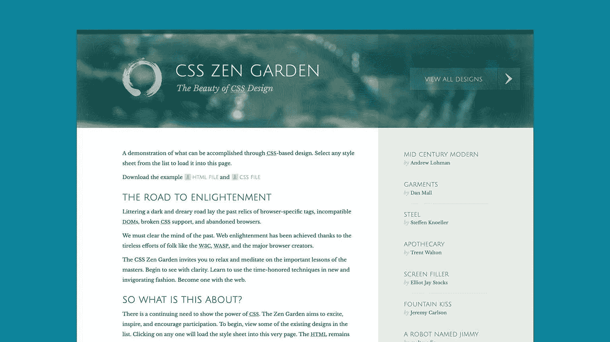
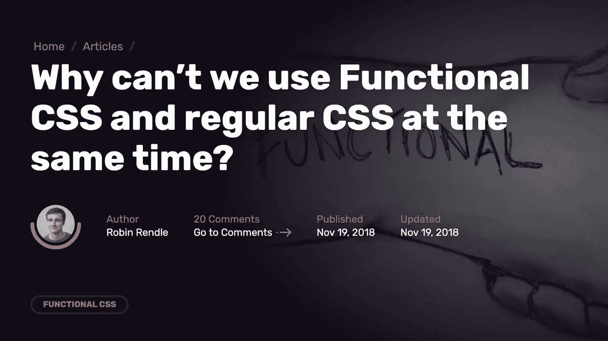

# 功能性 CSS 的危险

> 原文：<https://itnext.io/the-perils-of-functional-css-c9484d1b4680?source=collection_archive---------4----------------------->


函数式 CSS 是一个有争议的话题，经常引发激烈的评论讨论。在这种情况下，从审慎的观点中梳理出夸张的说法可能会很棘手。

下面是我对这个问题的看法，基于我最近在一个构建 web 应用程序的项目中对这种方法的实验。

# 一、什么是函数式 CSS？

函数式 CSS(有时称为原子 CSS)是使用小型的、不可变的和显式命名的实用程序类来构造组件的实践。各种现成的类库，如[超光速粒子](https://tachyons.io/docs/layout/grid/)和越来越受欢迎的[顺风 CSS](https://tailwindcss.com/docs/what-is-tailwind/) ，如雨后春笋般涌现，使得从功能 CSS 开始变得尽可能容易。


因此，与其创建一个自定义组件，不如按语义或视觉命名，例如:

```
<div class=”card”>A card</div>
```

您可以通过实用程序类的组合在标记中构造组件的样式规则。例如:

```
<div class="padding-sm border-radius-sm bgc-white"></div>
```

正如函数式编程鼓励纯粹性和可预测性一样，函数式 CSS 提倡使用单一用途和“纯粹”的类，这些类无论上下文(或传统编程中的“范围”)如何，都具有一致的行为。

检验一个类是否是“功能性”的一个很好的试金石是检查使用它的结果是否能从它的名字中立即辨别出来。此外，您可以询问该名称是否只应用单一样式规则(尽管也有例外)。

功能性 CSS 可以被视为对古老的“语义”类名最佳实践的反叛——例如“新闻项目”或“问候”——长期以来被著名的 [CSS Zen Garden](http://www.csszengarden.com/) 和著名的开发者 Jeffery Zeldman 所支持。



相反，functional CSS 认为，试图坚持 HTML 和 CSS 之间错误的“关注点分离”是没有意义的，因为正如 [Vue.js 文档指出的那样](https://vuejs.org/v2/guide/single-file-components.html#What-About-Separation-of-Concerns):

> *“…关注点的分离不等于文件类型的分离。”*

为了编写真正可重用的 CSS，我们已经进入了视觉和功能抽象，例如“卡片”而不是“新闻项目”，或者“媒体对象”而不是“作者简介”。这是所有 UI 库的前提，从[引导](https://getbootstrap.com/)到[语义 UI](https://semantic-ui.com/) 。正如《顺风 CSS》的作者亚当·瓦森所说:

> 这是无法假装的。堆叠式表单比。右对齐；它们都是根据它们如何影响标记的表示来命名的，我们在标记中使用这些类来实现特定的表示结果。

函数式 CSS 通过鼓励我们完全放弃这些抽象，将这一点发挥到了极致。函数式方法建议我们使用我们选择的库的不可变实用程序类，而不是试图为可能永远不会重用的组件命名，这意味着您可能永远不必再次编写自己的 CSS。

# 问题

# 语境

也许最显著的问题——在某些情况下也是*特性*——是函数式方法如何违背 CSS 的上下文感知特性。

虽然 BEM 和 SMACSS 等方法促进了扁平的类层次结构，限制了特异性，但在许多情况下，上下文感知规则是有意义的。获取基于父类切换显示的新闻列表:

```
<ul class="summary-list">
     <li class="summary-list__item">A list item.</li>
</ul> <ul class="summary-list summary-list--compact">
     <li class="summary-list__item">A list item.</li>
</ul>
```

另一种方法是遍历每个新闻条目，并为每个条目添加一个`summary-list__item--compact`类(或者组成其等价物的功能集)，但是，这会导致每个条目的性能下降，并且您还会失去轻松“挂钩”到紧凑视图进行其他更改的能力(例如，将父显示从`grid`切换到`block`)。


*你如何用功能方法复制显示模式切换？*

主题化也有类似的问题。传统的函数类如`text-black`必须按元素进行映射和更改，这是一个性能噩梦。想象一下，基于它们的上下文来改变函数类的含义——这不仅会令人困惑，而且几乎是不可能的，因为它们有着广泛的非特定用途。

当然，你可以通过创建自己的别名来逃避这些问题，比如`primary` / `secondary`等等:

```
.text-primary { @apply .text-black; }
.t-dark .text-primary { @apply .text-white; }
```

或者更好的是，如果您的浏览器支持要求允许，在 CSS 变量[旁边使用别名:](https://www.browserlondon.com/blog/2019/01/15/css-variables-theming/)

```
::root { --t-primary: black; }
.t-dark { --t-primary: white; }
.text-primary { color: var(--t-primary); }
```

不管怎样，当你将类的明确的功能性含义别名或隐藏到抽象的概念中时，不管它是主要的/次要的还是“特色的”等等，你已经移除了*功能性*方面。

事实上，对于一些支持者来说，这可能才是重点。《超光速粒子》的作者亚当·莫尔斯[指出](http://mrmrs.io/writing/2016/03/24/scalable-css/):

> *‘让一个类根据上下文重新定义多个定义并不能解决问题，反而会制造问题。’*

然而，只有当类名是文体描述性的，比如`float-left`，并且上下文改变了具体含义时，这才是一个问题。在上下文中改变一个在语义上定义的模块，例如`news`或者在一个 UI 结构中定义的模块，例如`card`，可能比 Morse 在他的例子中提出的问题要少得多:

> 想象一下，如果你有一个名为“filesize”的函数，你给它传递一个文件名，它返回文件大小。听起来很棒。但是想象一下，如果有时它返回文件中的行数。听起来一点也不好，不是吗？

还有一种不同的上下文需要考虑，那就是关系选择器的使用，比如直系后代(`>`)和相邻兄弟(`+`)。这些使模块能够根据它们的周围环境来决定它们的外观，并且已经成为诸如臭名昭著的[脑叶切除猫头鹰选择器](https://alistapart.com/article/axiomatic-css-and-lobotomized-owls/)之类的技术的基础:

```
ul > * + * { margin-top: 10px; }
```


函数式 CSS 传统上避开这些方法，采用更明确的基于模板的有类或无类方法，在这种方法中，您可以简单地在最后一项或第一项中不包含 margin 类:

```
<ul>
   <li>Apple</li>
   <li class="margin-top-10">Orange</li>
   <li class="margin-top-10">Pear</li>
</ul>
```

不仅在模板化中处理这一点很麻烦，如果用 JS 动态添加或删除一个项目，您还必须手动调整类。

当然，没有什么能阻止你创建一个间距实用类或模块，但是这又一次让我们更接近 Wathan 在他今天的“功能”方法之旅中描述的“内容不可知的实用类”的中间立场。

# 响应式设计

作为功能性 CSS 过程的一部分，类是预定义的，这意味着您也将预先定义您的固定断点(例如' sm'/'md'/'lg ')。不幸的是，这种方法并不符合我们所知的现代响应式设计。

特定的“宏”断点早已失宠，当一个组件看起来不再正确时，就倾向于特定于组件的断点或“调整”。随着诸如 [Flexbox 圣信天翁](http://www.heydonworks.com/article/the-flexbox-holy-albatross)和[“内在”网页设计](https://www.webdesignerdepot.com/2018/05/a-simple-introduction-to-intrinsic-web-design/)的兴起，更不用说对某种形式的容器查询不可避免的原生支持，这感觉非常过时。在我们渴望更少的同质性和更多的组件外设计的时候，将模块显示绑定到特定的宏断点感觉很奇怪。

最重要的是，当使用功能性 CSS 库时，诸如 CSS-grid 这样的工具是没有意义的，因为有趣的网格定义的规则往往非常具体，你很可能最终要编写一个组件来使它们工作。

# 伪元素和选择器

由于伪元素不以传统方式存在于 HTML 中，功能性 CSS 不能有效地针对它们，这是有问题的。事实上，如果不涉及组件抽象或某种规则定义的复制，这个问题就没有真正的解决方案。

例如，Wathan [建议](https://github.com/tailwindcss/discuss/issues/184)注册一个“[变体](https://github.com/tailwindcss/tailwindcss/releases#registering-new-variants-from-plugins)”，这会给你一个额外的类，比如`before-text-red`。修复方法是将这个类放在包含“before”规则的组件上，但是一旦你达到这个长度，你实际上是将实用程序类添加到父类中，而不是直接应用到父类中。

# 黑客解决方案

也许函数式 CSS 最不专业但可能最普遍的问题是它只会让开发人员变得懒惰。

如果一个问题的最佳解决方案是一个定制的组件，那么你可能应该做一个定制的组件。由于教条地坚持实用类库的简单性，函数式 CSS 可以说给了开发人员一个不去创建原始组件的借口。

# 函数式 CSS 的优点

# 表演

不可否认，遵循功能性 CSS 方法可以带来一些性能上的好处，因为以这种方式创建项目所需的实际 CSS 数量很少。对于一般的网站或网络应用程序来说，整体影响可能是微妙的，但这肯定是一个不错的意外收获。另外，由于您更新 CSS 的频率降低了，您将受益于一个更加缓存友好的样式表。

然而， [Nicholas Glasser](http://nicolasgallagher.com/about-html-semantics-front-end-architecture/) 认为这种好处有些转移视线:

> *‘使用预处理程序的有经验的 CSS 开发人员不需要过分担心编译后的 CSS 中一定程度的重复，因为它可以很好地适应 HTTP 压缩后较小的文件大小。通过预处理器，更易维护的“CSS”代码的好处应该超过对原始和缩小输出 CSS 的美学或大小的关注。*

不管您对更小的 CSS 的影响有什么想法，迁移到函数式方法的性能优势中也可能存在人的因素。例如，开发人员入职更加直接，由于您的团队共享库或代码库，跨项目的生产率可以大幅提高。这不是函数式 CSS 独有的特性(例如，Bootstrap 也是如此)，但如果情况合适，这仍然是一个潜在的优势。

其次，功能性 CSS 使得核心前端团队之外的团队成员更容易对给定的站点或项目进行更改。由于减少了 CSS 编写开销并避免了抽象，后端开发人员完全有可能独立地对项目进行更改，这在小型团队中非常有用。

# 一致性

从一个特定的角度来看，功能方法提供的预定义值可以为整个项目的一致性带来实际的好处。瓦森又一次简洁地阐明了这一点，[暗示说](https://adamwathan.me/css-utility-classes-and-separation-of-concerns/):

> “当一个项目中的每个人都从有限的选项中选择自己的风格时，你的 CSS 就不会随着项目的规模而线性增长，你可以免费获得一致性。”

这在高流失率的团队中可能特别有意义，例如雇佣了许多承包商或自由职业者的团队，或者在团队之间转移项目的责任时(或者甚至在没有自己的内部开发人员的公司的外部机构之间)。然而， [Sarah Dayan](https://frontstuff.io/in-defense-of-utility-first-css) 认为代码或布局不一致主要是“人的问题，而不是技术问题”，如果“你不遵循你的团队制定的规则、风格指南和最佳实践”，即使坚持功能性 CSS 方法也没有用。

# 为什么不两者兼而有之呢？



尽管争论的双方都很紧张，但是有一种[日益增长的趋同](https://css-tricks.com/why-cant-we-use-functional-css-and-regular-css-at-the-same-time/)倾向于同时采用组件和功能的方法，这种方法被顺风公司称为[“实用优先”](https://adamwathan.me/css-utility-classes-and-separation-of-concerns/):

> *“我之所以称我对 CSS 采取的方法为实用优先，是因为我试图从实用程序中构建一切，并且只在出现重复模式时提取它们……对 CSS 采取组件优先的方法意味着你为事物创建组件，即使它们永远不会被重用。这种不成熟的抽象是样式表大量膨胀和复杂的根源。*

组件到离散实体的抽象只有在有特定需求时才会出现，例如，一个重复的 UI 模式将在某种程度上受益于更传统的“语义”分组。在 Tailwind 中，这种组合看起来像这样，与传统的预处理器 mixin 没有什么不同:

```
.btn {
   @apply font-bold py-2 px-4 rounded;
}
```

虽然实用类有它们的位置，并且适度使用会非常有用，但这种“组合”肯定会抵消传统组件驱动 CSS 的任何好处。如果一个按钮值得抽象，那么很难想象许多 UI 组件*不值得抽象，它们是真正“一次性使用”的，就像 Adam 给出的导航条例子。*

事实上，当你把一个类组成一个抽象的时候，你就失去了:

*   类名的明确性。
*   不必命名或设计组件的好处。
*   不用自己写 CSS 节省的时间。

更糟糕的是，组件类和功能实用程序类的广泛组合实际上使得*更难理解*，并且在决定什么是对类的有价值的和可重用的修改以及什么应该保持一次性变化时，给开发人员带来了更多的负担:

```
<!-- Should this be 'card--large' and 'card--light' ? -->
<div class="card bg-white padding-lg">Card</div>
```

这种混合有可能是极具破坏性的，尤其是当新的或经验不足的开发人员使用函数类作为“撤销”组件规则的出口时(例如，增加“card”中定义的填充)。

确保可读性和可维护性的唯一方法是对两者的应用都非常严格，这样它们就不会交叉或共享关注点:

```
<div class="bg-white padding-md flex">
   <div class="profile">Jay Freestone etc.</div>
</div>
```

# 结论

综上所述，功能性 CSS 对我这个前端开发者来说意义不大。我认为一个专门的前端团队管理他们自己的 CSS 方法会更有成效，而不是被束缚在标准化类库的束缚中。

然而，如果你不是很擅长 CSS，并且努力想出适当的抽象，或者如果你没有一个专门的前端团队来处理这方面的事情，我可以看到函数式 CSS 是多么有用。我不认为后端开发人员编写了大多数功能性 CSS 库是巧合。

作为一名前端开发人员，如果你*真的*认为功能性 CSS 可以解决你或你的团队面临的问题，我的建议是首先考虑这个问题实际上是否更人性化。我认为这句来自[泽尔德曼](http://www.zeldman.com/2017/01/03/kiss-my-classname/)的话说得很好:

> *我不认为问题在于语义标记的原则或者 CSS 中的层叠。我认为问题在于十几个人一起做某件事却不互相交流。*

## 关于浏览器

我们为更好、更高效的工作场所创建企业网络应用。我们已经帮助壳牌、英国航空公司和英国政府等客户提高效率，简化业务。在 [Browser London](http://www.browserlondon.com) 访问我们。

*原载于 2019 年 6 月 10 日*[*https://www.browserlondon.com*](https://www.browserlondon.com/blog/2019/06/10/functional-css-perils/)*。*