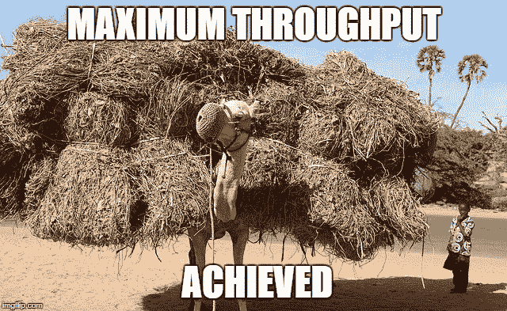
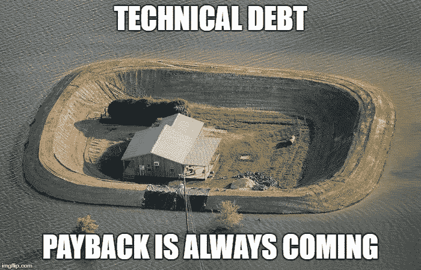
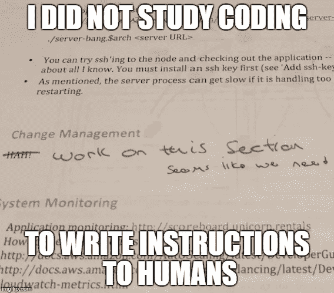
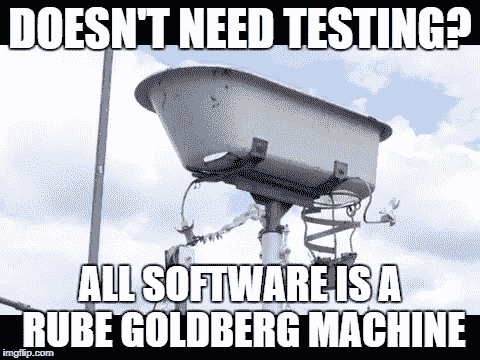
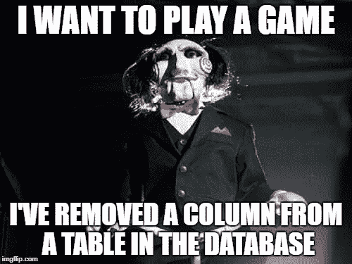

# 飞行前云应用清单

> 原文：<https://itnext.io/the-pre-flight-cloud-application-checklist-3187dae57e81?source=collection_archive---------2----------------------->

*在按下启动按钮之前，要问自己的 40 个问题。*

空白项目是最容易的。

[*点击这里在 LinkedIn 上分享这篇文章*](https://www.linkedin.com/cws/share?url=https%3A%2F%2Fitnext.io%2Fthe-pre-flight-cloud-application-checklist-3187dae57e81)

恭喜你！您已经在 AWS 上构建了新的闪亮应用程序，是时候将它发布到世界各地了。所有这些周的努力终于有了回报，发射时间即将到来。所以只要那只小狗，我们就完事了，对吗？

不完全是。现在是时候确保你已经完成了所有的细节，并且对你的设计过程进行了理性的检查。这整个部分实际上是关于过程的，所以有点费力。

我从过去几年的各种来源拼凑了这份平淡无奇但至关重要的**飞行前检查清单**，并添加了一些事情进展不顺利时的项目。我们的想法是不要详尽地做清单上的每一件事，但至少要考虑每一个问题，并在行动之前做出最佳行动方案的决定。

对于大多数产品来说，在 1.0 版本之前完成这个过程是不可能的(如果你正确使用资源，可能*不应该*发生)。但是当你在发布周期中大步前进的时候，更多的这些问题将开始成为焦点。

# 0.SLA/目的审查

在这一点上，可能已经有一段时间没有人记得他们为什么要开发这个应用程序了。现在是时候检查你所建立的仍然符合最初的目标，或者也许目标已经改变了(想象一下)。

1.**服务水平要求是什么？**这个*真的*需要有多靠谱？微服务的 SLA 是什么？例如，登录服务可能是 99.9999%，但“推荐产品”面板可能是 99.95%。这是关于管理 9、成本和复杂性之间的权衡。

2.**预期吞吐量是多少？**你的断点在哪里？运行预期平均工作负载的最低基础架构是什么样的？在您的设计中断之前，最大吞吐量是多少？所有的设计都有一个最大的尺度，所以在宇宙出现之前找出它。

# 1.建筑评论

向两个建筑师要一个设计，你会得到三张图。确保不止一双眼睛审查架构设计，以仔细检查差距。基础架构计划是否符合业务需求？具体来说:

3.**检查连锁故障**。如果数据库出现故障，是导致中间的所有服务都倒掉还是前端优雅处理？如果一只蝴蝶在 eu-west-1 扇动翅膀，那么在 us-east-1 会发生地震吗？

4.**任何扩展问题**？需要考虑三个方面:

*   您是否恰当地平衡了各地区的服务？你有什么位置偏见吗？随着时间的推移，配置往往会过度依赖某个特定区域。如果一个地区出现故障，您的应用程序能应付吗？
*   流量突发:您的实例的自动伸缩是否到位，设置是否正确？或者(更好的是)您是否在流量不稳定且难以预测的地方使用了无服务器方法？
*   你有信心这一切运行起来会花多少钱吗？确保您不会为不必要的 9 个 9 构建过多的解决方案。你*缩减*的速度够快吗(根据我的经验，通常你不够快)？

5.**是否存在单点故障？**您的数据库有足够的复制能力吗？对任何不可扩展的东西有依赖性吗？

# 2.代码设计审查

语言、库和风格指南的标准化使得新开发人员的入职和故障排除更加容易。此外，由于安全性始终是重中之重，所以仔细查看代码库，就像尝试入侵自己的系统一样。你*怎么会*闯入这东西？我打赌你能找到办法。

6.您是否审查过服务内部和服务之间的重复代码？它就在某个地方，我向你保证。

7.您是否在可能的情况下**有计划地实施标准**(例如林挺等。)?

8.您是否使用了 [**静态分析工具**](https://en.wikipedia.org/wiki/List_of_tools_for_static_code_analysis) **？**

9.您是否在任何地方存储凭证？你知道应该使用角色，但令人惊讶的是硬编码的凭证是如此频繁地出现。

10.你有没有**编码防御**(例如，再次保护 SQL 注入，跨站脚本攻击等。)?

11.另一个团队**审查过你的代码**吗？许多不好的做法可以通过这种方式揭露出来。如果你是一家小公司，与另一家创业公司合作，在架构和代码审查方面互相帮助。

12.这个版本中有新的开发者吗？每隔几个月在项目之间轮换开发人员，以获得关于项目的新观点和实践。

13.有什么你决定接受的已知的坏想法吗？在未来达到某个目标之前，制造技术债务是很常见的，但是要确保这个决定被记录下来，这样就不会被忘记。开发者总是会偿还他们的技术债务。

# 3.监视

要知道你的应用程序*将会*失败——你如何发现失败是重要的一部分。在云工作负载中，您可以有几十个服务相互通信，监控不仅仅是确保系统健康，一个好的监控系统需要艺术和设计。

14.您使用的是**应用级监控**还是服务级监控？在服务级别，这会产生很大的噪音，并且从用户的角度来看会错过失败的体验。

15.你有一个**系统生命体征仪表板吗？**请记住，在测量中仅使用平均值可能会隐藏主要问题，使用百分位数测量来捕捉异常值也有很好的理由(更多信息[此处](https://www.elastic.co/blog/averages-can-dangerous-use-percentile))。

16.您是否正在**监控实时使用**指标？测量*实际的*页面加载时间、吞吐量和正在发生的真实事情，这些通常不会出现在测试或开发环境中。

17.您使用的是**定制监控脚本还是第三方工具？**团队经常不充分利用第三方工具，这些工具比脚本和其他黑客工具做得更好。值得研究免费、开源、AWS 提供或付费的解决方案，并评估时间-成本-风险的权衡。

# 4.记录

这是一个恼人的问题——我们经常记录如此多没有任何真正目的的活动，以至于当问题发生时，它变成了一座无尽的垃圾山。努力做好测井工作，赢得更多的胜利。

18.你有记录日志的目标吗？当系统崩溃时，你会问什么问题？人们需要寻找什么样的支持？

19.所有系统的**日志记录格式都标准化了吗**(例如 JSON)？日志文件命名约定如何？

20.是否正确使用了**记录级别**(例如信息/警告/致命类别)？

21.**日志** [**是否集中汇总**](https://aws.amazon.com/answers/logging/centralized-logging/) ？在系统第一次崩溃时，没有集中聚合的上线将招致因果报应点。

22.你的**时间戳在不同的系统上都设置正确了吗**？请始终假设您的系统将在某个时候成为多地区系统，并使用 UTC 来防止由于夏令时和其他调整而导致的不匹配。

23.你是否**过度记录**？对于大规模系统来说，这可能是一种巨大的资源浪费。这在第一个版本中可能不明显，但随着时间的推移，开始识别过度日志记录的区域，并根据需要进行调整。

24.您是否一直在跟踪一个**个人交易 ID** ？例如，跟踪一个会话 ID 可以更容易地在不同系统之间切换。

25.你是否在记录任何**敏感信息**？检查信用卡号、社会安全号、凭证、令牌或任何其他可能导致安全问题的东西。*像公开信息一样记录数据*。

# 5.文件审查

我知道你总是能产生完整的、可读的文档，对吗？再读一遍，确保它包括:

26.你如何**安装和部署解决方案**？这经常被忽略，但是当团队改变时，这就变得令人头疼了。描述好像你正在从零开始启动一个完整的堆栈，并要求其他人按照指示来寻找差距。

27.你**怎么配置**这个东西？记住所有那些散布在数据库、配置文件和脚本中的聪明标志——你需要记录它们在哪里以及它们做什么。

28.**故障排除流程**是什么？当它失败时——并且它*将*失败——支持人员应该首先看哪里？如何重启或停止流程？然后呢？他们应该在什么时候升级，那些人应该做什么？

29.**代码做什么**？哪些部分是我们写的，哪些是从 Stack Overflow 复制的，哪些是未经修改的第三方或者扭捏的开源？

# 6.测试

这是一个巨大的话题，对于复杂的分布式系统的成功至关重要。

30.您正在使用哪些**自动化测试系统**，为什么？你为什么选择风车而不是硒？

31.开发测试用例的**流程是什么，开发人员如何将变更集成到发布中？**

32.你是否使用了**测试驱动开发**(即首先构建测试用例，开发代码使其通过，重构和优化，重复)？如果没有，为什么？

33.提高未来版本测试复杂度的**计划是什么？我们如何将学习纳入一个更好的测试框架？**

# 7.部署

部署模型从来没有看起来那么简单——尽管我们喜欢将新版本推向市场，但总会有问题。通常客户还没有准备好，有些特性只适合某些用户，或者在测试和生产之间你需要一群新的试验品。离“完成”还有很长的路要走。

## 对于数据库更改:

34.对于**数据库变更**，是否已经根据当前生产数据库的副本对所有内容进行了测试？你知道哪些用户会受到影响吗？你在追踪你所有的登录吗？

35.任何变化都有区域影响吗？(例如，任何与货币或格式相关的东西？)

36.您是否正在**删除任何列**？如果有，真的有必要吗？如果移除一个列，什么会断开？如果该列永远保持不变呢？

37.您是否**记录了数据库模式的每个变更**以创建完整的修订历史？您能放心地将数据库模式恢复到以前的状态吗？

## 对于与用户界面相关的更改:

38.您是否评估过**非二进制推广**方法(如选择加入、可扩展推广、A/B 测试等)。)?

39.如果需要的话，你能阻止选定的用户使用新的功能和服务吗？如果这是一个全有或全无的部署，这会导致任何问题吗？

40.淘汰旧功能或禁用没人用的功能的策略是什么？

尽管这个列表并不全面，但它至少应该为启动云解决方案之前的讨论提供一个起点。很少有团队拥有完美解决所有问题的资源，但是理解风险和迭代到“理想状态”的计划有助于在最终按下 *Go* 按钮之前建立信心。