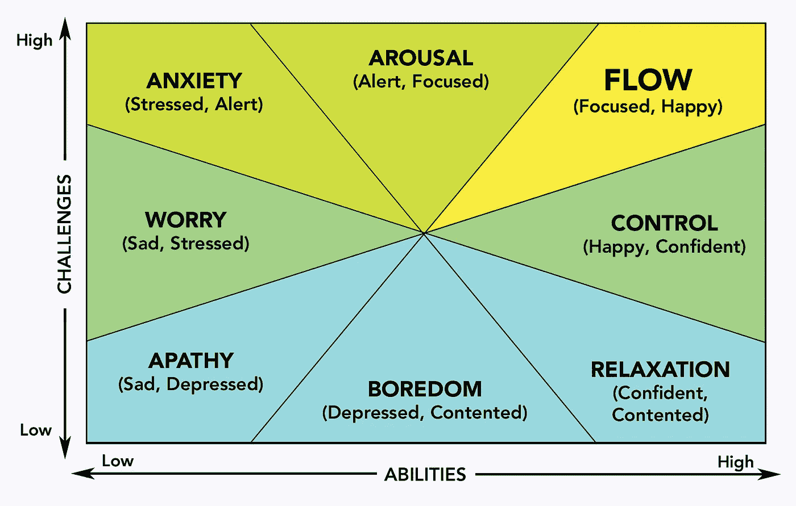
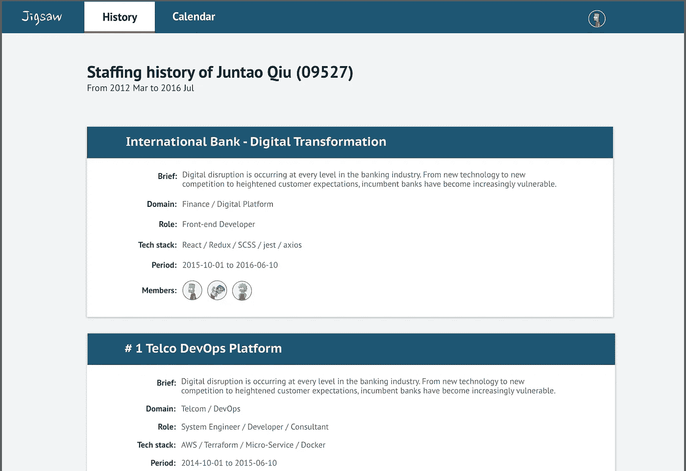
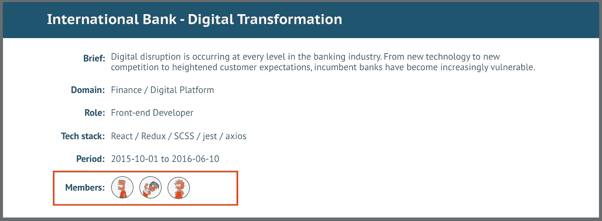
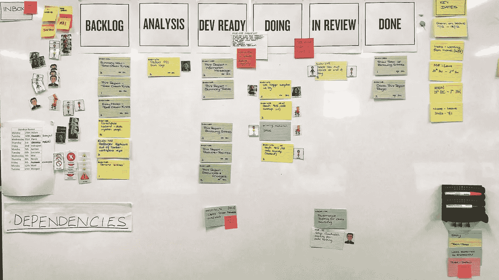
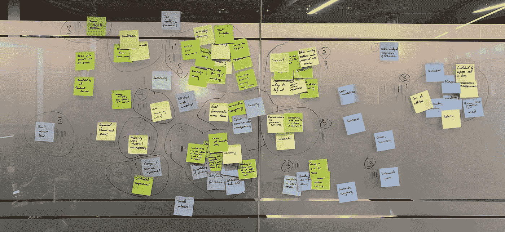

# 节奏大师

> 原文：<https://itnext.io/the-rhythm-master-fe18c2154a13?source=collection_archive---------7----------------------->

> *所有伟大的球队都是相似的；每个状态不佳的团队都有自己的问题*

如果你走进任何一个运行良好的敏捷团队，你会惊奇地发现人们每天做的事情都很简单**和*直截了当*。这并不是说他们一直在解决的问题没有其他项目有挑战性。这些任务很简单，定义明确，彼此之间或与环境之间的摩擦很少。**

**他们以端到端的方式交付可行的软件，每一项工作都有明确定义的验收标准，任务有明确定义的优先级，待办事项足够多但不会产生任何焦虑，也许你甚至会发现团队中也充满了友好和有趣的人。简直太完美了。**

**此外，每当他们开始做某件事时，他们都是以简单的任务作为原型开始，一旦原型完成，他们就会以我们都欣赏的渐进方式在此基础上逐渐做出一些改进。他们重构已经写好的代码，有时甚至重写一部分，但是人们有信心这样做，因为有底层测试。从外部的角度来看，足够数量的自动化测试保证了代码的整体质量。**

**像这样的完美团队来之不易。相反，你要努力达到这样的阶段。幸运的是，有一条路。**

**然而，如果你问团队中的任何人同样的问题:“你认为敏捷的基本原则是什么？”，你肯定会对你得到的答案的变化感到惊讶。有人认为工程实践的极端程度会带领团队走向成功，比如结对编程、TDD 或 CI/CD。此外，其他人可能认为他们采用的沟通方法，如迭代计划、故事板、常规业务展示是必不可少的。有些人可能会认为，在更高的层面上接受这些变化，快速响应时间是至关重要的。当然，所有这些答案在某种程度上都是有道理的，人们在日常工作中往往会得出结论并形成自己的观点。而在我看来，敏捷，或者精益，其基础可以被描述为“增量改进”**

# **增量改进**

**我说`Incremental improvement`的意思是:从最优先的任务开始，这些任务有很好的理解和相对清晰的接受标准，并在这些任务的基础上增强。在逐步改进的过程中，还要建立交付和仪式的节奏，甚至可能是适合团队的文化。一旦你建立了所有这些，剩下的就很容易了。这也正是本文将要讨论的:如何使`incremental improvement`切实可行，尤其是在现实世界的项目中有很多限制的时候。**

**为了实现渐进的改进，你必须提前付出很多努力。诸如**

*   **需求分解——细化**
*   **正确运用投资**
*   **想象这个过程**
*   **建立文化(基于价值的交付方法)**

**这些额外的努力需要一个业务分析师作为驱动力来实现。分解需求的不同方式，甚至是将 backlog 发布到准备开发中的节奏，都可能导致完全不同的结果。但是在我们深入细节之前，让我们先看看交付的节奏在任何敏捷团队中有多重要。**

# **反馈、节奏和流程**

**1975 年，著名的心理学家米哈里·契克森米哈讨论了`flow`的概念，并第一次开始把它作为一个严肃的科学话题来研究，尽管不同背景的人已经发现并经历了相当长的时间。**

> ***在积极心理学中,“心流状态”( flow state)也就是俗称的“进入状态”( in the zone ),是一种精神状态，在这种状态下，从事某项活动的人会完全沉浸在一种精力充沛的专注感中，全身心地投入并享受活动的过程。本质上,“心流”的特征是完全专注于自己所做的事情，并随之丧失对空间和时间的感觉。***

**为了进入*流*，Csikszentmihalyi 建议你至少要先做 3 件事**

*   **清晰的愿景或目标**
*   **准确而有价值的反馈**
*   **你的能力和挑战之间的平衡(都在相对较高的水平上)**

****

**这意味着如果你想以你可能最有效的速度工作，你应该清楚地定义目标，当你试图实现这个目标时，你需要来自外界的持续反馈。你完成任务的能力或技能需要与任务的挑战相匹配，如果挑战远远超出你的能力，你很快就会变得沮丧，而如果这对你来说太容易了，你很快就会厌倦。**

***流程*不仅可以最大限度地发挥个人潜力，还可以应用到团队层面。当它进入一种*流动*状态或建立了一种节奏时，团队成员往往更有效率，合作更顺畅，无论你交给他们什么任务，他们都能毫无问题地完成。**

**既然建立一个节奏是至关重要的，并且业务分析师在这个构建过程中起着至关重要的作用，那么问题来了:我们如何在现实世界中实现它？让我们从一个典型的场景开始。**

# **业务分析师角色**

**团队中的业务分析师就像任何电路中的稳压器。他们充当外部环境和团队之间的桥梁。一方面，他们必须管理来自外部任何渠道的预期，分析这些预期，并仔细区分轻重缓急。另一方面，他们必须在特定情况下权衡不同的因素，并保护团队免受压倒性任务的影响。**

**在某种程度上，我认为保护团队比满足涉众更重要，因为团队实际上是产生有价值结果的人。**

**在最坏的情况下，业务分析师只是将需求从上游传递给交付团队，而没有进行深入的分析。我在一些场景中看到，业务分析师就像一只鹦鹉，拒绝分析原始需求，并且在开始时很难回答开发人员或质量保证人员提出的问题。作为一名开发人员，如果我不相信故事中的商业价值(如果有的话)，我会拒绝编写代码。**

# **将特写拆分成故事**

**当合理地将需求分割成大块时，正确地应用传统的工具如`INVEST`(也许和`SMART`一起)可以确保团队在正确的方向上。当然，您可能需要在不同的场景中使用其他工具来进行正确的拆分。**

**问题是:**

*   **`INVEST`如果有正确的方法，正确的方法是什么？**
*   **即使你正确地使用它，它可能仍然不工作，然后你会怎么做？**

**关于正确的方法`INVEST`——包括每个工作块有多大`fit`，典型的分割模式，如工作流、业务规则变化——已经有很多文章了，我不打算在这里描述它们。但是，我特别专注于第二个问题，即你已经掌握了如何在不同场景下恰当地应用`INVEST`，但是你拆分故事的方式不符合团队能力结构(或者团队工作的方式)，那么你该怎么办？**

**在现实世界中，您可能会发现团队能力模型有许多变体。康威定律无处不在，组织有不同的沟通结构，这导致不同的团队结构。有时它甚至会影响你将需求分解成用户故事的方式。**

**至少您可以看到其中的两种变化:前端和后端分离以及端到端分离。**

# **前端和后端分离**

**有时，你从书上读到的、从会议上听到的敏捷实践在你的*项目中是行不通的。当你尝试应用它时，就像垂直分割(也许是蛋糕比喻)一样糟糕，端到端交付。偶尔你会发现现实世界是不同的。可能在你开始写任何代码之前，设计的最终版本已经展示给了最重要的利益相关者，甚至配色方案、排版也已经完成。***

**尽管在开发过程中你有定期的展示，但通常效果不好，反馈并没有提供太多的价值来指导改进。在最后的展示之后，一切都可能改变，我想我们都经历得够多了。**

**在这种情况下，分离前端和后端似乎可以加快速度，并且更有实际意义。专用的`UI Dev`可以很容易的把 Hi-Fi 转换成`HTML/CSS/JS`，表面上看，性能、系统弹性、高并发之类的东西根本不应该涉及到`UI`的工作中。事实上，许多项目就是以这种方式运行的，对我来说，它对`fixed`范围的项目很有效。**

**不幸的是，我参与的大多数项目都是动态的。这种方法显然有一些缺点:**

*   **为了不被后端阻止，前端开发人员将设置一个模拟服务器**
*   **后端需要一些机制来确保前端和后端之间的合同匹配**
*   **需要设置额外的测试套件**
*   **真正的整合被推迟了**
*   **该功能无法端到端交付(您必须等到最慢的一端才能完成)**

**而且很有可能是前端在等待后端完成 API，反之亦然。此外，那些难以跟踪的状态可能导致不透明，然后相互指责，管理成本，内部摩擦，等等。即使我们可以建立复杂的工程实践，如模拟服务器、合同测试，这个过程仍然是痛苦的和容易出错的。更糟糕的是只演示了 UI 的`fake` / `mock`版本，它实际上没有与任何下游服务对话，这使得团队和客户都缺乏信心。**

# **端到端交付**

**相比之下，另一种方法是垂直拆分，端到端地交付功能，包括前端和后端，然后作为一个整体签署。当然，这种方法的主要障碍是团队的能力，由于两端变得越来越复杂(从编程语言、工具到编程范例，等等)，差距变得更大。在垂直拆分中，我们需要开发人员同时具备前端和后端所需的技能，或者至少相互配合来完成一个单独的故事。**

**此外，这种方式有其自身的问题需要解决:**

*   **熟练的用户界面开发和后端开发如何有效地合作**
*   **端到端的用户故事可能需要更长的时间来交付**
*   **开发人员需要更多的时间来提高速度/技能**

**乍一看，这两种不同的方法非常矛盾，根本不能一起工作。在大多数情况下，如果你只看每种方法的结果，它们都是一样的:按时完成需求，并保持合理的质量。但是，前后端分离的方法中缺少了一些东西:*开发者的体验*。**

**我讨厌这种感觉，我不确定要做的事情是否真的完成了。当你依赖于其他人，同时又依赖于生态系统中的其他人时，我讨厌成为整个系统的一部分。没有人知道你开发的功能是否有用户，更不用说潜在的商业价值了。所以对我来说，我会尽最大努力端到端地实现每个故事，从数据库/服务到 UI。**

**我认为即使在极端环境下，我们也应该采用端到端的交付方式。首先，团队不再从技术角度来看用户故事，他们将它从特性(或具有商业价值的单元)中分离出来。一个功能可以通过在交付阶段使用不同的技术来完成，`functionality`应该是原子的，不能分为前端和后端。其次，如果我们考察对任何项目的成功最重要的另一个因素:人的能力和成长，那么端到端有更多的优势。项目结束后，前端开发人员可能已经掌握了如何使用`terraform`在`cloud`上建立基础设施和进行应用程序维护。与此同时，后端开发人员了解前端生态系统中的 JavaScript 最近是如何发展的。**

**此外，它只需要在交付过程中进行微小的调整，就可以大大改善整体体验。即使在一些极端的情况下，当范围在项目开始时就被定义固定时。事实上，只要正确运用`INVEST`，就可以帮助团队建立顺畅、稳定、有效的交付节奏。**

# **申请投资**

**`INVEST`是实现`incremental improvement`的基础部分。没有精细的粒度，独立的用户故事，逐渐增强则是不可能的。事实上，这需要在许多不同的层面上有意识地练习。对敏捷有深远的影响:如果分割太小，那么你可能会引入更多的管理成本。如果太大，很难界定界限，也很难区分优先次序，甚至更糟的是，它可能会影响整体氛围:没有人希望看到无休止的卡片被钉在`DEV`柱上一周。**

**就像真实项目中的许多其他事情一样，作为一名业务分析师，将故事拆分到一个完美的大小需要从不同维度进行许多权衡，有时这更像是一门艺术。**

**下面我们来看一些具体的例子:**

# **人员配备历史页面**

**比方说，我们需要构建一个类似于`jigsaw`的应用程序，它有一个针对特定用户的`staffing history`页面，包括:导航栏、基本信息、员工历史记录、用户资料等等。**

****

**假设我们的第一个故事是在页面上显示基本信息(用红色矩形标记)部分。**

****

**然后，故事应该包括:与后端服务交谈，以获取数据，并在用户界面表面。虽然数据可以从真实的数据库或简单的 JSON 文件中获取，但这取决于后端的持久性策略。作为第一个用户故事，它可能有一个相关的技术任务:设置框架代码。比如用`create-react-app`设置前端，用`gradle`和相应的模板生成后端文件结构，等等。**

**作为一个有价值的用户故事，它符合以下标准:**

*   **垂直拆分，端到端实施**
*   **UI 与实体模型对齐**

**虽然这是一个相对简单直接的故事，但它帮助开发人员在工作时建立反馈机制。如`TDD`做到什么程度，怎么做`Code Review`，组队体验`kick off`、`desk check` s 等。换句话说，这不仅仅是一个用户故事，而是一个你如何建立反馈循环的具体例子——建立节奏的重要部分。一旦人们理解了如何做基本版本的想法，你就可以逐渐加入更多的细节，让它变得更复杂，然后它会变得更流畅。**

# **错误处理**

**对第一个故事的合理改进可以是:**

*   **当用户不存在时，显示一些错误信息**
*   **如果数据中的某个字段丢失了，就退回到其他字段**

**因为你已经播放了第一个故事，团队会对如何做和做什么更有信心。一旦人们看到某样东西是从零开始构建的，那么它往往会吸引他们自己去做得更好。首先通过微小但有意义的成就让人们变得自信，然后是一些提高，这实际上非常重要。**

# **更进一步**

**对于更复杂的特性，仍然可以通过应用`INVEST`来实现`gradually improvement`。在签署基本版本时，假设最终版本根本不存在。`enhanced version`可以单独签署。**

****

**如上图，标记为 read rectangle 的部分内容来自另一个后端服务，你要在特定的时间内与其他一些产品集成，当然他们不一定和你的有相同的交付节奏。此外，由于您可能还没有优先权，将整个部分视为一个故事(这是一个常见的陷阱)会使其难以签署，并且可能会降低团队的速度。更好的方法是假设这个部分根本不存在(或者不在范围内)，然后基于这个假设进行评估、开发和测试。**

**换句话说，即使 Hi-Fi 在开发前就准备好了，你也应该总是根据商业价值、优先级和其他限制(比如集成成本)来拆分用户故事，而不是一页一页地进行物理切割。在大多数情况下，按 UI 拆分是个坏主意。一方面，自截止日期以来，商业价值并不存在；另一方面，团队找不到生产的节奏(这是交付最重要的部分)。**

**在微观视图中，每个具有端到端价值的细分用户故事都可以触发`flow`。而在更大的范围内，业务分析师可以引入其他实践来确保团队成员可以清楚地看到目标，并确保团队朝着正确的方向前进。毫无疑问，可视化工具可以确保这一切发生。**

# **(英)可视化(= visualization)**

**几年前我在某处读到过一个说法，敏捷中使用的可视化方法利用了人们的羞耻感:当你看到卡片已经在墙上的同一个栏里挂了几天，你应该会感到一些压力。我相信理论是非常肤浅的，敏捷本身应该是一种方法论，你可以在高度信任的环境中使用，人们在这种情况下应该会有这样的感觉:看起来有什么地方出错了？也许有一些我们没有意识到的技术挑战，或者如果做得不好，故事会分裂，让我们看看我能做些什么。一旦确定了问题，就该帮助修复它，然后从中吸取教训，就这样。**

****

**通过适当的观想，在发展过程中肯定有更多的事情需要注意。从实体墙到迭代报告，从燃尽图到`RAID`，那些工具可以帮助团队显著地理解进度是什么样子，以及任何潜在的问题、浪费、阻碍因素应该被清楚地识别，等等。有时，帮助团队成员认识到目标和当前状态之间的差距是至关重要的，如果工具能够提供如何缩小差距的方法，那就更好了。**

**开发人员很容易迷失在技术细节中，忘记他们在项目中的位置。一份明亮的、结构良好的迭代报告可以很好地向团队展示迭代过程中的所有总体情况。成就:被签署的需求，花费的时间，每个故事的`cycle time`，交付的重要商业价值，等等。我还发现花一些时间(不要太多，15 分钟——如果你有一个模板和像吉拉这样工具的帮助，半个小时应该足够了)生成一个报告，并发送给团队成员和相关的利益相关者——特定状态的摘要，让人们知道*我们到了吗？*和*我们的目标还有多远？* (Nicole 已经非常好地完成了迭代报告和不同类型的可视化，如果您有兴趣，请向她询问更多细节)**

# **文化建设**

**在一个咨询项目中，我一直在帮助一个交付团队建立`requirement splitting`能力。在一个`INVEST 101`原则研讨会上，一个开发人员问我:除了其他原则，你所说的`negotiable`到底是什么意思？**

**客户文化的一个方面是:在分析阶段完成后，你不能挑战需求，你必须做在特定阶段同意的任何事情，然后计划所有的资源(当然，开发人员是资源的一部分，像项目预算或键盘)以满足最后期限。这是制造业中许多公司采用的典型方法，我们知道这在软件业中是行不通的。反正交付团队根本没有谈判的权力，最后期限甚至连交付团队都不知道。然而，具有讽刺意味的是，错过最后期限的后果将是他们的责任。**

**显然，每个团队都需要并拥有自己的文化，这决定了团队的工作方式。还有，工作方式会反作用于团队培养人，然后再塑造文化。幸运的是，ThoughtWorks 中的大多数团队，文化是从地下生长出来的，没有人能强迫任何人应用特定的文化。**

**事实上，一个简单的头脑风暴可以突出团队的价值、期望的工作氛围、工作方式等等。这是我们在《T4》中做过的一件事。**

****

**文化最令人惊叹的是，你可以把任何东西放进去，不同的人认为他们的观点是最重要的。虽然我无法判断什么对团队来说是重要的，什么不是，但我想强调的是，有些要点可以帮助建立一个影响交付节奏的`flow`。**

*   **从失败中学习**
*   **衡量目标和现实之间的差距**
*   **反馈**
*   **专业点**

**小而全的成就是培养健康文化的简单方法。当然，文化不是你说的，而是你真正做的。例如，为每个用户故事设定一个固定的截止日期——你已经把它描述为‘失败是不可接受的’，即使你说犯错误没关系，人们也不会相信你。另一方面，明确的验收标准，标记为超出范围的要求，为每个任务演示你将如何衡量目标和现实之间的差距。此外，当然，反馈总是任何敏捷实践(结对、代码审查、站立、回顾等)中的基本元素。).**

# **摘要**

**业务分析师实际上是团队中控制整个交付节奏的人，他/她连接外部和内部，管理来自客户和团队成员的期望。对团队来说，他们必须分解需求以更好地细化故事，帮助建立适当的反馈机制。对于团队之外的利益相关者，他们必须管理他们的期望，促进大量的活动:可视化团队中的阻碍因素，并努力跟踪和移除这些阻碍因素，分析需求，基于业务价值区分需求的优先级。此外，继续将它们作为`deliverable units`输出给团队。**

**即使在范围相对固定的项目中，业务分析师也可以使用`INVEST`等工具，通过适当的粒度拆分来构建`user story`的管道。此外，通过利用各种可视化工具，他们可以建立一个稳定和有效的反馈渠道。在实施过程中，业务分析师可以以身作则，示范和强调从失败中学习，而不是遵循计划，从小而坚实的原型开始，一点一点地改进。在更大的范围内，业务分析师可以确保整个交付过程在安全、透明、有序和顺畅的氛围下运行。**

# **参考**

*   **[拆分用户故事的模式](https://agileforall.com/patterns-for-splitting-user-stories/)**
*   **[关于业务分析师的 10 个常见问题](https://insights.thoughtworks.cn/10-common-questions-of-ba/)**