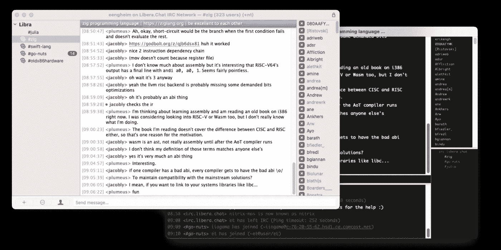
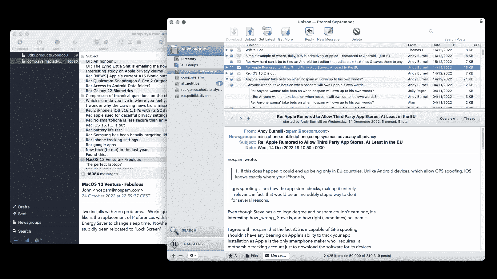
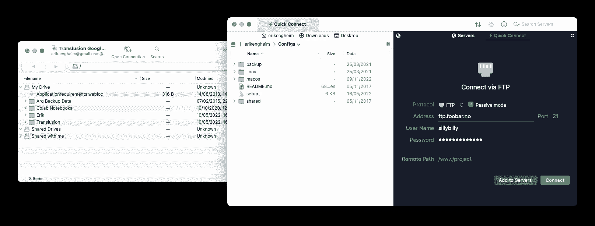
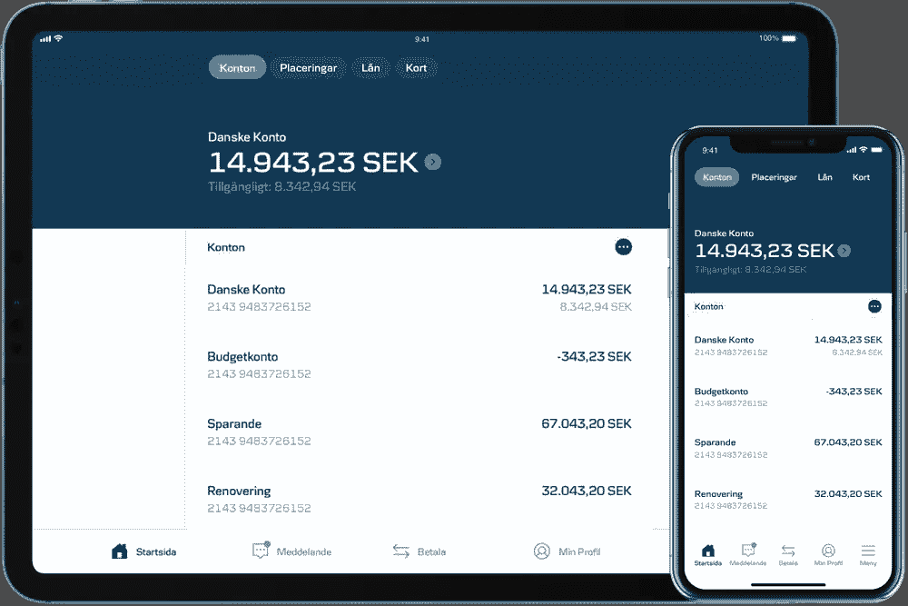

# 单片软件的兴起

> 原文：<https://itnext.io/the-rise-of-monolithic-software-9e538cfec6e4?source=collection_archive---------0----------------------->

## 现代软件是如何完全被独立的平台所支配的

我们曾经拥有可重用组件的软件生态系统。今天，我们有一个围墙花园单片软件的世界。我这么说是什么意思，我们是怎么走到这一步的？

正如我在我的故事[中将大应用程序分解成小应用程序](https://erikexplores.substack.com/p/breaking-big-applications-into-small)中所阐述的，我并不喜欢现代软件是如何发展的。今天，我们对[微服务](https://en.wikipedia.org/wiki/Microservices)和其他流行语感到烦恼，它们给人一种错误的印象，即我们不知何故已经进入了一个人们可以越来越多地随心所欲地混合和匹配软件的世界。事实恰恰相反。今天的软件开发人员可能有能力使用更多可重用的组件，但是作为用户，我们越来越受到限制。

今天的互联网和 15-20 年前的互联网已经变得非常不同。在此之前，互联网更多地围绕着*协议*，如 SMTP ( [简单邮件传输协议](https://en.wikipedia.org/wiki/Simple_Mail_Transfer_Protocol))、NNTP ( [网络新闻传输协议](https://en.wikipedia.org/wiki/Network_News_Transfer_Protocol))、FTP ( [文件传输协议](https://en.wikipedia.org/wiki/File_Transfer_Protocol))、IRC ( [互联网中继聊天](https://en.wikipedia.org/wiki/Internet_Relay_Chat))和 XMPP ( [可扩展消息和在线协议](https://en.wikipedia.org/wiki/XMPP))。在这个面向协议的世界中，多家公司将制造服务和最终用户客户端，用户可以混合和匹配它们。

在这个世界里，你的电子邮件服务可以由微软提供，你的电子邮件阅读器可以来自谷歌。你所需要的只是双方都使用 SMTP、IMAP 或 POP3 之类的协议。在任何时候，你都可以更换服务提供商，转而从亚马逊获取电子邮件，同时保留你的谷歌电子邮件客户端。今天做到这一点并非不可能。例如，我用苹果邮件应用程序阅读 Gmail。然而，互联网正从这种模式转向紧密集成的封闭平台。

我曾经使用过像 Trillian T1 和 T2 Adium T3 这样的即时通讯软件，它们理解 AIM，IRC，XMPP，Yahoo！Messenger、Bonjour 和更多。软件过去常常以这种方式构建。有许多明确定义的标准和各种各样的软件可以嵌入到这些标准中。相比之下，今天的视频会议。客户端和网络完全粘合在一起。如果你想在 Zoom 上联系某人，你需要使用 Zoom 客户端。如果你想和微软团队的人联系，你需要使用微软客户端。你不能只是从一家制作优秀视频会议客户端的公司挑选一个客户，然后用这个客户与谷歌视频聊天、微软团队或 Zoom 上的人联系。不，每个公司都有自己的小花园。

如果你使用推特，你会看到同样的情况，[不和谐](https://en.wikipedia.org/wiki/Discord)或者[懈怠](https://en.wikipedia.org/wiki/Slack_(software))。这些平台将协议、客户机和服务器都合并到一个解决方案中。您不能使用“选择另一个客户端”与 Discord 配合使用，也不能使用常规 Discord 客户端与 Slack 或 Skype 等客户端进行交互。这与 IRC 不同，IRC 只是一个开放的协议，任何公司或组织都可以为其制作客户端和服务器。下图显示了我在 Libra 聊天 IRC 频道上使用两个不同的 IRC 客户端: [Textual 7](https://www.codeux.com/textual/) 和 [LimeChat](http://limechat.net/mac/) 。

Libra 聊天 IRC 服务器上的 Textual 7 和 LimeChat IRC 客户端

这种面向协议的方法主导了旧的互联网。想进入论坛讨论政治、游戏机游戏或烹饪吗？过去，你上过[新闻组](https://en.wikipedia.org/wiki/Usenet)。像 IRC 一样，它提供了一个开放的协议，任何人都可以为其创建服务器或客户端。下面你可以看到两个不同的新闻组客户，[猪倌](https://www.asar.com/hogwasher.html)和 [Unison](https://en.wikipedia.org/wiki/Unison_(Usenet_client)) 。今天，你会使用 Twitter、Slack 或一些网络论坛。

使用 senset 客户端 Hogwasher 和 Unison

没有必要涵盖所有可能的组合，但我想提醒人们 Dropbox、Google Drive 和 One Drive 的旧替代方案，后者使用 FTP 客户端连接到任何运行 FTP 服务器的公司。下面显示的 FTP 客户端是 Cyberduck 和 [Transmit](https://panic.com/transmit/) 。这些客户可能有任何复杂程度。例如，Transmit 将进行类似于 Dropbox 的同步，确保只下载或上传更改过的文件和文件夹。

虽然 Dropbox 等服务显然提供了改进，但我想强调一些我们已经失去的东西。客户机和服务器的分离。

# 网络化如何实现围墙花园

是什么推动谷歌、脸书和亚马逊走向围墙花园？我认为，用一个单一的协议，HTTP，来代替丰富的互联网协议的趋势是罪魁祸首。

代替简单的协议，我们有了大量复杂的网络技术。网络从仅仅是带有信息的页面发展成为一个独立的应用平台。不同于多家公司提供客户端，你可以连接到一个服务器提供服务，如电子邮件或新闻(NNTP)，服务提供商也将通过网络提供客户端。这样的话，第三方应用程序制造商可能会被排除在外。

因此，谷歌不仅会为你提供电子邮件服务，还会通过网络提供该服务的接口。你看看现代的谷歌和脸书，就会发现它们确实是推动大量软件和服务的平台，这些软件和服务主要是作为网络前端而存在的。

可以说，所有这些公司都通过 REST APIs 之类的东西提供对其服务的访问。然而，这只是允许第三方扩展他们的生态系统。你不能把他们在网上开发的所有应用程序都拿来在其他服务中重复使用。在过去，你不只是为你的电子邮件服务建立一个电子邮件客户端。您构建了可以与任何服务提供商一起使用的电子邮件客户端。

# 移动应用的网络化

在转向移动应用程序之前，我做了很长时间的桌面应用程序开发人员。我记得当我开始做移动应用时，我认为我们会看到更多服务和客户端分离的原始想法。我做的第一件事就是开发银行应用程序。我记得我天真地以为会有一个银行协议，我们会制作一个通用的客户端，用户可以在他们拥有的任何银行使用。

在理想情况下，您应该有一个与网上银行交互的标准协议，并且您可以从提供不同类型的用户界面和功能的各种客户端中进行选择。

当然，这不是应用行业的工作方式。银行 app 不是独立做出来，卖给银行客户或者银行的。相反，银行雇佣咨询公司来开发专门为其银行定制的应用程序。这些应用的品牌只适合一家银行。

想象一下，如果您可以将不同的银行添加到通用银行客户端，就像您将电子邮件提供商添加到您的电子邮件客户端一样？多个银行，都可以从使用相同界面的相同应用程序访问。

斯堪的纳维亚著名银行的平板电脑和移动银行:丹斯克银行。

因此，作为一名顾问，我一直注意到这种情况的荒谬性:我们一直在为不同的公司一遍又一遍地构建相同类型的应用程序。整个应用经济似乎是在浪费大量的资源，一遍又一遍地重复同样的东西。咨询公司是按小时收费的，所以他们没有多少创造力来重用现有的银行软件。银行自己也想突出自己独特的品牌。这是我们当前销售和品牌文化的另一个方面。

这也是我注意到的侵入网络应用的东西。网页总是被设计成促进独特的视觉风格。因此，公司很快创建了带有特定标志和颜色的品牌网页。桌面应用程序开发从来不是这样工作的。桌面 UI 工具包主要是为了匹配它所运行的操作系统的风格而设计的。从 UX 的角度来看，这个想法是视觉一致性，以帮助用户更快地识别功能和学习应用程序。苹果主要是一家桌面应用开发商，围绕构建高度可用和视觉一致的应用开发了一种强大的文化。这在他们为移动应用开发制作的 UI 工具包中得到了强烈的反映。

作为一名早期的 iOS 开发人员，我注意到了这种不和谐的文化碰撞，苹果专注于创建标准化的外观和感觉以提高可用性，而企业界习惯于从咨询公司订购品牌网页。突然之间，美国开发者被要求用工具包来制作品牌应用程序，而这些工具包从来不是为做这件事而设计的。企业界将 web 思维强加于移动应用程序开发。坦白说，这是一场灾难。许多早期的移动应用程序最终成为一个复杂的烂摊子，以促进企业品牌。你基本上是在强迫 UI 工具包去做一些它们不是为之设计的事情。这意味着大量的视觉风格的硬编码，这成了维护的噩梦。

因此，我们不仅一遍又一遍地重新发明相同的应用程序，而且还以非常低效的方式构建应用程序，从而花费更多的钱。咨询公司可能不想告诉客户这是多么愚蠢，因为毕竟，他们从以这种耗时的方式构建应用程序中赚了更多的钱。

# 网络为什么没有创造一个跨平台的世界

我们被告知，由于网络技术，你可以很容易地在所有平台上运行相同的软件。为 Linux、Windows 和 macOS 定制应用程序的可怕日子已经一去不复返了。你所需要的是一个 400 MB 的电子应用程序来取代你以前在每个平台上使用的 10 MB 的本地应用程序。好吧，这只是部分玩笑。

只不过我们所做的只是替换了那些明智的平台，并人为地制造了全新的不兼容的平台。如果你开始认为脸书、微软、谷歌和亚马逊是他们自己的平台，类似于操作系统，你会发现变化不大。这些平台上的应用程序可能都运行在网络上，但它们仍然有自己的围墙花园。你不能把 Google Hangout 客户端带入微软的网络世界。你不能用谷歌 Hangout 客户端做微软团队。Google 日历不会与您所有的 Microsoft 在线应用程序集成。

我认为操作系统供应商创建的不同平台更有意义。我的问题不是有不同的平台。选择是有价值的。macOS 的工作方式与 Windows 不同，可能会吸引不同的用户。它还允许供应商选择不同的硬件平台。例如，macOS 已经在 68k、PowerPC、Intel 和现在的 Arm 芯片上运行。我认为拥有特定平台的应用程序实际上是有价值的。选择 Mac 或 Linux 的人通常寻求不同的体验。我认为定制应用程序以适应不同操作系统平台的不同审美和行为是有意义的。

然而，对我来说，将网络任意划分成不同的领域是没有意义的。根据定义，Web 不是由不同的技术栈组成的。网络的全部意义在于为所有操作系统提供一个公共平台。互联网本应是一个开放的平台。旧的以协议为中心的互联网给了我们这些。

是什么阻碍了 app 跨平台？不同的平台有不同的 API。例如，微软使用 DirectX APIs 实现高性能图形，而苹果使用 Metal。但是网络巨头们是如何改变这一切的呢？为[谷歌应用引擎平台](https://cloud.google.com/appengine)编写的应用将无法在[微软 Azure](https://azure.microsoft.com/en-us/) 上运行。下一步是什么？有人发明了另一个跨平台层，所以你的网络软件只能运行任何云提供商？然而，更多的抽象层，以确保我们扼杀任何在过去 20 年里取得的硬件进步？

好吧，我有点刻薄，但我想强调的是，网络并没有神奇地解决不同不兼容平台的问题。我是一个老派的桌面应用程序爱好者，希望看到桌面能像网络一样受到人们的喜爱。我认为人们不应该回避开发特定于平台的应用程序。我们不会回避在网络上做这件事。如果你为 Azure 开发应用程序，那么你就像为 Mac 开发 Cocoa 应用程序一样被锁定在一个平台上。

当然，你的 windows 用户不能在他们的电脑上运行 Mac 应用，但你的谷歌云用户也不能在谷歌应用引擎或亚马逊网络服务(AWS)上运行 Azure 应用。

# 解决方法是什么？

我不是真的提供解决方案。我写这篇文章主要是为了阐明我为什么不太喜欢现代软件。这比我在这里写的要多得多。有些我已经在[中将大程序分解成小程序](https://erikexplores.substack.com/p/breaking-big-applications-into-small)中介绍过了。

问题的核心是市场逻辑。公司希望建造围墙花园，因为开放平台意味着更强的竞争，没有人愿意为其他人的平台做贡献。谷歌和亚马逊不想受制于平台把关者，比如苹果的微软。

微软过去确实滥用了他们在 Windows 平台上的绝对优势。然而，我不认为解决办法是建造更多的围墙花园。以 Linux 和 Mac 为代表的更强大的替代产品，依我拙见，是对 Windows 统治地位的一种可行的解毒剂。另一个解决方案是政府强制执行某些开放文档标准，这样微软就不能通过控制最重要的文件格式来完全锁定 MS Office。文件格式类似于互联网协议。最好是它们是开放的，并且各公司主要竞争创造最好的软件来阅读和使用这些文件格式，而不是一个公司完全控制关键的协议和格式。

咨询公司的财务激励也意味着构建可用于许多公司服务的共享应用程序没有经济合理性。这在一定程度上是资本主义本身的问题。激励措施经常不一致。对此，一个可能的解决办法是政府更积极的干预。在欧洲，当欧洲各国政府决定 GSM 标准时，我们看到了移动电话和服务的惊人选择。我记得几年后我去了美国，看到国家手机基础设施是多么糟糕。在美国，公司被允许创建多个具有竞争标准的围墙花园，如 CDMA、AMPS 和 GSM。在每一个标准中，公司通常会将你可以使用的手机限制在特定的运营商。不同的公司建了自己的手机信号塔，相互之间没有共享。我还记得 2000 年代初在北达科他州上学时的困惑，当时我翻遍了不同的地图，想看看哪个供应商覆盖了哪个地区，同时又想看看哪个供应商提供了哪些手机。

我认为，当没有人在那里制定共同标准时，你就会陷入这种混乱。尽管政府越来越招人讨厌，但它们在制定共同标准方面发挥着重要作用，因为它创造了一个公平的竞争环境，对消费者和公司都有利。大多数公司都不希望看到一家实力强大的公司创建一个受到严密控制的花园。