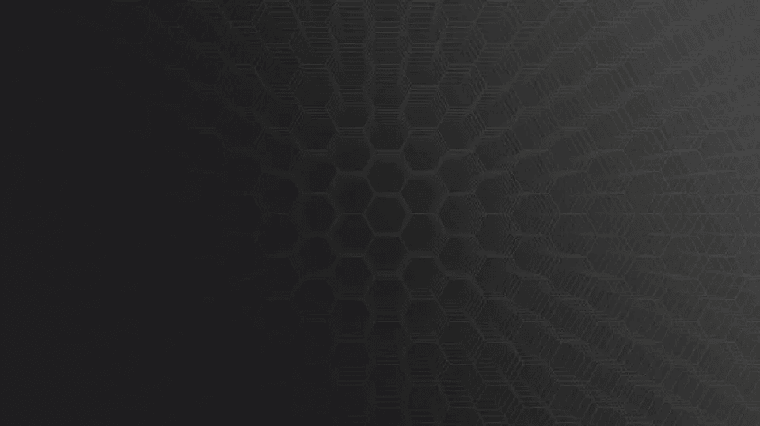

# 网络抓取的模糊区域:7 个最好的网络抓取工具

> 原文：<https://itnext.io/the-shadowy-area-of-web-scraping-7-of-the-best-web-scraping-tools-49c8c4fb730f?source=collection_archive---------1----------------------->

万维网，更准确地说是表层网，包含大约 500 亿个索引页面(T2)。应该注意的是，网站的大部分内容是标准搜索引擎无法访问的，因为它没有超链接。典型的搜索引擎，如谷歌、必应和雅虎，使用被称为“网络爬虫”的软件来查找公开的网页。

正如谷歌所描述的，抓取过程从过去抓取的网址列表和网站提供的网站地图开始。此外，网站所有者可以使用机器人排除协议( [robots.txt](http://www.robotstxt.org/robotstxt.html) )与网络爬虫通信，并向其提供关于其网站的指令。Robots.txt 通知爬虫网站的哪些区域不应该被访问或处理“不允许:/”。

虽然 web 爬行通常用于索引并提供通用信息，但另一种称为抓取的技术用于收集特定信息。一般来说，网页抓取是从网站中提取数据，并将非结构化网站的内容(主要是 HTML)转换为结构化数据的过程。网页抓取的主要使用案例包括:

*   [内容抓取](https://www.techopedia.com/definition/27564/content-scraping)
*   接触刮擦(销售线索生成)
*   价格比较
*   研究和分析(营销、科学等)
*   数据监控(社交媒体、天气等)
*   变化检测(网站)

虽然爬行器遵循 robots.txt 规则，但抓取器普遍忽略了这些规则。抓取器系统地从网站上提取数据，这些数据是通过编程获取的。所以刮痧的合法与不合法是有一线之隔的，不是[固有违法](http://www.integrity-research.com/mitigating-risks-associated-with-web-crawling/)。值得注意的是，来自 [OWASP](https://www.owasp.org/index.php/Main_Page) (开放 web 应用安全项目)的最新分类法将 web 抓取器( [OAT-011](https://www.owasp.org/images/3/33/Automated-threat-handbook.pdf) —收集应用内容和/或其他数据以在其他地方使用)归类为 Web 应用的二十种自动威胁之一。

据估计，61%的网络流量来自机器人。抓取构成了这种流量的很大一部分，它的范围从对企业来说可取的/补充的活动到不可取的/讨厌的活动。一些网站希望他们的内容被聚集在其他地方；相反，有些人认为这是一种盗窃。根据 distil networks 的 2016 年网络抓取经济报告，每年有 2%的在线收入因网络抓取而损失。网络抓取的六个主要动机如下:

1.  内容积累，主要由比价网站(pcw)完成
2.  通过实时竞争对手监控实现竞争领先
3.  多重列表服务(MLS)，主要用于房地产市场
4.  复制其他网站的数字库存
5.  滥用联系信息发送垃圾邮件
6.  排挤其他企业

尽管使用网页抓取器提取信息存在法律和道德问题，但几家公司为此提供了不同的工具。以下工具是 web 数据搜集的一些最佳解决方案:

1.  [**import . io**](https://www.import.io/) import . io 使用尖端技术从网页中提取数据，并允许任何用户创建私有 API，而无需定制代码。在这个平台中，数据提取和查询管理都完全在云端运行，之后可以以 CSV、Excel、Google Sheets 或 JSON 格式下载并共享。

    Import.io 尽可能减少内存占用，并要求它所访问的 web 服务器消耗最少的处理器时间。有趣的是，通过 import.io 的“自我修复”行为，那些在数据提取后应用于网站的更改可以自动修复。
2.  [**dexi . io**](https://dexi.io/) dexi . io 原名 cloudscrape，是一款基于云的 Web 数据工具，用户在这里提取、丰富&连接任何数据。Dexi.io 开发了最先进的数据抽取工具，用于网页抓取、网页抓取和数据提炼。其基于浏览器的编辑器实时抓取和提取数据。席德使用一个名为“pipes”的可视化数据工具产品来添加智能数据转换，以补充点-&-点击数据提取服务。

    Dexio.io 正在参与一些著名的项目，如 2016 年 4 月启动的[城市数据交换](https://www.citydataexchange.com/#/home)，作为欧洲智慧城市项目的一部分。
3.  [**scraping hub**](http://scrapinghub.com/) scraping hub 是部署和运行网络爬虫的最先进平台，它通过四大工具发挥作用，包括 [Scrapy cloud](https://scrapinghub.com/scrapy-cloud/) 、 [Portia](https://scrapinghub.com/portia/) 、 [Crawlera](https://scrapinghub.com/crawlera/) 和 [Splash](https://scrapinghub.com/splash/) 。Scrapinghub 将整个网页转换成有组织的内容，提取的数据可以 CSV、XML、JSON 和 JSON 格式下载。Scrapinghub 平台允许一次启动多个爬网程序。
4.  [**Scrapy**](https://scrapy.org/) **(由 Scrapinghub 维护)** Scrapy 是一个开源的 web 抓取和抓取框架，用于抓取和提取网站中的结构化数据。它有一个非常广泛的用例，从数据挖掘到监控和自动化测试。Scrapy 是用 Python 编写的，内置了对从 HTML/XML 源中选择和提取数据的支持。受 [Django](https://www.djangoproject.com/) 的启发，Scrapy 允许开发者使用[信号](https://doc.scrapy.org/en/latest/topics/signals.html#topics-signals)和一个定义良好的 API 来插入他们自己的功能。
5.  [**diff bot**](https://www.diffbot.com/products/crawlbot/) diff bot 提供知识即服务(knowledge-as-a-service)，是一种独特的利用机器视觉结构化数据的 web 爬行技术。其视觉内容和布局识别(VCLR)技术提供了对 web 内容的自动化视觉理解。VCLR(结合机器学习、NLP 和标记检查)通过呈现网页的图像并将该图像与其他页面的图像进行比较，来提供对网页内容的视觉理解。
    Diffbot 提供不同的产品包括:
    - Crawlbot 是一个网络爬虫和抓取器，用于自动提取网页内容。通过使用先进的人工智能，Crawlbot 自动将数百万个不同的 URL 转换成大规模的结构化数据。
    -用于从各种 web 内容中自动提取数据的自动 API。Diffbot 使用先进的人工智能技术来检索结构化数据，而无需手动规则或特定于站点的培训。这些 API 能够轻松创建应用计算机视觉算法的应用程序，以提取信息和理解各种网页的视觉布局。
6.  [**Mozenda**](http://www.mozenda.com/) Mozenda 通过在云端运行代理帮助企业收割数据。为此，使用了两种工具:代理构建器和 web 控制台。Mondezo Agent builder 是一个基于 windows 的应用程序，可帮助构建代理作为数据提取项目。Mondezo web console 是一个基于 web 的应用程序，允许运行代理。从 2016 年 7 月开始，Mozenda 开始支持上传到微软的 Azure 平台，使用户能够收集、构造和使用数据。
7.  [**IRobotSoft**](http://www.irobotsoft.com/) 一款可视化的网页自动化和网页抓取软件，能够根据用户的喜好生成网页机器人。通过观察用户的网络探索，它创建了一个网络机器人代理来执行用户想要做的事情。需要注意的是，IRobot 只支持 Internet Explorer (IE) 6.0 及以上版本，不支持其他 web 浏览器。机器人代理强大的数据操作语言(DML)支持复杂的网络计算，并自动提取数据和与本地数据库进行数据整合。此外，内部调度程序允许在特定的时间或频率运行每个机器人。通过采用人工智能和机器学习技术，IRobotSoft 为数据处理、数据计算和并行化提供了一个完整的计算平台。这款软件适合需要不断跟踪网络上某些话题并反复收集市场数据的市场研究人员。