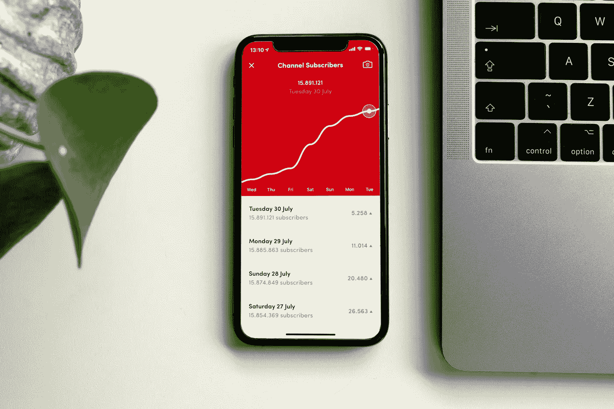

# 开发者对渐进式网络应用的采用情况

> 原文：<https://itnext.io/the-state-of-progressive-web-apps-adoption-by-developers-8b119783d3b9?source=collection_archive---------2----------------------->

## PWA 是被开发者宣扬还是采纳？尽管在 iOS 上缺乏支持，他们还是会使用这些吗？以下是我在过去几天里从民意调查中收集到的一些线索。

照片由 [YTCount](https://unsplash.com/@ytcount?utm_source=unsplash&utm_medium=referral&utm_content=creditCopyText) 在 [Unsplash](/?utm_source=unsplash&utm_medium=referral&utm_content=creditCopyText) 上拍摄

在本周的“[苹果 vs 嘿](https://twitter.com/dhh/status/1272968382329942017)”的故事之后，我很想知道，可以被视为解决这些问题的渐进式网络应用程序，是主要由开发者宣扬的，还是实际上已经被采用了🤔。

为了回答我的问题，我在 [Twitter](https://twitter.com/) 上做了一些民意调查，了解到一些有趣的事实和数据，我想在这篇新博文中与你分享。

# 限制

我既不是统计学专家，也不是管理和解释民意调查的专家。此外，实验发生在 Twitter 上，一组答案是由我可以通过这个社交网络联系到的人给出的，因此可能不够有代表性。

这就是为什么不要把你将要读到的任何东西视为理所当然。请务必将这些数字和评论视为提示，不多不少。

也请注意，我是一个进步的网络应用程序爱好者。我可以试着保持公正，但当然在平等的情况下，我可能更积极而不是消极😉。

# 47%的开发人员不使用 PWA

我几乎每天都在使用 [DEV.to](https://dev.to) 的渐进式网络应用，现在我也在尝试 Twitter 的应用。但是除此之外，我不认为我每周都用其他手机。这就是为什么我首先对收养问题感兴趣。

令我惊讶的是，**47%的开发者每周都不使用安装在他们手机主屏幕上的 PWA。**

**尽管我倾向于认为这个数字实际上应该更低，因为许多开发人员可能在他们的浏览器中使用 PWA，但是这个数字非常重要。**

**当然，拒绝率如此之高的主要原因是 iOS 缺乏对 PWA 的适当支持，这将在下一章讨论。**

**尽管如此，这仍然意味着几乎两个开发者中有一个不使用 PWA，这让我个人对移动设备技术的未来有点“担心”。如果连编写应用程序的开发人员都不使用或不能使用它们，那么它将如何被更广泛的受众所接受呢？**

**另一方面，积极的一面是，我可能不会看到半空的杯子，而是半满的杯子， **29%** 的开发人员，三分之一，每周使用两个或更多的 PWA。这立刻让我再次相信😁。**

**有趣的是，一些开发人员并没有将 PWA 固定在他们的主屏幕上，而是每周在他们的桌面上使用多个(4+) PWA。**

**这让我产生了以下想法:如果渐进式网络应用的未来实际上不是在手机上(首先)，而是在桌面上，那会怎样？如果台式机真的会在它们在手机上流行起来之前流行起来，那会怎么样呢？如果这些假设是真，那是否意味着谷歌从一开始就对其 [Chrome Book](https://www.google.com/chromebook/) 做了正确的选择？还是谷歌力推 PWA 是因为他们相信 Chrome Book？**

**这可能是太多的解释或假设，但我真的很期待未来知道这是否会以这种方式发展。**

# **不使用 PWA 的人中有 63%使用 iOS**

**正如我上面所说的，毫无疑问，iOS 上的部分支持是开发者不使用 PWA 的主要原因。**这些不使用 PWA 的人中有 63%** 拥有 iPhones。这意味着 30%的开发者不使用 PWA，仅仅是因为他们有一部苹果公司生产的手机。**

**此外，根据我收到的评论，除了部分支持，开发者似乎也放弃了在 iOS 上使用 PWA，因为苹果没有显示任何自动的“添加到主屏幕”弹出窗口，这让他们不知道在哪里可以找到该选项。苹果禁止任何其他浏览器在他们的设备上实现这样的功能并没有缓解这个问题。**

**我试了一下，没错，UX 有点令人沮丧，但在你的 iOS 主屏幕上安装 PWA 是可能的。如果你感兴趣，按照我在下面的推文中展示的进行。**

**请注意，您可以将任何网站添加到您的主屏幕，但只有这些是正确的 PWA 将作为独立的应用程序。感谢 Julio 的准确[反馈](https://twitter.com/jcesarmobile/status/1274625510165884928)👍。**

**说到这个，我也借此机会尝试了一下 Android 上的 [Firefox](https://www.mozilla.org) mobile 的“添加到主屏幕”UX，因为我以前从未尝试过。信不信由你，我觉得其实是最好的一个。Chrome one 很好，但我几乎觉得 Firefox 牵着我的手告诉我“大卫，过来，我要告诉你如何正确地给你的手机添加 PWA”。**

**我不知道 Firefox 的设计师是否会读到这几行，但是如果你看到了，恭喜你，了不起的工作！**

# **8%的开发者更喜欢 Google Play 的应用**

**如果所有开发者中有 30%因为他们的 iPhones 而不使用 PWA，那么 **17%** 也不使用这些，即使他们拥有 [Android](https://www.android.com/) 手机，至少在我看来，这些手机真的“PWA 友好”。所以我做了最后一次民意调查来找出原因？**

**我花了一些时间来思考可能的解决方案，我担心我的建议会让民意调查有点过于导向。也许我应该用一个开放式问题。**

**话虽如此，但似乎大多数开发者， **44%** 不在 Android 上使用 PWA，其中 **7%** 不使用渐进式网络应用，而是分别为商店和 Google Play 获取应用，因为他们觉得他们的 UX 或设计更好。**

**老实说，我不知道如何解释这个事实。对我来说，由于同样的原因，可能会有丑陋的、性能不佳的 web 应用程序，也可能会有糟糕的“本地”应用程序(或来自商店的应用程序)。我认为这完全是概念和执行的问题。不管是什么技术，如果实现或设计得不好，最终都不会令人惊叹。**

**值得注意的是:在一个提到 PWA 可能最适合低端设备的反馈之后，我很想知道 [Kaios](https://www.kaiostech.com/) 是否支持渐进式网络应用。你猜怎么着？他们不仅支持 PWA，还可以在他们的[商店](https://twitter.com/daviddalbusco/status/1274559473206595584)中发布这些内容。**

# **结论**

**也许渐进式网络应用的未来是桌面？或者它在移动设备上的未来是商店，因为它可以在 Kaios 商店和 Google Play 上发布它们？或者也许有一天欧盟能够让苹果变得对 PWA 友好？谁知道…**

**但可以肯定的是，我学到了一些有趣的提示，我仍然相信未来会有进步的网络应用。**

**此外，我刚刚在我的日历上添加了 2021 年 6 月的提醒，以便再次进行这样的民意调查，让我们看看明年这个主题如何演变。**

**同时，我非常期待听到你的反馈和想法。给我你最好的评论！**

**到无限和更远**

**大卫**