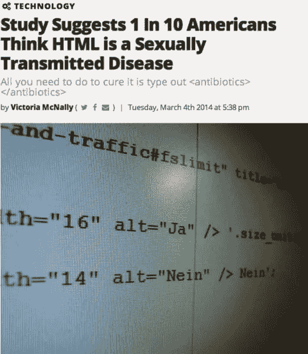
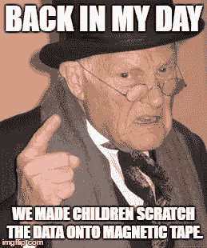
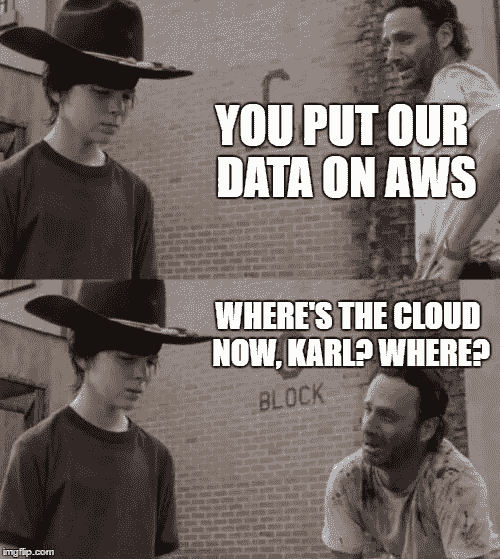
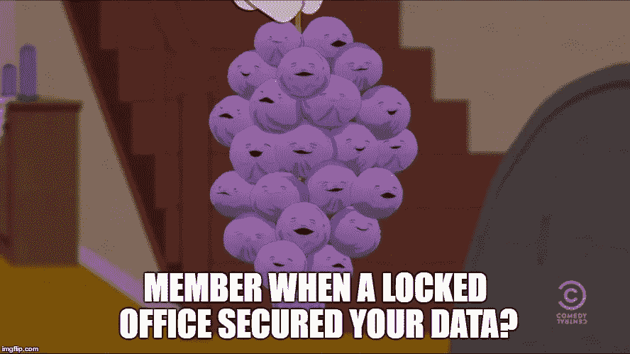
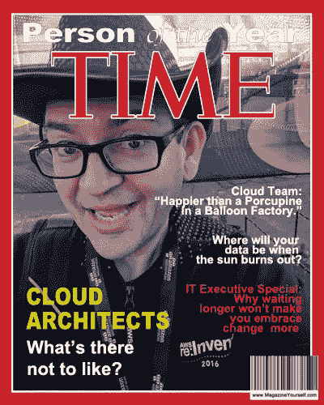

# 云否认者的三大反对理由

> 原文：<https://itnext.io/the-top-3-broad-objections-of-cloud-deniers-9c9ee8019a7d?source=collection_archive---------5----------------------->

与老派高管合作，有几个主要的“不”范畴困扰着云的接受。

行为是最难改变的。在我成长的过程中，我的父母买了一台录像机(这就像当时买了一辆车)，当它不用的时候，我妈妈就把它从墙上拔掉。尽管它不能在断电的情况下用计时器记录节目，但她还是做到了。直到今天，我还得阻止她关机。“如果拔掉插头，它们就不会着火，”她解释道。

在面对(1)无法录制电视节目的残缺设备和(2)火灾几率极小的未来这两个选项之间，对她来说，安全因素占了上风，她选择了第一个选项。很难否认这一点。我妈妈不是一个人。这篇文章是关于我从有一套标准的反云异议的 IT 高管那里看到的类似的与云相关的疯狂。

但是 Linux 是终端的。

# 反对意见 1:矩阵不确定性原理。

当提出云解决方案时，不可避免地会出现持久性的合理问题。也就是说，如果我们把所有这些东西都放在那里，它消失的几率有多大，我们除了空的空间和失业支票什么都没有。好问题。

经验丰富的 AWS 架构师推出的逻辑推理通常可以归结为:

> S3 有 11 个 9 的耐久性。那就是 99.9999999%。每 1000 万年就会失去一个天体。

客观地说，人类存在的时间并不长，再过一千万年，谁知道会进化成什么样。到那时，任何人今天在这个星球上所做的一切都将完全不为人知，被吹成尘埃，被熵所衰减，被时间抛到一边。但是很高兴知道**你的文件中只有一个会丢失**，其余的仍然在 S3。

印象深刻吧。比您壁橱后面的戴尔服务器更好？

孩子们有很好的记忆力。完美的备份。

一位 IT 主管面无表情地说，这还不够好。我建议将所有 S3 的内容复制到谷歌云平台，这将这些几率降低到一个水平，即亚里士多德逻辑确定性的基础开始受到质疑。

“我需要 100%的耐用性。如果小行星撞击，我们可能会丢失数据，”他说。他真的这么说了。

我想回答:“也有一点可能性，生活是一种幻觉，我们生活在一个模拟世界里。如果是这样，当模拟结束时，数据可能会消失。亚马逊没有想到这一点。”

在我说之前，他在他的思路中探索了更多的灾难，总结道，“我的意思是，我们最终都会死。”

“今天不行！”我想，离开他的办公室。

**经验教训**:我们可以减轻云中每一个合理的持久性风险，但是一旦有人提到宇宙玄学事件，你就必须退出对话。

# 异议 2:经典的“一切都太新了”策略。

气候变化“辩论”是一项有趣的全国性娱乐活动。对于真正理解科学的科学家来说，你知道，他们有这个过程——嗯，这实际上更像是一种方法——叫做*科学方法*，帮助他们走向真理。

在听取陌生人的随机意见和来自同行评议研究的数据之间的选择中，实验室外套选择了后者，并得出结论，气候变化实际上是一件事。你可以辩论它，就像你可以辩论重力、登月或地球绕着太阳转一样，但你只是在浪费时间，并没有改变科学结果。

我提到这一点，是因为那些站在气候变化科学结论错误一边的人，在以下反逻辑中站稳了脚跟:

> 地球存在的时间比人还长。人们只是最近才开始记录测量值。因此，你无法证明气候变化不是某个现存循环的一部分。一切都太新了。钻，宝贝，钻。

在向公司介绍云解决方案时，一个常见的异议是，它“看起来非常有趣”，但技术“太新”(或者像一位即将退休的首席信息官向我描述的那样，“正在兴起”)。这种观点认为，就像气候变化一样，**在我们可以信任云之前，还需要一段时间。嗯。**

新的云观察警报。

*Strokey beard moment* —这里有几个问题:

*   在 IT 领域，云并不新鲜。虽然已经有十年的历史了(如果你认为它是由康柏公司在 1996 年创造的，那就是 20 年)，但这大约是整个 it 时代的 20%(如果你不包括家用电脑时代)。
*   云主要是已经存在了很长时间的、经过实践检验的现有技术的集合。Linux、安全协议、网络拓扑等等都在云出现之前，是计算机科学的基石。所以云很好地包装了它，但它实际上是一种新型汽车，由我们以前见过的所有零件组成。
*   在主要的云层中没有发生任何值得警惕的事情。我们不是在等着什么东西被修复或者一个大问题出现。

“太新”论点的支持者倾向于提出一个原子的“全云或无云”世界。他们认为，真正的选择是在以下两者之间:(1)一个已知的、内部部署的基础架构，其中的性能已经过测量和理解；或者(2)一个未经测试的、全新的替代方案，它代表着更大的风险。

对于现场人群来说，这是一个很好的论点，因为这种法律上的轻微变化表明任何变化总是更有风险，因为风险等于坏，所以不要做。但同样是这些人会在一年后高兴地向他们的用户介绍 Windows 11，并看到稳定性出乎意料地崩溃，声称这是可控的和预期的。交替现实还是双重标准？

**经验教训**“它太新了”可能是反对 LASIK 手术的有效理由，但当应用于一个有十年历史的[、价值 2500 亿美元的行业](https://www.forbes.com/sites/louiscolumbus/2017/04/29/roundup-of-cloud-computing-forecasts-2017/#7b62688131e8)时，这就像拒绝去健身房，因为研究表明喝红酒对你有好处。

在政府没收之前储存铝！

# 反对意见 3:常春的“他们在读我的数据”妄想。

有几个人在阅读或试图阅读你的数据:政府、你的雇主和黑客。是的，谷歌通过在线了解你的生活来谋生。但是仅仅因为你不是唯一一个阅读手机账单的人，并不意味着云提供商在窥探你的数据。

我合作过的不止一家公司反对云解决方案，理由是谷歌和亚马逊在读取他们的数据。这也是我参加过的每一次 Google Onboard 或 AWS 峰会都会提到的问题，总有人要求沮丧、翻白眼的云代表证明答案是否定的。

我向你保证，云供应商不会读取你的数据。我哪里知道？

*   他们不需要。
*   他们不想:
*   他们不能。

如果不享受密钥管理和加密的乐趣，即使有云资源，读取客户数据也是不可行的。这是建立在数学基础上的互联网安全的基础，使得*美丽心灵*的黑板看起来像*我和 Elmo* 在学校的日子。

除了技术，你必须相当偏执地相信，谷歌和亚马逊这两家世界上最成功的公司有任何东西可以学习你的业务。如果他们真的这么做了，为什么要威胁数十亿美元的收入来源呢?“拉一辆大众汽车”,因为他们可以用相对较低的价格买下你的公司及其宝贵的机密。

这些公司的运营相当完美，但他们通过欺骗竞争对手进入云来读取他们的数据来做到这一点的想法绝对是偏执狂。

**经验教训**:在解释了技术原因和云实际上是如何工作的之后，它通常不会削弱这种说法。“啊，”他们反驳道，就像阴谋论者经常做那样，“有后门。”还有… *我们要离开*。你可以把你的访客卡和锡纸帽留在接待处。

# 拒绝吧，孩子们。

这些年来，你听到了各种疯狂的，错误的，怪异的，奇怪的屁话，这些都是负责人说的，他们应该更清楚。由于这是一个前瞻性的行业，没有人会回顾过去，提醒这些技术领导者他们完全错了 180 度。不仅仅是云——出于同样的原因，这些人中的许多人几乎对每一个新想法和技术都是错误的。

幸运的是，云解决方案正在成为常态，越来越多的客户和企业迫切需要我们的技能。对于所有与云否认者打交道的最糟糕的时刻，我更热衷于云福音传播者，他们对自己的业务有着我从未考虑过的想法。

所以当你不得不面对上述这些情况时，接受我的建议——不要争辩，不要辩论，不要说服。找另一个真正想做好事的客户。这些都是让我兴奋的机会，让我把工作做到最好。

